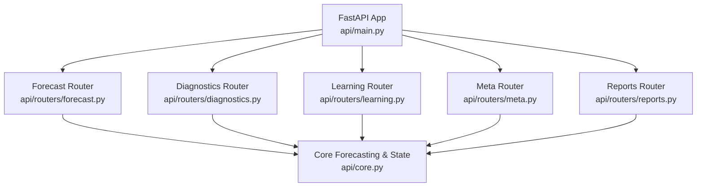
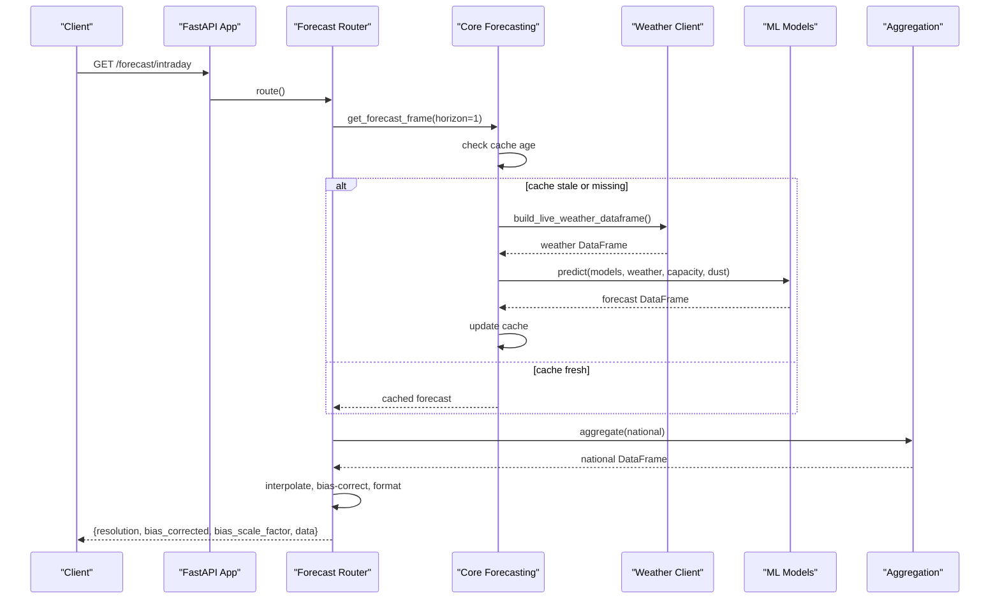
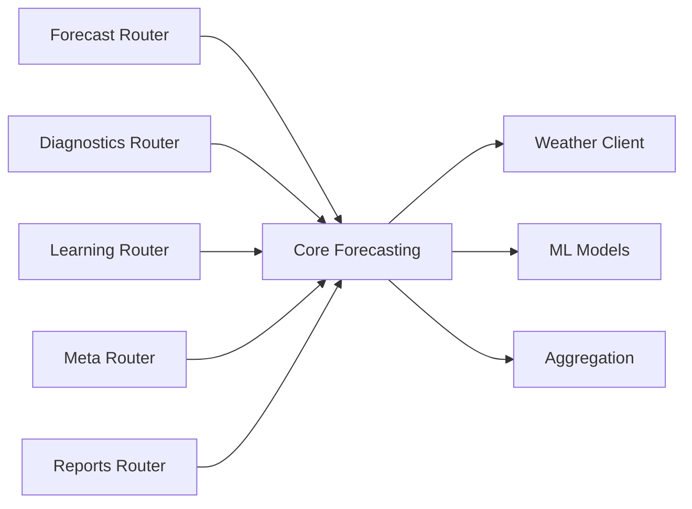

# API Reference

<cite>
**Referenced Files in This Document**
- [main.py](file://api/main.py)
- [core.py](file://api/core.py)
- [forecast.py](file://api/routers/forecast.py)
- [diagnostics.py](file://api/routers/diagnostics.py)
- [learning.py](file://api/routers/learning.py)
- [meta.py](file://api/routers/meta.py)
- [reports.py](file://api/routers/reports.py)
- [README.md](file://README.md)
</cite>

## Table of Contents
1. [Introduction](#introduction)
2. [Project Structure](#project-structure)
3. [Core Components](#core-components)
4. [Architecture Overview](#architecture-overview)
5. [Detailed Component Analysis](#detailed-component-analysis)
6. [Dependency Analysis](#dependency-analysis)
7. [Performance Considerations](#performance-considerations)
8. [Troubleshooting Guide](#troubleshooting-guide)
9. [Conclusion](#conclusion)
10. [Appendices](#appendices)

## Introduction
This document provides a comprehensive API reference for the FastAPI REST service that powers the STEG PréSol PV Forecast Platform. It covers all forecast endpoints, learning management endpoints for model registry and version control, diagnostics endpoints for system health monitoring, and report generation endpoints. It also documents authentication, request/response schemas, parameter validation, error handling, rate limiting considerations, response formats, example calls, client integration patterns, performance tips, and debugging approaches.

The service exposes:
- Forecast endpoints for national, intraday (15-minute resolution), district, governorate, direction, map, timelapse, refresh, and export.
- Learning management endpoints for metering ingestion, retraining triggers, status, and model registry queries.
- Diagnostics endpoints for alerts, metrics, model validation, and historical data.
- Report endpoints for Prosol summaries, snapshots, HTML reports, history, updates, evaluations, and displacement summary.

Authentication is enforced via an API key header on selected endpoints. The service includes CORS middleware and background scheduling to keep forecasts fresh.

**Section sources**
- [main.py:10-41](file://api/main.py#L10-L41)
- [README.md:1-31](file://README.md#L1-L31)

## Project Structure
The FastAPI application is organized by domain under api/routers:
- api/main.py: Application entrypoint, middleware, and router registration.
- api/core.py: Shared state, lifecycle, forecasting pipeline, bias correction, and API key security.
- api/routers/forecast.py: Forecast endpoints and exports.
- api/routers/diagnostics.py: Alerts, metrics, model validation, and history endpoints.
- api/routers/learning.py: Metering push, retraining, model registry, and training runs.
- api/routers/meta.py: Service root, status, cache status, district/governorate metadata, and registry pipeline.
- api/routers/reports.py: Prosol reports, evaluation history, and displacement summary.

**Diagram sources**
- [main.py:10-41](file://api/main.py#L10-L41)
- [forecast.py:1-22](file://api/routers/forecast.py#L1-L22)
- [diagnostics.py:1-14](file://api/routers/diagnostics.py#L1-L14)
- [learning.py:1-16](file://api/routers/learning.py#L1-L16)
- [meta.py:1-9](file://api/routers/meta.py#L1-L9)
- [reports.py:1-35](file://api/routers/reports.py#L1-L35)
- [core.py:1-35](file://api/core.py#L1-L35)

**Section sources**
- [main.py:10-41](file://api/main.py#L10-L41)

## Core Components
- API Key Authentication: Enforced via X-API-Key header on protected endpoints. Invalid or missing keys return 403.
- Forecast Cache: In-memory cache with time-based freshness; background scheduler refreshes every 15 minutes during operating hours.
- Weather Data Source: Live weather from Open-Meteo/PVGIS with synthetic fallback when live data is unavailable.
- Aggregation: District → direction → governorate → national roll-up with uncertainty propagation.
- Bias Correction: Optional scaling based on recent metered vs forecasted production.

Key behaviors:
- require_api_key validates the X-API-Key header and raises HTTPException(403) on mismatch.
- build_forecast computes or returns cached forecasts within a 14-minute window; otherwise recomputes using live or synthetic weather.
- compute_bias_correction reads recent meter buffer to derive a scale factor applied to P10/P50/P90 for intraday responses.

**Section sources**
- [core.py:45-52](file://api/core.py#L45-L52)
- [core.py:55-99](file://api/core.py#L55-L99)
- [core.py:106-132](file://api/core.py#L106-L132)
- [core.py:142-166](file://api/core.py#L142-L166)

## Architecture Overview
The API serves JSON responses and streaming CSV/XML exports. Forecasts are computed via core forecasting functions and aggregated across geographic levels. Background jobs refresh forecasts and optionally trigger retraining.

**Diagram sources**
- [forecast.py:35-54](file://api/routers/forecast.py#L35-L54)
- [core.py:72-99](file://api/core.py#L72-L99)

**Section sources**
- [forecast.py:35-54](file://api/routers/forecast.py#L35-L54)
- [core.py:72-99](file://api/core.py#L72-L99)

## Detailed Component Analysis

### Forecast Endpoints

#### GET /forecast/national
- Purpose: Aggregated national forecast over a horizon.
- Query Parameters:
  - horizon_days: integer, default 3.
  - split: boolean, default false. When true, splits national p50 into injected/self-consumed fractions.
- Response Schema: Array of records with timestamp and forecast quantiles (p10/p50/p90). If split=true, includes forecast_injected_mw and forecast_selfconsumed_mw.
- Error Handling: None specific beyond underlying forecast errors.
- Example Call:
  - curl "http://localhost:8000/forecast/national?horizon_days=3&split=false"
- Expected Response: JSON array of national-level rows with timestamps and MW values.

**Section sources**
- [forecast.py:25-32](file://api/routers/forecast.py#L25-L32)

#### GET /forecast/intraday
- Purpose: 15-minute resolution forecast for the next 6 hours, interpolated and clipped to non-negative values.
- Query Parameters: None.
- Response Schema:
  - resolution: "15min"
  - bias_corrected: boolean indicating whether bias correction was applied
  - bias_scale_factor: number or null
  - data: array of records with timestamp and forecast quantiles (p10/p50/p90) plus optional weather columns
- Error Handling: Returns 503 if no forecast data available for the next 6 hours.
- Example Call:
  - curl "http://localhost:8000/forecast/intraday"
- Expected Response: JSON object with 15-minute steps and optional bias correction metadata.

**Section sources**
- [forecast.py:35-54](file://api/routers/forecast.py#L35-L54)

#### GET /forecast/district/{district}
- Purpose: District-specific forecast; supports both directions and steg districts.
- Path Parameters:
  - district: string (case-insensitive). If matches a direction, delegates to direction endpoint; if matches a steg district, uses steg-district logic.
- Query Parameters:
  - horizon_days: integer, default 3.
- Response Schema: Array of records with timestamp and forecast quantiles; for steg districts, includes uncertainty_mw, uncertainty_ratio, utilization_pct, and weather columns.
- Error Handling: Returns 404 if unknown district.
- Example Call:
  - curl "http://localhost:8000/forecast/district/Tunis"
- Expected Response: JSON array of district-level rows.

**Section sources**
- [forecast.py:93-106](file://api/routers/forecast.py#L93-L106)

#### GET /forecast/governorate/{governorate}
- Purpose: Regional forecast for a governorate or steg district alias.
- Path Parameters:
  - governorate: string (case-insensitive). If matches a steg district name, delegates to steg-district logic.
- Query Parameters:
  - horizon_days: integer, default 3.
- Response Schema: Array of records with timestamp and forecast quantiles (p10/p50/p90).
- Error Handling: Returns 404 if unknown location.
- Example Call:
  - curl "http://localhost:8000/forecast/governorate/Sfax"
- Expected Response: JSON array of governorate-level rows.

**Section sources**
- [forecast.py:118-128](file://api/routers/forecast.py#L118-L128)

#### Additional Forecast Endpoints
- GET /forecast/directions: All directions forecast.
- GET /forecast/direction/{direction}: Direction-specific forecast.
- GET /forecast/steg-district/{name}: Steg district forecast with derived metrics.
- GET /forecast/districts: All districts forecast (aliases directions).
- GET /forecast/map: Snapshot at a target hour with per-governorate/district metrics.
- GET /forecast/timelapse: Frames over a time window with national totals.
- POST /forecast/refresh: Force cache refresh (requires API key).
- GET /forecast/export/forecast: Export forecast as CSV or XML at specified level.

**Section sources**
- [forecast.py:57-186](file://api/routers/forecast.py#L57-L186)
- [forecast.py:189-203](file://api/routers/forecast.py#L189-L203)

### Learning Management Endpoints

#### POST /metering/push
- Purpose: Ingest metering rows for future retraining analysis.
- Request Body: Array of MeteringRow objects with fields:
  - timestamp: string
  - governorate: string
  - actual_mw: float
  - forecast_p50_mw: float or null
- Authentication: Requires X-API-Key header.
- Response Schema: accepted count, buffer_days, retrain_triggered (false), message.
- Error Handling: None specific beyond schema validation.
- Example Call:
  - curl -X POST -H "Content-Type: application/json" -H "X-API-Key: dev-key" -d '[{"timestamp":"2026-01-01T00:00:00","governorate":"Tunis","actual_mw":1.2,"forecast_p50_mw":1.0}]' "http://localhost:8000/metering/push"
- Expected Response: JSON with acceptance details.

**Section sources**
- [learning.py:24-66](file://api/routers/learning.py#L24-L66)

#### POST /models/retrain
- Purpose: Trigger manual retraining from latest validated rooftop snapshot.
- Authentication: Not required here; internal lock prevents concurrent runs.
- Response Schema: accepted boolean, message, snapshot path, rows, locations.
- Error Handling: Returns 400 if no validated snapshot available.
- Example Call:
  - curl -X POST "http://localhost:8000/models/retrain"
- Expected Response: JSON with retraining job details.

**Section sources**
- [learning.py:77-130](file://api/routers/learning.py#L77-L130)

#### GET /retrain/status
- Purpose: View retraining schedule and recent log entries.
- Response Schema: retrain_log (array), schedule (object), message if waiting for snapshot.
- Example Call:
  - curl "http://localhost:8000/retrain/status"
- Expected Response: JSON with schedule and logs.

**Section sources**
- [learning.py:133-144](file://api/routers/learning.py#L133-L144)

#### Model Registry Endpoints
- GET /models/production: Current production model info.
- GET /models/versions: List model versions.
- GET /models/training-runs: List training runs.

**Section sources**
- [learning.py:147-162](file://api/routers/learning.py#L147-L162)

### Diagnostics Endpoints

#### GET /alerts
- Purpose: Operational alerts based on forecast uncertainty, ramp events, saturation risk, retraining status, and model drift.
- Query Parameters:
  - uncertainty_threshold_mw: float, default 50.0
  - ramp_threshold_pct: float, default 30.0
- Response Schema: alerts (array), count (integer). Each alert has type, timestamp, detail, severity, and sometimes district.
- Example Call:
  - curl "http://localhost:8000/alerts?uncertainty_threshold_mw=40&ramp_threshold_pct=25"
- Expected Response: JSON with alerts list.

**Section sources**
- [diagnostics.py:17-80](file://api/routers/diagnostics.py#L17-L80)

#### GET /metrics
- Purpose: Forecast metrics by horizon bucket.
- Response Schema: Array of metric records with nRMSE values and coverage percentages.
- Error Handling: Returns 404 if metrics file not found.
- Example Call:
  - curl "http://localhost:8000/metrics"
- Expected Response: JSON array of metrics.

**Section sources**
- [diagnostics.py:102-114](file://api/routers/diagnostics.py#L102-L114)

#### GET /model/validation
- Purpose: Retrieve model validation metrics JSON.
- Response Schema: JSON object with validation results.
- Error Handling: Returns 404 if file missing; 500 if unreadable.
- Example Call:
  - curl "http://localhost:8000/model/validation"
- Expected Response: JSON object.

**Section sources**
- [diagnostics.py:117-125](file://api/routers/diagnostics.py#L117-L125)

#### GET /history/national
- Purpose: Historical national forecast series.
- Response Schema: Array of records with timestamp and forecast values.
- Error Handling: Returns 404 if history file missing.
- Example Call:
  - curl "http://localhost:8000/history/national"
- Expected Response: JSON array.

**Section sources**
- [diagnostics.py:128-136](file://api/routers/diagnostics.py#L128-L136)

#### GET /history/rooftop
- Purpose: Rooftop dataset summary.
- Response Schema: Dataset path, source, rows, districts, pv_count, installed_capacity_kwp, start/end timestamps.
- Error Handling: Returns 404 if dataset missing.
- Example Call:
  - curl "http://localhost:8000/history/rooftop"
- Expected Response: JSON summary.

**Section sources**
- [diagnostics.py:83-99](file://api/routers/diagnostics.py#L83-L99)

### Report Generation Endpoints

#### GET /reports/prosol/summary
- Purpose: Summary metrics for a Prosol report period.
- Response Schema: JSON object with summary metrics.
- Example Call:
  - curl "http://localhost:8000/reports/prosol/summary"
- Expected Response: JSON object.

**Section sources**
- [reports.py:38-40](file://api/routers/reports.py#L38-L40)

#### GET /reports/prosol/snapshot
- Purpose: Retrieve imported Prosol snapshot JSON.
- Response Schema: JSON object representing the snapshot.
- Error Handling: Returns 404 if snapshot not found.
- Example Call:
  - curl "http://localhost:8000/reports/prosol/snapshot"
- Expected Response: JSON object.

**Section sources**
- [reports.py:43-48](file://api/routers/reports.py#L43-L48)

#### GET /reports/prosol/html
- Purpose: Generate HTML report.
- Response Type: HTML.
- Example Call:
  - curl "http://localhost:8000/reports/prosol/html"
- Expected Response: HTML document.

**Section sources**
- [reports.py:51-53](file://api/routers/reports.py#L51-L53)

#### GET /reports/prosol/history
- Purpose: List available Prosol history snapshots.
- Response Schema: JSON object with reports array.
- Example Call:
  - curl "http://localhost:8000/reports/prosol/history"
- Expected Response: JSON object.

**Section sources**
- [reports.py:56-59](file://api/routers/reports.py#L56-L59)

#### GET /reports/prosol/history/{snapshot_id}
- Purpose: Detail for a specific snapshot, including new installations and live updates.
- Path Parameters:
  - snapshot_id: string
- Response Schema: Report object with new_installations_by_district and live_updates.
- Error Handling: Returns 404 if snapshot not found.
- Example Call:
  - curl "http://localhost:8000/reports/prosol/history/abc123"
- Expected Response: JSON object.

**Section sources**
- [reports.py:62-76](file://api/routers/reports.py#L62-L76)

#### GET /reports/prosol/updates
- Purpose: Installation updates and aggregates by district.
- Response Schema: Updates array and totals_by_district object.
- Example Call:
  - curl "http://localhost:8000/reports/prosol/updates"
- Expected Response: JSON object.

**Section sources**
- [reports.py:79-81](file://api/routers/reports.py#L79-L81)

#### POST /reports/prosol/updates
- Purpose: Add installation update payload.
- Request Body: Object with update fields.
- Response Schema: Result of adding update.
- Error Handling: Returns 400 on invalid payload.
- Example Call:
  - curl -X POST -H "Content-Type: application/json" -d '{"district":"Tunis","new_installations":5}' "http://localhost:8000/reports/prosol/updates"
- Expected Response: JSON result.

**Section sources**
- [reports.py:84-89](file://api/routers/reports.py#L84-L89)

#### GET /reports/prosol/history/{snapshot_id}/new-installations.csv
- Purpose: Download new installations CSV for a snapshot.
- Path Parameters:
  - snapshot_id: string
- Response Type: CSV with Content-Disposition attachment.
- Error Handling: Returns 404 if snapshot not found.
- Example Call:
  - curl "http://localhost:8000/reports/prosol/history/abc123/new-installations.csv"
- Expected Response: CSV file download.

**Section sources**
- [reports.py:92-108](file://api/routers/reports.py#L92-L108)

#### POST /reports/prosol/history/import
- Purpose: Import a Prosol history snapshot from a project file path.
- Request Body: Embedded field path (string) pointing to existing project file.
- Response Schema: snapshot_id and inserted count.
- Error Handling: Returns 400 if path invalid or not a file.
- Example Call:
  - curl -X POST -H "Content-Type: application/json" -d '{"path":"data/source/prosol_mars_2026_1.txt"}' "http://localhost:8000/reports/prosol/history/import"
- Expected Response: JSON with import results.

**Section sources**
- [reports.py:111-117](file://api/routers/reports.py#L111-L117)

#### GET /evaluations/history
- Purpose: List forecast evaluations.
- Response Schema: Evaluations array.
- Example Call:
  - curl "http://localhost:8000/evaluations/history"
- Expected Response: JSON array.

**Section sources**
- [reports.py:120-122](file://api/routers/reports.py#L120-L122)

#### GET /evaluations/{evaluation_id}
- Purpose: Evaluation detail.
- Path Parameters:
  - evaluation_id: string
- Response Schema: Evaluation object.
- Error Handling: Returns 404 if not found.
- Example Call:
  - curl "http://localhost:8000/evaluations/eval_001"
- Expected Response: JSON object.

**Section sources**
- [reports.py:125-130](file://api/routers/reports.py#L125-L130)

#### GET /evaluations/{evaluation_id}/values
- Purpose: Evaluated values CSV for an evaluation.
- Path Parameters:
  - evaluation_id: string
- Response Schema: Array of evaluated value records.
- Error Handling: Returns 404 if values not available.
- Example Call:
  - curl "http://localhost:8000/evaluations/eval_001/values"
- Expected Response: JSON array.

**Section sources**
- [reports.py:133-142](file://api/routers/reports.py#L133-L142)

#### GET /displacement/summary
- Purpose: National displacement summary based on current forecast.
- Response Schema: Displacement summary object.
- Example Call:
  - curl "http://localhost:8000/displacement/summary"
- Expected Response: JSON object.

**Section sources**
- [reports.py:145-148](file://api/routers/reports.py#L145-L148)

### Meta Endpoints

#### GET /
- Purpose: Service root listing available endpoints.
- Response Schema: service, version, status, endpoints array.
- Example Call:
  - curl "http://localhost:8000/"
- Expected Response: JSON object.

**Section sources**
- [meta.py:12-31](file://api/routers/meta.py#L12-L31)

#### GET /status
- Purpose: Service status including data source and cache age.
- Response Schema: data_source, total_capacity_mwc, districts_count, directions_count, cache_age_min.
- Example Call:
  - curl "http://localhost:8000/status"
- Expected Response: JSON object.

**Section sources**
- [meta.py:34-45](file://api/routers/meta.py#L34-L45)

#### GET /cache/status
- Purpose: Cache status and staleness indicator.
- Response Schema: data_source, last_refreshed, cache_age_min, is_stale.
- Example Call:
  - curl "http://localhost:8000/cache/status"
- Expected Response: JSON object.

**Section sources**
- [meta.py:48-58](file://api/routers/meta.py#L48-L58)

#### GET /steg-districts
- Purpose: List STEG districts with metadata.
- Response Schema: Array of district objects.
- Example Call:
  - curl "http://localhost:8000/steg-districts"
- Expected Response: JSON array.

**Section sources**
- [meta.py:61-76](file://api/routers/meta.py#L61-L76)

#### GET /districts/positions
- Purpose: Alias for steg-districts positions.
- Response Schema: Same as steg-districts.
- Example Call:
  - curl "http://localhost:8000/districts/positions"
- Expected Response: JSON array.

**Section sources**
- [meta.py:79-81](file://api/routers/meta.py#L79-L81)

#### GET /governorates
- Purpose: List governorates with metadata.
- Response Schema: Array of governorate objects.
- Example Call:
  - curl "http://localhost:8000/governorates"
- Expected Response: JSON array.

**Section sources**
- [meta.py:84-100](file://api/routers/meta.py#L84-L100)

#### GET /districts
- Purpose: List directions.
- Response Schema: Array of direction strings.
- Example Call:
  - curl "http://localhost:8000/districts"
- Expected Response: JSON array.

**Section sources**
- [meta.py:103-105](file://api/routers/meta.py#L103-L105)

#### GET /registry/pipeline
- Purpose: Pipeline projection with pending dossiers and capacity projections.
- Response Schema: Array of projected district objects.
- Example Call:
  - curl "http://localhost:8000/registry/pipeline"
- Expected Response: JSON array.

**Section sources**
- [meta.py:108-126](file://api/routers/meta.py#L108-L126)

## Dependency Analysis
The API depends on shared core services for forecasting, caching, and lifecycle management. Routers delegate to core functions and external modules for aggregation, model loading, and weather ingestion.

**Diagram sources**
- [forecast.py:9-19](file://api/routers/forecast.py#L9-L19)
- [diagnostics.py:9-12](file://api/routers/diagnostics.py#L9-L12)
- [learning.py:11-13](file://api/routers/learning.py#L11-L13)
- [meta.py:6-7](file://api/routers/meta.py#L6-L7)
- [reports.py:10-12](file://api/routers/reports.py#L10-L12)
- [core.py:24-27](file://api/core.py#L24-L27)

**Section sources**
- [forecast.py:9-19](file://api/routers/forecast.py#L9-L19)
- [diagnostics.py:9-12](file://api/routers/diagnostics.py#L9-L12)
- [learning.py:11-13](file://api/routers/learning.py#L11-L13)
- [meta.py:6-7](file://api/routers/meta.py#L6-L7)
- [reports.py:10-12](file://api/routers/reports.py#L10-L12)
- [core.py:24-27](file://api/core.py#L24-L27)

## Performance Considerations
- Cache Freshness: Forecasts are cached for up to 14 minutes; subsequent requests within this window return cached results quickly.
- Interpolation: Intraday endpoint interpolates to 15-minute intervals and clips negative values to ensure realistic outputs.
- Bias Correction: Optional scaling improves accuracy when recent metered data is available; disabled if insufficient data.
- Background Refresh: Scheduler refreshes forecasts every 15 minutes during operating hours; can be forced via /forecast/refresh.
- Export Streaming: CSV/XML exports stream data to reduce memory usage for large datasets.

Recommendations:
- Use horizon_days appropriately to balance latency and scope.
- Leverage /forecast/map and /forecast/timelapse for visualizations to minimize client-side processing.
- Monitor /cache/status to understand staleness and plan refresh strategies.

[No sources needed since this section provides general guidance]

## Troubleshooting Guide
Common issues and resolutions:
- 403 Forbidden on protected endpoints: Ensure X-API-Key header matches the configured key.
- 404 Not Found: Check district/governorate names against available lists; verify files exist for diagnostics and reports.
- 503 Service Unavailable: No forecast data available for intraday; wait for weather data or synthetic fallback.
- Stale Cache: Use /forecast/refresh to force recomputation; check /cache/status for age and staleness.
- Retraining Failures: Inspect /retrain/status and /alerts for retraining state and errors; ensure validated rooftop snapshots are present.

Debugging steps:
- Validate inputs and parameters using query enums and types.
- Review alert types for operational insights (high uncertainty, ramp down, saturation risk, model drift).
- Check metrics and model validation endpoints for performance indicators.

**Section sources**
- [core.py:45-52](file://api/core.py#L45-L52)
- [forecast.py:42-43](file://api/routers/forecast.py#L42-L43)
- [diagnostics.py:17-80](file://api/routers/diagnostics.py#L17-L80)
- [meta.py:48-58](file://api/routers/meta.py#L48-L58)

## Conclusion
The FastAPI REST service provides a robust set of endpoints for PV forecasting, diagnostics, learning management, and reporting. It supports flexible geographic aggregations, real-time updates, and continuous learning capabilities. Clients should use the documented schemas, handle errors appropriately, and leverage caching and background refresh for optimal performance.

[No sources needed since this section summarizes without analyzing specific files]

## Appendices

### Authentication Methods
- API Key: Required on select endpoints via X-API-Key header. Invalid or missing keys return 403.
- CORS: Enabled for all origins, methods, and headers to support browser-based clients.

**Section sources**
- [core.py:45-52](file://api/core.py#L45-L52)
- [main.py:29-34](file://api/main.py#L29-L34)

### Rate Limiting Considerations
- No explicit rate limiting is implemented in the provided code. Consumers should implement client-side retries with exponential backoff and respect server responses.
- Use /cache/status to avoid unnecessary refreshes and manage load.

[No sources needed since this section provides general guidance]

### Response Format Specifications
- JSON: Most endpoints return JSON arrays or objects with clearly defined fields.
- CSV/XML: Export endpoints stream CSV or XML with appropriate Content-Disposition headers.
- HTML: Report endpoints return HTML documents.

**Section sources**
- [forecast.py:189-203](file://api/routers/forecast.py#L189-L203)
- [reports.py:51-53](file://api/routers/reports.py#L51-L53)

### Client Integration Patterns
- Polling: For near-real-time updates, poll /forecast/intraday at 15-minute intervals.
- Caching: Implement client-side caching aligned with server cache freshness to reduce load.
- Error Handling: Handle 403, 404, 503 responses gracefully and retry with backoff.
- Exports: Use /forecast/export/forecast for bulk data downloads in CSV or XML.

[No sources needed since this section provides general guidance]