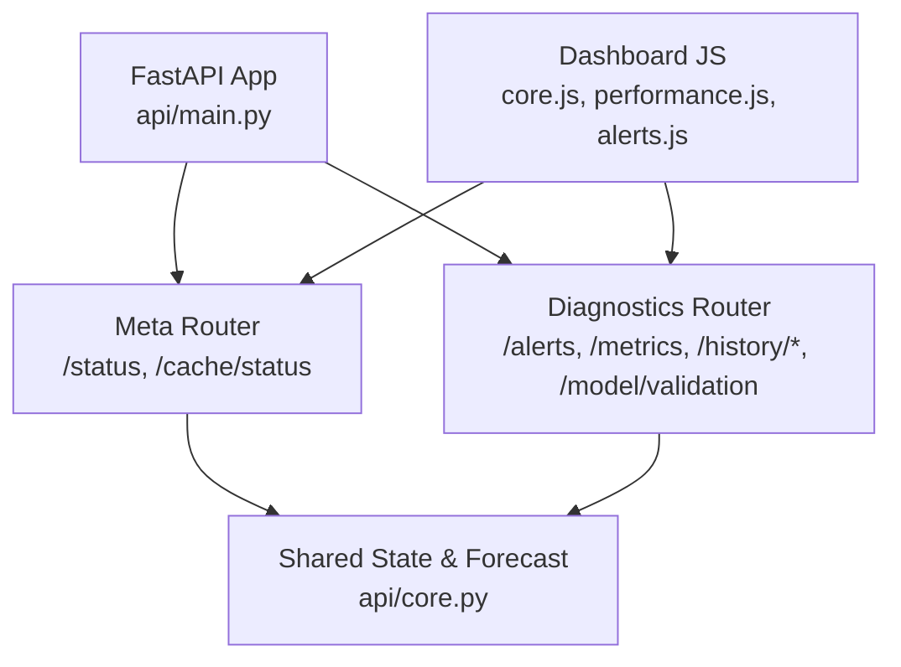
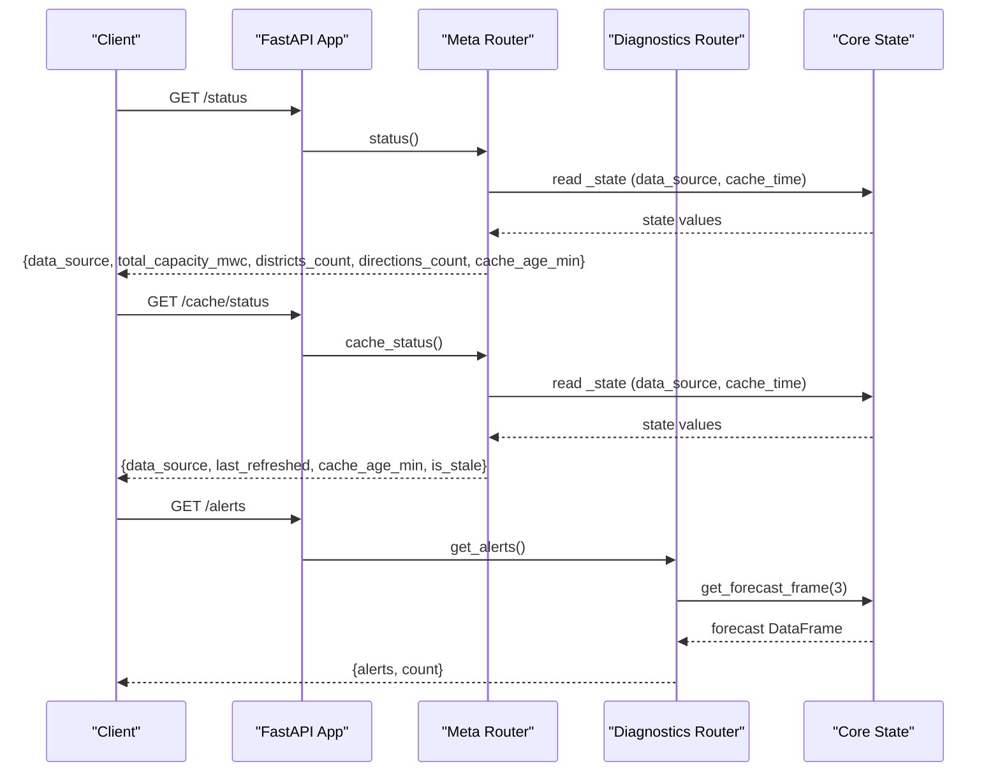
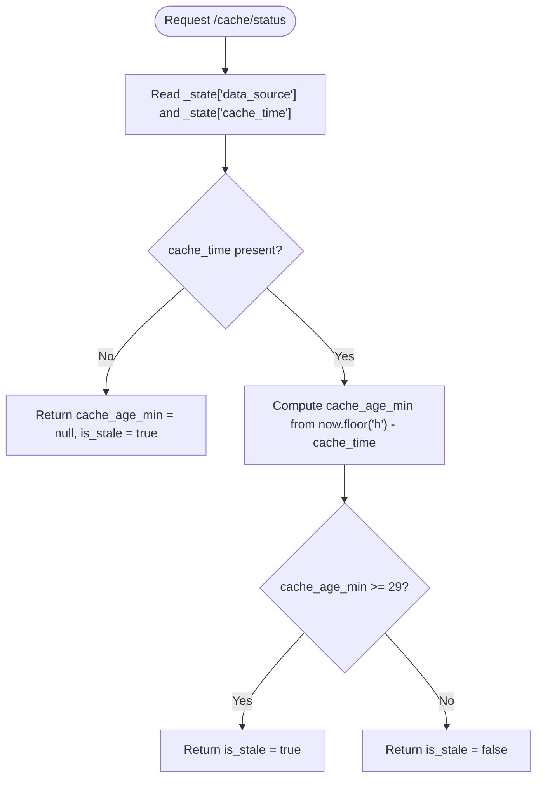
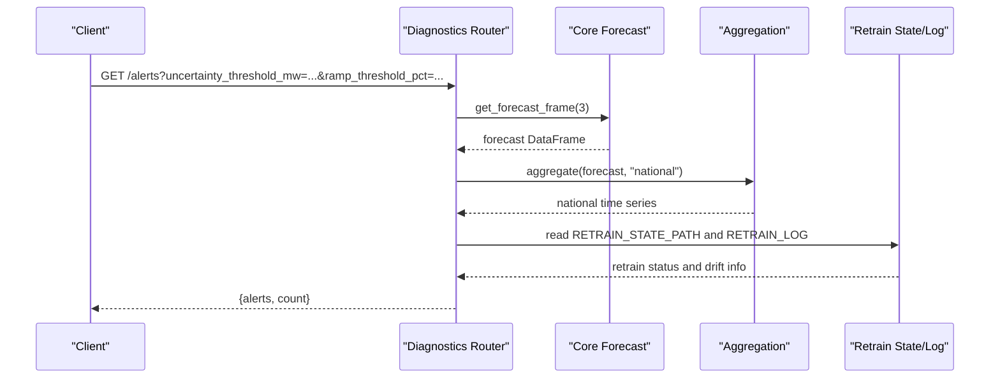
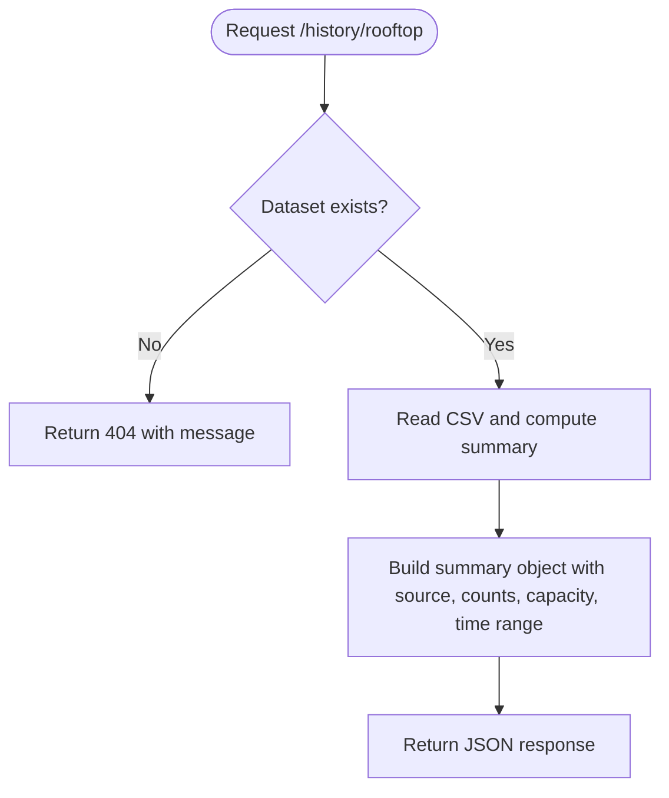
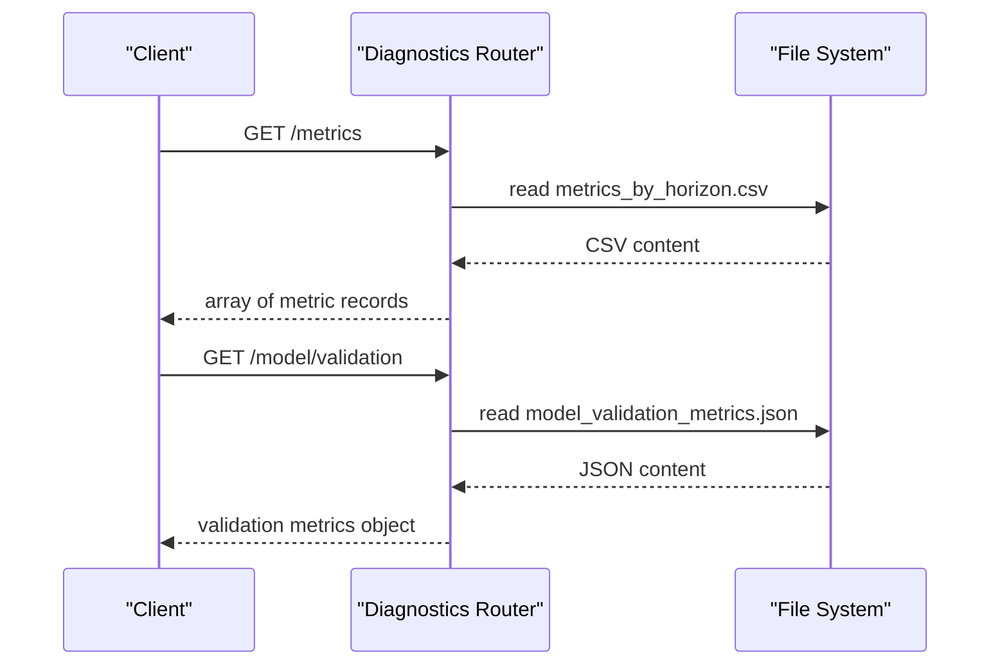
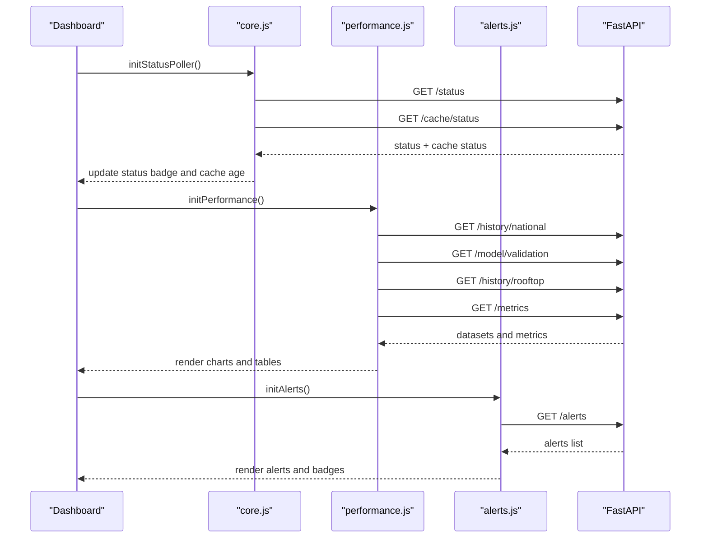
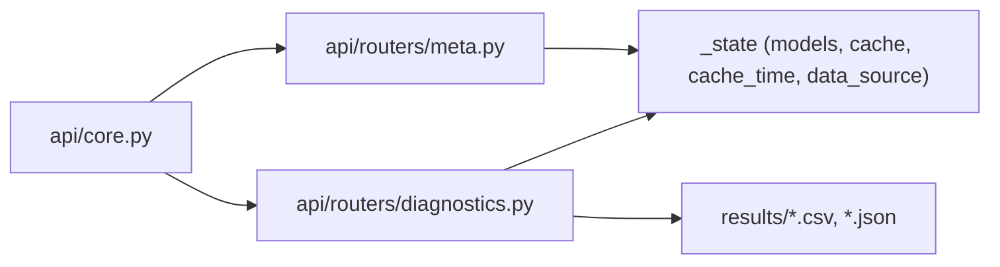

# Diagnostics & Health Monitoring

<cite>
**Referenced Files in This Document**
- [api/main.py](file://api/main.py)
- [api/core.py](file://api/core.py)
- [api/routers/meta.py](file://api/routers/meta.py)
- [api/routers/diagnostics.py](file://api/routers/diagnostics.py)
- [dashboard/assets/js/core.js](file://dashboard/assets/js/core.js)
- [dashboard/assets/js/performance.js](file://dashboard/assets/js/performance.js)
- [dashboard/assets/js/alerts.js](file://dashboard/assets/js/alerts.js)
</cite>

## Table of Contents
1. [Introduction](#introduction)
2. [Project Structure](#project-structure)
3. [Core Components](#core-components)
4. [Architecture Overview](#architecture-overview)
5. [Detailed Component Analysis](#detailed-component-analysis)
6. [Dependency Analysis](#dependency-analysis)
7. [Performance Considerations](#performance-considerations)
8. [Troubleshooting Guide](#troubleshooting-guide)
9. [Conclusion](#conclusion)
10. [Appendices](#appendices)

## Introduction
This document describes the system diagnostics and health monitoring capabilities exposed by the API, focusing on endpoints that provide operational status, model and data freshness indicators, performance metrics, and alerting information. It explains how to interpret responses, integrate with monitoring systems, configure alerts, and troubleshoot issues using diagnostic data.

## Project Structure
The diagnostics and health features are implemented as FastAPI routers included in the application entrypoint. Key files:
- Application entrypoint registers routers and middleware
- Core module provides shared state, forecast building, and lifecycle scheduling
- Meta router exposes service status and cache freshness
- Diagnostics router exposes alerts, historical summaries, metrics, and validation results
- Dashboard JavaScript consumes these endpoints for UI visualization and polling

**Diagram sources**
- [api/main.py:20-41](file://api/main.py#L20-L41)
- [api/routers/meta.py:12-58](file://api/routers/meta.py#L12-L58)
- [api/routers/diagnostics.py:17-136](file://api/routers/diagnostics.py#L17-L136)
- [api/core.py:55-99](file://api/core.py#L55-L99)

**Section sources**
- [api/main.py:1-42](file://api/main.py#L1-L42)
- [api/core.py:1-166](file://api/core.py#L1-L166)

## Core Components
- Service status and cache freshness:
  - GET /status: returns data source, capacity counts, district and direction counts, and cache age in minutes
  - GET /cache/status: returns data source, last refresh timestamp, cache age, and staleness flag
- Operational alerts:
  - GET /alerts: returns a list of active alerts (high uncertainty, ramp down, saturation risk, retraining status, drift)
- Historical and dataset summaries:
  - GET /history/national: returns national history records used for charting and evaluation
  - GET /history/rooftop: returns rooftop dataset summary including source, row count, districts, PV count, installed capacity, and time range
- Model and metric diagnostics:
  - GET /metrics: returns horizon-based error metrics and coverage percentages
  - GET /model/validation: returns training and validation metrics from the latest validation run

These endpoints collectively enable basic health checks, data freshness verification, and performance monitoring without requiring external tools.

**Section sources**
- [api/routers/meta.py:34-58](file://api/routers/meta.py#L34-L58)
- [api/routers/diagnostics.py:17-136](file://api/routers/diagnostics.py#L17-L136)

## Architecture Overview
The API is organized into domain-specific routers. The meta router handles service metadata and cache status; the diagnostics router handles operational alerts and model metrics. Both rely on shared state and forecasting utilities in the core module. The dashboard consumes these endpoints to render charts, badges, and status indicators.

**Diagram sources**
- [api/routers/meta.py:34-58](file://api/routers/meta.py#L34-L58)
- [api/routers/diagnostics.py:17-80](file://api/routers/diagnostics.py#L17-L80)
- [api/core.py:72-99](file://api/core.py#L72-L99)

## Detailed Component Analysis

### Health Check Endpoints
- GET /status
  - Purpose: Basic system status and data freshness indicator
  - Response fields:
    - data_source: string indicating live or synthetic data source
    - total_capacity_mwc: number representing total installed capacity across districts
    - districts_count: integer count of STEG districts
    - directions_count: integer count of directions
    - cache_age_min: number of minutes since last cache refresh (may be null if not yet refreshed)
  - Typical use: Health probes, dashboards showing “last updated” and data provenance

- GET /cache/status
  - Purpose: Cache-specific health check
  - Response fields:
    - data_source: same as /status
    - last_refreshed: ISO-like timestamp string of last refresh or null
    - cache_age_min: minutes since last refresh
    - is_stale: boolean true when cache_age_min is null or >= 29 minutes
  - Typical use: Alerting on stale data, forcing refresh workflows

**Diagram sources**
- [api/routers/meta.py:48-58](file://api/routers/meta.py#L48-L58)
- [api/core.py:55-63](file://api/core.py#L55-L63)

**Section sources**
- [api/routers/meta.py:34-58](file://api/routers/meta.py#L34-L58)

### Alerts Endpoint
- GET /alerts
  - Purpose: Aggregated operational alerts based on forecasts and model lifecycle state
  - Query parameters:
    - uncertainty_threshold_mw: float (default 50.0)
    - ramp_threshold_pct: float (default 30.0)
  - Response fields:
    - alerts: array of alert objects with type, timestamp, detail, severity, and optional district
    - count: integer number of alerts
  - Alert types include:
    - HIGH_UNCERTAINTY: when forecast interval width exceeds threshold
    - RAMP_DOWN: when significant drop in forecasted output within short window
    - SATURATION_RISK: when district generation may reach thresholds
    - MODEL_RETRAINING_STARTED / MODEL_RETRAINING_FAILED: automatic retraining lifecycle events
    - MODEL_DRIFT: when recent MAE indicates drift beyond baseline
  - Typical use: Alerting dashboards, incident response triggers

**Diagram sources**
- [api/routers/diagnostics.py:17-80](file://api/routers/diagnostics.py#L17-L80)
- [api/core.py:72-99](file://api/core.py#L72-L99)

**Section sources**
- [api/routers/diagnostics.py:17-80](file://api/routers/diagnostics.py#L17-L80)

### Historical Data and Data Freshness Indicators
- GET /history/national
  - Purpose: Returns national historical records used for charting and evaluation
  - Response: Array of records with timestamps and forecast/actual columns
  - Typical use: Time-series charts, validation overlays, trend analysis

- GET /history/rooftop
  - Purpose: Summary of rooftop dataset including source, row count, districts, PV count, installed capacity, and time range
  - Response fields:
    - dataset_path: relative path to dataset file
    - source: dataset source label (e.g., synthetic, PVGIS, real validated)
    - rows: number of rows
    - districts: number of unique districts
    - pv_count: sum of standardized PV units
    - installed_capacity_kwp: total installed capacity in kWp
    - start: earliest timestamp
    - end: latest timestamp
  - Typical use: Data provenance badges, freshness indicators, fleet sizing insights

**Diagram sources**
- [api/routers/diagnostics.py:83-99](file://api/routers/diagnostics.py#L83-L99)

**Section sources**
- [api/routers/diagnostics.py:83-99](file://api/routers/diagnostics.py#L83-L99)

### Performance Metrics and Model Validation
- GET /metrics
  - Purpose: Horizon-based performance metrics for forecasting models
  - Response: Array of records with horizon bucket and normalized errors plus coverage percentage
  - Typical use: Model accuracy tracking, SLO monitoring, regression detection

- GET /model/validation
  - Purpose: Latest training and validation metrics from validation runs
  - Response: Object containing training and validation sections with metrics such as MAE, RMSE, accuracy, coverage
  - Typical use: Model quality gates, promotion decisions, post-deployment validation

**Diagram sources**
- [api/routers/diagnostics.py:102-125](file://api/routers/diagnostics.py#L102-L125)

**Section sources**
- [api/routers/diagnostics.py:102-125](file://api/routers/diagnostics.py#L102-L125)

### Dashboard Integration and Polling
The dashboard uses these endpoints to:
- Display service status and cache age
- Render historical charts and validation metrics
- Show alerts and retraining status
- Provide data provenance badges for rooftop datasets

Key integration points:
- Global status poller fetches /status and /cache/status concurrently
- Performance page fetches /history/national, /model/validation, /history/rooftop, /metrics
- Alerts page polls /alerts at intervals and renders alert items

**Diagram sources**
- [dashboard/assets/js/core.js:507-514](file://dashboard/assets/js/core.js#L507-L514)
- [dashboard/assets/js/performance.js:27-210](file://dashboard/assets/js/performance.js#L27-L210)
- [dashboard/assets/js/alerts.js:91-123](file://dashboard/assets/js/alerts.js#L91-L123)

**Section sources**
- [dashboard/assets/js/core.js:507-514](file://dashboard/assets/js/core.js#L507-L514)
- [dashboard/assets/js/performance.js:27-210](file://dashboard/assets/js/performance.js#L27-L210)
- [dashboard/assets/js/alerts.js:91-123](file://dashboard/assets/js/alerts.js#L91-L123)

## Dependency Analysis
- Shared state and caching:
  - api/core.py maintains _state with models, cache, cache_time, data_source, and locks
  - build_forecast computes or retrieves cached forecasts and updates cache_time
- Router dependencies:
  - meta.py depends on _state for status and cache status
  - diagnostics.py depends on core.get_forecast_frame and aggregation utilities
- External data:
  - Weather client and synthetic data generator feed forecast building
  - Filesystem artifacts (results directory) provide historical and metrics data

**Diagram sources**
- [api/core.py:55-99](file://api/core.py#L55-L99)
- [api/routers/meta.py:34-58](file://api/routers/meta.py#L34-L58)
- [api/routers/diagnostics.py:17-136](file://api/routers/diagnostics.py#L17-L136)

**Section sources**
- [api/core.py:55-99](file://api/core.py#L55-L99)
- [api/routers/meta.py:34-58](file://api/routers/meta.py#L34-L58)
- [api/routers/diagnostics.py:17-136](file://api/routers/diagnostics.py#L17-L136)

## Performance Considerations
- Cache freshness:
  - Use /cache/status to detect stale data; is_stale becomes true when cache_age_min is null or >= 29 minutes
  - Dashboard displays cache age and can prompt refresh workflows
- Forecast refresh cadence:
  - Background scheduler attempts to refresh forecasts every 15 minutes during operational hours
  - If live weather fails, synthetic data is used and data_source reflects this
- Metrics and validation:
  - /metrics and /model/validation depend on generated artifacts; ensure prior runs have produced required files
- Error handling:
  - Missing datasets return 404 with descriptive messages
  - JSON parsing or filesystem errors return 500 with details

[No sources needed since this section provides general guidance]

## Troubleshooting Guide
Common issues and resolutions:
- No rooftop dataset found:
  - Symptom: GET /history/rooftop returns 404
  - Resolution: Generate or import rooftop dataset before querying
- No metrics found:
  - Symptom: GET /metrics returns 404
  - Resolution: Run model evaluation pipeline to produce metrics_by_horizon.csv
- No history found:
  - Symptom: GET /history/national returns 404
  - Resolution: Run historical data generation to produce history_national.csv
- Model validation metrics missing:
  - Symptom: GET /model/validation returns 404
  - Resolution: Run validation report to produce model_validation_metrics.json
- Stale cache:
  - Symptom: /cache/status reports is_stale = true
  - Resolution: Trigger forecast refresh or wait for scheduled refresh; verify weather client connectivity

**Section sources**
- [api/routers/diagnostics.py:83-136](file://api/routers/diagnostics.py#L83-L136)
- [api/core.py:72-99](file://api/core.py#L72-L99)

## Conclusion
The platform exposes practical diagnostics and health endpoints that support operational monitoring, data freshness verification, and model performance tracking. By integrating /status, /cache/status, /alerts, /metrics, and historical endpoints, teams can implement robust alerting, dashboards, and troubleshooting workflows tailored to PV forecasting operations.

[No sources needed since this section summarizes without analyzing specific files]

## Appendices

### Response Formats Summary
- /status
  - Fields: data_source, total_capacity_mwc, districts_count, directions_count, cache_age_min
- /cache/status
  - Fields: data_source, last_refreshed, cache_age_min, is_stale
- /alerts
  - Fields: alerts (array), count (integer)
  - Alert object fields: type, timestamp, detail, severity, district (optional)
- /history/national
  - Format: array of records with timestamp and forecast/actual columns
- /history/rooftop
  - Fields: dataset_path, source, rows, districts, pv_count, installed_capacity_kwp, start, end
- /metrics
  - Format: array of records with horizon_bucket and error/coverage metrics
- /model/validation
  - Format: object with training and validation sections containing metrics like MAE, RMSE, accuracy, coverage

[No sources needed since this section aggregates previously analyzed endpoints]

### Monitoring Integrations and Alerting Configurations
- Health probes:
  - Periodically call /status and /cache/status; trigger alerts if is_stale is true or cache_age_min exceeds threshold
- Alerts ingestion:
  - Poll /alerts at regular intervals; route critical alerts to incident channels
- Performance tracking:
  - Monitor /metrics and /model/validation trends; set SLOs around nRMSE and coverage
- Dashboard usage:
  - Use existing dashboard pages to visualize status, history, validation metrics, and alerts

[No sources needed since this section provides general guidance]