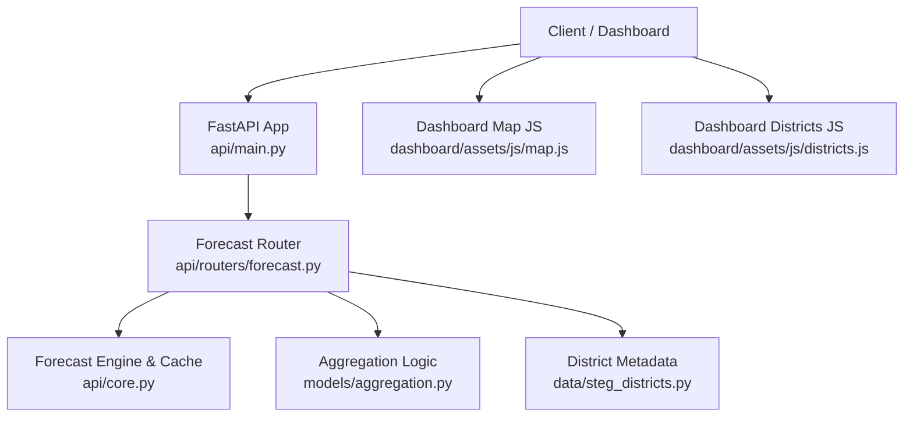
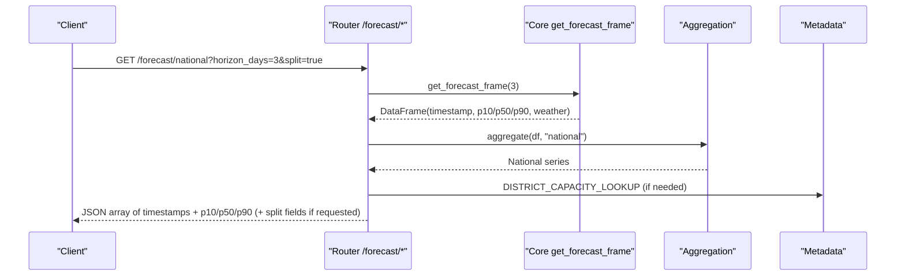
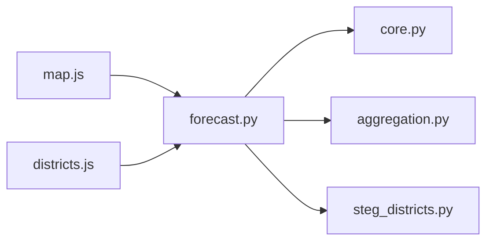

# Forecast Endpoints

<cite>
**Referenced Files in This Document**
- [forecast.py](file://api/routers/forecast.py)
- [main.py](file://api/main.py)
- [core.py](file://api/core.py)
- [aggregation.py](file://models/aggregation.py)
- [steg_districts.py](file://data/steg_districts.py)
- [map.js](file://dashboard/assets/js/map.js)
- [districts.js](file://dashboard/assets/js/districts.js)
</cite>

## Table of Contents
1. [Introduction](#introduction)
2. [Project Structure](#project-structure)
3. [Core Components](#core-components)
4. [Architecture Overview](#architecture-overview)
5. [Detailed Component Analysis](#detailed-component-analysis)
6. [Dependency Analysis](#dependency-analysis)
7. [Performance Considerations](#performance-considerations)
8. [Troubleshooting Guide](#troubleshooting-guide)
9. [Conclusion](#conclusion)

## Introduction
This document provides comprehensive API documentation for the PréSol platform forecast endpoints. It covers national aggregation, intraday forecasts with bias correction, spatial forecasting by district and governorate (including STEG districts with uncertainty metrics), and map visualization endpoints used by the dashboard. For each endpoint, you will find HTTP methods, URL patterns, query parameters, request/response schemas, error handling, status codes, example calls, and integration patterns for dashboard consumption.

## Project Structure
The forecast functionality is implemented as a FastAPI router under api/routers/forecast.py and mounted at /forecast in the main application. Supporting modules provide:
- Forecast generation and caching: api/core.py
- Aggregation across levels: models/aggregation.py
- District metadata and reference data: data/steg_districts.py
- Dashboard consumption of map/timelapse data: dashboard/assets/js/map.js and dashboard/assets/js/districts.js

**Diagram sources**
- [main.py:20-41](file://api/main.py#L20-L41)
- [forecast.py:21-22](file://api/routers/forecast.py#L21-L22)
- [core.py:72-103](file://api/core.py#L72-L103)
- [aggregation.py:26-89](file://models/aggregation.py#L26-L89)
- [steg_districts.py:153-176](file://data/steg_districts.py#L153-L176)
- [map.js:69-118](file://dashboard/assets/js/map.js#L69-L118)
- [districts.js:18-40](file://dashboard/assets/js/districts.js#L18-L40)

**Section sources**
- [main.py:1-42](file://api/main.py#L1-L42)
- [forecast.py:1-203](file://api/routers/forecast.py#L1-L203)

## Core Components
- Forecast generation and caching: The core module builds weather inputs, runs predictions, caches results for up to ~14 minutes, and exposes get_forecast_frame(horizon_days).
- Bias correction: compute_bias_correction reads recent metering data to derive a scale factor applied to intraday forecasts when available.
- Aggregation: aggregate supports national, direction, steg_district, governorate, and legacy district grouping; it combines uncertainty bands using root-sum-of-squares on half-widths.
- Reference data: steg_districts defines 50 commercial districts, directions, capacities, coordinates, and lookup tables used throughout the API.

Key responsibilities:
- api/routers/forecast.py: Defines all forecast endpoints and response shaping.
- api/core.py: Provides build_forecast, get_forecast_frame, compute_bias_correction, and lifecycle/scheduling.
- models/aggregation.py: Implements level-based aggregation and uncertainty combination.
- data/steg_districts.py: Supplies district metadata and capacity/dust lookups.

**Section sources**
- [core.py:72-123](file://api/core.py#L72-L123)
- [aggregation.py:26-89](file://models/aggregation.py#L26-L89)
- [steg_districts.py:153-176](file://data/steg_districts.py#L153-L176)

## Architecture Overview
The forecast pipeline flows from client requests through the FastAPI router to the core engine, which fetches or generates weather data, predicts production per district, and returns aggregated results based on the requested level. Spatial endpoints enrich responses with uncertainty metrics and utilization percentages using district capacity metadata.

**Diagram sources**
- [forecast.py:25-32](file://api/routers/forecast.py#L25-L32)
- [core.py:102-103](file://api/core.py#L102-L103)
- [aggregation.py:26-89](file://models/aggregation.py#L26-L89)
- [steg_districts.py:167-176](file://data/steg_districts.py#L167-L176)

## Detailed Component Analysis

### Endpoint: GET /forecast/national
- Purpose: Aggregated national PV production forecasts with optional split between injected and self-consumed power.
- Method: GET
- Path: /forecast/national
- Query Parameters:
  - horizon_days: integer, default 3
  - split: boolean, default false. When true, adds forecast_injected_mw and forecast_selfconsumed_mw derived from P50 using official shares.
- Response Schema: Array of records with fields:
  - timestamp: string (ISO-like)
  - forecast_p10_mw: number
  - forecast_p50_mw: number
  - forecast_p90_mw: number
  - If split=true:
    - forecast_injected_mw: number
    - forecast_selfconsumed_mw: number
- Error Handling: None expected beyond upstream errors.
- Status Codes: 200 OK on success.

Example call:
- curl "https://your-api.example.com/forecast/national?horizon_days=3&split=true"

Expected response shape:
- [
    {
      "timestamp": "2026-09-20T12:00:00",
      "forecast_p10_mw": 120.4,
      "forecast_p50_mw": 180.2,
      "forecast_p90_mw": 210.5,
      "forecast_injected_mw": 115.4,
      "forecast_selfconsumed_mw": 64.8
    }
  ]

Integration pattern:
- Use this endpoint for dashboards showing national totals over multiple days.
- When split=true, display injected vs self-consumed bars or stacked areas.

**Section sources**
- [forecast.py:25-32](file://api/routers/forecast.py#L25-L32)
- [steg_districts.py:27-34](file://data/steg_districts.py#L27-L34)

### Endpoint: GET /forecast/intraday
- Purpose: 15-minute resolution forecasts for the next 6 hours with optional bias correction.
- Method: GET
- Path: /forecast/intraday
- Query Parameters: None
- Response Schema: Object with:
  - resolution: "15min"
  - bias_corrected: boolean
  - bias_scale_factor: number or null
  - data: array of records with:
    - timestamp: string
    - forecast_p10_mw: number
    - forecast_p50_mw: number
    - forecast_p90_mw: number
- Error Handling: Returns 503 if no forecast data is available for the next 6 hours.
- Status Codes: 200 OK on success; 503 Service Unavailable if insufficient data.

Example call:
- curl "https://your-api.example.com/forecast/intraday"

Expected response shape:
- {
    "resolution": "15min",
    "bias_corrected": true,
    "bias_scale_factor": 1.0321,
    "data": [
      {"timestamp":"2026-09-20T12:00:00","forecast_p10_mw":10.2,"forecast_p50_mw":15.1,"forecast_p90_mw":18.4},
      {"timestamp":"2026-09-20T12:15:00","forecast_p10_mw":11.0,"forecast_p50_mw":16.3,"forecast_p90_mw":19.7}
    ]
  }

Integration pattern:
- Render a time-series chart with 15-minute intervals.
- Use bias_corrected and bias_scale_factor to annotate charts or adjust thresholds.

**Section sources**
- [forecast.py:35-54](file://api/routers/forecast.py#L35-L54)
- [core.py:106-123](file://api/core.py#L106-L123)

### Endpoint: GET /forecast/district/{district}
- Purpose: District-specific forecasts. Supports both STEG districts and Direction-level aliases via smart routing.
- Method: GET
- Path: /forecast/district/{district}
- Query Parameters:
  - horizon_days: integer, default 3
- Behavior:
  - If {district} matches one of the 7 Directions, returns direction-level forecasts.
  - If {district} matches a STEG district name, returns STEG district forecasts with uncertainty metrics.
  - Otherwise, attempts legacy district aggregation and returns matching rows.
- Response Schema: Array of records with:
  - timestamp: string
  - forecast_p10_mw: number
  - forecast_p50_mw: number
  - forecast_p90_mw: number
  - If STEG district: additional fields uncertainty_mw, uncertainty_ratio, utilization_pct, plus weather columns when present.
- Error Handling: 404 Not Found if unknown district/location.
- Status Codes: 200 OK on success; 404 Not Found for invalid names.

Example calls:
- curl "https://your-api.example.com/forecast/district/SFAX%20NORD?horizon_days=3"
- curl "https://your-api.example.com/forecast/district/TUNIS?horizon_days=3"

Expected response shapes:
- Direction:
  - [
      {"timestamp":"...","forecast_p10_mw":...,"forecast_p50_mw":...,"forecast_p90_mw":...}
    ]
- STEG district:
  - [
      {"timestamp":"...","forecast_p10_mw":...,"forecast_p50_mw":...,"forecast_p90_mw":...,"uncertainty_mw":...,"uncertainty_ratio":...,"utilization_pct":...,"ghi_wm2":...,"temp_c":...,"cloud_cover_pct":...,"wind_speed_ms":...}
    ]

Integration pattern:
- Use for drill-down views per district or direction.
- Display uncertainty bands and utilization percentage relative to installed capacity.

**Section sources**
- [forecast.py:93-106](file://api/routers/forecast.py#L93-L106)
- [forecast.py:74-90](file://api/routers/forecast.py#L74-L90)
- [steg_districts.py:163-176](file://data/steg_districts.py#L163-L176)

### Endpoint: GET /forecast/governorate/{governorate}
- Purpose: Regional predictions for a governorate or STEG district alias.
- Method: GET
- Path: /forecast/governorate/{governorate}
- Query Parameters:
  - horizon_days: integer, default 3
- Behavior:
  - If {governorate} matches a STEG district name, returns STEG district forecasts with uncertainty metrics.
  - Otherwise, filters by governorate column and returns basic forecast fields.
- Response Schema: Array of records with:
  - timestamp: string
  - forecast_p10_mw: number
  - forecast_p50_mw: number
  - forecast_p90_mw: number
  - If STEG district: additional fields uncertainty_mw, uncertainty_ratio, utilization_pct, plus weather columns when present.
- Error Handling: 404 Not Found if unknown location.
- Status Codes: 200 OK on success; 404 Not Found for invalid names.

Example call:
- curl "https://your-api.example.com/forecast/governorate/JERBA?horizon_days=3"

Expected response shape:
- [
    {"timestamp":"...","forecast_p10_mw":...,"forecast_p50_mw":...,"forecast_p90_mw":...}
  ]

Integration pattern:
- Use for regional dashboards where users select governorates.

**Section sources**
- [forecast.py:118-128](file://api/routers/forecast.py#L118-L128)
- [forecast.py:74-90](file://api/routers/forecast.py#L74-L90)

### Endpoint: GET /forecast/steg-district/{name}
- Purpose: STEG district forecasts with uncertainty metrics and utilization percentage.
- Method: GET
- Path: /forecast/steg-district/{name}
- Query Parameters:
  - horizon_days: integer, default 3
- Response Schema: Array of records with:
  - timestamp: string
  - forecast_p10_mw: number
  - forecast_p50_mw: number
  - forecast_p90_mw: number
  - uncertainty_mw: number
  - uncertainty_ratio: number
  - utilization_pct: number
  - Optional weather columns: ghi_wm2, temp_c, cloud_cover_pct, wind_speed_ms
- Error Handling: 404 Not Found if unknown district.
- Status Codes: 200 OK on success; 404 Not Found for invalid names.

Example call:
- curl "https://your-api.example.com/forecast/steg-district/MONASTIR?horizon_days=3"

Expected response shape:
- [
    {"timestamp":"...","forecast_p10_mw":...,"forecast_p50_mw":...,"forecast_p90_mw":...,"uncertainty_mw":...,"uncertainty_ratio":...,"utilization_pct":...,"ghi_wm2":...,"temp_c":...,"cloud_cover_pct":...,"wind_speed_ms":...}
  ]

Integration pattern:
- Use for detailed district cards and charts in the dashboard.
- Display uncertainty ratio and utilization to highlight risk zones.

**Section sources**
- [forecast.py:74-90](file://api/routers/forecast.py#L74-L90)
- [steg_districts.py:167-176](file://data/steg_districts.py#L167-L176)

### Endpoint: GET /forecast/map
- Purpose: Snapshot of forecasts across governorates/districts for a given horizon hour, including uncertainty and utilization metrics. Used by the interactive map.
- Method: GET
- Path: /forecast/map
- Query Parameters:
  - horizon_hours: integer, default 0 (current hour). Internally clamped to at least 1 day horizon as needed.
- Response Schema: Object with:
  - timestamp: string
  - data_source: string ("live" or "synthetic")
  - governorates: array of objects with fields including governorate, steg_district, district, direction, installed_capacity_mwc, forecast_p50_mw, forecast_p10_mw, forecast_p90_mw, uncertainty_mw, uncertainty_ratio, utilization_pct, temp_c, cloud_cover_pct, ghi_wm2, wind_speed_ms
  - districts: same as governorates (alias for compatibility)
- Error Handling: None expected beyond upstream errors.
- Status Codes: 200 OK on success.

Example call:
- curl "https://your-api.example.com/forecast/map?horizon_hours=0"

Expected response shape:
- {
    "timestamp": "2026-09-20T12:00:00",
    "data_source": "live",
    "governorates": [
      {"governorate":"SFAX NORD","steg_district":"SFAX NORD","direction":"SFAX","installed_capacity_mwc":32.4,"forecast_p50_mw":20.1,"forecast_p10_mw":15.3,"forecast_p90_mw":24.8,"uncertainty_mw":9.5,"uncertainty_ratio":0.237,"utilization_pct":62.0,"temp_c":31.2,"cloud_cover_pct":15,"ghi_wm2":820,"wind_speed_ms":3.4}
    ],
    "districts": [...]
  }

Integration pattern:
- Populate map markers with circle radius proportional to p50 and color based on uncertainty_ratio.
- Use utilization_pct to set marker fill opacity.

**Section sources**
- [forecast.py:131-158](file://api/routers/forecast.py#L131-L158)
- [core.py:72-99](file://api/core.py#L72-L99)

### Endpoint: GET /forecast/timelapse
- Purpose: Time-lapse frames of forecasts across districts for visualization. Each frame includes national total and per-district metrics.
- Method: GET
- Path: /forecast/timelapse
- Query Parameters:
  - hours: integer, default 48. Clamped to range [1, 78].
- Response Schema: Array of frames, each with:
  - timestamp: string
  - governorates: array of objects with fields including governorate, direction, p50, p10, p90, uncertainty_ratio, utilization_pct, cloud_cover_pct, ghi_wm2, temp_c
  - national_total_mw: number
- Error Handling: None expected beyond upstream errors.
- Status Codes: 200 OK on success.

Example call:
- curl "https://your-api.example.com/forecast/timelapse?hours=48"

Expected response shape:
- [
    {"timestamp":"2026-09-20T12:00:00","governorates":[...],"national_total_mw":180.2},
    {"timestamp":"2026-09-20T13:00:00","governorates":[...],"national_total_mw":195.7}
  ]

Integration pattern:
- Animate frames on a map with slider controls.
- Aggregate direction-level statistics for overview panels.

**Section sources**
- [forecast.py:161-179](file://api/routers/forecast.py#L161-L179)
- [map.js:69-118](file://dashboard/assets/js/map.js#L69-L118)

### Endpoint: POST /forecast/refresh
- Purpose: Force refresh of cached forecasts. Requires API key authentication.
- Method: POST
- Path: /forecast/refresh
- Authentication: X-API-Key header required; must match configured key.
- Response Schema: Object with:
  - refreshed: boolean
  - data_source: string ("live" or "synthetic")
  - rows: integer
  - cache_time: string
- Error Handling: 403 Forbidden if API key is invalid or missing.
- Status Codes: 200 OK on success; 403 Forbidden for invalid key.

Example call:
- curl -X POST -H "X-API-Key: your-secret-key" "https://your-api.example.com/forecast/refresh"

Expected response shape:
- {"refreshed":true,"data_source":"live","rows":1200,"cache_time":"2026-09-20T12:00:00"}

Integration pattern:
- Trigger after manual model updates or data ingestion jobs.

**Section sources**
- [forecast.py:182-186](file://api/routers/forecast.py#L182-L186)
- [core.py:45-52](file://api/core.py#L45-L52)

### Endpoint: GET /export/forecast
- Purpose: Export forecasts in CSV or XML formats at specified aggregation level.
- Method: GET
- Path: /export/forecast
- Query Parameters:
  - level: enum ["national","direction","district","steg_district"], default "national"
  - fmt: enum ["csv","xml"], default "csv"
  - horizon_days: integer, default 3
- Response: Streaming file download with appropriate Content-Type and Content-Disposition headers.
- Error Handling: None expected beyond parameter validation.
- Status Codes: 200 OK on success.

Example calls:
- curl "https://your-api.example.com/export/forecast?level=national&fmt=csv&horizon_days=3"
- curl "https://your-api.example.com/export/forecast?level=steg_district&fmt=xml&horizon_days=3"

Integration pattern:
- Provide bulk export for reporting tools or offline analysis.

**Section sources**
- [forecast.py:189-202](file://api/routers/forecast.py#L189-L202)

## Dependency Analysis
The forecast endpoints depend on:
- Forecast generation and caching in core.py
- Aggregation logic in models/aggregation.py
- District metadata and capacity lookups in data/steg_districts.py
- Dashboard JavaScript consuming map/timelapse endpoints

**Diagram sources**
- [forecast.py:9-19](file://api/routers/forecast.py#L9-L19)
- [core.py:72-103](file://api/core.py#L72-L103)
- [aggregation.py:26-89](file://models/aggregation.py#L26-L89)
- [steg_districts.py:153-176](file://data/steg_districts.py#L153-L176)
- [map.js:69-118](file://dashboard/assets/js/map.js#L69-L118)
- [districts.js:18-40](file://dashboard/assets/js/districts.js#L18-L40)

**Section sources**
- [forecast.py:1-203](file://api/routers/forecast.py#L1-L203)
- [core.py:1-166](file://api/core.py#L1-L166)
- [aggregation.py:1-164](file://models/aggregation.py#L1-L164)
- [steg_districts.py:1-247](file://data/steg_districts.py#L1-L247)
- [map.js:1-300](file://dashboard/assets/js/map.js#L1-L300)
- [districts.js:1-206](file://dashboard/assets/js/districts.js#L1-L206)

## Performance Considerations
- Caching: Forecasts are cached for approximately 14 minutes to reduce repeated computation. Subsequent requests within this window return cached data.
- Intraday interpolation: The intraday endpoint reindexes to 15-minute intervals and applies cubic interpolation to ensure consistent time steps.
- Uncertainty combination: Aggregation uses root-sum-of-squares on half-widths, which slightly under-states uncertainty for adjacent districts sharing cloud systems.
- Bias correction: Applied only when recent metering data is available; otherwise, raw forecasts are returned.

[No sources needed since this section provides general guidance]

## Troubleshooting Guide
Common issues and resolutions:
- 404 Not Found: Occurs when requesting an unknown district, direction, or governorate. Verify the name against known values or use /forecast/districts and /forecast/directions to enumerate valid options.
- 503 Service Unavailable: Returned by /forecast/intraday when there is no forecast data available for the next 6 hours. Check data source availability and ensure the forecast has been generated.
- 403 Forbidden: Returned by /forecast/refresh if the X-API-Key header is invalid or missing. Ensure the correct key is configured and sent.
- Empty or unexpected data: Confirm that horizon_days is sufficient to cover the requested timeframe and that the underlying weather data source is returning rows.

Operational tips:
- Use /forecast/map and /forecast/timelapse to validate data availability and quality before building dashboards.
- Monitor data_source in /forecast/map responses to understand whether live or synthetic data is being used.

**Section sources**
- [forecast.py:64-71](file://api/routers/forecast.py#L64-L71)
- [forecast.py:74-90](file://api/routers/forecast.py#L74-L90)
- [forecast.py:118-128](file://api/routers/forecast.py#L118-L128)
- [forecast.py:35-54](file://api/routers/forecast.py#L35-L54)
- [forecast.py:182-186](file://api/routers/forecast.py#L182-L186)
- [core.py:45-52](file://api/core.py#L45-L52)

## Conclusion
The PréSol forecast API provides robust endpoints for national, intraday, and spatial forecasting with uncertainty metrics and bias correction capabilities. The map and timelapse endpoints enable rich visualizations consumed by the dashboard. By following the documented schemas, parameters, and error handling patterns, integrators can build reliable dashboards and analytical tools around the platform’s forecasting capabilities.

[No sources needed since this section summarizes without analyzing specific files]