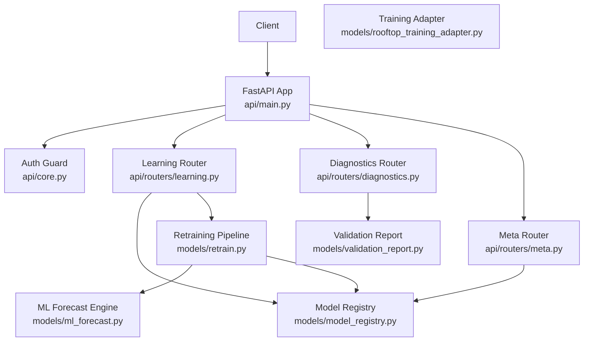
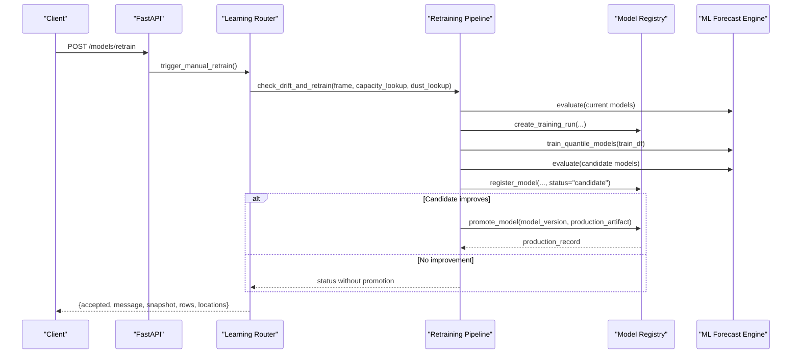
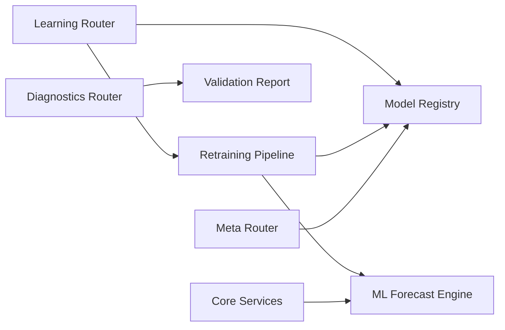
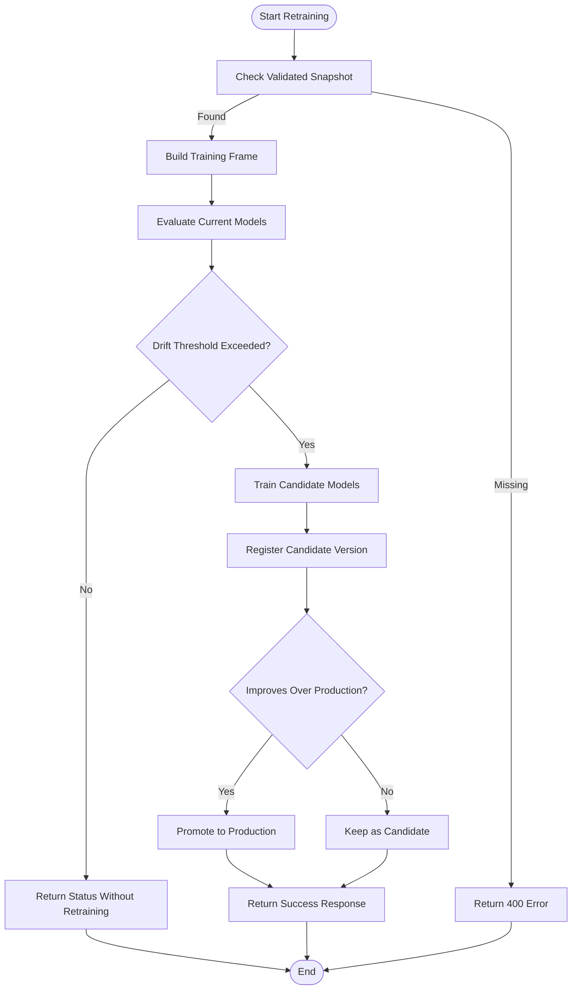
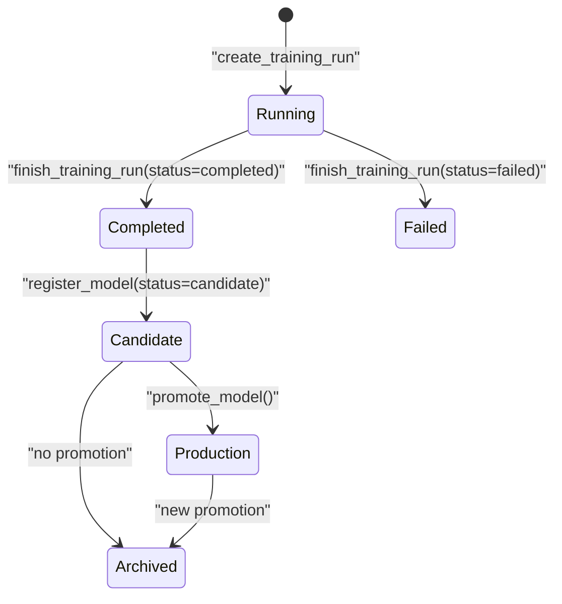

# Learning & Model Management

<cite>
**Referenced Files in This Document**
- [api/main.py](file://api/main.py)
- [api/core.py](file://api/core.py)
- [api/routers/learning.py](file://api/routers/learning.py)
- [api/routers/meta.py](file://api/routers/meta.py)
- [api/routers/diagnostics.py](file://api/routers/diagnostics.py)
- [models/model_registry.py](file://models/model_registry.py)
- [models/retrain.py](file://models/retrain.py)
- [models/ml_forecast.py](file://models/ml_forecast.py)
- [models/validation_report.py](file://models/validation_report.py)
- [models/rooftop_training_adapter.py](file://models/rooftop_training_adapter.py)
</cite>

## Table of Contents
1. [Introduction](#introduction)
2. [Project Structure](#project-structure)
3. [Core Components](#core-components)
4. [Architecture Overview](#architecture-overview)
5. [Detailed Component Analysis](#detailed-component-analysis)
6. [Dependency Analysis](#dependency-analysis)
7. [Performance Considerations](#performance-considerations)
8. [Troubleshooting Guide](#troubleshooting-guide)
9. [Conclusion](#conclusion)
10. [Appendices](#appendices)

## Introduction
This document provides detailed API documentation for machine learning model management endpoints in the PV Forecast Platform. It covers:
- Model registry access: listing versions, training runs, and current production model
- Model training initiation via continuous learning and drift detection
- Model validation procedures and evaluation results
- Deployment and rollback operations through promotion logic
- Performance comparison between versions and baselines
- Request/response schemas for metadata, training job status, and evaluation results
- Authentication requirements, rate limiting considerations, and error handling
- End-to-end lifecycle workflows from training to deployment with automation patterns

## Project Structure
The platform is a FastAPI application with domain-scoped routers and shared services:
- Application entrypoint mounts routers and sets up CORS and lifespan scheduling
- Core module defines authentication, model loading, caching, and scheduled jobs
- Learning router exposes model registry and retraining endpoints
- Diagnostics router exposes alerts, metrics, and validation report endpoints
- Model registry persists immutable versioning and training run records
- Retraining pipeline evaluates drift and promotes improved models
- Validation report computes train/validation metrics for deployed models

**Diagram sources**
- [api/main.py:20-41](file://api/main.py#L20-L41)
- [api/core.py:45-52](file://api/core.py#L45-L52)
- [api/routers/learning.py:122-162](file://api/routers/learning.py#L122-L162)
- [api/routers/diagnostics.py:117-125](file://api/routers/diagnostics.py#L117-L125)
- [models/model_registry.py:35-160](file://models/model_registry.py#L35-L160)
- [models/retrain.py:40-104](file://models/retrain.py#L40-L104)
- [models/ml_forecast.py:97-152](file://models/ml_forecast.py#L97-L152)
- [models/validation_report.py:62-82](file://models/validation_report.py#L62-L82)
- [models/rooftop_training_adapter.py:26-88](file://models/rooftop_training_adapter.py#L26-L88)

**Section sources**
- [api/main.py:1-42](file://api/main.py#L1-L42)
- [api/core.py:1-166](file://api/core.py#L1-L166)

## Core Components
- Authentication guard enforces an API key header for protected endpoints
- Model registry stores immutable model versions, training runs, and production state
- Retraining pipeline performs drift detection against persistence baseline and promotes better candidates
- Validation report computes pinball loss, MAE, RMSE, coverage, and accuracy on split datasets
- Training adapter converts validated rooftop measurements into canonical model schema

Key responsibilities:
- Learning router: trigger retraining, query production model, list versions and training runs
- Diagnostics router: provide alerts, metrics, and validation report retrieval
- Core: manage model cache, forecast generation, and background scheduling

**Section sources**
- [api/core.py:45-52](file://api/core.py#L45-L52)
- [models/model_registry.py:35-160](file://models/model_registry.py#L35-L160)
- [models/retrain.py:40-104](file://models/retrain.py#L40-L104)
- [models/validation_report.py:62-82](file://models/validation_report.py#L62-L82)
- [models/rooftop_training_adapter.py:26-88](file://models/rooftop_training_adapter.py#L26-L88)
- [api/routers/learning.py:122-162](file://api/routers/learning.py#L122-L162)
- [api/routers/diagnostics.py:117-125](file://api/routers/diagnostics.py#L117-L125)

## Architecture Overview
The model management architecture combines file-based registries with a continuous learning loop:
- Retraining is triggered manually or scheduled; it evaluates drift and trains candidate models
- Candidate models are registered as immutable versions with metrics
- Promotion copies artifacts and updates version statuses only if performance improves
- Validation reports are generated from historical data and exposed via diagnostics

**Diagram sources**
- [api/routers/learning.py:122-130](file://api/routers/learning.py#L122-L130)
- [models/retrain.py:40-104](file://models/retrain.py#L40-L104)
- [models/model_registry.py:35-131](file://models/model_registry.py#L35-L131)
- [models/ml_forecast.py:97-152](file://models/ml_forecast.py#L97-L152)

## Detailed Component Analysis

### Model Registry Access Endpoints
- GET /models/production: returns current production model record (ensures initial production exists)
- GET /models/versions: lists all model versions in reverse chronological order
- GET /models/training-runs: lists all training runs in reverse chronological order

Request/Response Schemas:
- Production response: object containing model_version, training_run_id, status, created_at, artifact_path, data_start, data_end, feature_version, schema_version, metrics, promoted_at, production_artifact
- Versions response: array of version objects with fields above
- Training runs response: array of run objects with training_run_id, status, started_at, finished_at, data_start, data_end, feature_version, schema_version, source, model_version, metrics, error

Authentication:
- These endpoints do not explicitly require the API key guard in their definitions; however, global protection can be applied at the app level if needed.

Error Handling:
- If no production model exists, ensure_initial_production initializes a baseline using the existing artifact path and metrics.

**Section sources**
- [api/routers/learning.py:147-162](file://api/routers/learning.py#L147-L162)
- [models/model_registry.py:98-160](file://models/model_registry.py#L98-L160)

### Model Training Initiation and Drift Detection
- POST /models/retrain: starts a retraining job from the latest validated rooftop measurement snapshot
- GET /retrain/status: returns schedule configuration and recent retraining log entries

Behavior:
- Retraining uses a lock to prevent concurrent jobs
- Builds a training frame from validated snapshots; requires weather columns
- Evaluates drift by comparing model MAE to persistence baseline
- Trains candidate models and registers them as “candidate” versions
- Promotes candidate only if it outperforms current production

Request/Response Schemas:
- Trigger response: accepted boolean, message string, snapshot path, rows count, locations count
- Status response: retrain_log array, schedule object with enabled, interval_days, source, promotion_policy

Error Handling:
- Returns HTTP 400 when no validated snapshot is available or when validation splits are insufficient

**Section sources**
- [api/routers/learning.py:69-130](file://api/routers/learning.py#L69-L130)
- [models/retrain.py:40-104](file://models/retrain.py#L40-L104)
- [models/rooftop_training_adapter.py:26-88](file://models/rooftop_training_adapter.py#L26-L88)

### Model Validation Procedures
- GET /model/validation: retrieves model validation metrics computed from historical data

Behavior:
- Reads hourly dataset, splits into train/validation by timestamp quantile
- Computes pinball loss across quantiles, MAE, RMSE, nRMSE%, accuracy%, coverage%
- Writes JSON report to results directory

Request/Response Schemas:
- Response: object with source, dataset_path, model_path, split_timestamp, training metrics, validation metrics

Error Handling:
- Returns HTTP 404 if validation metrics file does not exist
- Returns HTTP 500 if metrics cannot be read

**Section sources**
- [api/routers/diagnostics.py:117-125](file://api/routers/diagnostics.py#L117-L125)
- [models/validation_report.py:22-82](file://models/validation_report.py#L22-L82)

### Model Deployment and Rollback Operations
- Promotion occurs automatically during retraining when candidate metrics improve over production
- Promotion copies artifact to production path and updates version statuses
- Rollback is achieved by promoting a previous candidate that previously held production status

Behavior:
- Candidate must have lower MAE than current production to be promoted
- Previous production version is archived; new production version marked accordingly
- Production record includes artifact path and promotion timestamp

Request/Response Schemas:
- Promotion response: production_record mirroring version object with additional promoted_at and production_artifact fields

Error Handling:
- Raises ValueError if candidate does not outperform production
- Raises FileNotFoundError if candidate artifact missing

**Section sources**
- [models/model_registry.py:104-131](file://models/model_registry.py#L104-L131)
- [models/retrain.py:96-101](file://models/retrain.py#L96-L101)

### Performance Comparison Between Versions
- GET /metrics: returns backtest metrics by horizon bucket comparing model vs persistence and clear-sky baselines
- Evaluation functions compute overall MAE, nRMSE%, and P10-P90 coverage

Behavior:
- Metrics include nRMSE_ours_% vs nRMSE_persistence_% and nRMSE_clearsky_%
- Coverage indicates percentage of actual values within P10-P90 band

Request/Response Schemas:
- Response: array of objects with horizon_bucket, nrmse_ours_pct, nrmse_persistence_pct, nrmse_clearsky_pct, coverage_pct, samples

**Section sources**
- [api/routers/diagnostics.py:102-114](file://api/routers/diagnostics.py#L102-L114)
- [models/ml_forecast.py:155-224](file://models/ml_forecast.py#L155-L224)

### Alerts and Monitoring
- GET /alerts: aggregates forecast uncertainty, ramp-down risks, saturation risks, and retraining status
- Behavior: reads current forecast, applies thresholds, checks retrain state and drift ratio

Request/Response Schemas:
- Response: alerts array with type, timestamp, detail, severity; count integer

Error Handling:
- Gracefully handles missing retrain state files and logs

**Section sources**
- [api/routers/diagnostics.py:17-80](file://api/routers/diagnostics.py#L17-L80)

### Authentication Requirements
- Protected endpoints use X-API-Key header; invalid or missing key returns HTTP 403
- The metering push endpoint requires authentication; model registry endpoints currently do not enforce it in their definitions

Request Schema:
- Header: X-API-Key with value matching configured API key

Error Handling:
- Returns HTTP 403 with detail message for invalid or missing key

**Section sources**
- [api/core.py:45-52](file://api/core.py#L45-L52)
- [api/routers/learning.py:52-66](file://api/routers/learning.py#L52-L66)

### Rate Limiting Considerations
- No explicit rate limiting middleware is configured in the application
- Background scheduler refreshes forecasts every 15 minutes and triggers daily retraining
- Retraining uses a thread lock to prevent concurrent execution

Recommendations:
- Add rate limiting middleware to protect endpoints under high load
- Monitor retrain job concurrency and queue length
- Implement circuit breakers for external dependencies like weather clients

[No sources needed since this section provides general guidance]

### Error Handling Summary
- HTTP 400: Invalid inputs, missing validated snapshots, insufficient data splits
- HTTP 403: Invalid or missing API key
- HTTP 404: Missing datasets or reports
- HTTP 500: Internal errors reading validation metrics

**Section sources**
- [api/routers/learning.py:122-130](file://api/routers/learning.py#L122-L130)
- [api/routers/diagnostics.py:83-125](file://api/routers/diagnostics.py#L83-L125)
- [models/model_registry.py:104-131](file://models/model_registry.py#L104-L131)

## Dependency Analysis
The system exhibits clear separation of concerns:
- Routers depend on core services for authentication and model loading
- Retraining pipeline depends on ML engine and registry for training and versioning
- Validation report depends on historical datasets and model artifacts
- Diagnostics aggregate multiple sources for operational insights

**Diagram sources**
- [api/routers/learning.py:122-162](file://api/routers/learning.py#L122-L162)
- [models/retrain.py:40-104](file://models/retrain.py#L40-L104)
- [models/model_registry.py:35-160](file://models/model_registry.py#L35-L160)
- [models/ml_forecast.py:97-152](file://models/ml_forecast.py#L97-L152)
- [models/validation_report.py:62-82](file://models/validation_report.py#L62-L82)
- [api/routers/diagnostics.py:117-125](file://api/routers/diagnostics.py#L117-L125)

**Section sources**
- [api/routers/learning.py:122-162](file://api/routers/learning.py#L122-L162)
- [models/retrain.py:40-104](file://models/retrain.py#L40-L104)
- [models/model_registry.py:35-160](file://models/model_registry.py#L35-L160)
- [models/ml_forecast.py:97-152](file://models/ml_forecast.py#L97-L152)
- [models/validation_report.py:62-82](file://models/validation_report.py#L62-L82)
- [api/routers/diagnostics.py:117-125](file://api/routers/diagnostics.py#L117-L125)

## Performance Considerations
- Model caching reduces repeated loading overhead; cache lifetime is bounded by time-based expiration
- Retraining is serialized via threading locks to avoid race conditions
- Backtesting metrics are precomputed and stored for quick retrieval
- Weather data fallback ensures forecast continuity even when live sources fail

Optimization opportunities:
- Implement async I/O for file operations where appropriate
- Add pagination for large metric responses
- Cache retrain status and logs to reduce disk reads

[No sources needed since this section provides general guidance]

## Troubleshooting Guide
Common issues and resolutions:
- No validated rooftop snapshot: Import validated measurements before triggering retraining
- Insufficient data splits: Ensure enough historical data for separate training and validation periods
- Candidate not promoted: Verify candidate metrics improve over current production
- Missing validation metrics: Run validation report generation script first
- API key errors: Ensure X-API-Key header matches configured value

Diagnostic endpoints:
- /alerts: Check for model retraining status and drift warnings
- /metrics: Review backtest performance across horizons
- /model/validation: Validate model accuracy on historical splits

**Section sources**
- [api/routers/learning.py:122-130](file://api/routers/learning.py#L122-L130)
- [models/retrain.py:71-104](file://models/retrain.py#L71-L104)
- [api/routers/diagnostics.py:17-80](file://api/routers/diagnostics.py#L17-L80)
- [models/validation_report.py:62-82](file://models/validation_report.py#L62-L82)

## Conclusion
The platform provides a robust model management system with:
- Immutable versioning and training run tracking
- Automated drift detection and conditional promotion
- Comprehensive validation and evaluation metrics
- Operational alerts and monitoring capabilities
- Clear API boundaries for integration with automated ML pipelines

Best practices:
- Always validate input data before training
- Monitor drift ratios and alert thresholds
- Use version history to audit model changes
- Secure endpoints with API keys in production environments

[No sources needed since this section summarizes without analyzing specific files]

## Appendices

### API Endpoint Reference
- POST /models/retrain: Trigger manual retraining
- GET /retrain/status: Query retraining schedule and recent logs
- GET /models/production: Retrieve current production model
- GET /models/versions: List all model versions
- GET /models/training-runs: List all training runs
- GET /model/validation: Get validation metrics
- GET /metrics: Get backtest metrics by horizon
- GET /alerts: Get operational alerts

### Data Flow Diagrams

#### Retraining Workflow

**Diagram sources**
- [models/retrain.py:40-104](file://models/retrain.py#L40-L104)
- [models/model_registry.py:69-131](file://models/model_registry.py#L69-L131)
- [api/routers/learning.py:122-130](file://api/routers/learning.py#L122-L130)

#### Model Lifecycle States

**Diagram sources**
- [models/model_registry.py:35-131](file://models/model_registry.py#L35-L131)