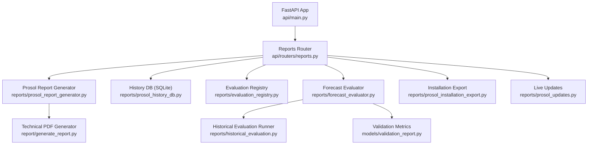
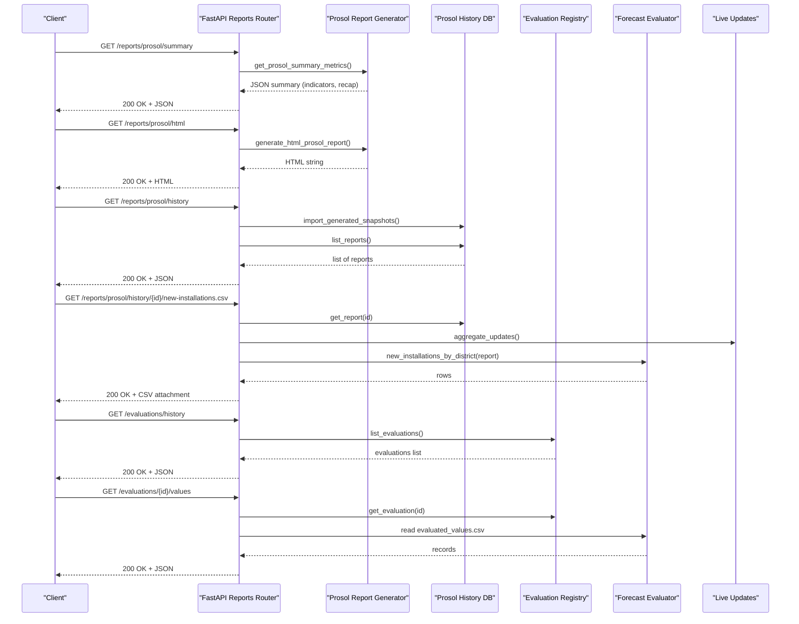
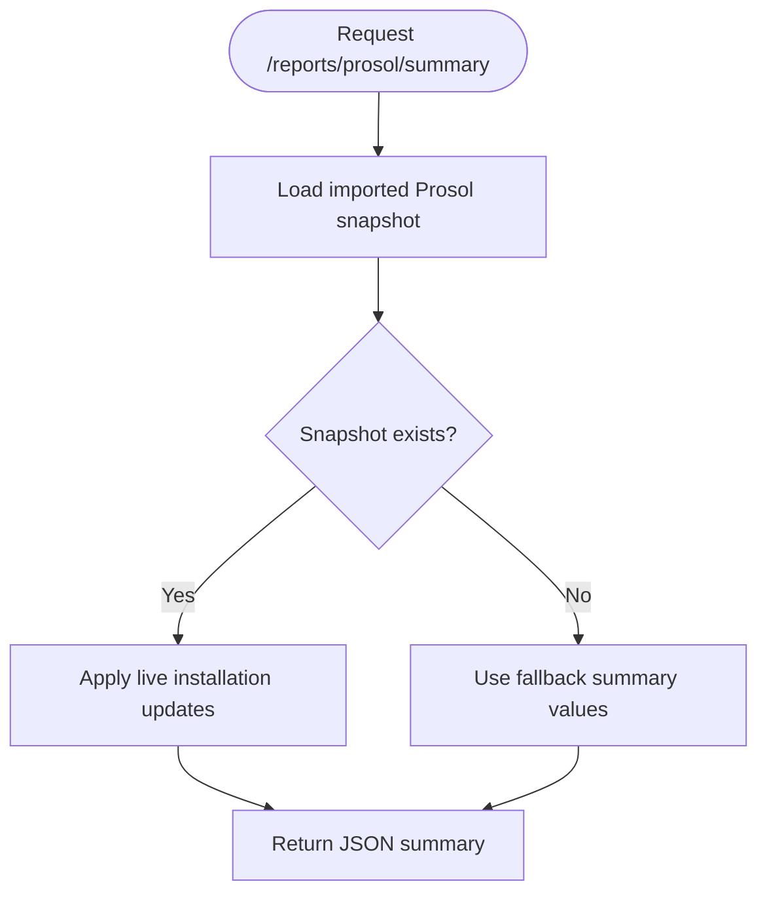
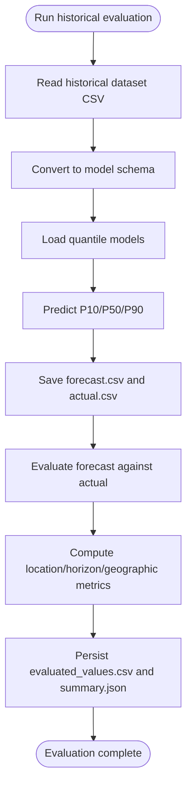
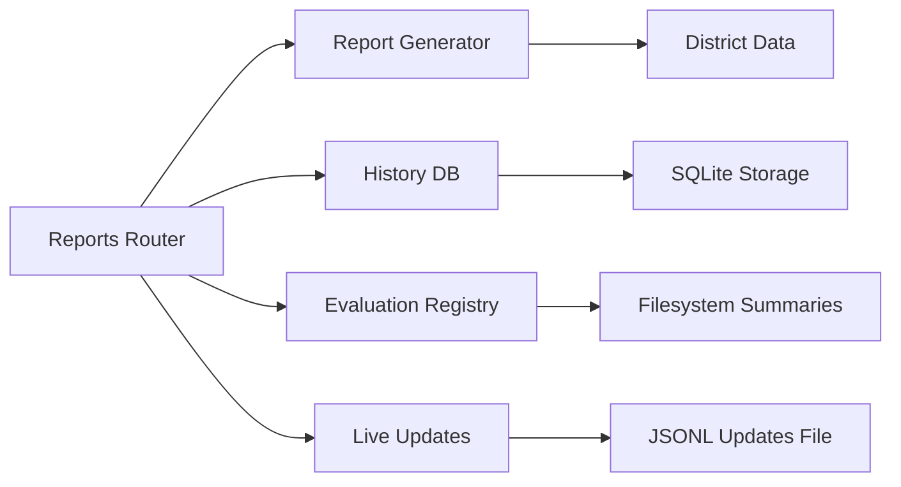

# Reporting & Export

<cite>
**Referenced Files in This Document**
- [main.py](file://api/main.py)
- [reports.py](file://api/routers/reports.py)
- [prosol_report_generator.py](file://reports/prosol_report_generator.py)
- [generate_report.py](file://report/generate_report.py)
- [prosol_history_db.py](file://reports/prosol_history_db.py)
- [prosol_installation_export.py](file://reports/prosol_installation_export.py)
- [evaluation_registry.py](file://reports/evaluation_registry.py)
- [forecast_evaluator.py](file://reports/forecast_evaluator.py)
- [historical_evaluation.py](file://reports/historical_evaluation.py)
- [validation_report.py](file://models/validation_report.py)
- [prosol_updates.py](file://reports/prosol_updates.py)
</cite>

## Table of Contents
1. [Introduction](#introduction)
2. [Project Structure](#project-structure)
3. [Core Components](#core-components)
4. [Architecture Overview](#architecture-overview)
5. [Detailed Component Analysis](#detailed-component-analysis)
6. [Dependency Analysis](#dependency-analysis)
7. [Performance Considerations](#performance-considerations)
8. [Troubleshooting Guide](#troubleshooting-guide)
9. [Conclusion](#conclusion)
10. [Appendices](#appendices)

## Introduction
This document provides detailed API documentation for reporting and data export endpoints exposed by the platform. It covers:
- Report generation endpoints for official Prosol reports (HTML, JSON snapshots, CSV exports)
- Historical analysis endpoints for comparing actual vs predicted values and evaluating performance metrics
- Bulk data retrieval endpoints for installation updates and evaluation datasets
- Integration patterns and examples to automate report generation and downstream consumption

The API is implemented with FastAPI and organized under a single application that includes multiple routers. The reporting router exposes endpoints for Prosol reports, historical evaluations, and displacement summaries.

## Project Structure
The reporting functionality spans the API layer and several report modules:
- API entrypoint registers all routers, including the reporting router
- Reporting router defines HTTP endpoints for Prosol reports, history, evaluations, and CSV downloads
- Report generators produce HTML and JSON outputs
- Evaluation modules compute forecast accuracy metrics and persist results
- History persistence stores immutable Prosol snapshots in SQLite
- Installation update module supports append-only live updates layered over reports

**Diagram sources**
- [main.py:10-41](file://api/main.py#L10-L41)
- [reports.py:35-148](file://api/routers/reports.py#L35-L148)
- [prosol_report_generator.py:115-254](file://reports/prosol_report_generator.py#L115-L254)
- [prosol_history_db.py:72-197](file://reports/prosol_history_db.py#L72-L197)
- [evaluation_registry.py:13-70](file://reports/evaluation_registry.py#L13-L70)
- [forecast_evaluator.py:29-189](file://reports/forecast_evaluator.py#L29-L189)
- [prosol_installation_export.py:12-52](file://reports/prosol_installation_export.py#L12-L52)
- [prosol_updates.py:36-75](file://reports/prosol_updates.py#L36-L75)
- [generate_report.py:33-251](file://report/generate_report.py#L33-L251)
- [historical_evaluation.py:32-77](file://reports/historical_evaluation.py#L32-L77)
- [validation_report.py:62-82](file://models/validation_report.py#L62-L82)

**Section sources**
- [main.py:10-41](file://api/main.py#L10-L41)
- [reports.py:35-148](file://api/routers/reports.py#L35-L148)

## Core Components
- Reports router: Exposes endpoints for Prosol summary, HTML report, snapshot retrieval, history listing/detail, CSV download, import, evaluations list/detail/values, and displacement summary.
- Prosol report generator: Produces an official HTML report and a structured JSON summary of eight canonical indicators; can overlay live installation updates.
- Technical PDF generator: Builds a print-ready technical report using ReportLab.
- History persistence: Imports and stores immutable Prosol snapshots into SQLite; lists and retrieves reports by snapshot ID.
- Evaluation registry: Discovers evaluation summaries and metadata from filesystem directories.
- Forecast evaluator: Validates schemas, merges forecasts with actuals, computes metrics by location/horizon/geography, and persists evaluated values and summaries.
- Installation export: Derives district-level new installation rows and serializes them to CSV.
- Live updates: Append-only records of validated installation updates aggregated per district.

**Section sources**
- [reports.py:38-148](file://api/routers/reports.py#L38-L148)
- [prosol_report_generator.py:115-254](file://reports/prosol_report_generator.py#L115-L254)
- [generate_report.py:33-251](file://report/generate_report.py#L33-L251)
- [prosol_history_db.py:72-197](file://reports/prosol_history_db.py#L72-L197)
- [evaluation_registry.py:13-70](file://reports/evaluation_registry.py#L13-L70)
- [forecast_evaluator.py:29-189](file://reports/forecast_evaluator.py#L29-L189)
- [prosol_installation_export.py:12-52](file://reports/prosol_installation_export.py#L12-L52)
- [prosol_updates.py:36-75](file://reports/prosol_updates.py#L36-L75)

## Architecture Overview
The reporting architecture combines REST endpoints with backend services that generate reports, evaluate forecasts, and persist data.

**Diagram sources**
- [reports.py:38-148](file://api/routers/reports.py#L38-L148)
- [prosol_report_generator.py:115-254](file://reports/prosol_report_generator.py#L115-L254)
- [prosol_history_db.py:157-197](file://reports/prosol_history_db.py#L157-L197)
- [evaluation_registry.py:27-70](file://reports/evaluation_registry.py#L27-L70)
- [forecast_evaluator.py:119-189](file://reports/forecast_evaluator.py#L119-L189)
- [prosol_installation_export.py:12-52](file://reports/prosol_installation_export.py#L12-L52)
- [prosol_updates.py:67-75](file://reports/prosol_updates.py#L67-L75)

## Detailed Component Analysis

### Prosol Report Endpoints
- GET /reports/prosol/summary
  - Purpose: Returns the official 8-indicator Prosol summary with recap executions and top/last districts.
  - Response: JSON object containing report_period, emission_date, direction_tutelle, recap_executions, indicators array, top_five_districts, last_five_districts, and optional live_updates_applied when live updates are applied.
  - Notes: Uses fallback values if no imported snapshot exists; overlays live installation updates when present.

- GET /reports/prosol/snapshot
  - Purpose: Retrieves the raw Prosol JSON snapshot file used for report generation.
  - Response: JSON object representing the imported snapshot payload.
  - Error: 404 if snapshot file not found.

- GET /reports/prosol/html
  - Purpose: Serves a print-ready HTML report styled like STEG’s Tableau de Bord Programme Prosol.
  - Response: HTML content.

- GET /reports/prosol/history
  - Purpose: Lists available Prosol report snapshots stored in the history database after importing generated snapshots.
  - Response: JSON object with reports array containing snapshot_id, report_period, emission_date, source_file, imported_at, scope, reconciliation_passed.

- GET /reports/prosol/history/{snapshot_id}
  - Purpose: Retrieves full details for a specific snapshot, including new_installations_by_district and live_updates.
  - Response: JSON object with report fields plus derived district metrics and live totals.
  - Error: 404 if snapshot not found.

- GET /reports/prosol/history/{snapshot_id}/new-installations.csv
  - Purpose: Downloads a CSV export of new installations by district for a given snapshot, augmented with live updates.
  - Response: text/csv with Content-Disposition attachment header.
  - Error: 404 if snapshot not found.

- POST /reports/prosol/history/import
  - Purpose: Imports a Prosol snapshot JSON file into the history database.
  - Request body: { path: string } where path is relative to project root.
  - Response: { snapshot_id: string, inserted: boolean }.
  - Error: 400 if path is invalid or not within project root.

**Section sources**
- [reports.py:38-117](file://api/routers/reports.py#L38-L117)
- [prosol_report_generator.py:115-254](file://reports/prosol_report_generator.py#L115-L254)
- [prosol_history_db.py:157-197](file://reports/prosol_history_db.py#L157-L197)
- [prosol_installation_export.py:12-52](file://reports/prosol_installation_export.py#L12-L52)
- [prosol_updates.py:36-75](file://reports/prosol_updates.py#L36-L75)

### Forecast Evaluation Endpoints
- GET /evaluations/history
  - Purpose: Lists all available forecast evaluation summaries discovered on disk.
  - Response: JSON object with evaluations array containing evaluation_id, path, rows_matched, created_at, source, forecast_source, actual_source, horizon_metrics.

- GET /evaluations/{evaluation_id}
  - Purpose: Retrieves a specific evaluation summary with optional metadata.
  - Response: JSON object with evaluation details and metadata if present.
  - Error: 404 if evaluation not found.

- GET /evaluations/{evaluation_id}/values
  - Purpose: Retrieves evaluated values dataset for a specific evaluation.
  - Response: JSON array of records from evaluated_values.csv.
  - Error: 404 if evaluated values not available.

**Section sources**
- [reports.py:120-142](file://api/routers/reports.py#L120-L142)
- [evaluation_registry.py:27-70](file://reports/evaluation_registry.py#L27-L70)
- [forecast_evaluator.py:119-189](file://reports/forecast_evaluator.py#L119-L189)

### Displacement Summary Endpoint
- GET /displacement/summary
  - Purpose: Computes national displacement based on aggregated forecast frame.
  - Response: JSON object with displacement metrics calculated from national forecast totals.

**Section sources**
- [reports.py:145-148](file://api/routers/reports.py#L145-L148)

### Installation Update Endpoints
- GET /reports/prosol/updates
  - Purpose: Lists recent installation updates and aggregates totals by district.
  - Response: JSON object with updates array and totals_by_district map.

- POST /reports/prosol/updates
  - Purpose: Adds a validated installation update record.
  - Request body: { district: string, new_installations: number, installed_capacity_kwp?: number, report_period?: string, source?: string, notes?: string }
  - Response: Record object with update_id, recorded_at, report_period, district, direction, new_installations, installed_capacity_kwp, source, notes.
  - Error: 400 if validation fails (e.g., unknown district or non-positive numbers).

**Section sources**
- [reports.py:79-89](file://api/routers/reports.py#L79-L89)
- [prosol_updates.py:36-75](file://reports/prosol_updates.py#L36-L75)

### Data Models and Schemas

#### Prosol Summary Metrics
- Fields:
  - report_period: string
  - emission_date: string
  - direction_tutelle: string
  - recap_executions: object with period, executes_current, executes_prev, executes_var_pct, pending_current, pending_prev, pending_var_pct, completion_rate_pct
  - indicators: array of objects with id, label, unit, month_current, month_prev, month_var, ytd_current, ytd_prev, ytd_var, since_2011
  - top_five_districts: array of objects with name, rate_2026, rate_2025
  - last_five_districts: array of objects with name, rate_2026, rate_2025
  - live_updates_applied: integer (optional)

**Section sources**
- [prosol_report_generator.py:115-254](file://reports/prosol_report_generator.py#L115-L254)

#### Prosol Snapshot
- Fields:
  - report_period: string
  - emission_date: string
  - source_file: string
  - national_rows: array of indicator rows
  - directions: array of direction payloads
  - districts: array of district payloads
  - installation_sizes: array of installation size payloads
  - pending_dossiers: object with current_year_to_date and previous_year_to_date
  - reconciliation: object with passed flag

**Section sources**
- [prosol_history_db.py:99-154](file://reports/prosol_history_db.py#L99-L154)

#### New Installations CSV Columns
- Fields:
  - report_period: string
  - emission_date: string
  - district: string
  - direction: string
  - new_installations_month: number
  - new_installations_ytd: number
  - live_new_installations: number
  - current_new_installations_ytd: number
  - installations_since_program_start: number
  - new_capacity_mw_month: number
  - new_capacity_mw_ytd: number
  - source_file: string
  - source: string

**Section sources**
- [prosol_installation_export.py:12-52](file://reports/prosol_installation_export.py#L12-L52)

#### Evaluation Summary
- Fields:
  - evaluation_id: string
  - created_at: string
  - forecast_source: string
  - actual_source: string
  - power_unit: string
  - rows_matched: number
  - metrics: array of location metrics
  - horizon_metrics: array of horizon bucket metrics
  - geographic_metrics: array (optional)

**Section sources**
- [forecast_evaluator.py:119-189](file://reports/forecast_evaluator.py#L119-L189)

#### Installation Update Record
- Fields:
  - update_id: string
  - recorded_at: string
  - report_period: string
  - district: string
  - direction: string
  - new_installations: number
  - installed_capacity_kwp: number
  - source: string
  - notes: string

**Section sources**
- [prosol_updates.py:36-75](file://reports/prosol_updates.py#L36-L75)

### Processing Logic and Workflows

#### Prosol Report Generation Workflow

**Diagram sources**
- [prosol_report_generator.py:23-112](file://reports/prosol_report_generator.py#L23-L112)
- [prosol_report_generator.py:115-254](file://reports/prosol_report_generator.py#L115-L254)

**Section sources**
- [prosol_report_generator.py:23-112](file://reports/prosol_report_generator.py#L23-L112)
- [prosol_report_generator.py:115-254](file://reports/prosol_report_generator.py#L115-L254)

#### Forecast Evaluation Workflow

**Diagram sources**
- [historical_evaluation.py:32-77](file://reports/historical_evaluation.py#L32-L77)
- [forecast_evaluator.py:119-189](file://reports/forecast_evaluator.py#L119-L189)

**Section sources**
- [historical_evaluation.py:32-77](file://reports/historical_evaluation.py#L32-L77)
- [forecast_evaluator.py:119-189](file://reports/forecast_evaluator.py#L119-L189)

### Output Formats and Download Links
- HTML: Served directly via /reports/prosol/html
- JSON: Returned by /reports/prosol/summary and /reports/prosol/snapshot
- CSV: Downloaded via /reports/prosol/history/{snapshot_id}/new-installations.csv with Content-Disposition attachment header
- PDF: Generated offline by report/generate_report.py; not exposed as a direct endpoint in the reporting router

**Section sources**
- [reports.py:51-53](file://api/routers/reports.py#L51-L53)
- [reports.py:92-108](file://api/routers/reports.py#L92-L108)
- [generate_report.py:33-251](file://report/generate_report.py#L33-L251)

## Dependency Analysis
The reporting system has clear separation between API routing, report generation, evaluation, and persistence:
- The reports router depends on report generators, history DB, evaluation registry, and live updates
- Report generators depend on district data and aggregation utilities
- Evaluators depend on model artifacts and historical datasets
- History DB persists snapshots and provides listing/retrieval
- Evaluation registry discovers summaries and metadata from filesystem paths

**Diagram sources**
- [reports.py:35-148](file://api/routers/reports.py#L35-L148)
- [prosol_report_generator.py:115-254](file://reports/prosol_report_generator.py#L115-L254)
- [prosol_history_db.py:72-197](file://reports/prosol_history_db.py#L72-L197)
- [evaluation_registry.py:13-70](file://reports/evaluation_registry.py#L13-L70)
- [prosol_updates.py:36-75](file://reports/prosol_updates.py#L36-L75)

**Section sources**
- [reports.py:35-148](file://api/routers/reports.py#L35-L148)
- [prosol_report_generator.py:115-254](file://reports/prosol_report_generator.py#L115-L254)
- [prosol_history_db.py:72-197](file://reports/prosol_history_db.py#L72-L197)
- [evaluation_registry.py:13-70](file://reports/evaluation_registry.py#L13-L70)
- [prosol_updates.py:36-75](file://reports/prosol_updates.py#L36-L75)

## Performance Considerations
- CSV downloads derive rows in memory and stream via PlainTextResponse; ensure snapshot sizes remain manageable
- History imports scan generated snapshots directory; batch imports may be needed for large volumes
- Evaluation merging joins forecast and actual datasets; ensure indexes on timestamp and location_id for performance
- Live updates aggregation reads JSONL file; consider caching aggregated totals for frequent requests

[No sources needed since this section provides general guidance]

## Troubleshooting Guide
Common issues and resolutions:
- Missing Prosol snapshot: Ensure the snapshot file exists at the expected path or run the import endpoint to populate the history database
- No evaluated values available: Verify that evaluation runs have been executed and persisted under results/forecast_evaluations or evaluations directories
- Invalid snapshot path: When importing, ensure the provided path resolves within the project root and points to an existing file
- Unknown district in updates: Validate district names against known STEG districts before submitting updates

**Section sources**
- [reports.py:43-48](file://api/routers/reports.py#L43-L48)
- [reports.py:92-108](file://api/routers/reports.py#L92-L108)
- [reports.py:111-117](file://api/routers/reports.py#L111-L117)
- [prosol_updates.py:36-44](file://reports/prosol_updates.py#L36-L44)

## Conclusion
The reporting and export subsystem provides robust endpoints for generating official Prosol reports, retrieving historical snapshots, exporting district-level installation data, and accessing forecast evaluation metrics. The design emphasizes immutability for snapshots and evaluations, while allowing live updates to enrich reports. Integration patterns include direct HTTP calls for JSON/HTML/CSV and scheduled jobs for evaluation runs and report generation.

[No sources needed since this section summarizes without analyzing specific files]

## Appendices

### Example Workflows and Automation Patterns
- Generate official HTML report: Call GET /reports/prosol/html and render in browser or convert to PDF using a headless browser
- Retrieve summary metrics: Call GET /reports/prosol/summary and consume JSON for dashboards or downstream systems
- Export new installations CSV: Call GET /reports/prosol/history/{snapshot_id}/new-installations.csv and parse CSV for analytics
- Import Prosol snapshot: Call POST /reports/prosol/history/import with path to JSON snapshot
- List and fetch evaluations: Call GET /evaluations/history and GET /evaluations/{evaluation_id}/values for performance analysis
- Add live installation updates: Call POST /reports/prosol/updates with validated payload to augment reports

[No sources needed since this section provides general guidance]