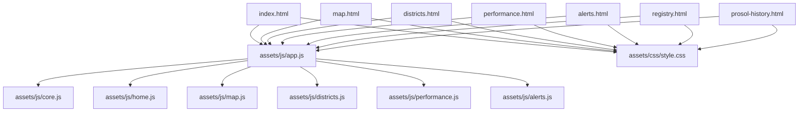
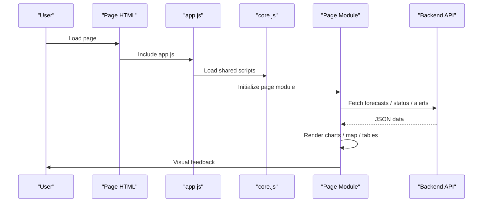
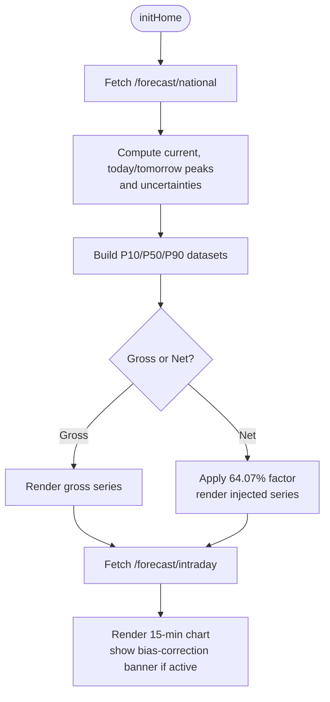
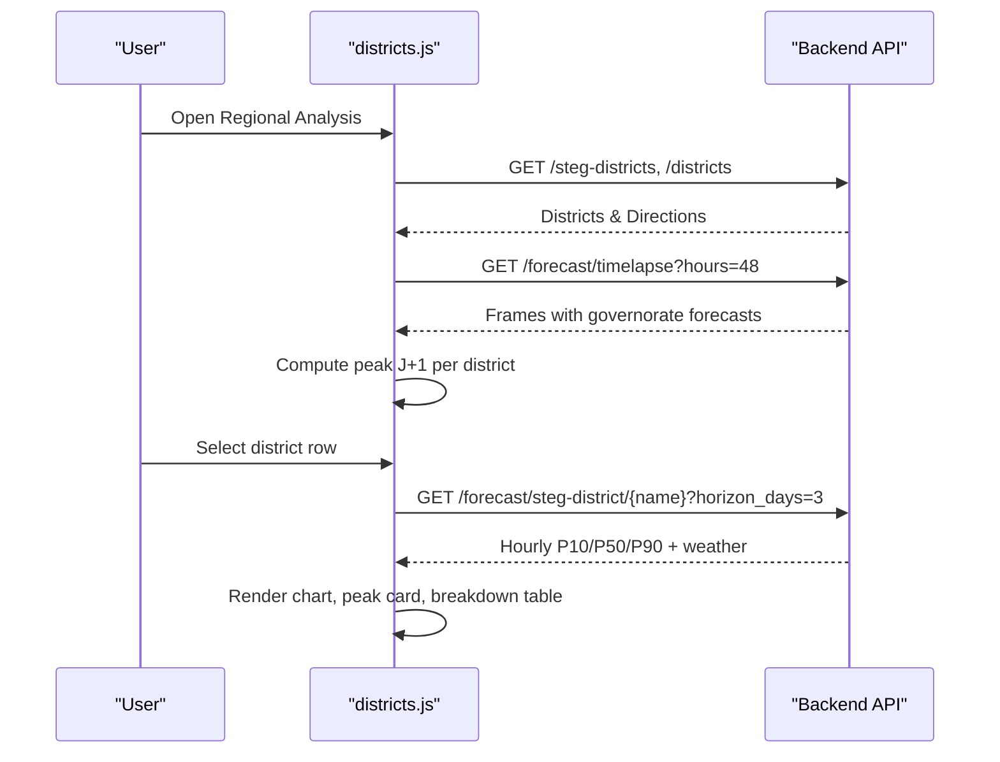
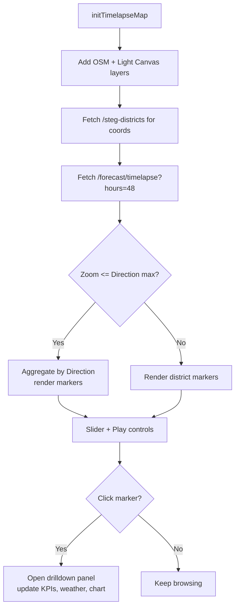
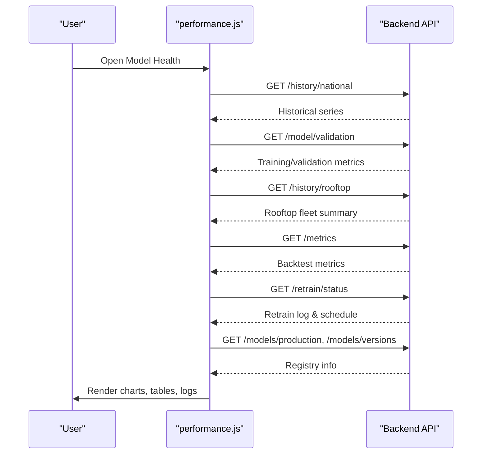
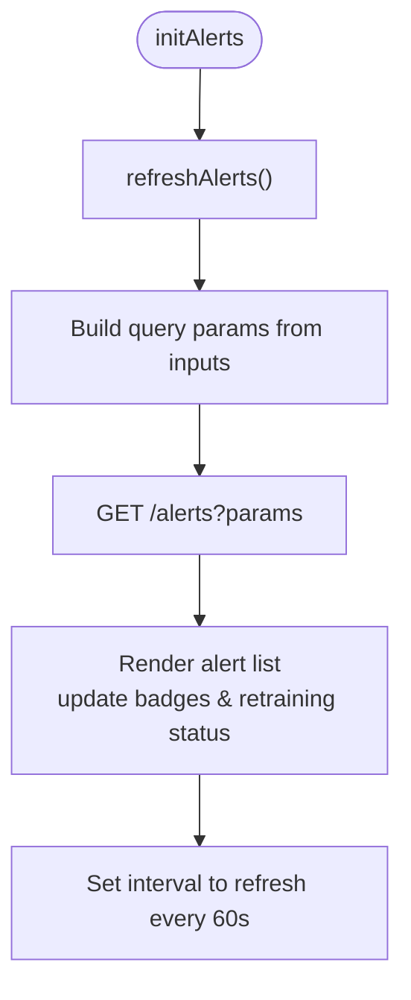
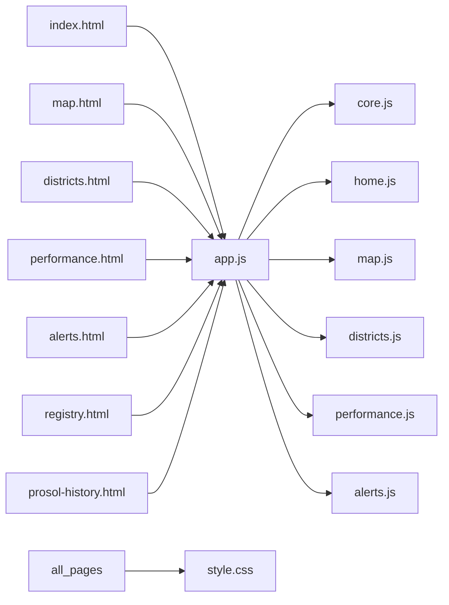

# Dashboard Interface

<cite>
**Referenced Files in This Document**
- [index.html](file://dashboard/index.html)
- [map.html](file://dashboard/map.html)
- [districts.html](file://dashboard/districts.html)
- [performance.html](file://dashboard/performance.html)
- [alerts.html](file://dashboard/alerts.html)
- [registry.html](file://dashboard/registry.html)
- [prosol-history.html](file://dashboard/prosol-history.html)
- [style.css](file://dashboard/assets/css/style.css)
- [app.js](file://dashboard/assets/js/app.js)
- [home.js](file://dashboard/assets/js/home.js)
- [map.js](file://dashboard/assets/js/map.js)
- [districts.js](file://dashboard/assets/js/districts.js)
- [performance.js](file://dashboard/assets/js/performance.js)
- [alerts.js](file://dashboard/assets/js/alerts.js)
</cite>

## Table of Contents
1. [Introduction](#introduction)
2. [Project Structure](#project-structure)
3. [Core Components](#core-components)
4. [Architecture Overview](#architecture-overview)
5. [Detailed Component Analysis](#detailed-component-analysis)
6. [Dependency Analysis](#dependency-analysis)
7. [Performance Considerations](#performance-considerations)
8. [Troubleshooting Guide](#troubleshooting-guide)
9. [Conclusion](#conclusion)
10. [Appendices](#appendices)

## Introduction
This document explains the interactive dashboard interface for the PréSol STEG PV forecasting platform. It focuses on user experience and visualization components across the main pages: National Overview, Regional Analysis (districts), Spatial Timelapse Map, Model Health, Alerts, Park Registry, and Prosol History. It details Chart.js visualizations (time-series forecasts, uncertainty bands, regional comparisons), interactive map features (district-level forecasts, weather overlays, drill-down), multi-language support (EN/FR/AR), responsive design, real-time updates, customization options, extensibility guidance, accessibility, and cross-browser considerations.

## Project Structure
The dashboard is a set of HTML pages sharing a common sidebar navigation, i18n system, and shared JavaScript modules. Each page declares its role via a data attribute and loads a dedicated module to initialize charts and interactions.

**Diagram sources**
- [index.html:1-137](file://dashboard/index.html#L1-L137)
- [map.html:1-252](file://dashboard/map.html#L1-L252)
- [districts.html:1-293](file://dashboard/districts.html#L1-L293)
- [performance.html:1-145](file://dashboard/performance.html#L1-L145)
- [alerts.html:1-84](file://dashboard/alerts.html#L1-L84)
- [registry.html:1-170](file://dashboard/registry.html#L1-L170)
- [prosol-history.html:1-84](file://dashboard/prosol-history.html#L1-L84)
- [app.js:1-18](file://dashboard/assets/js/app.js#L1-L18)
- [core.js:1-658](file://dashboard/assets/js/core.js#L1-L658)
- [style.css:1-807](file://dashboard/assets/css/style.css#L1-L807)

**Section sources**
- [index.html:1-137](file://dashboard/index.html#L1-L137)
- [app.js:1-18](file://dashboard/assets/js/app.js#L1-L18)
- [style.css:1-807](file://dashboard/assets/css/style.css#L1-L807)

## Core Components
- Shared layout and navigation: Sidebar with brand, language toggle (EN/FR/AR), navigation links, API status box, and alert badge.
- Multi-language system: Centralized translations and runtime switching with RTL support for Arabic.
- Charting utilities: Reusable chart factory, P10/P50/P90 datasets, zoom/pan, and “Now” annotation.
- Page-specific modules: Home (national overview), Districts (regional analysis), Map (timelapse + weather), Performance (model health), Alerts (operational alerts), Registry (park registry), Prosol History (report snapshots).

Key responsibilities by file:
- app.js: Entrypoint that dynamically loads per-page modules; global i18n setup; status polling; router dispatch based on page type.
- core.js: Design tokens, i18n resources, translation helpers, Chart.js defaults and helpers, status/alert badge fetchers, global Prosol report modal logic.
- home.js: National overview KPIs, national forecast chart (gross/net toggle), intraday 15-min chart, bias-correction banner.
- map.js: Leaflet map with timelapse frames, direction vs district markers, drilldown panel with live weather and district forecast chart, 7-direction weather grid.
- districts.js: District table with search/filter, peak card, district forecast chart, hour-by-hour prediction breakdown table.
- performance.js: Historical accuracy chart, training/validation metrics, backtest metrics table, retrain log, model registry UI.
- alerts.js: Alert list rendering, threshold controls, auto-refresh, retraining status banner.
- style.css: Responsive layout, theme tokens, component styles, RTL rules, chart wrappers, panels, tables, modals.

**Section sources**
- [app.js:1-18](file://dashboard/assets/js/app.js#L1-L18)
- [core.js:18-658](file://dashboard/assets/js/core.js#L18-L658)
- [home.js:1-133](file://dashboard/assets/js/home.js#L1-L133)
- [map.js:1-300](file://dashboard/assets/js/map.js#L1-L300)
- [districts.js:1-206](file://dashboard/assets/js/districts.js#L1-L206)
- [performance.js:1-293](file://dashboard/assets/js/performance.js#L1-L293)
- [alerts.js:1-124](file://dashboard/assets/js/alerts.js#L1-L124)
- [style.css:1-807](file://dashboard/assets/css/style.css#L1-L807)

## Architecture Overview
The dashboard follows a simple client-side architecture:
- HTML pages define structure and include shared assets.
- app.js bootstraps the application and loads per-page modules.
- core.js provides shared utilities and i18n.
- Per-page modules fetch data from the backend API and render charts/tables/maps.
- Charts are built with Chart.js using shared helpers for uncertainty bands and annotations.
- The map uses Leaflet with OpenStreetMap and an alternative light canvas basemap.

**Diagram sources**
- [app.js:1-18](file://dashboard/assets/js/app.js#L1-L18)
- [core.js:506-573](file://dashboard/assets/js/core.js#L506-L573)
- [home.js:5-133](file://dashboard/assets/js/home.js#L5-L133)
- [map.js:21-112](file://dashboard/assets/js/map.js#L21-L112)
- [districts.js:8-119](file://dashboard/assets/js/districts.js#L8-L119)
- [performance.js:5-293](file://dashboard/assets/js/performance.js#L5-L293)
- [alerts.js:91-124](file://dashboard/assets/js/alerts.js#L91-L124)

## Detailed Component Analysis

### National Overview (Home)
- Layout: KPI cards (current output, today/tomorrow peaks, installed capacity), national forecast chart with gross/net toggle, intraday 15-min chart, bias-correction banner.
- Interactions: Toggle between gross production and net grid injection; hover/zoom on charts; “Now” vertical line annotation.
- Data flow: Fetches national forecast and intraday series; computes KPIs and uncertainty bands; renders charts with P10/P50/P90.

**Diagram sources**
- [home.js:5-133](file://dashboard/assets/js/home.js#L5-L133)
- [core.js:426-497](file://dashboard/assets/js/core.js#L426-L497)

**Section sources**
- [index.html:14-112](file://dashboard/index.html#L14-L112)
- [home.js:5-133](file://dashboard/assets/js/home.js#L5-L133)
- [core.js:426-497](file://dashboard/assets/js/core.js#L426-L497)

### Regional Analysis (Districts)
- Layout: District table with search and direction filter pills; drilldown panel with peak prediction card, district forecast chart, and hour-by-hour model prediction breakdown including weather fields.
- Interactions: Click row to select district; filter by direction; search by name/direction/governorate; view detailed hourly predictions.
- Data flow: Loads district metadata and directions; computes J+1 peak per district; fetches district forecast for selected district; renders charts and table rows with uncertainty classification.

**Diagram sources**
- [districts.html:160-293](file://dashboard/districts.html#L160-L293)
- [districts.js:8-206](file://dashboard/assets/js/districts.js#L8-L206)

**Section sources**
- [districts.html:160-293](file://dashboard/districts.html#L160-L293)
- [districts.js:8-206](file://dashboard/assets/js/districts.js#L8-L206)

### Spatial Timelapse Map
- Layout: Leaflet map with two basemaps (OpenStreetMap and Light Canvas), timelapse slider with play/pause, aggregate total display, uncertainty legend, and a side drilldown panel showing KPIs, live weather snapshot, and a 72-hour forecast chart. Also includes a 7-direction weather snapshot grid.
- Interactions: Zoom level determines aggregation (direction vs district); click markers to open drilldown; slider to scrub timelapse; play/pause animation.
- Data flow: Fetches timelapse frames and district coordinates; renders markers with size/opacity based on utilization and uncertainty; populates drilldown with district forecast and weather; aggregates direction-level weather.

**Diagram sources**
- [map.html:133-252](file://dashboard/map.html#L133-L252)
- [map.js:21-300](file://dashboard/assets/js/map.js#L21-L300)

**Section sources**
- [map.html:133-252](file://dashboard/map.html#L133-L252)
- [map.js:21-300](file://dashboard/assets/js/map.js#L21-L300)

### Model Health (Performance)
- Layout: Historical accuracy chart (actual vs P10/P50/P90), training vs validation bar charts, backtest metrics table, continuous learning retrain log, model registry with manual retrain button.
- Interactions: Reload history; trigger manual retraining; view versioned models and metrics.
- Data flow: Fetches historical series, validation metrics, rooftop summary, metrics table, retrain status/log, and model registry endpoints; renders charts and tables accordingly.

**Diagram sources**
- [performance.html:14-145](file://dashboard/performance.html#L14-L145)
- [performance.js:5-293](file://dashboard/assets/js/performance.js#L5-L293)

**Section sources**
- [performance.html:14-145](file://dashboard/performance.html#L14-L145)
- [performance.js:5-293](file://dashboard/assets/js/performance.js#L5-L293)

### Alerts
- Layout: Threshold controls (uncertainty MW, ramp-down %), refresh button, active alerts list, retraining status banner.
- Interactions: Adjust thresholds and refresh; auto-refresh every minute; view retraining status.
- Data flow: Fetches alerts with optional query parameters; renders items with severity styling; updates badges and retraining banner.

**Diagram sources**
- [alerts.html:10-84](file://dashboard/alerts.html#L10-L84)
- [alerts.js:91-124](file://dashboard/assets/js/alerts.js#L91-L124)

**Section sources**
- [alerts.html:10-84](file://dashboard/alerts.html#L10-L84)
- [alerts.js:91-124](file://dashboard/assets/js/alerts.js#L91-L124)

### Park Registry
- Layout: Summary KPIs, tabs for inventory and pipeline, searchable/filterable table, geographic distribution cards.
- Interactions: Switch tabs; search and filter by direction; view projections and pending dossiers.
- Data flow: Populates tables and cards from registry data; computes projections and execution rates.

**Section sources**
- [registry.html:50-170](file://dashboard/registry.html#L50-L170)

### Prosol History
- Layout: Snapshot selector, national metrics chart, installations by direction chart, district snapshot table, pending dossiers table, add-installations form, CSV export, installation sizes chart.
- Interactions: Select snapshot; submit new installations; download CSV; view aggregated official counts.
- Data flow: Loads snapshot list and content; renders charts and tables; handles form submission and CSV generation.

**Section sources**
- [prosol-history.html:13-84](file://dashboard/prosol-history.html#L13-L84)

## Dependency Analysis
- Pages depend on shared CSS and JS modules.
- app.js orchestrates loading of per-page modules.
- core.js centralizes i18n, chart helpers, and global status/alert fetching.
- Each page module depends on specific API endpoints for data.

**Diagram sources**
- [app.js:1-18](file://dashboard/assets/js/app.js#L1-L18)
- [index.html:1-137](file://dashboard/index.html#L1-L137)
- [map.html:1-252](file://dashboard/map.html#L1-L252)
- [districts.html:1-293](file://dashboard/districts.html#L1-L293)
- [performance.html:1-145](file://dashboard/performance.html#L1-L145)
- [alerts.html:1-84](file://dashboard/alerts.html#L1-L84)
- [registry.html:1-170](file://dashboard/registry.html#L1-L170)
- [prosol-history.html:1-84](file://dashboard/prosol-history.html#L1-L84)
- [style.css:1-807](file://dashboard/assets/css/style.css#L1-L807)

**Section sources**
- [app.js:1-18](file://dashboard/assets/js/app.js#L1-L18)
- [style.css:1-807](file://dashboard/assets/css/style.css#L1-L807)

## Performance Considerations
- Chart rendering: Use shared makeChart helper and dataset builders to minimize duplication and ensure consistent configuration.
- Data fetching: Batch independent requests where possible (e.g., districts and directions in parallel).
- Timelapse playback: Interval-based frame advancement; consider throttling on low-end devices.
- Responsiveness: CSS grid/flex layouts adapt to screen sizes; charts use responsive settings.
- Caching: Status and cache age displayed; avoid unnecessary re-renders when toggling views.

[No sources needed since this section provides general guidance]

## Troubleshooting Guide
- API offline: Status indicator turns red and text shows offline message; alert badge may hide.
- Missing translations: Console warns about missing keys; fallback to English ensures usability.
- Chart errors: Check console for fetch/render errors; verify Chart.js and plugins loaded.
- Map issues: Ensure Leaflet loaded; check network for district coordinates and timelapse frames.
- Alerts not updating: Verify refresh interval and endpoint availability; adjust thresholds and retry.

**Section sources**
- [core.js:506-573](file://dashboard/assets/js/core.js#L506-L573)
- [alerts.js:91-124](file://dashboard/assets/js/alerts.js#L91-L124)

## Conclusion
The dashboard provides a cohesive, multi-language, responsive interface for exploring PV forecasts across national, regional, and spatial dimensions. It leverages Chart.js for robust time-series visualizations with uncertainty bands, Leaflet for interactive mapping with timelapse and weather overlays, and a modular JavaScript architecture for maintainability. Real-time updates and customizable thresholds enhance operational awareness, while clear patterns for extension enable adding new visualizations and integrating additional data sources.

[No sources needed since this section summarizes without analyzing specific files]

## Appendices

### Multi-Language Support (EN/FR/AR)
- Centralized translations in core.js with i18next integration.
- Language toggle buttons update document language and direction (RTL for Arabic).
- Placeholder translations supported for input fields.

**Section sources**
- [core.js:38-386](file://dashboard/assets/js/core.js#L38-L386)
- [style.css:781-800](file://dashboard/assets/css/style.css#L781-L800)

### Chart.js Visualizations
- Time-series forecasts with P10/P50/P90 uncertainty bands.
- “Now” annotation for temporal context.
- Zoom/pan enabled for detailed inspection.
- Gross vs Net toggle for national overview.

**Section sources**
- [core.js:426-497](file://dashboard/assets/js/core.js#L426-L497)
- [home.js:57-98](file://dashboard/assets/js/home.js#L57-L98)

### Interactive Map Features
- Basemap selection (OSM and Light Canvas).
- Direction vs district markers based on zoom.
- Timelapse slider with play/pause.
- Drilldown panel with live weather and district forecast chart.

**Section sources**
- [map.js:21-112](file://dashboard/assets/js/map.js#L21-L112)
- [map.js:167-300](file://dashboard/assets/js/map.js#L167-L300)

### Extending the Dashboard
- Add a new page: Create HTML with data-page attribute; add nav link; implement init function; register in app.js module list.
- Add a new visualization: Use makeChart and p10p50p90Datasets; integrate with existing modules or create a new one.
- Integrate additional data sources: Add fetch calls in appropriate module; handle errors and loading states; update UI elements.

**Section sources**
- [app.js:1-18](file://dashboard/assets/js/app.js#L1-L18)
- [core.js:426-497](file://dashboard/assets/js/core.js#L426-L497)

### Accessibility and Cross-Browser Compatibility
- Semantic HTML structure with accessible labels and roles.
- RTL support for Arabic improves readability.
- Responsive design adapts to mobile and tablet screens.
- Uses widely supported libraries (Chart.js, Leaflet, i18next) for broad compatibility.

**Section sources**
- [style.css:55-64](file://dashboard/assets/css/style.css#L55-L64)
- [style.css:607-614](file://dashboard/assets/css/style.css#L607-L614)
- [style.css:781-800](file://dashboard/assets/css/style.css#L781-L800)