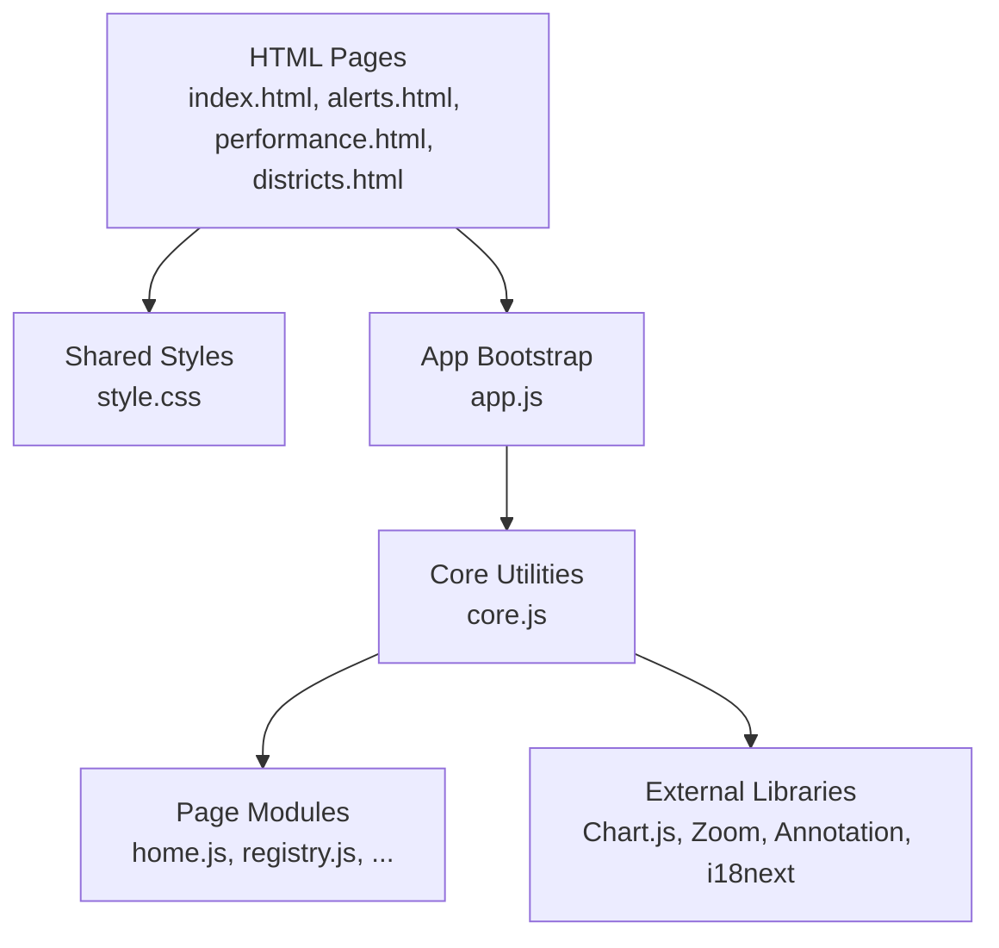
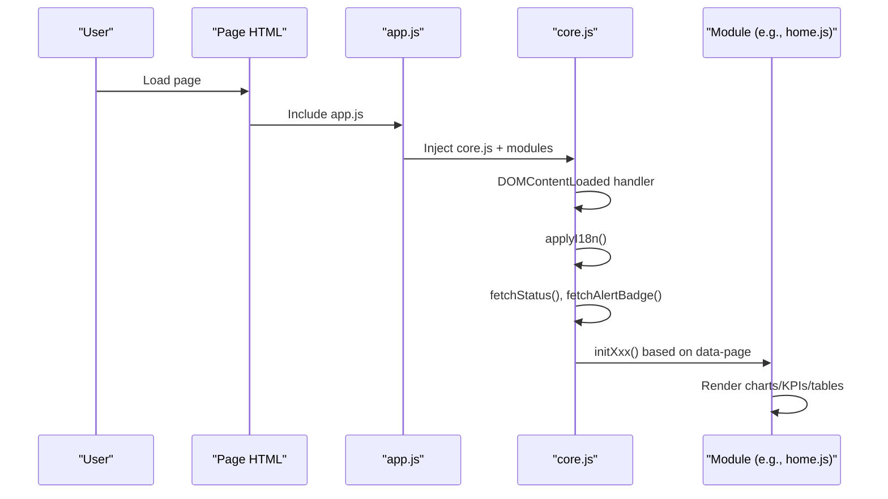
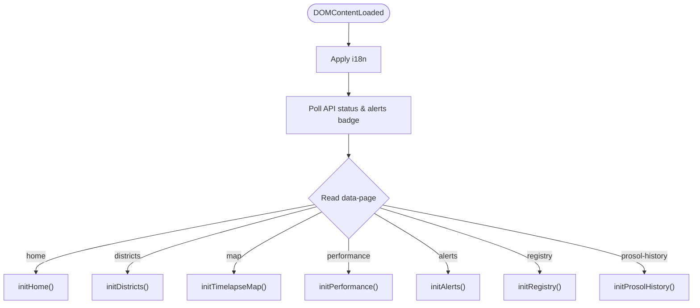
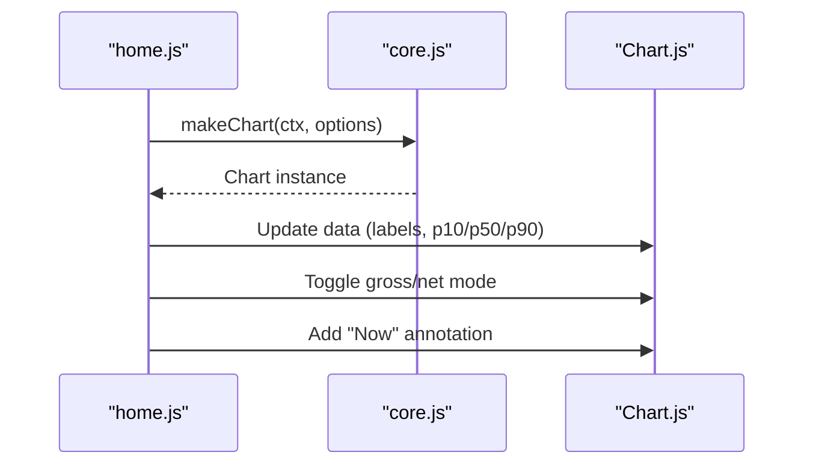
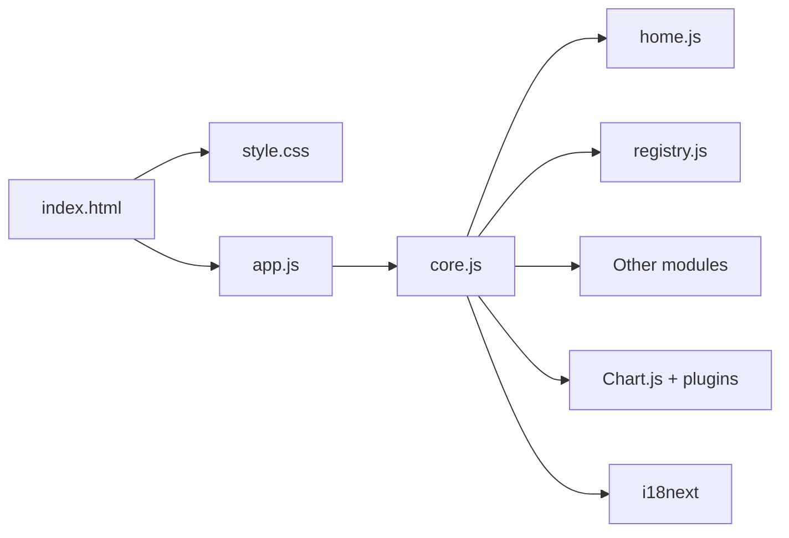

# Dashboard Overview & Navigation

<cite>
**Referenced Files in This Document**
- [index.html](file://dashboard/index.html)
- [alerts.html](file://dashboard/alerts.html)
- [performance.html](file://dashboard/performance.html)
- [districts.html](file://dashboard/districts.html)
- [app.js](file://dashboard/assets/js/app.js)
- [core.js](file://dashboard/assets/js/core.js)
- [home.js](file://dashboard/assets/js/home.js)
- [registry.js](file://dashboard/assets/js/registry.js)
- [style.css](file://dashboard/assets/css/style.css)
</cite>

## Table of Contents
1. Introduction
2. Project Structure
3. Core Components
4. Architecture Overview
5. Detailed Component Analysis
6. Dependency Analysis
7. Performance Considerations
8. Troubleshooting Guide
9. Conclusion
10. Appendices

## Introduction
This document explains the dashboard overview and navigation system for the PréSol platform. It covers the primary layout, responsive design, navigation menu, page initialization, global state management, component loading, CSS architecture (breakpoints, theming, conventions), JavaScript bootstrap, event handling patterns, module organization, and guidance for extending functionality. It also addresses mobile responsiveness, accessibility considerations, and cross-browser compatibility.

## Project Structure
The dashboard is a static front-end composed of multiple HTML pages that share a common layout and assets:
- Shared layout elements: sidebar with brand, language toggle, navigation links, API status box; main content area with page header and panels.
- Shared styles: CSS variables for theming, consistent typography, grid/flex layouts, responsive rules, and reusable components (panels, KPI cards, tables, modals).
- Shared JavaScript: an entrypoint that dynamically loads feature modules, plus core utilities for i18n, charts, status polling, routing, and modal behavior.

**Diagram sources**
- [index.html:1-137](file://dashboard/index.html#L1-L137)
- [style.css:1-807](file://dashboard/assets/css/style.css#L1-L807)
- [app.js:1-18](file://dashboard/assets/js/app.js#L1-L18)
- [core.js:1-658](file://dashboard/assets/js/core.js#L1-L658)
- [home.js:1-133](file://dashboard/assets/js/home.js#L1-L133)
- [registry.js:1-159](file://dashboard/assets/js/registry.js#L1-L159)

**Section sources**
- [index.html:1-137](file://dashboard/index.html#L1-L137)
- [style.css:1-807](file://dashboard/assets/css/style.css#L1-L807)
- [app.js:1-18](file://dashboard/assets/js/app.js#L1-L18)
- [core.js:1-658](file://dashboard/assets/js/core.js#L1-L658)

## Core Components
- Sidebar navigation: Brand, language toggle (EN/FR/AR), navigation links to all pages, API status indicator, and a Prosol report action button.
- Main content: Page-specific headers, KPI grids, chart panels, tables, and modals.
- Global utilities:
  - i18n with English, French, Arabic support and RTL switching.
  - Chart helpers for P10/P50/P90 bands, zoom/pan, annotations.
  - Status polling for API health and cache freshness.
  - Router that dispatches to page-specific init functions based on data-page attribute.
  - Modal logic for the Prosol Report Studio.

Key responsibilities by file:
- app.js: Bootstraps and injects feature modules per page.
- core.js: Centralized i18n, chart defaults, status polling, router, modal setup.
- home.js: National overview charts and KPIs.
- registry.js: Park registry and pipeline visualization.
- style.css: Design tokens, layout, responsive breakpoints, and UI components.

**Section sources**
- [app.js:1-18](file://dashboard/assets/js/app.js#L1-L18)
- [core.js:16-658](file://dashboard/assets/js/core.js#L16-L658)
- [home.js:1-133](file://dashboard/assets/js/home.js#L1-L133)
- [registry.js:1-159](file://dashboard/assets/js/registry.js#L1-L159)
- [style.css:8-807](file://dashboard/assets/css/style.css#L8-L807)

## Architecture Overview
The application follows a simple client-side SPA-like pattern using multiple HTML pages sharing shared assets. Each page sets a data-page attribute on the body, which the core router uses to initialize the appropriate module.

**Diagram sources**
- [app.js:1-18](file://dashboard/assets/js/app.js#L1-L18)
- [core.js:551-573](file://dashboard/assets/js/core.js#L551-L573)
- [home.js:5-133](file://dashboard/assets/js/home.js#L5-L133)
- [registry.js:5-159](file://dashboard/assets/js/registry.js#L5-L159)

## Detailed Component Analysis

### Layout and Navigation
- Sidebar contains:
  - Brand heading and subtitle.
  - Language toggle buttons that update document direction and translate text.
  - Navigation links to all dashboard pages with icons and active states.
  - API status box showing connection state, capacity, and cache age.
  - Prosol report button that opens a modal.
- Main content includes:
  - Page header with title and description.
  - Panels for charts, KPIs, tables, and controls.
  - Modals for detailed views (e.g., Prosol Report Studio).

Responsive behavior:
- On small screens, the sidebar hides and main content expands.
- Grids collapse to single columns.
- Tables become horizontally scrollable where needed.

Accessibility:
- Semantic HTML structure (aside, main, header, sections).
- Keyboard-accessible buttons and inputs.
- RTL support for Arabic via html[dir="rtl"].

**Section sources**
- [index.html:16-112](file://dashboard/index.html#L16-L112)
- [alerts.html:12-33](file://dashboard/alerts.html#L12-L33)
- [performance.html:16-37](file://dashboard/performance.html#L16-L37)
- [districts.html:162-186](file://dashboard/districts.html#L162-L186)
- [style.css:67-178](file://dashboard/assets/css/style.css#L67-L178)
- [style.css:180-191](file://dashboard/assets/css/style.css#L180-L191)
- [style.css:608-614](file://dashboard/assets/css/style.css#L608-L614)
- [style.css:781-800](file://dashboard/assets/css/style.css#L781-L800)

### Page Initialization and Routing
- The core script listens for DOMContentLoaded, applies i18n, polls API status, wires the Prosol modal, then reads the body’s data-page to call the corresponding init function.
- Module list is defined centrally and injected at runtime by app.js.

**Diagram sources**
- [core.js:551-573](file://dashboard/assets/js/core.js#L551-L573)
- [app.js:1-18](file://dashboard/assets/js/app.js#L1-L18)

**Section sources**
- [core.js:551-573](file://dashboard/assets/js/core.js#L551-L573)
- [app.js:1-18](file://dashboard/assets/js/app.js#L1-L18)

### Global State Management
- Language preference stored in localStorage and applied across the session.
- Current language drives translations and document direction (LTR/RTL).
- API status and cache age are updated globally and reflected in the sidebar.
- Alert badge count is updated globally and shown in the navigation.

**Section sources**
- [core.js:315-386](file://dashboard/assets/js/core.js#L315-L386)
- [core.js:507-548](file://dashboard/assets/js/core.js#L507-L548)

### Component Loading Mechanisms
- app.js defines a list of modules and injects them via dynamic script tags during bootstrap.
- Each page’s specific logic is encapsulated in its own module (e.g., home.js, registry.js), keeping concerns separated and improving maintainability.

**Section sources**
- [app.js:1-18](file://dashboard/assets/js/app.js#L1-L18)

### Charts and Data Visualization
- Chart helpers standardize configuration: responsive sizing, zoom/pan, tooltips, and scales.
- P10/P50/P90 datasets are generated consistently across charts.
- “Now” annotation marks current time on forecast charts.
- National overview supports toggling between gross production and net injection.

**Diagram sources**
- [home.js:5-133](file://dashboard/assets/js/home.js#L5-L133)
- [core.js:388-497](file://dashboard/assets/js/core.js#L388-L497)

**Section sources**
- [home.js:5-133](file://dashboard/assets/js/home.js#L5-L133)
- [core.js:388-497](file://dashboard/assets/js/core.js#L388-L497)

### Alerts and Status
- Sidebar shows API connectivity, total capacity, and cache age.
- Alert badge updates from /alerts endpoint.
- Alerts page provides threshold controls and refresh actions.

**Section sources**
- [core.js:507-548](file://dashboard/assets/js/core.js#L507-L548)
- [alerts.html:41-75](file://dashboard/alerts.html#L41-L75)

### Registry and Pipeline
- Fetches district inventory and pipeline projections.
- Renders KPIs, tables, and cards grouped by Direction.
- Supports search and filter by Direction.

**Section sources**
- [registry.js:5-159](file://dashboard/assets/js/registry.js#L5-L159)

### Modal: Prosol Report Studio
- Opens a modal with summary metrics and actions to open official HTML report or download JSON.
- Uses fresh URLs to avoid caching issues.

**Section sources**
- [core.js:575-658](file://dashboard/assets/js/core.js#L575-L658)
- [index.html:114-132](file://dashboard/index.html#L114-L132)

## Dependency Analysis
- External libraries:
  - Chart.js for charts.
  - Hammer.js for touch gestures.
  - chartjs-plugin-zoom for zoom/pan.
  - chartjs-plugin-annotation for “Now” line.
  - i18next for internationalization.
- Internal dependencies:
  - app.js depends on core.js and page modules.
  - core.js provides shared utilities used by all modules.
  - Pages depend on shared CSS for consistent styling.

**Diagram sources**
- [index.html:1-137](file://dashboard/index.html#L1-L137)
- [app.js:1-18](file://dashboard/assets/js/app.js#L1-L18)
- [core.js:1-658](file://dashboard/assets/js/core.js#L1-L658)

**Section sources**
- [index.html:1-137](file://dashboard/index.html#L1-L137)
- [app.js:1-18](file://dashboard/assets/js/app.js#L1-L18)
- [core.js:1-658](file://dashboard/assets/js/core.js#L1-L658)

## Performance Considerations
- Lazy module loading: Only necessary modules are injected per page via app.js.
- Chart reuse: Shared chart defaults reduce configuration overhead.
- Network calls: Status and alert badge requests run once on load; consider debouncing or throttling if adding frequent refreshes.
- Responsive rendering: Use CSS grid/flex to minimize reflows; charts are configured to be responsive.
- Caching: Fresh URLs for report endpoints prevent stale data; consider HTTP caching strategies for forecast endpoints.

[No sources needed since this section provides general guidance]

## Troubleshooting Guide
Common issues and resolutions:
- API offline: Status text shows “API Offline”; check backend availability and CORS settings.
- Missing translations: Console warnings indicate missing keys; add entries to I18N for all supported languages.
- Charts not rendering: Ensure Chart.js and plugins are loaded before calling makeChart; verify canvas IDs exist.
- Mobile layout issues: Verify viewport meta tag and responsive CSS breakpoints; ensure tables have horizontal scroll containers.
- Modal not closing: Ensure close button and overlay click handlers are present; confirm modal IDs match.

**Section sources**
- [core.js:507-548](file://dashboard/assets/js/core.js#L507-L548)
- [core.js:345-351](file://dashboard/assets/js/core.js#L345-L351)
- [core.js:575-658](file://dashboard/assets/js/core.js#L575-L658)

## Conclusion
The dashboard provides a cohesive, responsive interface for national PV forecasting insights with robust navigation, internationalization, and modular JavaScript architecture. Shared utilities streamline chart creation, status monitoring, and routing, while CSS variables enable consistent theming and RTL support. Extending the system involves adding new modules, updating the router, and leveraging existing chart helpers and layout components.

[No sources needed since this section summarizes without analyzing specific files]

## Appendices

### Adding a New Navigation Item
Steps:
1. Add a new link in the sidebar nav-links of each page HTML.
2. Create a new page HTML with data-page set to a unique value.
3. In core.js router, add a condition to call your init function.
4. Implement your init function in a new module and include it in app.js module list.
5. Add translations for any new labels in core.js I18N.

**Section sources**
- [index.html:26-34](file://dashboard/index.html#L26-L34)
- [core.js:551-573](file://dashboard/assets/js/core.js#L551-L573)
- [app.js:1-18](file://dashboard/assets/js/app.js#L1-L18)

### Customizing the Layout
- Modify CSS variables in :root for colors, fonts, shadows, and radii.
- Adjust responsive breakpoints in media queries for different screen sizes.
- Use existing panel, kpi-card, and table classes for consistency.

**Section sources**
- [style.css:8-40](file://dashboard/assets/css/style.css#L8-L40)
- [style.css:608-614](file://dashboard/assets/css/style.css#L608-L614)

### Extending Core Functionality
- Add new chart types or configurations in core.js chart helpers.
- Introduce new global state in core.js and expose via APIs for modules.
- Extend i18n resources for additional languages or keys.

**Section sources**
- [core.js:388-497](file://dashboard/assets/js/core.js#L388-L497)
- [core.js:315-386](file://dashboard/assets/js/core.js#L315-L386)

### Mobile Responsiveness
- Sidebar hides below 900px; ensure critical actions remain accessible in main content.
- Grids collapse to single column; tables wrap or scroll horizontally.
- Touch interactions rely on Hammer.js and Chart.js zoom plugin.

**Section sources**
- [style.css:608-614](file://dashboard/assets/css/style.css#L608-L614)
- [districts.html:25-63](file://dashboard/districts.html#L25-L63)

### Accessibility Features
- Semantic HTML elements improve screen reader support.
- Buttons and inputs are keyboard navigable.
- RTL support ensures correct reading order for Arabic users.

**Section sources**
- [style.css:781-800](file://dashboard/assets/css/style.css#L781-L800)

### Cross-Browser Compatibility
- Uses modern CSS (variables, flexbox, grid) with fallbacks via vendor prefixes where applicable.
- Relies on widely supported libraries (Chart.js, i18next) with CDN delivery.
- Avoids experimental features; sticks to stable browser capabilities.

[No sources needed since this section provides general guidance]