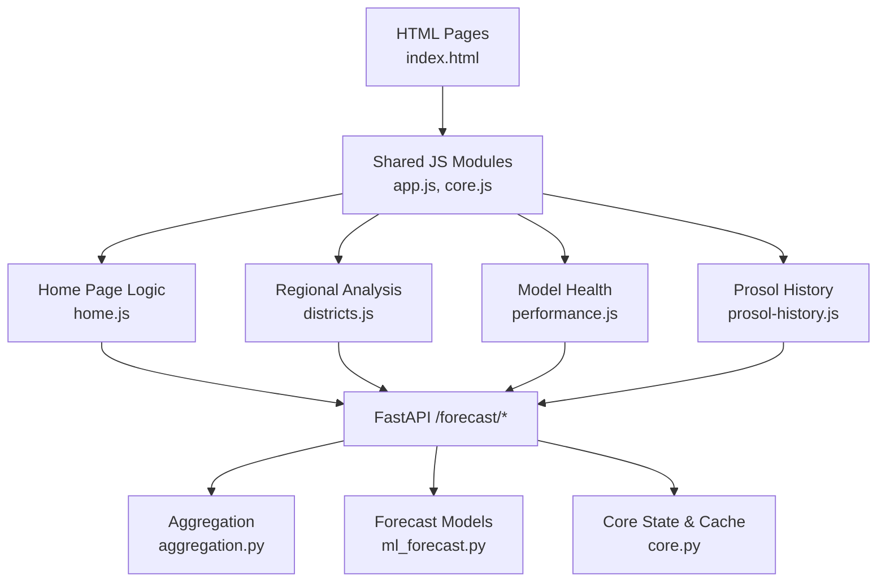
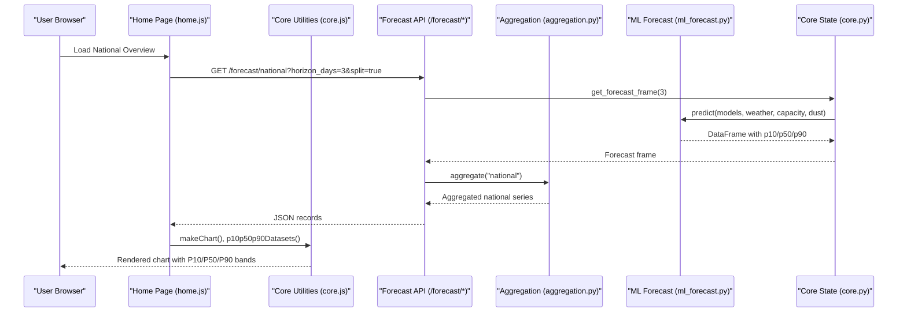
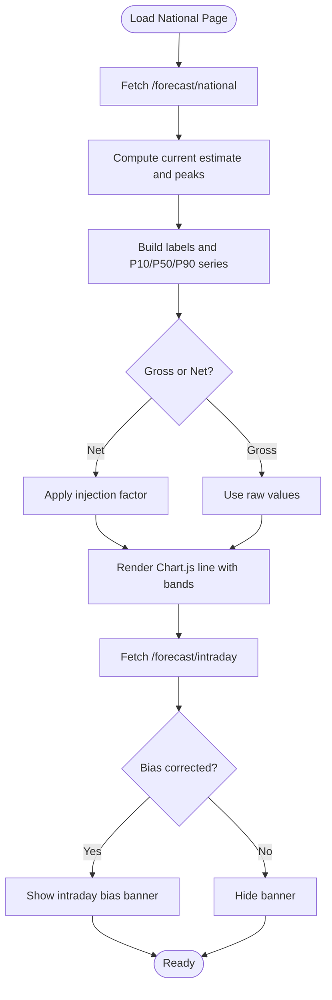
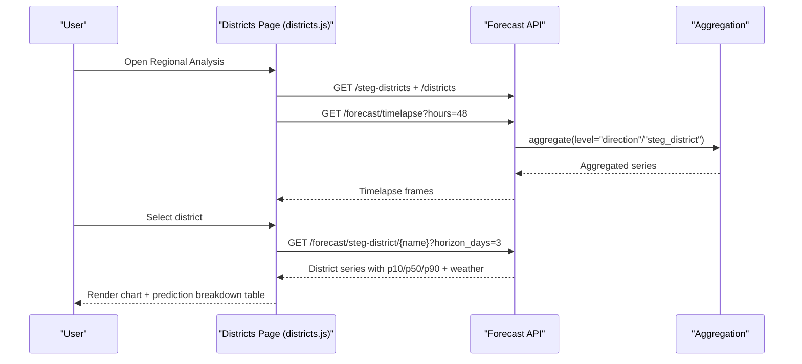
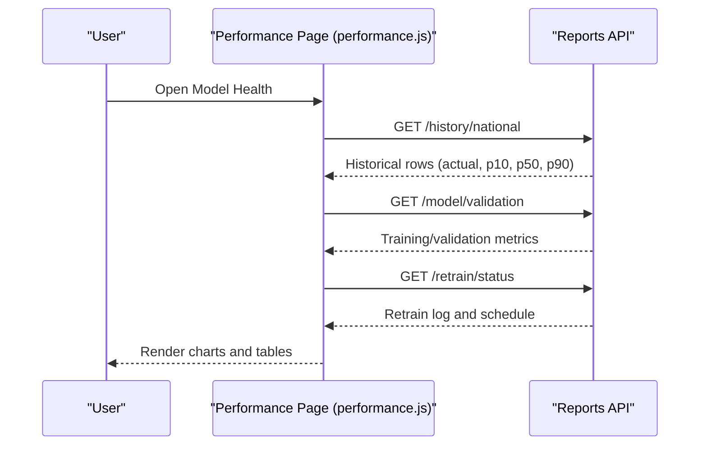
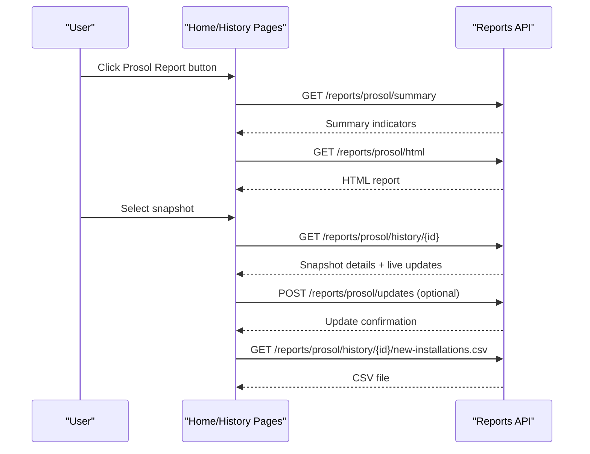
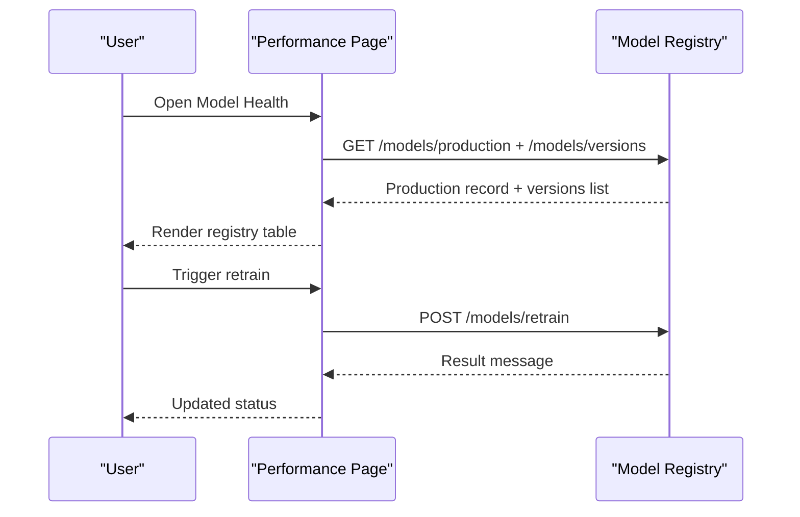
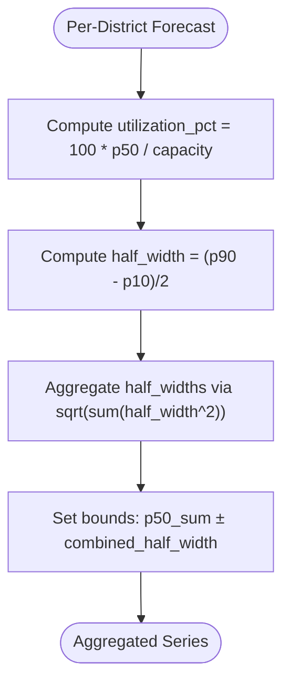
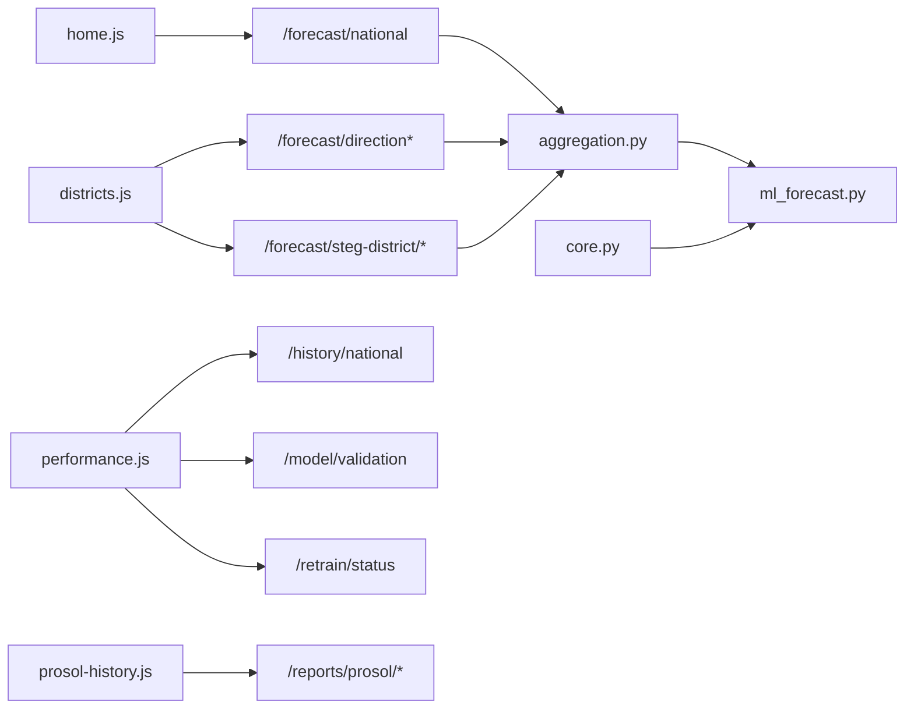

# Forecast Display & Analysis

<cite>
**Referenced Files in This Document**
- [index.html](file://dashboard/index.html)
- [app.js](file://dashboard/assets/js/app.js)
- [core.js](file://dashboard/assets/js/core.js)
- [home.js](file://dashboard/assets/js/home.js)
- [districts.js](file://dashboard/assets/js/districts.js)
- [performance.js](file://dashboard/assets/js/performance.js)
- [prosol-history.js](file://dashboard/assets/js/prosol-history.js)
- [forecast.py](file://api/routers/forecast.py)
- [reports.py](file://api/routers/reports.py)
- [core.py](file://api/core.py)
- [aggregation.py](file://models/aggregation.py)
- [ml_forecast.py](file://models/ml_forecast.py)
- [model_registry.py](file://models/model_registry.py)
- [prosol_report_generator.py](file://reports/prosol_report_generator.py)
</cite>

## Table of Contents
1. Introduction
2. Project Structure
3. Core Components
4. Architecture Overview
5. Detailed Component Analysis
6. Dependency Analysis
7. Performance Considerations
8. Troubleshooting Guide
9. Conclusion
10. Appendices

## Introduction
This document explains the forecast display and analysis components that present solar production predictions and historical comparisons across multiple aggregation levels (national, direction, district). It covers time-series visualization with uncertainty bands (P10/P50/P90), seasonal trend analysis, capacity factor calculations, Prosol report integration, historical data comparison tools, model version registry display, interactive chart features, and guidance for customization and performance optimization.

## Project Structure
The dashboard is a multi-page HTML application driven by shared JavaScript modules and backed by FastAPI endpoints. Key pages include:
- National overview with J to D+3 forecasts and intraday 15-minute view
- Regional analysis with drill-down per STEG district
- Model health and evaluation metrics
- Prosol history viewer and official report modal
- Registry and pipeline views



**Diagram sources**
- [index.html:1-137](file://dashboard/index.html#L1-L137)
- [app.js:1-18](file://dashboard/assets/js/app.js#L1-L18)
- [core.js:1-658](file://dashboard/assets/js/core.js#L1-L658)
- [home.js:1-133](file://dashboard/assets/js/home.js#L1-L133)
- [districts.js:1-206](file://dashboard/assets/js/districts.js#L1-L206)
- [performance.js:1-293](file://dashboard/assets/js/performance.js#L1-L293)
- [prosol-history.js:1-144](file://dashboard/assets/js/prosol-history.js#L1-L144)
- [forecast.py:1-203](file://api/routers/forecast.py#L1-L203)
- [reports.py:1-149](file://api/routers/reports.py#L1-L149)
- [core.py:1-166](file://api/core.py#L1-L166)
- [aggregation.py:1-164](file://models/aggregation.py#L1-L164)
- [ml_forecast.py:1-267](file://models/ml_forecast.py#L1-L267)

**Section sources**
- [index.html:1-137](file://dashboard/index.html#L1-L137)
- [app.js:1-18](file://dashboard/assets/js/app.js#L1-L18)

## Core Components
- Shared charting and i18n utilities: theme tokens, Chart.js defaults, zoom/pan, P10/P50/P90 dataset builder, “Now” annotation, timestamp formatting, status polling, and global Prosol modal wiring.
- Page modules:
  - National overview: fetches national forecast and intraday series; toggles gross vs net injection; renders KPIs and charts.
  - Regional analysis: lists districts, filters by direction, drills into district-level forecasts and weather variables.
  - Model health: displays historical actual vs forecast bands, validation metrics, retrain log, and model registry.
  - Prosol history: loads snapshots, renders KPIs, charts, tables, and CSV export; supports live installation updates.
- Backend:
  - Forecast endpoints: national, intraday, directions, district/governorate, map/timelapse, refresh, and export.
  - Reports endpoints: Prosol summary, HTML report, history list/detail, new installations CSV, evaluation endpoints, displacement summary.
  - Core state: model loading, caching, bias correction, scheduled refresh/retrain.
  - Aggregation: combines per-district quantile forecasts to direction/national with uncertainty band combination.
  - ML models: gradient-boosted quantile regression producing P10/P50/P90 with extended features.
  - Model registry: immutable versioning, training runs, promotion logic.

**Section sources**
- [core.js:18-497](file://dashboard/assets/js/core.js#L18-L497)
- [home.js:1-133](file://dashboard/assets/js/home.js#L1-L133)
- [districts.js:1-206](file://dashboard/assets/js/districts.js#L1-L206)
- [performance.js:1-293](file://dashboard/assets/js/performance.js#L1-L293)
- [prosol-history.js:1-144](file://dashboard/assets/js/prosol-history.js#L1-L144)
- [forecast.py:25-203](file://api/routers/forecast.py#L25-L203)
- [reports.py:38-149](file://api/routers/reports.py#L38-L149)
- [core.py:55-166](file://api/core.py#L55-L166)
- [aggregation.py:1-164](file://models/aggregation.py#L1-L164)
- [ml_forecast.py:1-267](file://models/ml_forecast.py#L1-L267)
- [model_registry.py:1-161](file://models/model_registry.py#L1-L161)

## Architecture Overview
End-to-end flow from UI to backend and back:



**Diagram sources**
- [home.js:18-80](file://dashboard/assets/js/home.js#L18-L80)
- [core.js:426-497](file://dashboard/assets/js/core.js#L426-L497)
- [forecast.py:25-32](file://api/routers/forecast.py#L25-L32)
- [core.py:72-103](file://api/core.py#L72-L103)
- [ml_forecast.py:118-131](file://models/ml_forecast.py#L118-L131)
- [aggregation.py:26-89](file://models/aggregation.py#L26-L89)

## Detailed Component Analysis

### National Overview: Time-Series Visualization (J to D+3) and Intraday
- Displays current estimated output, peak forecasts for today and tomorrow, and installed capacity.
- Renders national forecast with P10/P50/P90 uncertainty bands and a “Now” annotation line.
- Supports Gross Production vs Net Grid Injection toggle using a fixed factor.
- Intraday chart shows 15-minute resolution for the next 6 hours with optional bias correction banner.



**Diagram sources**
- [home.js:18-133](file://dashboard/assets/js/home.js#L18-L133)
- [core.js:426-497](file://dashboard/assets/js/core.js#L426-L497)
- [forecast.py:25-54](file://api/routers/forecast.py#L25-L54)

**Section sources**
- [index.html:60-111](file://dashboard/index.html#L60-L111)
- [home.js:18-133](file://dashboard/assets/js/home.js#L18-L133)
- [core.js:426-497](file://dashboard/assets/js/core.js#L426-L497)
- [forecast.py:25-54](file://api/routers/forecast.py#L25-L54)

### Regional Analysis: Multi-Level Aggregation and Directional Breakdown
- Lists all 50 STEG commercial districts with capacity and projected peak.
- Filters by Direction de Distribution and search terms.
- Drill-down to district-level forecast with P10/P50/P90, uncertainty ratio, utilization percentage, and weather variables (GHI, temperature, cloud cover).



**Diagram sources**
- [districts.js:18-206](file://dashboard/assets/js/districts.js#L18-L206)
- [forecast.py:74-90](file://api/routers/forecast.py#L74-L90)
- [aggregation.py:26-89](file://models/aggregation.py#L26-L89)

**Section sources**
- [districts.js:18-206](file://dashboard/assets/js/districts.js#L18-L206)
- [forecast.py:74-90](file://api/routers/forecast.py#L74-L90)
- [aggregation.py:26-89](file://models/aggregation.py#L26-L89)

### Model Health: Historical Comparison and Seasonal Trends
- Plots last 30 days of actual vs forecast with P10/P90 bands and highlights P50 median.
- Shows validation metrics (pinball loss, accuracy, coverage) and rooftop fleet provenance badge.
- Displays retrain log events and continuous learning status.



**Diagram sources**
- [performance.js:27-255](file://dashboard/assets/js/performance.js#L27-L255)
- [reports.py:120-149](file://api/routers/reports.py#L120-L149)

**Section sources**
- [performance.js:27-255](file://dashboard/assets/js/performance.js#L27-L255)
- [reports.py:120-149](file://api/routers/reports.py#L120-L149)

### Prosol Report Integration and Historical Data Comparison
- Modal on home page opens official Prosol HTML report and provides JSON summary download.
- History page lists available snapshots, renders KPIs, bar charts (national, directions, sizes), and tables (districts, pending dossiers, new installations).
- Supports adding manual installation updates per snapshot and exporting new installations CSV.



**Diagram sources**
- [core.js:578-658](file://dashboard/assets/js/core.js#L578-L658)
- [prosol-history.js:78-144](file://dashboard/assets/js/prosol-history.js#L78-L144)
- [reports.py:38-108](file://api/routers/reports.py#L38-L108)
- [prosol_report_generator.py:115-254](file://reports/prosol_report_generator.py#L115-L254)

**Section sources**
- [core.js:578-658](file://dashboard/assets/js/core.js#L578-L658)
- [prosol-history.js:78-144](file://dashboard/assets/js/prosol-history.js#L78-L144)
- [reports.py:38-108](file://api/routers/reports.py#L38-L108)
- [prosol_report_generator.py:115-254](file://reports/prosol_report_generator.py#L115-L254)

### Model Version Registry Display
- Displays current production model info and a table of all registered versions with status, creation date, MAE, and training run ID.
- Supports manual retraining and shows outcome messages based on latest retrain event.



**Diagram sources**
- [performance.js:242-293](file://dashboard/assets/js/performance.js#L242-L293)
- [model_registry.py:69-161](file://models/model_registry.py#L69-L161)

**Section sources**
- [performance.js:242-293](file://dashboard/assets/js/performance.js#L242-L293)
- [model_registry.py:69-161](file://models/model_registry.py#L69-L161)

### Capacity Factor Calculations and Uncertainty Bands
- Per-district utilization percentage is computed as forecast P50 divided by installed capacity.
- Aggregate uncertainty bands combine per-district half-widths via sqrt-sum-of-squares to approximate national/direction bands.



**Diagram sources**
- [forecast.py:74-90](file://api/routers/forecast.py#L74-L90)
- [aggregation.py:20-23](file://models/aggregation.py#L20-L23)
- [aggregation.py:67-89](file://models/aggregation.py#L67-L89)

**Section sources**
- [forecast.py:74-90](file://api/routers/forecast.py#L74-L90)
- [aggregation.py:20-23](file://models/aggregation.py#L20-L23)
- [aggregation.py:67-89](file://models/aggregation.py#L67-L89)

### Interactive Chart Features: Zoom, Pan, Inspection, Export
- Zoom and pan enabled via Chart.js plugin with wheel and pinch support; x-axis only.
- Tooltips show index-based interaction without requiring point hover.
- Export capabilities:
  - Forecast export endpoint supports CSV and XML at various aggregation levels.
  - Prosol history exports new installations CSV.
  - Prosol modal allows JSON summary download.

```mermaid
classDiagram
class ChartDefaults {
+responsive
+maintainAspectRatio
+interaction
+plugins.zoom
+plugins.tooltip
+scales.x
+scales.y
}
class ForecastExport {
+level : enum
+fmt : enum
+horizon_days
}
ChartDefaults <.. ForecastExport : "UI uses defaults; export via API"
```

**Diagram sources**
- [core.js:388-438](file://dashboard/assets/js/core.js#L388-L438)
- [forecast.py:189-203](file://api/routers/forecast.py#L189-L203)
- [prosol-history.js:85-87](file://dashboard/assets/js/prosol-history.js#L85-L87)
- [core.js:639-658](file://dashboard/assets/js/core.js#L639-L658)

**Section sources**
- [core.js:388-438](file://dashboard/assets/js/core.js#L388-L438)
- [forecast.py:189-203](file://api/routers/forecast.py#L189-L203)
- [prosol-history.js:85-87](file://dashboard/assets/js/prosol-history.js#L85-L87)
- [core.js:639-658](file://dashboard/assets/js/core.js#L639-L658)

## Dependency Analysis
Key dependencies between frontend modules, backend routers, and model layers:



**Diagram sources**
- [home.js:18-80](file://dashboard/assets/js/home.js#L18-L80)
- [districts.js:18-206](file://dashboard/assets/js/districts.js#L18-L206)
- [performance.js:27-255](file://dashboard/assets/js/performance.js#L27-L255)
- [prosol-history.js:78-144](file://dashboard/assets/js/prosol-history.js#L78-L144)
- [forecast.py:25-203](file://api/routers/forecast.py#L25-L203)
- [reports.py:38-149](file://api/routers/reports.py#L38-L149)
- [aggregation.py:26-89](file://models/aggregation.py#L26-L89)
- [ml_forecast.py:118-131](file://models/ml_forecast.py#L118-L131)
- [core.py:72-103](file://api/core.py#L72-L103)

**Section sources**
- [forecast.py:25-203](file://api/routers/forecast.py#L25-L203)
- [reports.py:38-149](file://api/routers/reports.py#L38-L149)
- [aggregation.py:26-89](file://models/aggregation.py#L26-L89)
- [ml_forecast.py:118-131](file://models/ml_forecast.py#L118-L131)
- [core.py:72-103](file://api/core.py#L72-L103)

## Performance Considerations
- Data loading optimization:
  - Server-side cache with 14-minute TTL reduces repeated weather/model calls; background scheduler refreshes every 15 minutes during operational hours.
  - Intraday endpoint interpolates missing points and clips negative values; bias correction scales quantiles when meter buffer indicates drift.
- Chart rendering performance:
  - Shared Chart.js defaults minimize configuration overhead; zoom/pan restricted to x-axis for smoother interactions.
  - Avoid excessive point radius and use tension smoothing for large series.
- Mobile-friendly interactions:
  - Pinch-to-zoom enabled; tooltips set to index mode to avoid dense point selection issues on small screens.
  - Responsive layout and reduced tick limits improve readability on mobile devices.

[No sources needed since this section provides general guidance]

## Troubleshooting Guide
Common issues and resolutions:
- API offline or stale cache:
  - Status indicator turns warning if cache is stale; check network connectivity and ensure API key headers are correct for protected endpoints.
- No forecast data for intraday window:
  - Endpoint returns 503 if no data available for next 6 hours; verify horizon and timezone alignment.
- Unknown district/direction:
  - 404 responses indicate invalid names; confirm against directory mappings and ensure case-insensitive matching.
- Prosol snapshot not found:
  - Ensure snapshots are imported before accessing history detail; import endpoint required first.
- Model registry errors:
  - Promotion fails if candidate does not outperform production; review metrics and retrain logs.

**Section sources**
- [core.js:507-548](file://dashboard/assets/js/core.js#L507-L548)
- [forecast.py:35-54](file://api/routers/forecast.py#L35-L54)
- [forecast.py:64-90](file://api/routers/forecast.py#L64-L90)
- [reports.py:43-48](file://api/routers/reports.py#L43-L48)
- [model_registry.py:104-131](file://models/model_registry.py#L104-L131)

## Conclusion
The platform delivers robust, multi-level PV forecasting visualizations with uncertainty bands, integrates official Prosol reports and historical snapshots, and exposes model health and registry insights. The architecture balances real-time interactivity with efficient server-side caching and aggregation. Customization points include chart themes, additional forecast types via new endpoints, and expanded data sources through ingestion adapters.

[No sources needed since this section summarizes without analyzing specific files]

## Appendices

### Customizing Chart Themes
- Modify design tokens in core.js to adjust colors, fonts, and tooltip styles globally.
- Extend _chartDefaults for consistent scale callbacks and grid settings across pages.

**Section sources**
- [core.js:18-497](file://dashboard/assets/js/core.js#L18-L497)

### Adding New Forecast Types
- Implement new aggregation levels or endpoints in forecast.py and update UI modules to consume them.
- Ensure aggregation functions handle new grouping columns and uncertainty combinations.

**Section sources**
- [forecast.py:25-203](file://api/routers/forecast.py#L25-L203)
- [aggregation.py:26-89](file://models/aggregation.py#L26-L89)

### Integrating Additional Data Sources
- Extend ingestion adapters and update core.py build_forecast to incorporate new weather or measurement sources.
- Validate schema compatibility with ml_forecast feature expectations and add new features if necessary.

**Section sources**
- [core.py:72-103](file://api/core.py#L72-L103)
- [ml_forecast.py:49-94](file://models/ml_forecast.py#L49-L94)