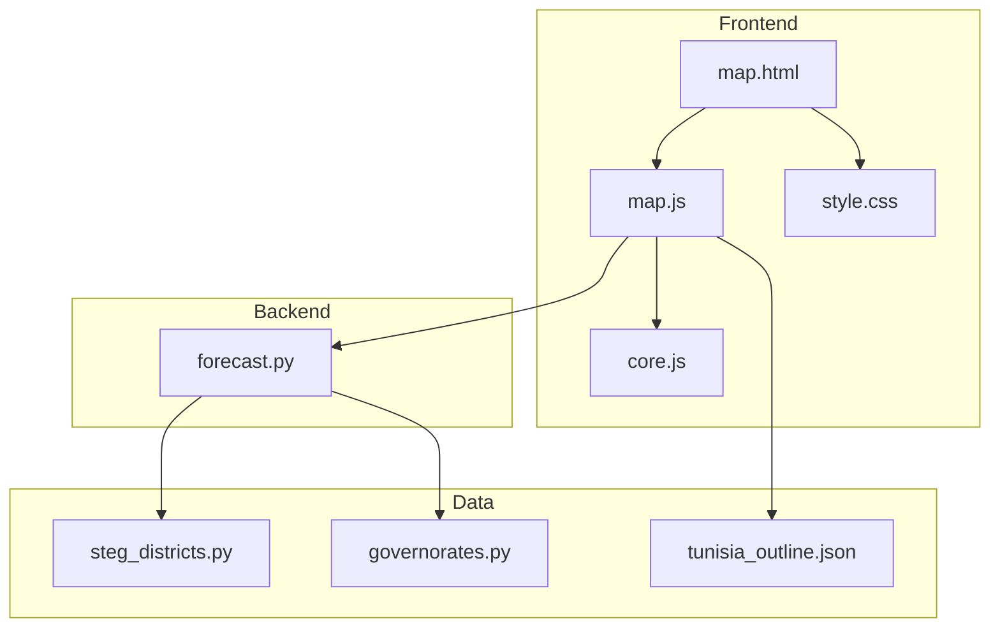
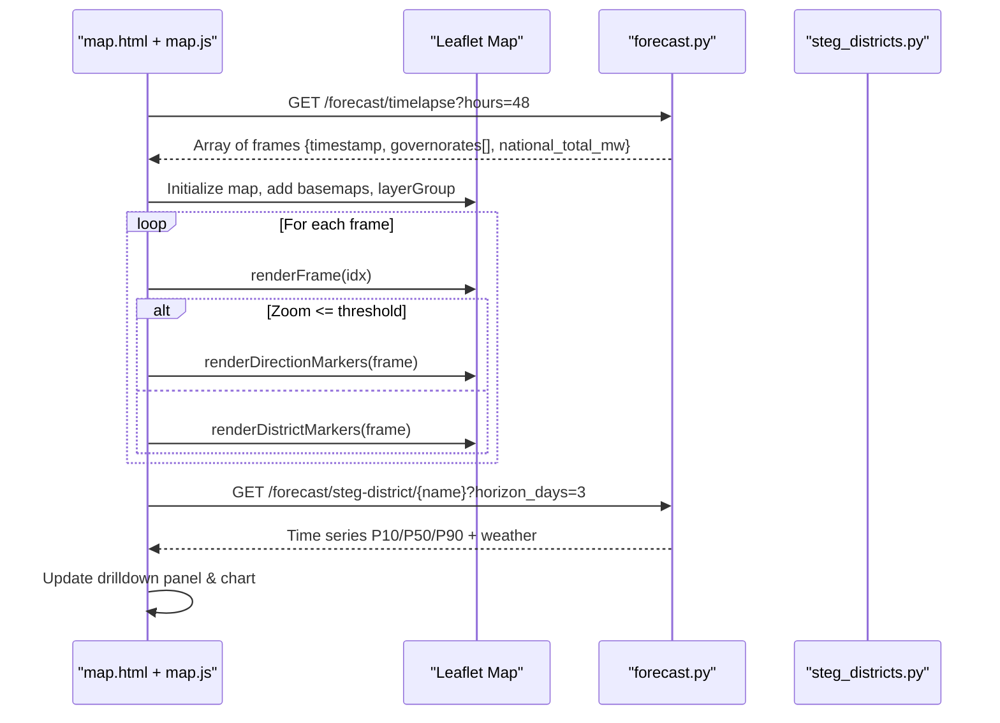
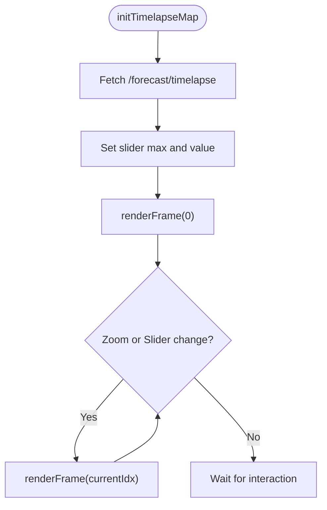
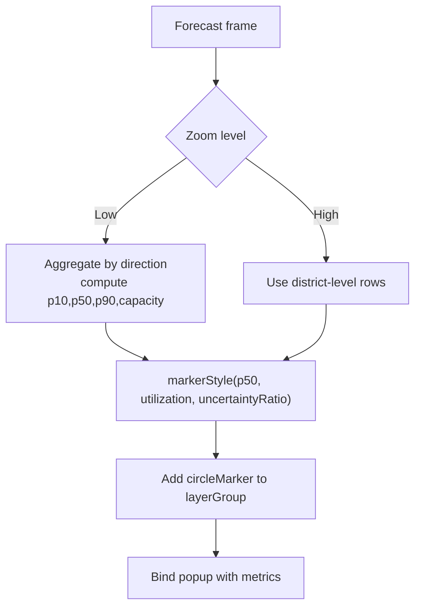
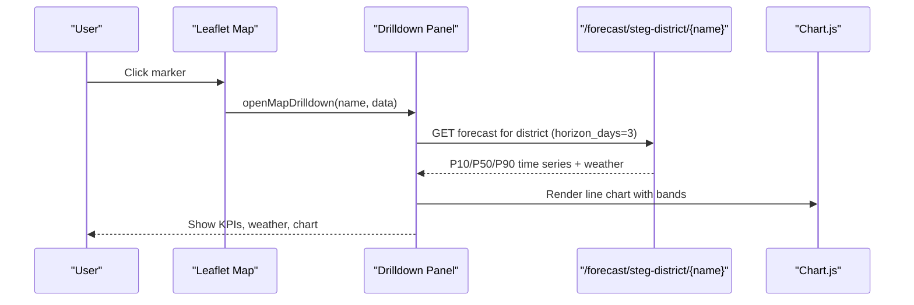
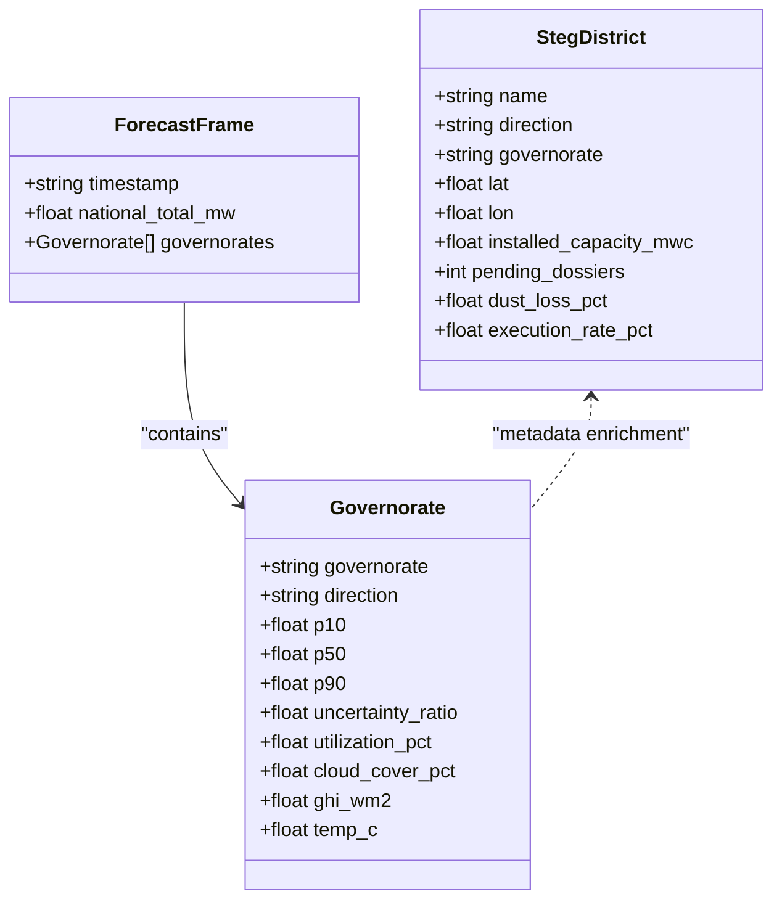
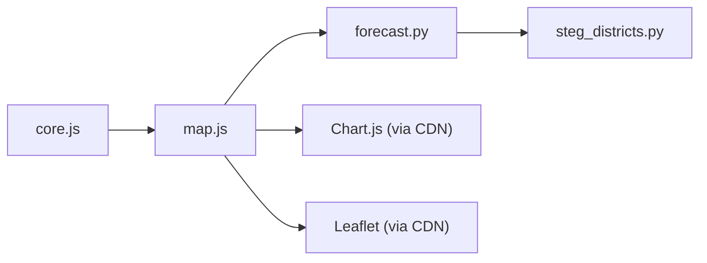

# Interactive Map Visualization

<cite>
**Referenced Files in This Document**
- [map.js](file://dashboard/assets/js/map.js)
- [districts.js](file://dashboard/assets/js/districts.js)
- [core.js](file://dashboard/assets/js/core.js)
- [map.html](file://dashboard/map.html)
- [style.css](file://dashboard/assets/css/style.css)
- [forecast.py](file://api/routers/forecast.py)
- [steg_districts.py](file://data/steg_districts.py)
- [governorates.py](file://data/governorates.py)
- [tunisia_outline.json](file://dashboard/assets/data/tunisia_outline.json)
</cite>

## Table of Contents
1. [Introduction](#introduction)
2. [Project Structure](#project-structure)
3. [Core Components](#core-components)
4. [Architecture Overview](#architecture-overview)
5. [Detailed Component Analysis](#detailed-component-analysis)
6. [Dependency Analysis](#dependency-analysis)
7. [Performance Considerations](#performance-considerations)
8. [Troubleshooting Guide](#troubleshooting-guide)
9. [Conclusion](#conclusion)
10. [Appendices](#appendices)

## Introduction
This document explains the Leaflet-based interactive map visualization for spatial analysis of solar forecasts across Tunisia. It covers district boundary rendering, geographic data integration, forecast overlays with color-coded intensity mapping, real-time updates via a timelapse slider, drill-down to governorate-level details, hover interactions, and weather overlays (temperature, irradiance, cloud cover). It also provides guidance on adding new regions, customizing styles, integrating additional spatial data sources, optimizing performance for large datasets, and supporting mobile touch interactions.

## Project Structure
The map feature is implemented as a dedicated page that loads a Leaflet map, fetches forecast snapshots from the backend API, and renders markers at two levels:
- Direction level when zoomed out (aggregated by STEG Directions de Distribution)
- District level when zoomed in (50 commercial districts)

Key files:
- Frontend UI and scripts: map.html, map.js, core.js, style.css
- Backend forecast endpoints: forecast.py
- Geographic reference data: steg_districts.py, governorates.py, tunisia_outline.json

**Diagram sources**
- [map.html:1-252](file://dashboard/map.html#L1-L252)
- [map.js:1-300](file://dashboard/assets/js/map.js#L1-L300)
- [core.js:1-658](file://dashboard/assets/js/core.js#L1-L658)
- [forecast.py:1-203](file://api/routers/forecast.py#L1-L203)
- [steg_districts.py:1-247](file://data/steg_districts.py#L1-L247)
- [governorates.py:1-46](file://data/governorates.py#L1-L46)
- [tunisia_outline.json:1-1](file://dashboard/assets/data/tunisia_outline.json#L1-L1)

**Section sources**
- [map.html:1-252](file://dashboard/map.html#L1-L252)
- [map.js:1-300](file://dashboard/assets/js/map.js#L1-L300)
- [core.js:1-658](file://dashboard/assets/js/core.js#L1-L658)
- [forecast.py:1-203](file://api/routers/forecast.py#L1-L203)
- [steg_districts.py:1-247](file://data/steg_districts.py#L1-L247)
- [governorates.py:1-46](file://data/governorates.py#L1-L46)
- [tunisia_outline.json:1-1](file://dashboard/assets/data/tunisia_outline.json#L1-L1)

## Core Components
- Leaflet map initialization and basemap switching (OpenStreetMap and Light Canvas)
- Timelapse frames fetching and playback control
- Dynamic marker rendering at direction vs district levels based on zoom
- Forecast overlay styling using P50 magnitude, utilization percentage, and uncertainty ratio
- Drill-down panel showing KPIs, weather metrics, and a 72-hour forecast chart
- Weather snapshot grid aggregated by direction

**Section sources**
- [map.js:21-112](file://dashboard/assets/js/map.js#L21-L112)
- [map.js:167-246](file://dashboard/assets/js/map.js#L167-L246)
- [map.js:248-300](file://dashboard/assets/js/map.js#L248-L300)
- [map.html:167-246](file://dashboard/map.html#L167-L246)
- [core.js:16-31](file://dashboard/assets/js/core.js#L16-L31)

## Architecture Overview
The frontend initializes the Leaflet map, loads forecast timelapse frames, and renders markers according to zoom level. The backend serves aggregated forecasts per timestamp and per location, enriched with weather variables and metadata.

**Diagram sources**
- [map.js:21-112](file://dashboard/assets/js/map.js#L21-L112)
- [map.js:167-246](file://dashboard/assets/js/map.js#L167-L246)
- [map.js:248-300](file://dashboard/assets/js/map.js#L248-L300)
- [forecast.py:161-179](file://api/routers/forecast.py#L161-L179)
- [forecast.py:74-90](file://api/routers/forecast.py#L74-L90)

## Detailed Component Analysis

### Leaflet Map Initialization and Basemaps
- Creates a Leaflet map centered on Tunisia with appropriate min/max zoom
- Adds OpenStreetMap tiles as default and an alternative light canvas tile layer
- Provides a layer switcher control for users to toggle basemaps
- Initializes a LayerGroup to manage forecast markers efficiently

**Section sources**
- [map.js:21-47](file://dashboard/assets/js/map.js#L21-L47)
- [map.html:9-13](file://dashboard/map.html#L9-L13)
- [style.css:375-406](file://dashboard/assets/css/style.css#L375-L406)

### Timelapse Playback and Real-Time Updates
- Fetches 48 hours of forecast frames from the backend
- Populates a time slider and play/pause controls
- On zoom changes or slider input, re-renders markers for the current frame
- Displays national aggregate production for the selected frame

**Diagram sources**
- [map.js:69-112](file://dashboard/assets/js/map.js#L69-L112)
- [map.js:167-184](file://dashboard/assets/js/map.js#L167-L184)

**Section sources**
- [map.js:69-112](file://dashboard/assets/js/map.js#L69-L112)
- [map.js:167-184](file://dashboard/assets/js/map.js#L167-L184)

### Forecast Overlay System and Color-Coded Intensity Mapping
- At low zoom, aggregates forecasts by STEG Direction and plots one marker per direction
- At higher zoom, plots individual district markers
- Marker radius scales with P50 production; fill opacity scales with utilization percentage
- Border color encodes uncertainty ratio: green (low), amber (medium), red (high)
- Popups show P50, utilization, uncertainty band, cloud cover, and GHI

**Diagram sources**
- [map.js:186-246](file://dashboard/assets/js/map.js#L186-L246)

**Section sources**
- [map.js:186-246](file://dashboard/assets/js/map.js#L186-L246)
- [forecast.py:161-179](file://api/routers/forecast.py#L161-L179)

### Drill-Down Mechanism and Hover Interactions
- Clicking a marker opens a side panel with KPIs (P50, utilization, uncertainty)
- Weather mini-strip shows current GHI, temperature, cloud cover, wind, and dust loss
- Fetches a 72-hour forecast curve for the selected district and renders it with Chart.js
- Includes pan/zoom support for charts on desktop and pinch-to-zoom on mobile

**Diagram sources**
- [map.js:248-300](file://dashboard/assets/js/map.js#L248-L300)
- [forecast.py:74-90](file://api/routers/forecast.py#L74-L90)
- [core.js:388-497](file://dashboard/assets/js/core.js#L388-L497)

**Section sources**
- [map.js:248-300](file://dashboard/assets/js/map.js#L248-L300)
- [forecast.py:74-90](file://api/routers/forecast.py#L74-L90)
- [core.js:388-497](file://dashboard/assets/js/core.js#L388-L497)

### Weather Data Overlays and Direction Snapshot Grid
- The map popups include current cloud cover and GHI
- A separate grid below the map aggregates live weather metrics by direction (GHI, temperature, cloud cover, wind) and displays PV capacity in service
- Data source includes NWP/live weather fields returned by the forecast endpoint

**Section sources**
- [map.js:114-165](file://dashboard/assets/js/map.js#L114-L165)
- [forecast.py:131-158](file://api/routers/forecast.py#L131-L158)

### Geographic Data Integration and Boundary Rendering
- District coordinates and metadata are fetched from the backend and merged into forecast frames to position markers accurately
- Reference dataset defines all 50 commercial districts with lat/lon, capacity, pending dossiers, direction, and dust loss
- A Tunisia outline GeoJSON is available for potential boundary rendering or clipping

**Diagram sources**
- [steg_districts.py:61-177](file://data/steg_districts.py#L61-L177)
- [forecast.py:161-179](file://api/routers/forecast.py#L161-L179)
- [map.js:49-83](file://dashboard/assets/js/map.js#L49-L83)

**Section sources**
- [steg_districts.py:61-177](file://data/steg_districts.py#L61-L177)
- [governorates.py:1-46](file://data/governorates.py#L1-L46)
- [tunisia_outline.json:1-1](file://dashboard/assets/data/tunisia_outline.json#L1-L1)
- [map.js:49-83](file://dashboard/assets/js/map.js#L49-L83)

### Adding New Geographic Regions
To add a new region or update existing ones:
- Extend the reference dataset in the district definitions with new entries including name, direction, governorate, lat/lon, capacity, pending dossiers, dust loss, and execution rate
- Ensure the backend aggregation recognizes the new region (the aggregator uses district names and directions)
- Verify that the frontend can locate the new region via the same naming conventions used by the API

Implementation references:
- District definition structure and lookup tables
- Backward compatibility aliases for legacy imports

**Section sources**
- [steg_districts.py:86-177](file://data/steg_districts.py#L86-L177)
- [governorates.py:1-46](file://data/governorates.py#L1-L46)

### Customizing Map Styles
- Change basemaps by editing the tile layer URLs and labels in the layer switcher
- Adjust marker styling (radius scaling, opacity bounds, border colors) to reflect different metrics or thresholds
- Modify CSS variables for consistent theming across the dashboard

**Section sources**
- [map.js:21-47](file://dashboard/assets/js/map.js#L186-L194)
- [style.css:8-40](file://dashboard/assets/css/style.css#L8-L40)
- [style.css:375-406](file://dashboard/assets/css/style.css#L375-L406)

### Integrating Additional Spatial Data Sources
- Use the existing LayerGroup to add GeoJSON layers (e.g., boundaries, heatmaps) alongside forecast markers
- Load external GeoJSON via Leaflet’s GeoJSON layer and bind events/popups as needed
- Optionally use the provided Tunisia outline for clipping or context

**Section sources**
- [map.js:47-47](file://dashboard/assets/js/map.js#L47-L47)
- [tunisia_outline.json:1-1](file://dashboard/assets/data/tunisia_outline.json#L1-L1)

## Dependency Analysis
The map depends on:
- Core utilities and i18n configuration
- Forecast endpoints for timelapse and district-specific forecasts
- District reference data for coordinates and metadata
- Chart.js for drilldown charts

**Diagram sources**
- [core.js:1-658](file://dashboard/assets/js/core.js#L1-L658)
- [map.js:1-300](file://dashboard/assets/js/map.js#L1-L300)
- [forecast.py:1-203](file://api/routers/forecast.py#L1-L203)
- [steg_districts.py:1-247](file://data/steg_districts.py#L1-L247)

**Section sources**
- [core.js:1-658](file://dashboard/assets/js/core.js#L1-L658)
- [map.js:1-300](file://dashboard/assets/js/map.js#L1-L300)
- [forecast.py:1-203](file://api/routers/forecast.py#L1-L203)
- [steg_districts.py:1-247](file://data/steg_districts.py#L1-L247)

## Performance Considerations
- Marker count management: Switch between direction-aggregated markers at low zoom and district markers at high zoom to reduce DOM nodes
- Efficient layer updates: Clear and rebuild markers per frame using a single LayerGroup
- Chart reuse: Destroy previous drilldown chart before creating a new one to avoid memory leaks
- Mobile interactions: Enable pinch-to-zoom on charts and ensure responsive layout for small screens
- Network efficiency: Request only necessary horizons (e.g., 48h timelapse, 3-day district forecast)

[No sources needed since this section provides general guidance]

## Troubleshooting Guide
Common issues and resolutions:
- Map not loading: Check browser console for errors; verify Leaflet CDN availability and correct element ID
- Markers not appearing: Ensure forecast frames contain valid lat/lon and non-zero P50; confirm API returns expected fields
- Drilldown chart not updating: Confirm district forecast endpoint returns data; ensure previous chart instance is destroyed before re-rendering
- Weather grid empty: Validate that the map endpoint returns districts/governorates with weather fields

Operational checks:
- Status indicator and cache age display help identify connectivity and freshness issues
- API offline state is handled gracefully with user-visible messages

**Section sources**
- [core.js:506-548](file://dashboard/assets/js/core.js#L506-L548)
- [map.js:69-112](file://dashboard/assets/js/map.js#L69-L112)
- [map.js:248-300](file://dashboard/assets/js/map.js#L248-L300)

## Conclusion
The interactive map provides a robust, scalable visualization of solar forecasts across Tunisia, combining Leaflet-based geospatial rendering with rich forecast overlays and drill-down analytics. By leveraging direction-level aggregation at low zoom and district-level detail at high zoom, it balances clarity and performance. The system integrates live weather data, supports timelapse playback, and offers intuitive interactions for operational decision-making.

[No sources needed since this section summarizes without analyzing specific files]

## Appendices

### API Endpoints Used by the Map
- /forecast/timelapse?hours=48: Returns time-series frames with aggregated governorate forecasts
- /forecast/steg-district/{name}?horizon_days=3: Returns detailed time series for a district including P10/P50/P90 and weather
- /forecast/map?horizon_hours=0: Returns current snapshot with weather and metadata for direction aggregation

**Section sources**
- [forecast.py:131-179](file://api/routers/forecast.py#L131-L179)
- [forecast.py:74-90](file://api/routers/forecast.py#L74-L90)