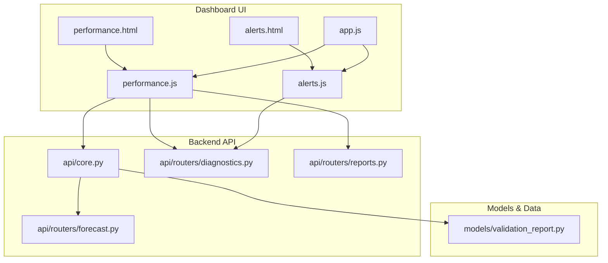
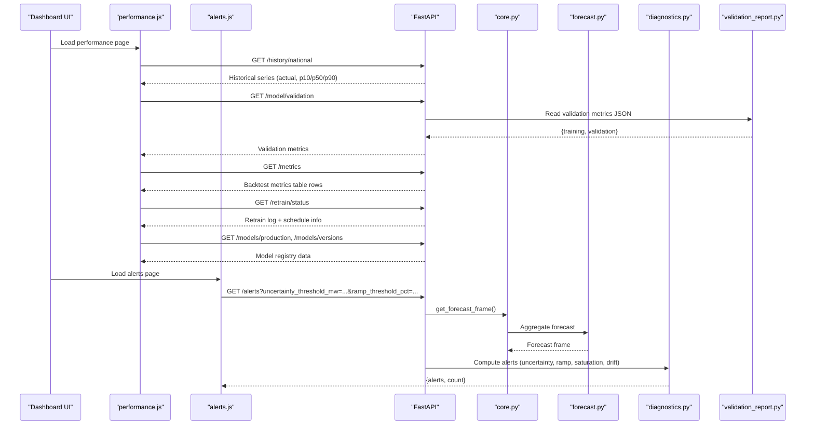
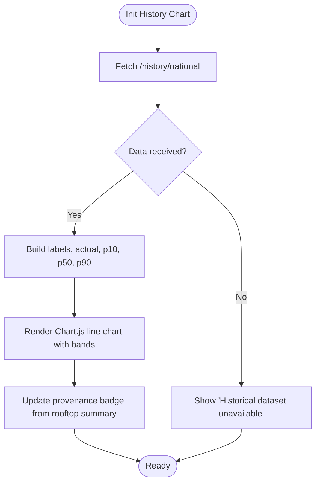
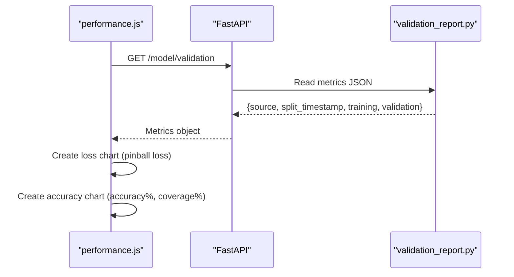
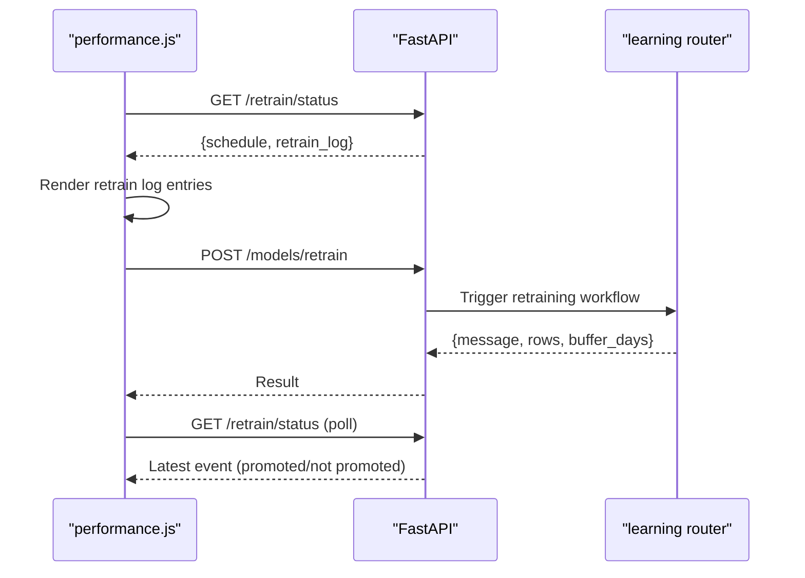
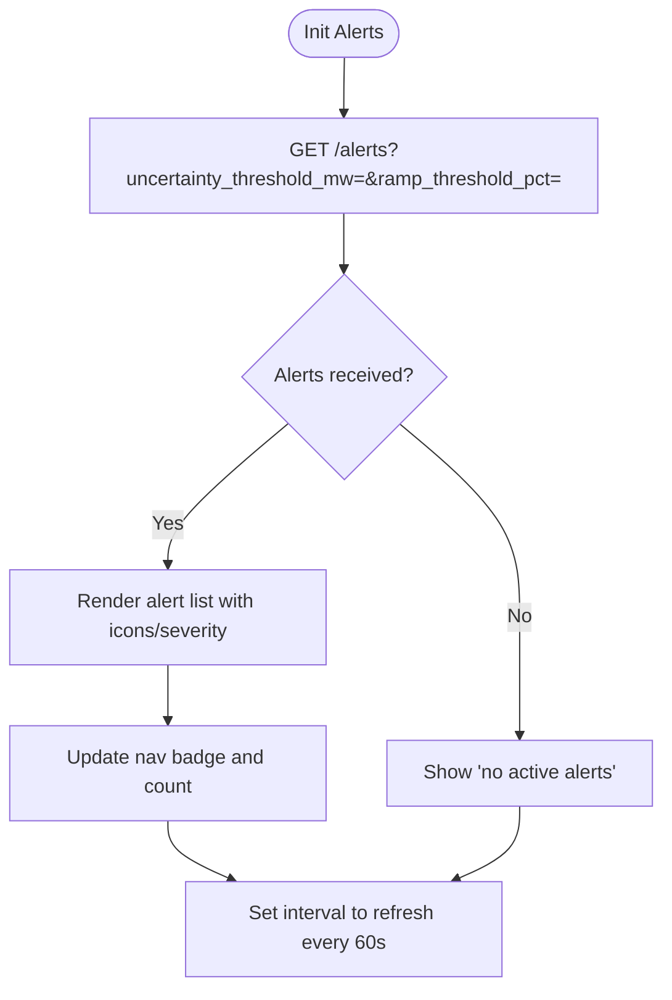
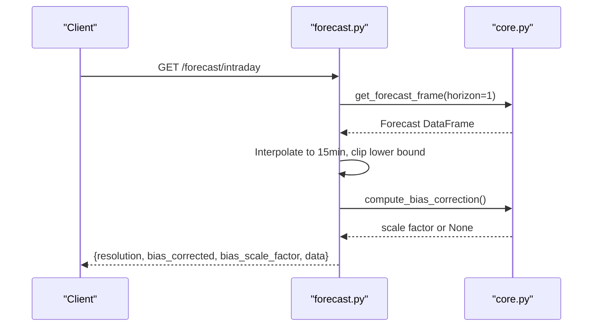
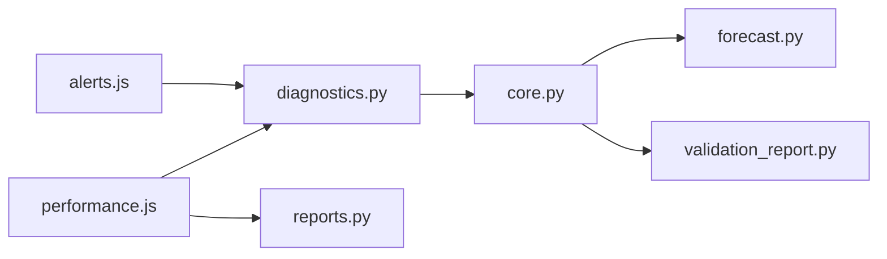

# Performance Monitoring Dashboard

<cite>
**Referenced Files in This Document**
- [performance.html](file://dashboard/performance.html)
- [alerts.html](file://dashboard/alerts.html)
- [performance.js](file://dashboard/assets/js/performance.js)
- [alerts.js](file://dashboard/assets/js/alerts.js)
- [app.js](file://dashboard/assets/js/app.js)
- [core.py](file://api/core.py)
- [forecast.py](file://api/routers/forecast.py)
- [diagnostics.py](file://api/routers/diagnostics.py)
- [reports.py](file://api/routers/reports.py)
- [validation_report.py](file://models/validation_report.py)
</cite>

## Table of Contents
1. [Introduction](#introduction)
2. [Project Structure](#project-structure)
3. [Core Components](#core-components)
4. [Architecture Overview](#architecture-overview)
5. [Detailed Component Analysis](#detailed-component-analysis)
6. [Dependency Analysis](#dependency-analysis)
7. [Performance Considerations](#performance-considerations)
8. [Troubleshooting Guide](#troubleshooting-guide)
9. [Conclusion](#conclusion)
10. [Appendices](#appendices)

## Introduction
This document explains the performance monitoring dashboard that visualizes forecasting accuracy and system health for a PV generation forecasting platform. It covers:
- Time-series charts comparing forecast vs actual production, error tracking over time, and model performance indicators
- Alert system configuration, threshold management, and notification mechanisms for forecast deviations
- Statistical analysis components including MAE, RMSE calculations, and confidence interval visualization
- Real-time data streaming, chart refresh mechanisms, and historical data comparison tools
- Guidance on configuring custom alerts, extending metrics, integrating with external systems, data retention policies, chart performance optimization, and alert fatigue prevention

## Project Structure
The dashboard is a client-side application composed of HTML pages and JavaScript modules that call backend API endpoints to fetch forecasts, metrics, validation results, and operational alerts. The backend exposes FastAPI routers for forecasting, diagnostics (alerts/metrics), and reports.

**Diagram sources**
- [performance.html:1-145](file://dashboard/performance.html#L1-L145)
- [alerts.html:1-84](file://dashboard/alerts.html#L1-L84)
- [app.js:1-18](file://dashboard/assets/js/app.js#L1-L18)
- [performance.js:1-293](file://dashboard/assets/js/performance.js#L1-L293)
- [alerts.js:1-124](file://dashboard/assets/js/alerts.js#L1-L124)
- [core.py:1-166](file://api/core.py#L1-L166)
- [forecast.py:1-203](file://api/routers/forecast.py#L1-L203)
- [diagnostics.py:1-137](file://api/routers/diagnostics.py#L1-L137)
- [reports.py:1-149](file://api/routers/reports.py#L1-L149)
- [validation_report.py:1-87](file://models/validation_report.py#L1-L87)

**Section sources**
- [performance.html:1-145](file://dashboard/performance.html#L1-L145)
- [alerts.html:1-84](file://dashboard/alerts.html#L1-L84)
- [app.js:1-18](file://dashboard/assets/js/app.js#L1-L18)

## Core Components
- Forecasting and aggregation endpoints provide national, district, direction, and map-level forecasts with quantiles (P10/P50/P90) and optional bias correction.
- Diagnostics endpoints serve operational alerts, historical series, backtest metrics, and model validation metrics.
- Reports endpoints expose Prosol summaries, snapshots, evaluation history, and displacement summaries.
- Validation report module computes train vs validation metrics including MAE, RMSE, nRMSE, coverage, and pinball loss.

Key responsibilities:
- Forecasts: generate or retrieve recent weather, predict quantile outputs, aggregate by geography, apply bias correction when metering data is available.
- Alerts: detect high uncertainty, ramp-down risk, saturation risk, retraining status, and model drift; return structured alerts with severity and timestamps.
- Metrics: read precomputed backtest metrics and validation metrics from disk and present them to the dashboard.

**Section sources**
- [forecast.py:25-186](file://api/routers/forecast.py#L25-L186)
- [diagnostics.py:17-137](file://api/routers/diagnostics.py#L17-L137)
- [reports.py:38-149](file://api/routers/reports.py#L38-L149)
- [validation_report.py:33-87](file://models/validation_report.py#L33-L87)

## Architecture Overview
The dashboard loads page-specific JS modules via app.js. Each module fetches data from API endpoints and renders charts using Chart.js with zoom/pan annotations. Backend services cache forecasts and schedule periodic refreshes and retraining.

**Diagram sources**
- [performance.js:27-255](file://dashboard/assets/js/performance.js#L27-L255)
- [alerts.js:91-123](file://dashboard/assets/js/alerts.js#L91-L123)
- [forecast.py:25-186](file://api/routers/forecast.py#L25-L186)
- [diagnostics.py:17-80](file://api/routers/diagnostics.py#L17-L80)
- [core.py:72-103](file://api/core.py#L72-L103)
- [validation_report.py:62-82](file://models/validation_report.py#L62-L82)

## Detailed Component Analysis

### Historical Accuracy Chart (Forecast vs Actual)
- Loads last 30 days of national history from the backend and renders a time-series with P10/P90 bands, actual realized production, and P50 median forecast.
- Displays provenance badge indicating synthetic, modeled, or validated data source based on rooftop summary metadata.
- Supports reload via button to refetch data.

**Diagram sources**
- [performance.js:27-97](file://dashboard/assets/js/performance.js#L27-L97)
- [performance.js:172-191](file://dashboard/assets/js/performance.js#L172-L191)
- [diagnostics.py:128-137](file://api/routers/diagnostics.py#L128-L137)

**Section sources**
- [performance.html:53-72](file://dashboard/performance.html#L53-L72)
- [performance.js:27-97](file://dashboard/assets/js/performance.js#L27-L97)
- [diagnostics.py:128-137](file://api/routers/diagnostics.py#L128-L137)

### Training vs Validation Performance Charts
- Fetches model validation metrics and renders bar charts for pinball loss, accuracy (100 − nRMSE), and P10–P90 coverage across training and validation splits.
- Shows sample counts and MAE/RMSE values in a meta line.

**Diagram sources**
- [performance.js:99-171](file://dashboard/assets/js/performance.js#L99-L171)
- [validation_report.py:33-82](file://models/validation_report.py#L33-L82)

**Section sources**
- [performance.html:74-89](file://dashboard/performance.html#L74-L89)
- [performance.js:99-171](file://dashboard/assets/js/performance.js#L99-L171)
- [validation_report.py:33-82](file://models/validation_report.py#L33-L82)

### Backtest Metrics Table
- Displays horizon-bucketed metrics comparing our model against persistence and clear-sky baselines, plus P10–P90 coverage and sample counts.

**Section sources**
- [performance.html:91-116](file://dashboard/performance.html#L91-L116)
- [performance.js:194-210](file://dashboard/assets/js/performance.js#L194-L210)
- [diagnostics.py:102-114](file://api/routers/diagnostics.py#L102-L114)

### Continuous Learning — Retrain Log and Manual Retraining
- Shows continuous learning schedule and retrain events with MAE comparisons to baseline.
- Provides manual trigger to start retraining and updates status after completion.

**Diagram sources**
- [performance.js:212-291](file://dashboard/assets/js/performance.js#L212-L291)

**Section sources**
- [performance.html:118-139](file://dashboard/performance.html#L118-L139)
- [performance.js:212-291](file://dashboard/assets/js/performance.js#L212-L291)

### Operational Alerts Page
- Configurable thresholds for uncertainty (MW) and ramp-down (%).
- Polls alerts endpoint at a fixed interval and renders active alerts with severity and context.
- Highlights automatic retraining status and failures.

**Diagram sources**
- [alerts.html:41-75](file://dashboard/alerts.html#L41-L75)
- [alerts.js:7-123](file://dashboard/assets/js/alerts.js#L7-L123)
- [diagnostics.py:17-80](file://api/routers/diagnostics.py#L17-L80)

**Section sources**
- [alerts.html:1-84](file://dashboard/alerts.html#L1-L84)
- [alerts.js:1-124](file://dashboard/assets/js/alerts.js#L1-L124)
- [diagnostics.py:17-80](file://api/routers/diagnostics.py#L17-L80)

### Forecast Endpoints and Bias Correction
- National and intraday endpoints aggregate forecasts and optionally split into injected/self-consumed shares.
- Intraday window interpolates missing points and applies bias correction when metering buffer exists.
- District/governorate endpoints compute uncertainty and utilization ratios.

**Diagram sources**
- [forecast.py:35-54](file://api/routers/forecast.py#L35-L54)
- [core.py:106-122](file://api/core.py#L106-L122)

**Section sources**
- [forecast.py:25-186](file://api/routers/forecast.py#L25-L186)
- [core.py:72-122](file://api/core.py#L72-L122)

### Statistical Analysis Components
- MAE and RMSE are computed on daylight-only samples for the P50 forecast.
- nRMSE is normalized by total capacity; coverage measures proportion of actual within P10–P90 band.
- Pinball loss aggregates quantile losses across P10/P50/P90.

**Section sources**
- [validation_report.py:33-59](file://models/validation_report.py#L33-L59)
- [validation_report.py:62-82](file://models/validation_report.py#L62-L82)

### Real-Time Data Streaming and Chart Refresh
- Alerts page polls the alerts endpoint every 60 seconds to keep the list current.
- Forecast caching in core reduces redundant computation; background scheduler refreshes forecasts every 15 minutes during operating hours.
- Chart zoom/pan and annotation plugins improve interaction without reloading.

**Section sources**
- [alerts.js:5-123](file://dashboard/assets/js/alerts.js#L5-L123)
- [core.py:125-166](file://api/core.py#L125-L166)
- [core.py:72-99](file://api/core.py#L72-L99)

### Historical Data Comparison Tools
- Historical accuracy chart compares actual vs forecast over the last 30 days.
- Backtest metrics table provides horizon-based comparisons against baselines.
- Model registry shows versioned models with metrics and promotion status.

**Section sources**
- [performance.html:53-139](file://dashboard/performance.html#L53-L139)
- [performance.js:27-255](file://dashboard/assets/js/performance.js#L27-L255)

## Dependency Analysis
- Frontend modules depend on shared core utilities (Chart.js, zoom plugin, global styles).
- performance.js depends on diagnostics and reports endpoints for metrics and validation.
- alerts.js depends on diagnostics endpoint for live alerts.
- Backend core orchestrates forecast building, caching, and scheduling; routers compose business logic and data access.

**Diagram sources**
- [performance.js:27-255](file://dashboard/assets/js/performance.js#L27-L255)
- [alerts.js:91-123](file://dashboard/assets/js/alerts.js#L91-L123)
- [diagnostics.py:17-137](file://api/routers/diagnostics.py#L17-L137)
- [core.py:72-166](file://api/core.py#L72-L166)
- [forecast.py:25-186](file://api/routers/forecast.py#L25-L186)
- [validation_report.py:33-82](file://models/validation_report.py#L33-L82)

**Section sources**
- [performance.js:27-255](file://dashboard/assets/js/performance.js#L27-L255)
- [alerts.js:91-123](file://dashboard/assets/js/alerts.js#L91-L123)
- [diagnostics.py:17-137](file://api/routers/diagnostics.py#L17-L137)
- [core.py:72-166](file://api/core.py#L72-L166)

## Performance Considerations
- Forecast caching: avoid recomputation within a short window; background scheduler refreshes periodically.
- Chart rendering: use zoom/pan and limit ticks to reduce overhead; update only necessary datasets.
- Alert polling: 60-second interval balances freshness with network load; consider adaptive intervals if needed.
- Data size: restrict historical windows and paginate where possible; leverage server-side aggregation.

[No sources needed since this section provides general guidance]

## Troubleshooting Guide
- Missing historical data: ensure history files are generated before loading the performance page; check error messages and regenerate as instructed.
- No validation metrics: run the validation report generator to produce metrics JSON; verify file paths exist.
- Alerts not updating: confirm API reachability and thresholds; check browser console for errors; verify alert polling timer is active.
- Bias correction not applied: ensure metering buffer exists with sufficient recent data; otherwise fallback to uncorrected forecasts.

**Section sources**
- [performance.html:69-71](file://dashboard/performance.html#L69-L71)
- [performance.js:91-97](file://dashboard/assets/js/performance.js#L91-L97)
- [diagnostics.py:117-125](file://api/routers/diagnostics.py#L117-L125)
- [core.py:106-122](file://api/core.py#L106-L122)

## Conclusion
The performance monitoring dashboard integrates forecasting, diagnostics, and reporting to provide actionable insights into PV generation forecasts and model health. It supports interactive time-series visualization, statistical evaluation, and real-time alerts with configurable thresholds. The architecture emphasizes efficient data retrieval, caching, and scheduled maintenance to maintain responsiveness and reliability.

[No sources needed since this section summarizes without analyzing specific files]

## Appendices

### Alert System Configuration and Threshold Management
- Uncertainty threshold (MW): controls when high uncertainty alerts are triggered based on the width of the P10–P90 band.
- Ramp-down threshold (%): triggers critical alerts when forecasted output drops significantly over a short horizon.
- Additional alerts include saturation risk per district, retraining status, and model drift detection.

**Section sources**
- [alerts.html:41-63](file://dashboard/alerts.html#L41-L63)
- [alerts.js:91-103](file://dashboard/assets/js/alerts.js#L91-L103)
- [diagnostics.py:17-80](file://api/routers/diagnostics.py#L17-L80)

### Extending Performance Metrics
- Add new metric computations in the validation report module and persist results to the expected path so the dashboard can consume them.
- Extend the metrics endpoint to include additional columns and update the frontend table rendering accordingly.

**Section sources**
- [validation_report.py:33-82](file://models/validation_report.py#L33-L82)
- [diagnostics.py:102-114](file://api/routers/diagnostics.py#L102-L114)
- [performance.js:194-210](file://dashboard/assets/js/performance.js#L194-L210)

### Integrating with External Monitoring Systems
- Use the alerts endpoint to export alert streams to external systems via webhooks or message queues.
- Expose forecast exports (CSV/XML) for integration with grid operations or analytics platforms.

**Section sources**
- [forecast.py:189-203](file://api/routers/forecast.py#L189-L203)
- [diagnostics.py:17-80](file://api/routers/diagnostics.py#L17-L80)

### Data Retention Policies
- Historical series and metrics are stored as CSV/JSON under results directories; ensure appropriate rotation and archival strategies.
- Metering buffer used for bias correction should be retained for a limited window to compute recent corrections.

**Section sources**
- [core.py:29-34](file://api/core.py#L29-L34)
- [diagnostics.py:83-114](file://api/routers/diagnostics.py#L83-L114)

### Chart Performance Optimization
- Limit visible ticks and use zoom/pan to explore large datasets efficiently.
- Avoid frequent full-page reloads; prefer targeted data fetches and incremental chart updates.

**Section sources**
- [performance.js:6-25](file://dashboard/assets/js/performance.js#L6-L25)
- [core.js:388-423](file://dashboard/assets/js/core.js#L388-L423)

### Alert Fatigue Prevention Strategies
- Tune thresholds to balance sensitivity and noise; use severity levels to prioritize critical alerts.
- Consolidate related alerts and suppress duplicates within short time windows.
- Provide manual refresh and pause options to control alert frequency.

**Section sources**
- [alerts.html:41-63](file://dashboard/alerts.html#L41-L63)
- [alerts.js:7-17](file://dashboard/assets/js/alerts.js#L7-L17)
- [diagnostics.py:17-80](file://api/routers/diagnostics.py#L17-L80)