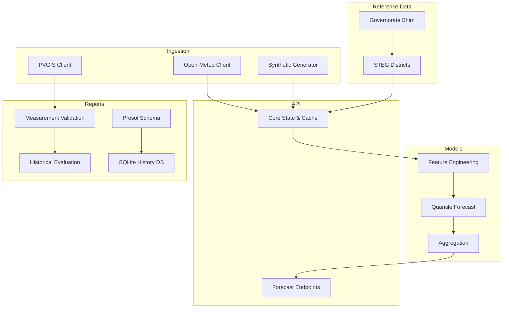
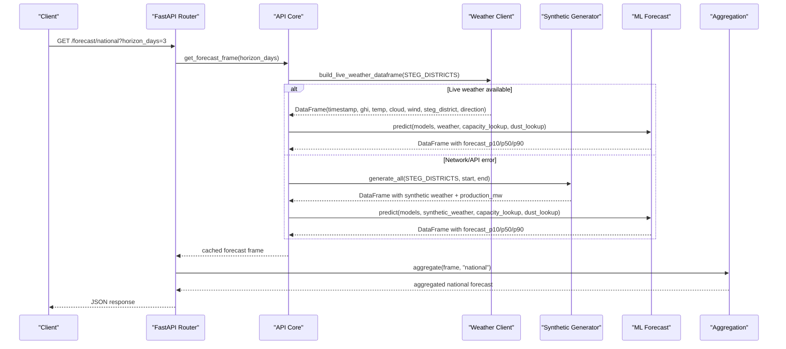
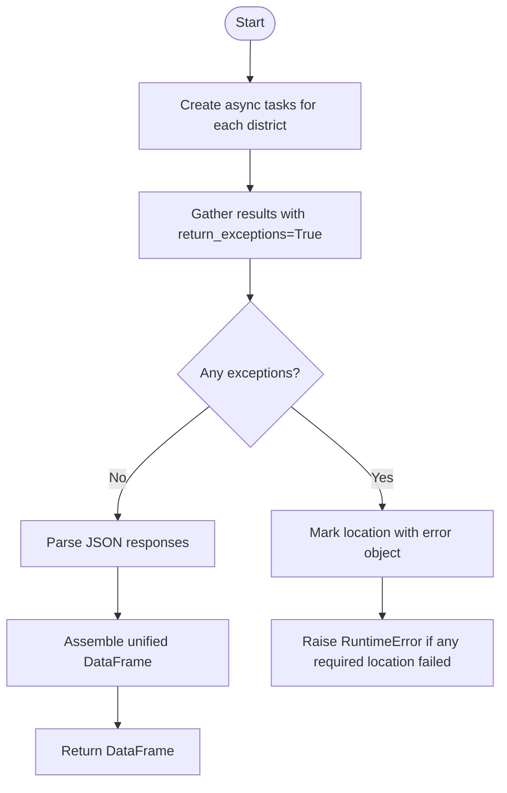
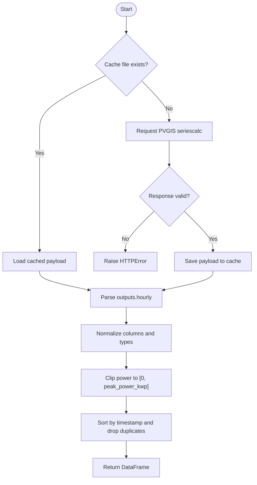
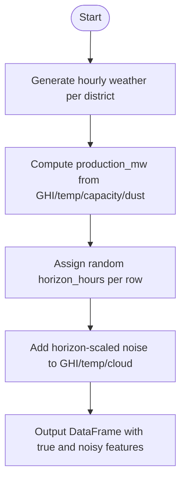
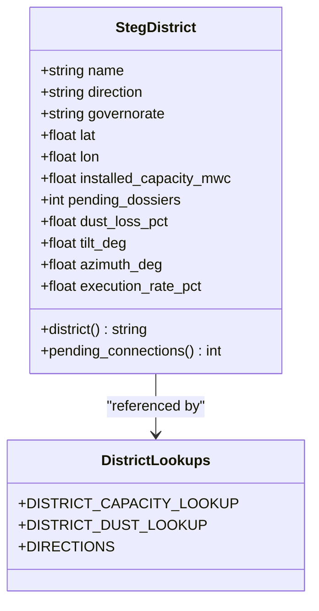
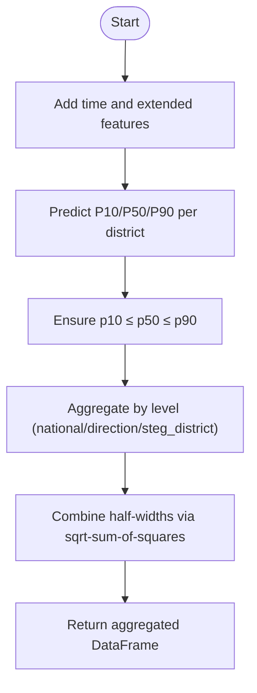
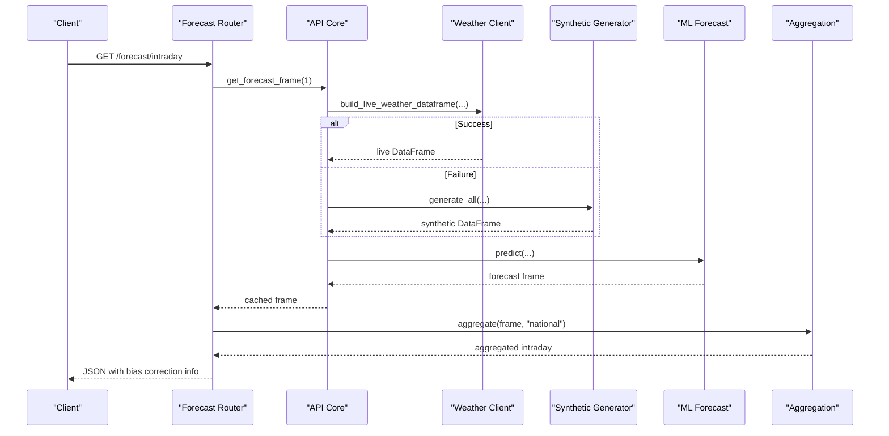
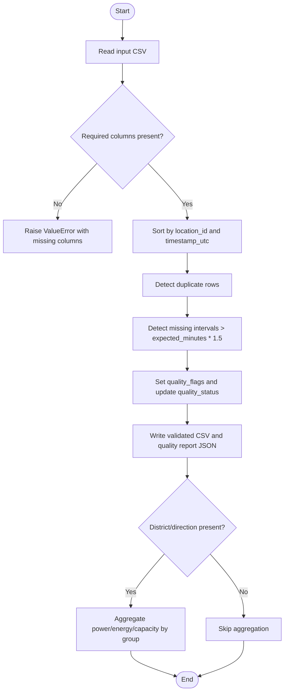
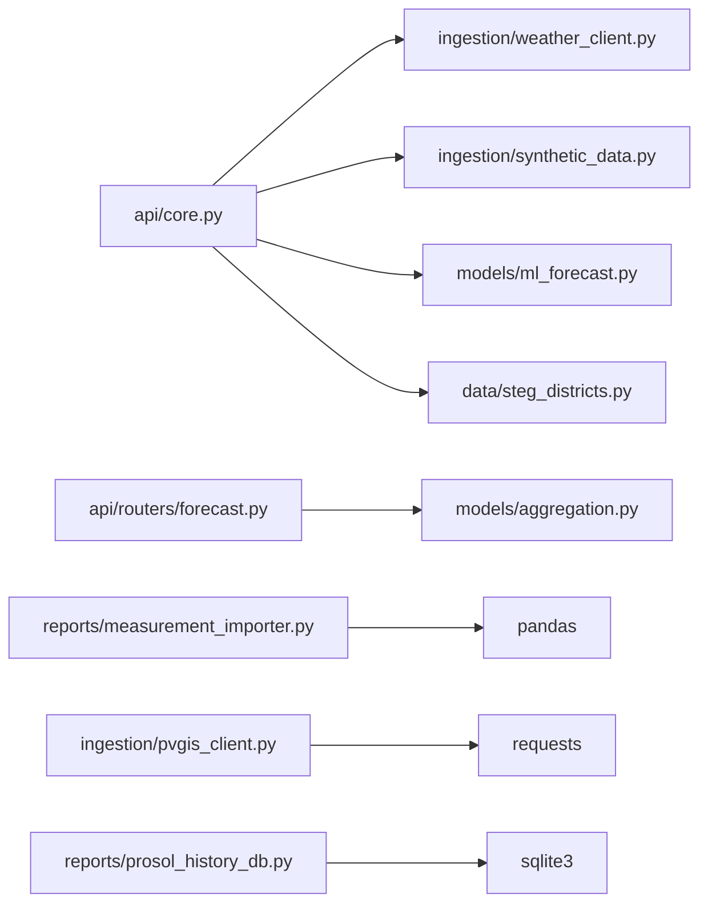

# Data Management

<cite>
**Referenced Files in This Document**
- [weather_client.py](file://ingestion/weather_client.py)
- [pvgis_client.py](file://ingestion/pvgis_client.py)
- [synthetic_data.py](file://ingestion/synthetic_data.py)
- [steg_districts.py](file://data/steg_districts.py)
- [governorates.py](file://data/governorates.py)
- [forecast.py](file://api/routers/forecast.py)
- [core.py](file://api/core.py)
- [aggregation.py](file://models/aggregation.py)
- [ml_forecast.py](file://models/ml_forecast.py)
- [measurement_importer.py](file://reports/measurement_importer.py)
- [historical_evaluation.py](file://reports/historical_evaluation.py)
- [prosol_report_schema.py](file://data/prosol_report_schema.py)
- [prosol_history_db.py](file://reports/prosol_history_db.py)
</cite>

## Table of Contents
1. Introduction
2. Project Structure
3. Core Components
4. Architecture Overview
5. Detailed Component Analysis
6. Dependency Analysis
7. Performance Considerations
8. Troubleshooting Guide
9. Conclusion
10. Appendices

## Introduction
This document explains the data management system for PV rooftop forecasting and reporting. It covers:
- Concurrent ingestion of weather forecasts from Open-Meteo and historical PV production from PVGIS-JRC
- Error handling, connection resilience, and fallback to synthetic data generation
- Reference data for STEG districts, governorate mappings, and installed capacity
- Synthetic data generator with physics-based production and horizon-scaled forecast noise
- Data validation, quality checks, transformation pipelines, schemas, storage formats, and access patterns
- Ingestion workflows and troubleshooting guidance

## Project Structure
The data pipeline is organized into ingestion, models, API, reports, and reference data modules:
- Ingestion: concurrent weather fetching (Open-Meteo), district-level PVGIS historical simulation, and synthetic data generation
- Models: feature engineering, quantile forecasting, aggregation across STEG districts, directions, and national levels
- API: endpoints serving forecasts, exports, and status; caching and scheduled refresh
- Reports: measurement import/validation, historical evaluation, Prosol report schema and SQLite persistence
- Reference data: STEG commercial districts, capacities, dust losses, displacement factors, and compatibility shims

**Diagram sources**
- [weather_client.py:53-92](file://ingestion/weather_client.py#L53-L92)
- [pvgis_client.py:27-95](file://ingestion/pvgis_client.py#L27-L95)
- [synthetic_data.py:119-159](file://ingestion/synthetic_data.py#L119-L159)
- [ml_forecast.py:49-131](file://models/ml_forecast.py#L49-L131)
- [aggregation.py:26-89](file://models/aggregation.py#L26-L89)
- [core.py:72-103](file://api/core.py#L72-L103)
- [forecast.py:25-158](file://api/routers/forecast.py#L25-L158)
- [measurement_importer.py:37-119](file://reports/measurement_importer.py#L37-L119)
- [prosol_report_schema.py:81-121](file://data/prosol_report_schema.py#L81-L121)
- [prosol_history_db.py:99-168](file://reports/prosol_history_db.py#L99-L168)
- [steg_districts.py:61-177](file://data/steg_districts.py#L61-L177)
- [governorates.py:7-25](file://data/governorates.py#L7-L25)

**Section sources**
- [weather_client.py:1-180](file://ingestion/weather_client.py#L1-L180)
- [pvgis_client.py:1-96](file://ingestion/pvgis_client.py#L1-L96)
- [synthetic_data.py:1-170](file://ingestion/synthetic_data.py#L1-L170)
- [steg_districts.py:1-247](file://data/steg_districts.py#L1-L247)
- [governorates.py:1-46](file://data/governorates.py#L1-L46)
- [core.py:1-166](file://api/core.py#L1-L166)
- [forecast.py:1-203](file://api/routers/forecast.py#L1-L203)
- [aggregation.py:1-164](file://models/aggregation.py#L1-L164)
- [ml_forecast.py:1-267](file://models/ml_forecast.py#L1-L267)
- [measurement_importer.py:1-119](file://reports/measurement_importer.py#L1-L119)
- [historical_evaluation.py:41-89](file://reports/historical_evaluation.py#L41-L89)
- [prosol_report_schema.py:1-121](file://data/prosol_report_schema.py#L1-L121)
- [prosol_history_db.py:45-168](file://reports/prosol_history_db.py#L45-L168)

## Core Components
- Weather ingestion:
  - Open-Meteo client fetches hourly forecasts concurrently for all STEG districts using async HTTP requests and returns a unified DataFrame with standardized columns.
  - PVGIS client retrieves historical hourly PV production per district with caching and robust parsing.
- Synthetic data:
  - Generates realistic weather series and PV output with horizon-dependent noise to simulate forecast uncertainty growth over lead time.
- Reference data:
  - STEG district definitions include coordinates, direction, installed capacity, pending dossiers, dust loss, and execution rates.
  - Compatibility shim exposes legacy names for backward compatibility.
- Forecasting and aggregation:
  - Feature engineering adds time, orientation, capacity, dust loss, horizon, and optional extended features.
  - Quantile regression produces P10/P50/P90 forecasts per district.
  - Aggregation combines district forecasts to Direction and National levels with uncertainty band combination.
- API and caching:
  - Central state caches forecasts for up to ~14 minutes, switches between live and synthetic data sources, and serves multiple endpoints.
- Reporting and validation:
  - Measurement importer validates CSV inputs, flags gaps/duplicates, and writes validated snapshots.
  - Historical evaluation compares forecasts vs actuals and persists results.
  - Prosol report schema defines immutable monthly snapshots and SQLite tables store them.

**Section sources**
- [weather_client.py:53-130](file://ingestion/weather_client.py#L53-L130)
- [pvgis_client.py:27-95](file://ingestion/pvgis_client.py#L27-L95)
- [synthetic_data.py:21-78](file://ingestion/synthetic_data.py#L21-L78)
- [steg_districts.py:61-177](file://data/steg_districts.py#L61-L177)
- [governorates.py:7-25](file://data/governorates.py#L7-L25)
- [ml_forecast.py:49-131](file://models/ml_forecast.py#L49-L131)
- [aggregation.py:26-89](file://models/aggregation.py#L26-L89)
- [core.py:55-103](file://api/core.py#L55-L103)
- [measurement_importer.py:37-119](file://reports/measurement_importer.py#L37-L119)
- [historical_evaluation.py:41-89](file://reports/historical_evaluation.py#L41-L89)
- [prosol_report_schema.py:81-121](file://data/prosol_report_schema.py#L81-L121)
- [prosol_history_db.py:99-168](file://reports/prosol_history_db.py#L99-L168)

## Architecture Overview
The system ingests weather and PV data, generates or loads forecasts, aggregates by administrative levels, and exposes them via an API with caching and fallbacks.

**Diagram sources**
- [core.py:72-103](file://api/core.py#L72-L103)
- [weather_client.py:53-130](file://ingestion/weather_client.py#L53-L130)
- [synthetic_data.py:119-159](file://ingestion/synthetic_data.py#L119-L159)
- [ml_forecast.py:118-131](file://models/ml_forecast.py#L118-L131)
- [aggregation.py:26-89](file://models/aggregation.py#L26-L89)
- [forecast.py:25-32](file://api/routers/forecast.py#L25-L32)

## Detailed Component Analysis

### Concurrent Weather Fetching (Open-Meteo)
- Uses async HTTP client to issue parallel requests for all districts/governorates.
- Returns a dictionary mapping location name to forecast JSON or error object.
- Assembles a unified DataFrame with standardized columns including GHI/DNI/DHI, temperature, cloud cover, wind speed, and geographic identifiers.
- Raises exceptions on network/API failures so callers can trigger fallback logic.

**Diagram sources**
- [weather_client.py:53-92](file://ingestion/weather_client.py#L53-L92)
- [weather_client.py:97-130](file://ingestion/weather_client.py#L97-L130)

**Section sources**
- [weather_client.py:38-92](file://ingestion/weather_client.py#L38-L92)
- [weather_client.py:97-130](file://ingestion/weather_client.py#L97-L130)

### PVGIS Historical Production
- Retrieves hourly PV production for a representative coordinate and aggregate capacity per district.
- Caches raw JSON locally to avoid repeated network calls.
- Validates response structure and converts to a normalized DataFrame with timestamp_utc, power_kw, irradiance components, temperature, wind speed, and cloud cover defaults.
- Clips power to non-negative and within capacity bounds.

**Diagram sources**
- [pvgis_client.py:27-95](file://ingestion/pvgis_client.py#L27-L95)

**Section sources**
- [pvgis_client.py:27-95](file://ingestion/pvgis_client.py#L27-L95)

### Synthetic Data Generator
- Generates hourly weather series with seasonal cycles, diurnal temperature variation, and cloud attenuation.
- Converts GHI to PV output using a single-diode-inspired model with temperature derating, system losses, dust loss, and small noise.
- Adds horizon-dependent forecast noise to simulate NWP skill degradation over lead time.
- Produces per-governorate datasets with true and noisy features plus production targets.

**Diagram sources**
- [synthetic_data.py:21-78](file://ingestion/synthetic_data.py#L21-L78)
- [synthetic_data.py:104-116](file://ingestion/synthetic_data.py#L104-L116)
- [synthetic_data.py:119-159](file://ingestion/synthetic_data.py#L119-L159)

**Section sources**
- [synthetic_data.py:21-78](file://ingestion/synthetic_data.py#L21-L78)
- [synthetic_data.py:104-116](file://ingestion/synthetic_data.py#L104-L116)
- [synthetic_data.py:119-159](file://ingestion/synthetic_data.py#L119-L159)

### Reference Data: STEG Districts and Governorate Mappings
- Defines 50 commercial districts across 7 Directions de Distribution with coordinates, installed capacity, pending dossiers, dust loss, and execution rate.
- Provides lookup dictionaries for capacity and dust loss by district name.
- Includes utility functions for direction summaries, displacement calculations, and capacity projections based on pending dossiers and execution rates.
- Backward-compatibility shim exposes legacy names and objects.

**Diagram sources**
- [steg_districts.py:61-177](file://data/steg_districts.py#L61-L177)
- [steg_districts.py:180-228](file://data/steg_districts.py#L180-L228)
- [governorates.py:7-25](file://data/governorates.py#L7-L25)

**Section sources**
- [steg_districts.py:61-177](file://data/steg_districts.py#L61-L177)
- [steg_districts.py:180-228](file://data/steg_districts.py#L180-L228)
- [governorates.py:7-25](file://data/governorates.py#L7-L25)

### Forecasting and Aggregation
- Feature engineering enriches data with time features, capacity, dust loss, horizon hours, and optional extended features (DNI/DHI, wind speed, GHI×temp interaction, rolling GHI).
- Quantile regression trains three models (P10/P50/P90) and predicts clipped, monotonic forecasts.
- Aggregation sums P50 forecasts and combines uncertainty bands using sqrt-sum-of-squares of half-widths across groups.

**Diagram sources**
- [ml_forecast.py:49-131](file://models/ml_forecast.py#L49-L131)
- [aggregation.py:20-89](file://models/aggregation.py#L20-L89)

**Section sources**
- [ml_forecast.py:49-131](file://models/ml_forecast.py#L49-L131)
- [aggregation.py:20-89](file://models/aggregation.py#L20-L89)

### API Endpoints and Caching
- Builds forecast frames with live weather when available; falls back to synthetic data on errors.
- Caches results for ~14 minutes to reduce load and latency.
- Serves national, intraday, direction, district, and map endpoints; supports export to CSV/XML.
- Computes bias correction from recent meter buffer when available.

**Diagram sources**
- [core.py:72-103](file://api/core.py#L72-L103)
- [forecast.py:35-54](file://api/routers/forecast.py#L35-L54)
- [weather_client.py:53-130](file://ingestion/weather_client.py#L53-L130)
- [synthetic_data.py:119-159](file://ingestion/synthetic_data.py#L119-L159)
- [ml_forecast.py:118-131](file://models/ml_forecast.py#L118-L131)
- [aggregation.py:26-89](file://models/aggregation.py#L26-L89)

**Section sources**
- [core.py:55-103](file://api/core.py#L55-L103)
- [forecast.py:25-158](file://api/routers/forecast.py#L25-L158)

### Data Validation and Quality Checks
- Measurement importer validates required columns, sorts by location/time, detects duplicate rows, identifies missing intervals, and assigns quality flags/status.
- Writes validated CSV and a quality report JSON under results directory; optionally aggregates by district/direction if provided.

**Diagram sources**
- [measurement_importer.py:37-119](file://reports/measurement_importer.py#L37-L119)

**Section sources**
- [measurement_importer.py:37-119](file://reports/measurement_importer.py#L37-L119)

### Storage Formats and Access Patterns
- CSV: measurements and validated snapshots stored under results directory; exported forecasts available via streaming CSV.
- JSON: PVGIS cache payloads, Prosol report snapshots, and quality reports.
- SQLite: Prosol history database stores report snapshots and child tables for directions, districts, installation sizes, and pending dossiers.
- Joblib: serialized ML models for prediction.

**Section sources**
- [pvgis_client.py:40-67](file://ingestion/pvgis_client.py#L40-L67)
- [measurement_importer.py:91-119](file://reports/measurement_importer.py#L91-L119)
- [prosol_history_db.py:99-168](file://reports/prosol_history_db.py#L99-L168)
- [ml_forecast.py:227-233](file://models/ml_forecast.py#L227-L233)
- [forecast.py:189-202](file://api/routers/forecast.py#L189-L202)

## Dependency Analysis
Key dependencies and coupling:
- API core depends on weather client, synthetic generator, ML models, and reference data.
- Weather client depends on httpx and pandas; synthetic data depends on numpy and pandas.
- ML forecasting depends on LightGBM and joblib; aggregation depends on pandas and numpy.
- Reports depend on pandas and sqlite3; Prosol schema defines immutable structures used by importers.

**Diagram sources**
- [core.py:18-27](file://api/core.py#L18-L27)
- [forecast.py:9-19](file://api/routers/forecast.py#L9-L19)
- [measurement_importer.py:17-22](file://reports/measurement_importer.py#L17-L22)
- [pvgis_client.py:10-15](file://ingestion/pvgis_client.py#L10-L15)
- [prosol_history_db.py:1-44](file://reports/prosol_history_db.py#L1-L44)

**Section sources**
- [core.py:18-27](file://api/core.py#L18-L27)
- [forecast.py:9-19](file://api/routers/forecast.py#L9-L19)
- [measurement_importer.py:17-22](file://reports/measurement_importer.py#L17-L22)
- [pvgis_client.py:10-15](file://ingestion/pvgis_client.py#L10-L15)
- [prosol_history_db.py:1-44](file://reports/prosol_history_db.py#L1-L44)

## Performance Considerations
- Concurrent fetching reduces total wall-clock time to near single-request latency regardless of number of districts.
- Caching avoids repeated network calls and model inference within a short window (~14 minutes).
- Aggregation uses vectorized operations and efficient grouping to minimize overhead.
- Synthetic data generation uses vectorized NumPy operations for performance.
- PVGIS caching prevents redundant API calls and speeds up repeated evaluations.

[No sources needed since this section provides general guidance]

## Troubleshooting Guide
Common issues and resolutions:
- Network/API unavailability:
  - The API core catches exceptions during live weather fetch and automatically falls back to synthetic data, marking the data source as synthetic.
  - Ensure internet connectivity and correct timezone settings; verify Open-Meteo endpoint availability.
- Missing or invalid columns in measurements:
  - Measurement importer raises errors for missing required columns; ensure CSV includes timestamp_utc, location_id, power_kw.
  - Duplicate rows and missing intervals are flagged; review quality report JSON for details.
- PVGIS response format changes:
  - PVGIS client validates presence of outputs.hourly and required columns; handle ValueError if response structure changes.
- Model artifacts missing:
  - API core loads models from a fixed path; ensure quantile_models.joblib exists before starting services.
- Aggregation key errors:
  - Aggregation requires specific columns (direction/district/steg_district/governorate); ensure incoming DataFrame contains at least one of these keys.

**Section sources**
- [core.py:72-99](file://api/core.py#L72-L99)
- [measurement_importer.py:37-78](file://reports/measurement_importer.py#L37-L78)
- [pvgis_client.py:69-75](file://ingestion/pvgis_client.py#L69-L75)
- [ml_forecast.py:227-233](file://models/ml_forecast.py#L227-L233)
- [aggregation.py:41-65](file://models/aggregation.py#L41-L65)

## Conclusion
The system provides resilient, high-performance data ingestion and forecasting for Tunisia’s rooftop PV portfolio. It integrates real-time weather forecasts and historical PV simulations, falls back to synthetic data when necessary, and delivers aggregated forecasts across administrative boundaries. Robust validation and reporting tools support ongoing monitoring and evaluation.

[No sources needed since this section summarizes without analyzing specific files]

## Appendices

### Data Schemas and Columns
- Unified weather DataFrame columns:
  - timestamp, ghi_wm2, dni_wm2, dhi_wm2, wind_speed_ms, temp_c, cloud_cover_pct, governorate, district, steg_district, direction
- Forecast DataFrame columns:
  - All weather columns plus forecast_p10_mw, forecast_p50_mw, forecast_p90_mw
- Aggregated outputs:
  - timestamp, direction/steg_district/governorate as applicable, forecast_p10_mw, forecast_p50_mw, forecast_p90_mw
- Measurement CSV:
  - Required: timestamp_utc, location_id, power_kw
  - Optional: energy_kwh, installed_capacity_kwp, source, quality_status, district, direction, ghi_wm2, temp_c, cloud_cover_pct, dni_wm2, dhi_wm2, wind_speed_ms, horizon_hours

**Section sources**
- [weather_client.py:77-130](file://ingestion/weather_client.py#L77-L130)
- [ml_forecast.py:118-131](file://models/ml_forecast.py#L118-L131)
- [measurement_importer.py:24-29](file://reports/measurement_importer.py#L24-L29)

### Example Workflows
- Live forecast workflow:
  - API request triggers build_forecast, which attempts live weather fetch; if successful, runs ML prediction and aggregation; otherwise, uses synthetic data.
- Historical evaluation workflow:
  - Generate or load dataset with horizon_hours; produce forecasts; compare against actuals; write forecast.csv, actual.csv, and summary metadata.

**Section sources**
- [core.py:72-103](file://api/core.py#L72-L103)
- [historical_evaluation.py:41-89](file://reports/historical_evaluation.py#L41-L89)