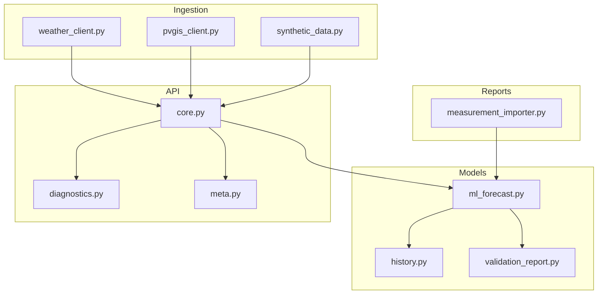
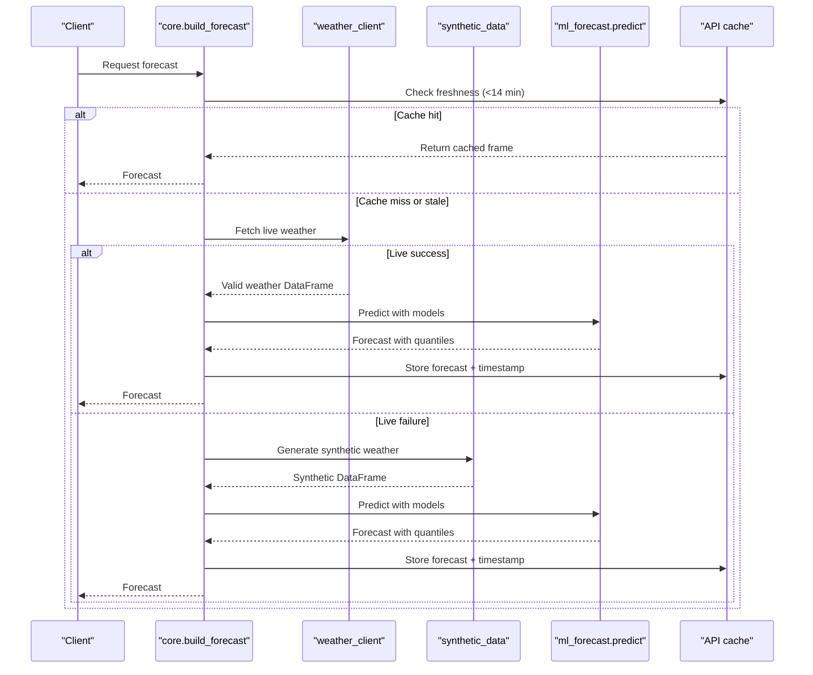
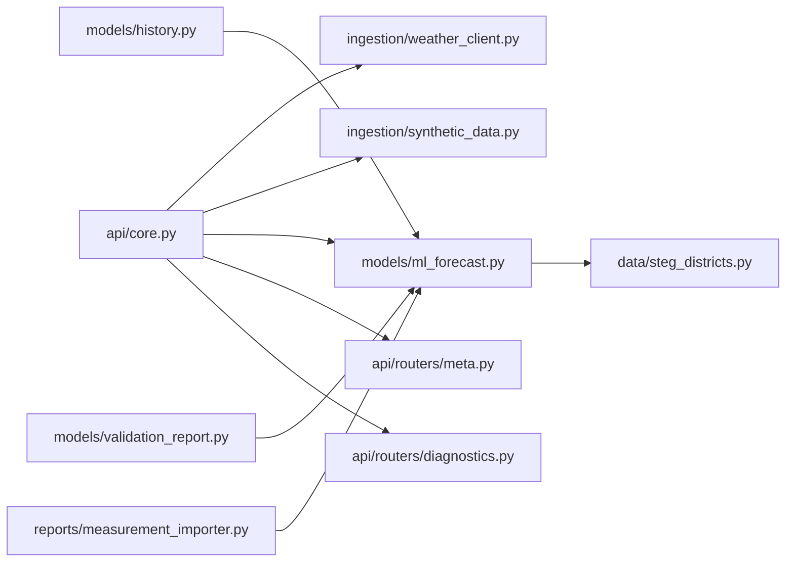

# Data Quality Assurance

<cite>
**Referenced Files in This Document**
- [weather_client.py](file://ingestion/weather_client.py)
- [pvgis_client.py](file://ingestion/pvgis_client.py)
- [synthetic_data.py](file://ingestion/synthetic_data.py)
- [measurement_importer.py](file://reports/measurement_importer.py)
- [ml_forecast.py](file://models/ml_forecast.py)
- [history.py](file://models/history.py)
- [validation_report.py](file://models/validation_report.py)
- [core.py](file://api/core.py)
- [diagnostics.py](file://api/routers/diagnostics.py)
- [meta.py](file://api/routers/meta.py)
- [steg_districts.py](file://data/steg_districts.py)
- [prosol_report_schema.py](file://data/prosol_report_schema.py)
</cite>

## Table of Contents
1. Introduction
2. Project Structure
3. Core Components
4. Architecture Overview
5. Detailed Component Analysis
6. Dependency Analysis
7. Performance Considerations
8. Troubleshooting Guide
9. Conclusion

## Introduction
This document describes the data quality assurance (DQA) processes that ensure reliability and consistency of weather and production data across the platform. It covers:
- Validation rules for incoming weather and production data, including range checks and temporal consistency
- Error detection mechanisms for missing data, outliers, and API response anomalies
- Fallback strategies when primary sources fail, including synthetic data and cached results
- Data transformation pipelines that normalize heterogeneous inputs into standard schemas
- Monitoring and alerting for data quality issues, logging practices, and procedures to investigate and resolve inconsistencies
- Examples of common data quality scenarios and their resolution approaches

## Project Structure
The DQA system spans ingestion, modeling, reporting, and API layers:
- Ingestion: real weather via Open-Meteo, PVGIS production simulation, and synthetic fallback generation
- Modeling: feature engineering, quantile forecasting, evaluation, and validation reports
- Reporting: measurement import validation and aggregation, historical evaluation
- API: forecast serving with cache, status endpoints, diagnostics/alerts, and retraining state exposure

**Diagram sources**
- [weather_client.py:77-130](file://ingestion/weather_client.py#L77-L130)
- [pvgis_client.py:27-95](file://ingestion/pvgis_client.py#L27-L95)
- [synthetic_data.py:30-159](file://ingestion/synthetic_data.py#L30-L159)
- [ml_forecast.py:49-131](file://models/ml_forecast.py#L49-L131)
- [history.py:42-82](file://models/history.py#L42-L82)
- [validation_report.py:22-82](file://models/validation_report.py#L22-L82)
- [measurement_importer.py:37-119](file://reports/measurement_importer.py#L37-L119)
- [core.py:72-99](file://api/core.py#L72-L99)
- [diagnostics.py:17-80](file://api/routers/diagnostics.py#L17-L80)
- [meta.py:34-58](file://api/routers/meta.py#L34-L58)

**Section sources**
- [weather_client.py:77-130](file://ingestion/weather_client.py#L77-L130)
- [pvgis_client.py:27-95](file://ingestion/pvgis_client.py#L27-L95)
- [synthetic_data.py:30-159](file://ingestion/synthetic_data.py#L30-L159)
- [ml_forecast.py:49-131](file://models/ml_forecast.py#L49-L131)
- [measurement_importer.py:37-119](file://reports/measurement_importer.py#L37-L119)
- [core.py:72-99](file://api/core.py#L72-L99)
- [diagnostics.py:17-80](file://api/routers/diagnostics.py#L17-L80)
- [meta.py:34-58](file://api/routers/meta.py#L34-L58)

## Core Components
- Weather ingestion: concurrent fetching from Open-Meteo, mapping to a shared schema with timestamp, irradiance, temperature, cloud cover, wind, and geographic identifiers
- PVGIS ingestion: district-level hourly production simulation with caching and strict response validation
- Synthetic fallback: deterministic weather and PV output generation with horizon-aware noise
- Measurement import: validation of rooftop measurements, gap detection, duplicate handling, capacity-based plausibility checks, and aggregation
- Model features and predictions: robust feature creation with defaults for missing columns; quantile forecasts with monotonicity enforcement
- Forecast serving and cache: in-memory cache with freshness policy and automatic fallback to synthetic data on source failure
- Diagnostics and alerts: operational alerts for uncertainty, ramp events, saturation risk, model drift, and retraining lifecycle
- Status and metadata: data source transparency and cache staleness indicators

**Section sources**
- [weather_client.py:77-130](file://ingestion/weather_client.py#L77-L130)
- [pvgis_client.py:27-95](file://ingestion/pvgis_client.py#L27-L95)
- [synthetic_data.py:30-159](file://ingestion/synthetic_data.py#L30-L159)
- [measurement_importer.py:37-119](file://reports/measurement_importer.py#L37-L119)
- [ml_forecast.py:49-131](file://models/ml_forecast.py#L49-L131)
- [core.py:72-99](file://api/core.py#L72-L99)
- [diagnostics.py:17-80](file://api/routers/diagnostics.py#L17-L80)
- [meta.py:34-58](file://api/routers/meta.py#L34-L58)

## Architecture Overview
The pipeline ensures data quality through layered validation, normalization, and monitoring:
- Real-time weather is fetched concurrently; if any request fails or returns no rows, synthetic data is used
- PVGIS responses are validated for required fields; numeric coercion and clipping enforce physical bounds
- Measurements are validated for completeness, temporal gaps, duplicates, and capacity plausibility
- Feature engineering fills missing optional columns with sensible defaults before prediction
- Forecasts are cached with freshness checks; diagnostics surface alerts for high uncertainty, ramps, saturation risk, and model drift
- Status endpoints expose data source and cache age for observability

**Diagram sources**
- [core.py:72-99](file://api/core.py#L72-L99)
- [weather_client.py:77-130](file://ingestion/weather_client.py#L77-L130)
- [synthetic_data.py:119-159](file://ingestion/synthetic_data.py#L119-L159)
- [ml_forecast.py:118-131](file://models/ml_forecast.py#L118-L131)

**Section sources**
- [core.py:72-99](file://api/core.py#L72-L99)
- [weather_client.py:77-130](file://ingestion/weather_client.py#L77-L130)
- [synthetic_data.py:119-159](file://ingestion/synthetic_data.py#L119-L159)
- [ml_forecast.py:118-131](file://models/ml_forecast.py#L118-L131)

## Detailed Component Analysis

### Weather Ingestion and Normalization
- Concurrent fetches per governorate/district using async HTTP client; errors captured per location and surfaced as exceptions
- Missing values filled with safe defaults (e.g., zero irradiance, default temperature/cloud/wind)
- Output normalized to a shared schema with timestamp, irradiance components, temperature, cloud cover, wind speed, and geographic keys

Validation and error detection:
- Network/API failures raise exceptions; callers catch and fall back to synthetic data
- Empty results within requested time window trigger fallback

Normalization:
- Maps Open-Meteo variables to canonical columns
- Ensures consistent geographic identifiers for downstream aggregation

**Section sources**
- [weather_client.py:38-74](file://ingestion/weather_client.py#L38-L74)
- [weather_client.py:77-130](file://ingestion/weather_client.py#L77-L130)

### PVGIS Production Ingestion
- Caches responses locally to reduce network calls
- Validates presence of required outputs and time/power columns
- Coerces numeric columns, fills missing values, clips power to installed capacity, deduplicates timestamps, and sorts by time

Validation and error detection:
- Raises errors for malformed responses or missing critical fields
- Enforces non-negative power and upper bound by capacity

Normalization:
- Computes GHI from beam, diffuse, reflected components
- Produces canonical columns for downstream use

**Section sources**
- [pvgis_client.py:27-95](file://ingestion/pvgis_client.py#L27-L95)

### Synthetic Data Generation
- Generates realistic hourly weather with seasonal cycles, diurnal patterns, and cloud attenuation
- Produces PV output using a physics-inspired approximation with temperature derating and losses
- Adds horizon-aware noise to simulate forecast uncertainty growth over lead time

Quality characteristics:
- Deterministic RNG seed for reproducibility
- Clipping ensures physically plausible ranges

**Section sources**
- [synthetic_data.py:21-78](file://ingestion/synthetic_data.py#L21-L78)
- [synthetic_data.py:104-159](file://ingestion/synthetic_data.py#L104-L159)

### Measurement Import and Validation
- Requires core columns; optional columns filled with NA
- Converts timestamps and numerics with coercion; flags invalid entries
- Detects negative energy/power, above-capacity readings, duplicates, and temporal gaps
- Assigns quality_status based on flags; produces aggregated views when district/direction available

Validation rules:
- Range checks: non-negative energy/power; power not exceeding 1.2x installed capacity
- Temporal consistency: gaps beyond expected interval flagged
- Duplicate detection: same location and timestamp

Normalization:
- Aggregates by district and direction when available

**Section sources**
- [measurement_importer.py:37-119](file://reports/measurement_importer.py#L37-L119)

### Model Features and Predictions
- Adds time features, capacity/dust lookups, and horizon hours
- Handles missing optional features by deriving defaults (e.g., DNI/DHI from GHI, wind speed default)
- Creates interaction and rolling features to improve forecast stability
- Enforces quantile ordering (P10 ≤ P50 ≤ P90) and non-negative predictions

Error detection:
- Robust to missing columns; avoids breaking downstream code

Normalization:
- Standardized feature set for training and inference

**Section sources**
- [ml_forecast.py:49-131](file://models/ml_forecast.py#L49-L131)

### Forecast Serving, Cache, and Fallback
- In-memory cache with 14-minute freshness threshold
- On cache miss or failure, attempts live weather; if unavailable, switches to synthetic data
- Marks data_source to indicate origin (live vs synthetic)

Monitoring:
- Exposes cache age and data source via status endpoints

**Section sources**
- [core.py:72-99](file://api/core.py#L72-L99)
- [meta.py:34-58](file://api/routers/meta.py#L34-L58)

### Diagnostics and Alerting
- Alerts for high uncertainty (wide P10-P90 bands), rapid ramps, saturation risk, model drift, and retraining lifecycle events
- Reads retraining state and logs to compose alerts
- Dashboard integration displays alerts and retraining status

Operational guidance:
- Use thresholds to tune sensitivity
- Investigate alerts via underlying forecast frames and logs

**Section sources**
- [diagnostics.py:17-80](file://api/routers/diagnostics.py#L17-L80)

### Historical Evaluation and Validation Reports
- Builds national history by aggregating district-level predictions and actuals
- Computes metrics (MAE, RMSE, coverage) and writes validation reports
- Supports split-based train/validation evaluation

Quality focus:
- Ensures consistent time alignment and aggregation
- Tracks dataset paths and sources for traceability

**Section sources**
- [history.py:42-82](file://models/history.py#L42-L82)
- [validation_report.py:22-82](file://models/validation_report.py#L22-L82)

### Reference Data and Schema
- District reference data includes coordinates, capacities, dust loss, and pending dossiers
- Prosol report schema defines immutable snapshots for monthly reporting

Usage:
- Capacity and dust lookups inform feature engineering and bias corrections
- Report schema structures dashboard and export logic

**Section sources**
- [steg_districts.py:61-176](file://data/steg_districts.py#L61-L176)
- [prosol_report_schema.py:12-121](file://data/prosol_report_schema.py#L12-L121)

## Dependency Analysis
Key dependencies and coupling:
- API core depends on ingestion modules and model services; uses district reference data for capacity/dust
- Weather client depends on external APIs; synthetic data provides deterministic fallback
- Measurement importer feeds validated data into model training adapters and evaluations
- Diagnostics depend on forecast frames and retraining state/logs

Potential risks:
- External API availability impacts live data path; mitigated by synthetic fallback
- Missing columns in upstream data handled via defaults but may degrade forecast accuracy

**Diagram sources**
- [core.py:72-99](file://api/core.py#L72-L99)
- [weather_client.py:77-130](file://ingestion/weather_client.py#L77-L130)
- [synthetic_data.py:119-159](file://ingestion/synthetic_data.py#L119-L159)
- [ml_forecast.py:49-131](file://models/ml_forecast.py#L49-L131)
- [history.py:42-82](file://models/history.py#L42-L82)
- [validation_report.py:22-82](file://models/validation_report.py#L22-L82)
- [measurement_importer.py:37-119](file://reports/measurement_importer.py#L37-L119)
- [steg_districts.py:167-176](file://data/steg_districts.py#L167-L176)

**Section sources**
- [core.py:72-99](file://api/core.py#L72-L99)
- [ml_forecast.py:49-131](file://models/ml_forecast.py#L49-L131)
- [steg_districts.py:167-176](file://data/steg_districts.py#L167-L176)

## Performance Considerations
- Concurrent weather fetching reduces latency significantly compared to sequential requests
- In-memory cache minimizes repeated computation and I/O; freshness threshold balances timeliness and load
- Synthetic data generation is deterministic and lightweight, enabling fast fallback
- Feature engineering uses vectorized operations and groupby transforms for efficiency
- PVGIS caching reduces repeated network calls and parsing overhead

[No sources needed since this section provides general guidance]

## Troubleshooting Guide
Common issues and resolutions:
- No live weather data returned:
  - Symptom: empty DataFrame after filtering by time window
  - Resolution: fallback to synthetic data; check network connectivity and API health
  - Evidence: exception handling and fallback in forecast builder
  - Section sources
    - [core.py:80-95](file://api/core.py#L80-L95)
    - [weather_client.py:92-130](file://ingestion/weather_client.py#L92-L130)

- PVGIS response missing required fields:
  - Symptom: ValueError raised during parsing
  - Resolution: inspect raw payload; verify endpoint parameters; rely on cached copy if present
  - Section sources
    - [pvgis_client.py:60-75](file://ingestion/pvgis_client.py#L60-L75)

- Measurement gaps and duplicates:
  - Symptom: flagged rows and missing intervals in quality report
  - Resolution: review gaps list; reconcile metering systems; remove duplicates; re-import
  - Section sources
    - [measurement_importer.py:63-88](file://reports/measurement_importer.py#L63-L88)

- High uncertainty alerts:
  - Symptom: HIGH_UNCERTAINTY alert with wide P10-P90 bands
  - Resolution: investigate weather input quality; consider adjusting thresholds; validate model performance
  - Section sources
    - [diagnostics.py:22-31](file://api/routers/diagnostics.py#L22-L31)

- Model drift detected:
  - Symptom: MODEL_DRIFT alert indicating MAE relative to persistence baseline
  - Resolution: review recent data quality; trigger retraining if appropriate; monitor retraining state
  - Section sources
    - [diagnostics.py:72-79](file://api/routers/diagnostics.py#L72-L79)

- Stale cache:
  - Symptom: cache_age_min indicates outdated data
  - Resolution: refresh cycle should run automatically; verify scheduler; force rebuild if needed
  - Section sources
    - [meta.py:48-58](file://api/routers/meta.py#L48-L58)
    - [core.py:125-139](file://api/core.py#L125-L139)

## Conclusion
The platform implements comprehensive data quality assurance across ingestion, modeling, reporting, and API layers. Validation rules detect missing data, outliers, and anomalies; fallback strategies ensure continuity; normalization guarantees consistent schemas; and monitoring/alerting provide operational visibility. Together, these mechanisms maintain reliable and consistent weather and production data throughout the system.