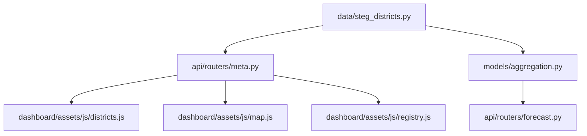
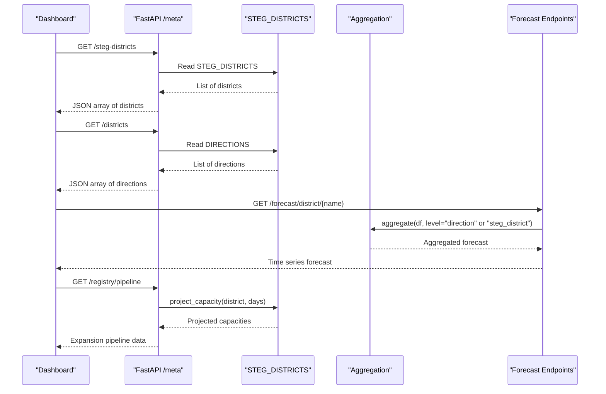
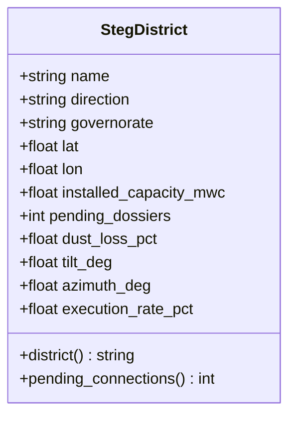
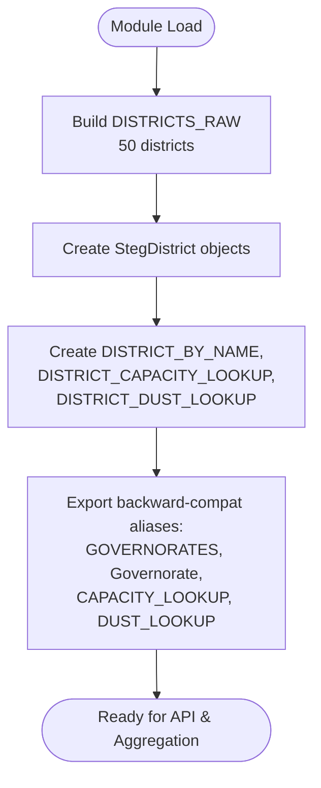
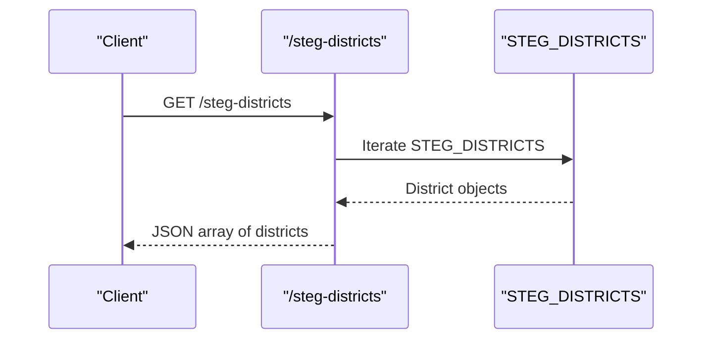
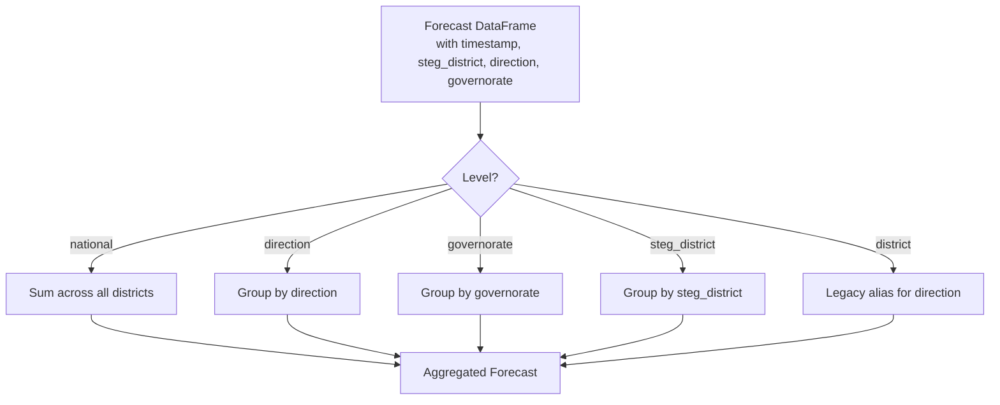
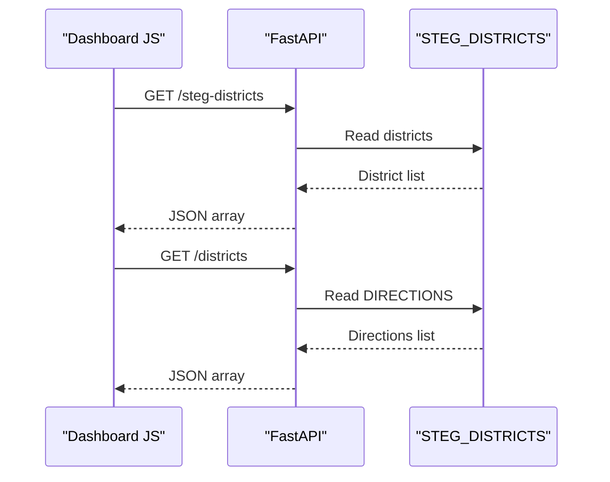
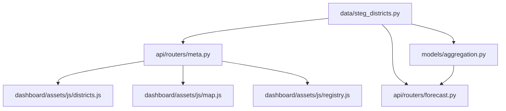

# Reference Data Management

<cite>
**Referenced Files in This Document**
- [steg_districts.py](file://data/steg_districts.py)
- [governorates.py](file://data/governorates.py)
- [meta.py](file://api/routers/meta.py)
- [forecast.py](file://api/routers/forecast.py)
- [aggregation.py](file://models/aggregation.py)
- [districts.js](file://dashboard/assets/js/districts.js)
- [map.js](file://dashboard/assets/js/map.js)
- [registry.js](file://dashboard/assets/js/registry.js)
</cite>

## Table of Contents
1. [Introduction](#introduction)
2. [Project Structure](#project-structure)
3. [Core Components](#core-components)
4. [Architecture Overview](#architecture-overview)
5. [Detailed Component Analysis](#detailed-component-analysis)
6. [Dependency Analysis](#dependency-analysis)
7. [Performance Considerations](#performance-considerations)
8. [Troubleshooting Guide](#troubleshooting-guide)
9. [Conclusion](#conclusion)
10. [Appendices](#appendices)

## Introduction
This document describes the reference data systems that define Tunisia’s administrative and utility district structures used by the PV forecast platform. The core dataset is the STEG_DISTRICTS configuration, which enumerates 50 commercial districts across 7 Directions de Distribution with capacity information, geographic coordinates, pending connection requests, execution rates, and Direction mappings. It also explains how governorate definitions are provided via compatibility aliases to support aggregation at multiple levels: steg_district, direction (Distribution), governorate, and national.

The StegDistrict data model includes attributes such as name, lat, lon, installed_capacity_mwc, direction, governorate, pending_dossiers, dust_loss_pct, tilt_deg, azimuth_deg, and execution_rate_pct. These objects enable multi-level forecasting and aggregation, map rendering, registry views, and expansion pipeline projections.

## Project Structure
Reference data for districts and directions lives under data/. The API exposes this data through metadata endpoints, while the dashboard consumes it for visualization and interactive analysis. Aggregation logic supports grouping forecasts by steg_district, direction, governorate, or national level.

**Diagram sources**
- [steg_districts.py:14-177](file://data/steg_districts.py#L14-L177)
- [meta.py:61-105](file://api/routers/meta.py#L61-L105)
- [aggregation.py:26-89](file://models/aggregation.py#L26-L89)
- [forecast.py:93-115](file://api/routers/forecast.py#L93-L115)
- [districts.js:18-24](file://dashboard/assets/js/districts.js#L18-L24)
- [map.js:49-67](file://dashboard/assets/js/map.js#L49-L67)
- [registry.js:5-17](file://dashboard/assets/js/registry.js#L5-L17)

**Section sources**
- [steg_districts.py:14-177](file://data/steg_districts.py#L14-L177)
- [meta.py:61-105](file://api/routers/meta.py#L61-L105)
- [aggregation.py:26-89](file://models/aggregation.py#L26-L89)
- [forecast.py:93-115](file://api/routers/forecast.py#L93-L115)
- [districts.js:18-24](file://dashboard/assets/js/districts.js#L18-L24)
- [map.js:49-67](file://dashboard/assets/js/map.js#L49-L67)
- [registry.js:5-17](file://dashboard/assets/js/registry.js#L5-L17)

## Core Components
- StegDistrict dataclass defines each commercial district with attributes for identity, geography, capacity, pending connections, performance parameters, and execution rate.
- STEG_DISTRICTS holds the complete list of 50 districts grouped by Direction de Distribution.
- DIRECTIONS lists the 7 distribution directions derived from the dataset.
- DISTRICT_BY_NAME provides fast lookup by district name.
- DISTRICT_CAPACITY_LOOKUP and DISTRICT_DUST_LOOKUP provide O(1) access to capacity and dust loss per district.
- Backward-compatibility aliases map legacy names (GOVERNORATES, Governorate, etc.) to StegDistrict so existing code continues to work.
- Utility functions include:
  - districts_by_direction(direction): filter districts by direction.
  - direction_summary(): aggregate counts, total capacity, pending dossiers, and share percentage per direction.
  - calculate_displacement(mwh_generated): compute multi-vector displacement metrics using official ratios.
  - project_capacity(district, days=90): project future capacity based on pending dossiers, average unit size, execution rate, and time window.

Examples of accessing reference data:
- Access all districts: import STEG_DISTRICTS and iterate or filter.
- Lookup by name: use DISTRICT_BY_NAME[name].
- Get directions: use DIRECTIONS.
- Capacity and dust lookups: use DISTRICT_CAPACITY_LOOKUP[name] and DISTRICT_DUST_LOOKUP[name].
- Filter by direction: use districts_by_direction("TUNIS").
- Direction summary: call direction_summary() to get aggregated stats per direction.
- Displacement calculation: call calculate_displacement(mwh).
- Capacity projection: call project_capacity(district, days=30 or 90).

Updating district configurations:
- Add a new district by appending a tuple to DISTRICTS_RAW with fields: name, direction, governorate, lat, lon, installed_capacity_mwc, pending_dossiers, dust_loss_pct, execution_rate_pct.
- Ensure the direction exists in DIRECTIONS; if adding a new direction, add it to the raw data and recompute DIRECTIONS automatically.
- Validate consistency:
  - District names must be unique.
  - Coordinates should be valid latitude/longitude within Tunisia.
  - Capacity values should be non-negative.
  - Pending dossiers should be non-negative integers.
  - Dust loss percentages should be between 0 and 1.
  - Execution rates should be between 0 and 100.
- Maintain backward compatibility:
  - Keep aliases GOVERNORATES, Governorate, CAPACITY_LOOKUP, DUST_LOOKUP consistent with new entries.
  - If changing field names, update properties like .district and .pending_connections to preserve compatibility.

Maintaining data consistency:
- Use DISTRICT_BY_NAME for lookups to avoid duplicates.
- Use direction_summary() to verify totals align with NATIONAL_ROOFTOP_PV_MWC.
- Use project_capacity() to ensure projected capacities remain realistic relative to pending dossiers and execution rates.
- Update SATURATION_THRESHOLDS_MW when high-penetration districts approach grid constraints.

**Section sources**
- [steg_districts.py:61-177](file://data/steg_districts.py#L61-L177)
- [steg_districts.py:180-228](file://data/steg_districts.py#L180-L228)

## Architecture Overview
The reference data system integrates with the API layer to expose district metadata and with the aggregation engine to group forecasts across hierarchical levels. Dashboard components consume the API to render charts, maps, and registry views.

**Diagram sources**
- [meta.py:61-105](file://api/routers/meta.py#L61-L105)
- [steg_districts.py:153-177](file://data/steg_districts.py#L153-L177)
- [aggregation.py:26-89](file://models/aggregation.py#L26-L89)
- [forecast.py:93-115](file://api/routers/forecast.py#L93-L115)

## Detailed Component Analysis

### StegDistrict Data Model
StegDistrict encapsulates district identity, geography, capacity, pending connections, performance parameters, and execution rate. It provides compatibility properties to bridge legacy naming conventions.

**Diagram sources**
- [steg_districts.py:61-84](file://data/steg_districts.py#L61-L84)

**Section sources**
- [steg_districts.py:61-84](file://data/steg_districts.py#L61-L84)

### Reference Data Configuration
STEG_DISTRICTS is constructed from DISTRICTS_RAW, which contains tuples for each district. The module also exports lookup tables and helper functions for filtering and summarizing data.

**Diagram sources**
- [steg_districts.py:86-177](file://data/steg_districts.py#L86-L177)

**Section sources**
- [steg_districts.py:86-177](file://data/steg_districts.py#L86-L177)

### API Exposure
The API exposes endpoints to retrieve district metadata, positions, and directions. It also provides a registry pipeline that projects future capacity based on pending dossiers and execution rates.

**Diagram sources**
- [meta.py:61-76](file://api/routers/meta.py#L61-L76)
- [steg_districts.py:153-177](file://data/steg_districts.py#L153-L177)

**Section sources**
- [meta.py:61-105](file://api/routers/meta.py#L61-L105)

### Aggregation Levels
Aggregation supports multiple levels: steg_district (finest grain), direction (7 groups), governorate (alias mapping), and national (sum across all). Uncertainty bands are combined assuming partial independence.

**Diagram sources**
- [aggregation.py:26-89](file://models/aggregation.py#L26-L89)

**Section sources**
- [aggregation.py:26-89](file://models/aggregation.py#L26-L89)

### Dashboard Integration
The dashboard fetches district and direction data to render charts, maps, and registry views. It uses the API endpoints to populate visualizations with real-time reference data.

**Diagram sources**
- [districts.js:18-24](file://dashboard/assets/js/districts.js#L18-L24)
- [map.js:49-67](file://dashboard/assets/js/map.js#L49-L67)
- [registry.js:5-17](file://dashboard/assets/js/registry.js#L5-L17)
- [meta.py:61-105](file://api/routers/meta.py#L61-L105)

**Section sources**
- [districts.js:18-24](file://dashboard/assets/js/districts.js#L18-L24)
- [map.js:49-67](file://dashboard/assets/js/map.js#L49-L67)
- [registry.js:5-17](file://dashboard/assets/js/registry.js#L5-L17)

## Dependency Analysis
The reference data system has clear dependencies:
- data/steg_districts.py is the source of truth for districts and directions.
- api/routers/meta.py depends on STEG_DISTRICTS and DIRECTIONS to serve metadata.
- models/aggregation.py depends on district-level columns to group forecasts.
- api/routers/forecast.py uses DISTRICT_BY_NAME and DIRECTIONS to resolve location queries.
- Dashboard JavaScript files depend on API endpoints to render visuals.

**Diagram sources**
- [steg_districts.py:14-177](file://data/steg_districts.py#L14-L177)
- [meta.py:61-105](file://api/routers/meta.py#L61-L105)
- [aggregation.py:26-89](file://models/aggregation.py#L26-L89)
- [forecast.py:93-115](file://api/routers/forecast.py#L93-L115)
- [districts.js:18-24](file://dashboard/assets/js/districts.js#L18-L24)
- [map.js:49-67](file://dashboard/assets/js/map.js#L49-L67)
- [registry.js:5-17](file://dashboard/assets/js/registry.js#L5-L17)

**Section sources**
- [steg_districts.py:14-177](file://data/steg_districts.py#L14-L177)
- [meta.py:61-105](file://api/routers/meta.py#L61-L105)
- [aggregation.py:26-89](file://models/aggregation.py#L26-L89)
- [forecast.py:93-115](file://api/routers/forecast.py#L93-L115)
- [districts.js:18-24](file://dashboard/assets/js/districts.js#L18-L24)
- [map.js:49-67](file://dashboard/assets/js/map.js#L49-L67)
- [registry.js:5-17](file://dashboard/assets/js/registry.js#L5-L17)

## Performance Considerations
- Lookup efficiency: DISTRICT_BY_NAME, DISTRICT_CAPACITY_LOOKUP, and DISTRICT_DUST_LOOKUP provide O(1) access for frequent queries.
- Aggregation cost: Grouping by direction or steg_district scales with the number of rows in the forecast DataFrame; consider pre-filtering timestamps if needed.
- API response size: /steg-districts returns all 50 districts; pagination or filtering may be considered for large dashboards.
- Projection calculations: project_capacity() uses simple arithmetic; batch operations can be vectorized if applied to many districts.

[No sources needed since this section provides general guidance]

## Troubleshooting Guide
Common issues and resolutions:
- Unknown district error: Ensure the district name matches exactly (case-insensitive checks exist in some endpoints). Verify DISTRICT_BY_NAME contains the expected key.
- Missing direction column: Aggregation requires 'direction' or 'district'; ensure the forecast DataFrame includes these columns.
- Invalid governorate query: For /forecast/governorate/{governorate}, check if the governorate maps to a known district or direction.
- Dashboard fetch failures: Check network connectivity and API availability; fallbacks are implemented in map.js to handle errors gracefully.
- Data inconsistency: Validate that STEG_DISTRICTS totals align with NATIONAL_ROOFTOP_PV_MWC and NATIONAL_PENDING_DOSSIERS.

**Section sources**
- [forecast.py:93-115](file://api/routers/forecast.py#L93-L115)
- [aggregation.py:26-89](file://models/aggregation.py#L26-L89)
- [map.js:49-67](file://dashboard/assets/js/map.js#L49-L67)

## Conclusion
The reference data system centers on STEG_DISTRICTS, providing a robust foundation for multi-level forecasting and aggregation across Tunisia’s utility districts. The StegDistrict model captures essential attributes for capacity, geography, and performance, while utility functions support filtering, summarization, displacement calculations, and capacity projections. The API exposes this data to the dashboard, enabling interactive visualization and analysis. Maintaining data consistency and leveraging lookup structures ensures efficient and reliable operation across the platform.

[No sources needed since this section summarizes without analyzing specific files]

## Appendices

### Example Workflows

#### Accessing Reference Data
- Import STEG_DISTRICTS and iterate over districts to display names and capacities.
- Use DISTRICT_BY_NAME to retrieve a specific district object by name.
- Call districts_by_direction("SFAX") to get all SFAX districts.
- Use direction_summary() to obtain aggregated statistics per direction.

**Section sources**
- [steg_districts.py:153-177](file://data/steg_districts.py#L153-L177)
- [steg_districts.py:180-196](file://data/steg_districts.py#L180-L196)

#### Updating District Configurations
- Append a new tuple to DISTRICTS_RAW with required fields.
- Rebuild STEG_DISTRICTS automatically via list comprehension.
- Validate uniqueness of district names and correctness of coordinates.
- Update SATURATION_THRESHOLDS_MW if the new district is high-penetration.

**Section sources**
- [steg_districts.py:86-177](file://data/steg_districts.py#L86-L177)

#### Maintaining Data Consistency
- Use direction_summary() to verify totals against NATIONAL_ROOFTOP_PV_MWC.
- Ensure pending_dossiers and execution_rate_pct reflect current STEG Prosol reports.
- Cross-check LAT/LON values with official geographic references.

**Section sources**
- [steg_districts.py:184-196](file://data/steg_districts.py#L184-L196)