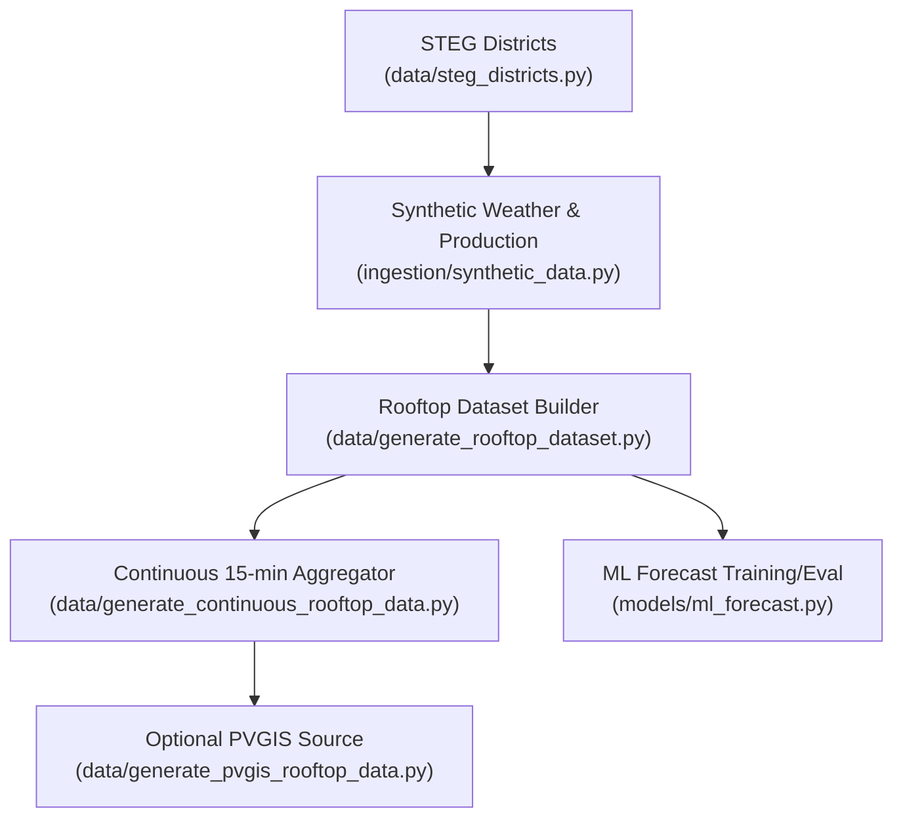
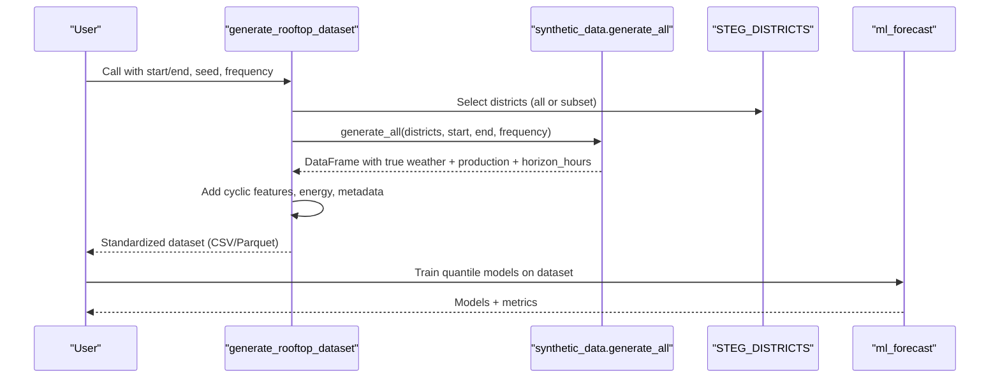
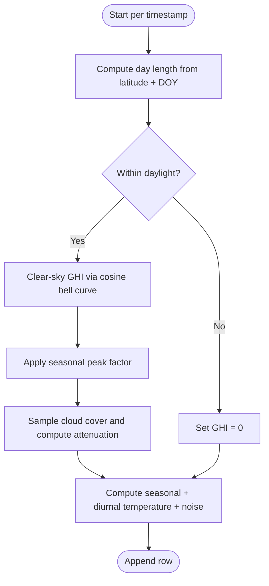
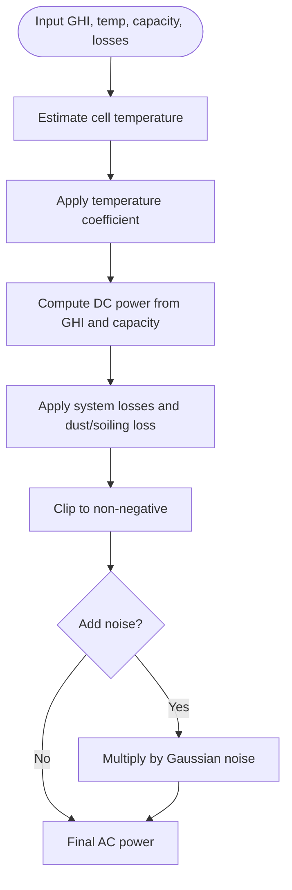
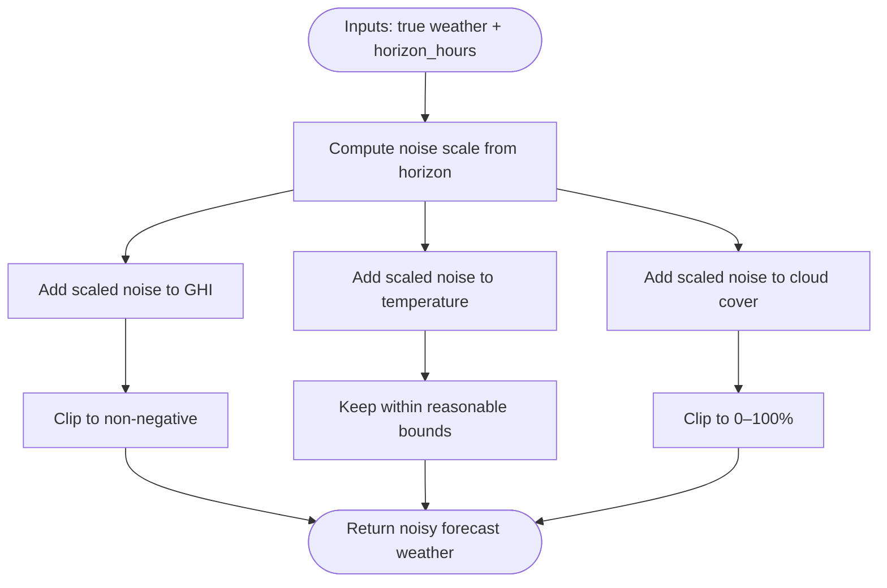
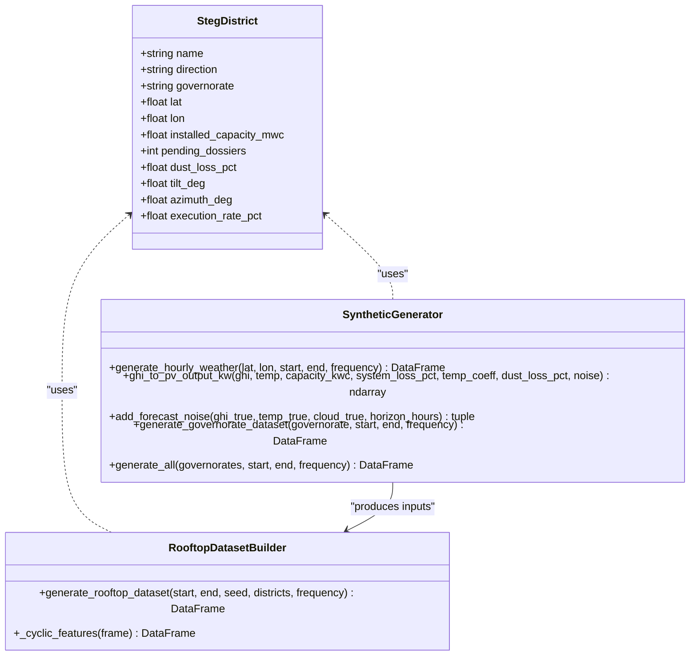
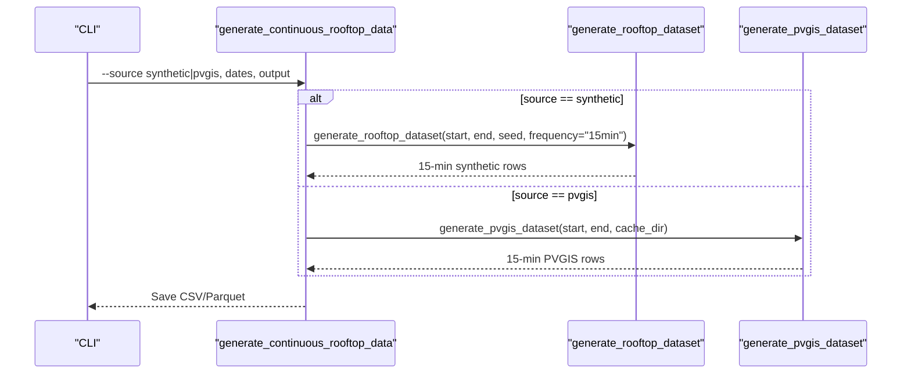
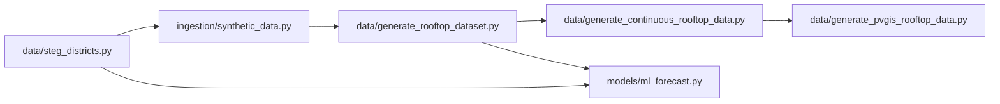

# Synthetic Data Generation

<cite>
**Referenced Files in This Document**
- [ingestion/synthetic_data.py](file://ingestion/synthetic_data.py)
- [data/generate_rooftop_dataset.py](file://data/generate_rooftop_dataset.py)
- [data/generate_continuous_rooftop_data.py](file://data/generate_continuous_rooftop_data.py)
- [data/generate_pvgis_rooftop_data.py](file://data/generate_pvgis_rooftop_data.py)
- [data/steg_districts.py](file://data/steg_districts.py)
- [models/ml_forecast.py](file://models/ml_forecast.py)
- [README.md](file://README.md)
</cite>

## Table of Contents
1. [Introduction](#introduction)
2. [Project Structure](#project-structure)
3. [Core Components](#core-components)
4. [Architecture Overview](#architecture-overview)
5. [Detailed Component Analysis](#detailed-component-analysis)
6. [Dependency Analysis](#dependency-analysis)
7. [Performance Considerations](#performance-considerations)
8. [Troubleshooting Guide](#troubleshooting-guide)
9. [Conclusion](#conclusion)
10. [Appendices](#appendices)

## Introduction
This document explains the synthetic data generation system that powers physics-based production simulations for development and testing. It focuses on how realistic solar production is created with horizon-scaled forecast noise to simulate prediction uncertainty, and how the generated data mimics real-world conditions such as seasonal variations, weather patterns, and equipment degradation effects. It also documents configuration options for generating different scenarios, noise levels, and production profiles, provides usage examples for model training, testing forecast accuracy, and validating system behavior, and discusses the relationship between synthetic data quality and expected real-world performance.

## Project Structure
The synthetic data pipeline is centered around a small set of modules:
- A physics-based generator for hourly weather and PV output per STEG district
- A horizon-aware noise layer that scales forecast uncertainty with lead time
- Dataset builders that wrap the generator into standardized training schemas
- Optional integration with real PVGIS-derived data for comparison or replacement

**Diagram sources**
- [data/steg_districts.py:61-177](file://data/steg_districts.py#L61-L177)
- [ingestion/synthetic_data.py:30-159](file://ingestion/synthetic_data.py#L30-L159)
- [data/generate_rooftop_dataset.py:43-100](file://data/generate_rooftop_dataset.py#L43-L100)
- [data/generate_continuous_rooftop_data.py:21-43](file://data/generate_continuous_rooftop_data.py#L21-L43)
- [data/generate_pvgis_rooftop_data.py:39-105](file://data/generate_pvgis_rooftop_data.py#L39-L105)
- [models/ml_forecast.py:97-152](file://models/ml_forecast.py#L97-L152)

**Section sources**
- [ingestion/synthetic_data.py:1-170](file://ingestion/synthetic_data.py#L1-L170)
- [data/generate_rooftop_dataset.py:1-125](file://data/generate_rooftop_dataset.py#L1-L125)
- [data/generate_continuous_rooftop_data.py:1-48](file://data/generate_continuous_rooftop_data.py#L1-L48)
- [data/generate_pvgis_rooftop_data.py:1-128](file://data/generate_pvgis_rooftop_data.py#L1-L128)
- [data/steg_districts.py:1-247](file://data/steg_districts.py#L1-L247)
- [models/ml_forecast.py:1-267](file://models/ml_forecast.py#L1-L267)
- [README.md:75-145](file://README.md#L75-L145)

## Core Components
- Physics-based weather and production generator:
  - Creates clear-sky GHI with a bell-shaped diurnal profile and seasonal modulation
  - Adds cloud cover attenuation and temperature series with seasonal and diurnal cycles
  - Converts irradiance and temperature to AC power using a single-diode-inspired approximation with temperature derating, system losses, dust/soiling loss, and optional measurement noise
- Horizon-dependent forecast noise:
  - Scales noise in GHI, temperature, and cloud cover by forecast lead time to emulate NWP skill degradation
  - Assigns a random horizon_hours per row so each row represents a forecast issued at varying lead times before the target timestamp
- Dataset assembly:
  - Wraps per-district synthetic series into a unified schema with cyclical time features, capacity metadata, and energy columns
  - Supports both hourly and 15-minute frequencies
  - Provides an entry point to switch between synthetic and PVGIS sources for continuous datasets

Key behaviors:
- Seasonal variation: GHI peak factor varies across the year; temperature has seasonal and diurnal components
- Weather patterns: Cloud cover attenuates clear-sky irradiance; stochastic perturbations add realism
- Equipment degradation: Dust/soiling loss is applied per district; temperature coefficient reduces efficiency at high cell temperatures
- Uncertainty modeling: Noise grows with horizon hours, enabling models to learn widening uncertainty bands

**Section sources**
- [ingestion/synthetic_data.py:21-78](file://ingestion/synthetic_data.py#L21-L78)
- [ingestion/synthetic_data.py:81-116](file://ingestion/synthetic_data.py#L81-L116)
- [ingestion/synthetic_data.py:119-159](file://ingestion/synthetic_data.py#L119-L159)
- [data/generate_rooftop_dataset.py:31-100](file://data/generate_rooftop_dataset.py#L31-L100)

## Architecture Overview
The end-to-end flow from configuration to usable training data:

**Diagram sources**
- [data/generate_rooftop_dataset.py:43-100](file://data/generate_rooftop_dataset.py#L43-L100)
- [ingestion/synthetic_data.py:119-159](file://ingestion/synthetic_data.py#L119-L159)
- [data/steg_districts.py:153-177](file://data/steg_districts.py#L153-L177)
- [models/ml_forecast.py:97-152](file://models/ml_forecast.py#L97-L152)

## Detailed Component Analysis

### Physics-Based Weather Generator
- Clear-sky irradiance:
  - Diurnal bell curve centered near solar noon, zero outside daylight window
  - Seasonal modulation increases summer peaks
- Cloud attenuation:
  - Stochastic cloud cover modulates clear-sky irradiance non-linearly
  - Small multiplicative noise adds variability
- Temperature:
  - Seasonal baseline plus diurnal sine wave plus small noise
- Output:
  - Columns include timestamp, GHI, temperature, and cloud cover percentage

**Diagram sources**
- [ingestion/synthetic_data.py:21-60](file://ingestion/synthetic_data.py#L21-L60)

**Section sources**
- [ingestion/synthetic_data.py:21-60](file://ingestion/synthetic_data.py#L21-L60)

### PV Production Approximation
- Cell temperature derived from ambient temperature and irradiance
- Temperature coefficient reduces output at higher cell temperatures
- System losses and dust/soiling loss reduce DC to AC conversion
- Optional measurement noise added to final AC power

**Diagram sources**
- [ingestion/synthetic_data.py:63-78](file://ingestion/synthetic_data.py#L63-L78)

**Section sources**
- [ingestion/synthetic_data.py:63-78](file://ingestion/synthetic_data.py#L63-L78)

### Horizon-Dependent Forecast Noise
- Real forecasts degrade with lead time; this module models that explicitly
- Noise scale increases linearly with horizon hours
- Applies to GHI, temperature, and cloud cover
- Each row gets a random horizon_hours to simulate varied issuance times

**Diagram sources**
- [ingestion/synthetic_data.py:81-116](file://ingestion/synthetic_data.py#L81-L116)

**Section sources**
- [ingestion/synthetic_data.py:81-116](file://ingestion/synthetic_data.py#L81-L116)

### Dataset Assembly and Schema
- Per-district generation:
  - Produces true production from true weather and district-specific parameters
  - Adds horizon_hours and replaces input weather with noisy versions
- Standardization:
  - Adds cyclic time features (hour sin/cos, day-of-year sin/cos)
  - Computes energy per interval and sets source/version metadata
  - Ensures consistent column set for ML training

**Diagram sources**
- [data/steg_districts.py:61-177](file://data/steg_districts.py#L61-L177)
- [ingestion/synthetic_data.py:30-159](file://ingestion/synthetic_data.py#L30-L159)
- [data/generate_rooftop_dataset.py:31-100](file://data/generate_rooftop_dataset.py#L31-L100)

**Section sources**
- [data/generate_rooftop_dataset.py:43-100](file://data/generate_rooftop_dataset.py#L43-L100)
- [ingestion/synthetic_data.py:119-159](file://ingestion/synthetic_data.py#L119-L159)

### Continuous 15-Minute Aggregation and PVGIS Integration
- The aggregator supports switching between synthetic and PVGIS sources
- For PVGIS:
  - Fetches district-level hourly production and resamples to 15 minutes
  - Adds location identifiers, capacity, orientation, and energy columns
  - Includes cyclic time features
- For synthetic:
  - Uses the rooftop dataset builder with 15-minute frequency

**Diagram sources**
- [data/generate_continuous_rooftop_data.py:21-43](file://data/generate_continuous_rooftop_data.py#L21-L43)
- [data/generate_rooftop_dataset.py:43-100](file://data/generate_rooftop_dataset.py#L43-L100)
- [data/generate_pvgis_rooftop_data.py:39-105](file://data/generate_pvgis_rooftop_data.py#L39-L105)

**Section sources**
- [data/generate_continuous_rooftop_data.py:21-43](file://data/generate_continuous_rooftop_data.py#L21-L43)
- [data/generate_pvgis_rooftop_data.py:39-105](file://data/generate_pvgis_rooftop_data.py#L39-L105)

## Dependency Analysis
- District configuration drives geography, capacity, and dust losses
- Synthetic generator depends on district metadata for per-location weather and production
- Dataset builders depend on the synthetic generator and district metadata to produce standardized training frames
- ML forecasting consumes the standardized schema and uses district capacity/dust lookups for feature enrichment

**Diagram sources**
- [data/steg_districts.py:153-177](file://data/steg_districts.py#L153-L177)
- [ingestion/synthetic_data.py:119-159](file://ingestion/synthetic_data.py#L119-L159)
- [data/generate_rooftop_dataset.py:43-100](file://data/generate_rooftop_dataset.py#L43-L100)
- [data/generate_continuous_rooftop_data.py:21-43](file://data/generate_continuous_rooftop_data.py#L21-L43)
- [data/generate_pvgis_rooftop_data.py:39-105](file://data/generate_pvgis_rooftop_data.py#L39-L105)
- [models/ml_forecast.py:49-94](file://models/ml_forecast.py#L49-L94)

**Section sources**
- [data/steg_districts.py:153-177](file://data/steg_districts.py#L153-L177)
- [models/ml_forecast.py:49-94](file://models/ml_forecast.py#L49-L94)

## Performance Considerations
- Time complexity:
  - Weather generation iterates over timestamps; complexity is O(N) where N is number of intervals
  - Dataset assembly performs vectorized operations and groupby rolling windows; complexity remains close to O(N)
- Memory:
  - Large date ranges can be memory-intensive; consider filtering districts or reducing date spans when prototyping
- Reproducibility:
  - Random seed controls stochastic elements; set seed for deterministic outputs
- I/O:
  - Use Parquet for large datasets to reduce storage and improve read/write speed
- Model training:
  - Extended features (DNI/DHI, wind speed, interaction terms, rolling averages) improve accuracy but increase feature computation cost

[No sources needed since this section provides general guidance]

## Troubleshooting Guide
Common issues and resolutions:
- Empty or invalid date range:
  - Ensure end is later than start; otherwise the PVGIS path raises an error
- Missing columns in downstream code:
  - The ML feature builder fills defaults for optional columns (e.g., DNI/DHI, wind speed); ensure your dataset includes required base columns like GHI, temperature, cloud cover, and timestamps
- Unexpected low coverage or high errors:
  - Verify horizon_hours are present and correctly computed; check that noise scaling matches intended lead-time distribution
  - Confirm dust loss values align with district characteristics; southern districts have higher soiling losses
- Network-related failures with PVGIS:
  - If using PVGIS source, ensure network access or use synthetic source for offline testing

**Section sources**
- [data/generate_pvgis_rooftop_data.py:45-49](file://data/generate_pvgis_rooftop_data.py#L45-L49)
- [models/ml_forecast.py:49-94](file://models/ml_forecast.py#L49-L94)
- [ingestion/synthetic_data.py:119-159](file://ingestion/synthetic_data.py#L119-L159)

## Conclusion
The synthetic data generation system provides a robust, physics-informed foundation for developing and testing solar forecasting pipelines without requiring live metering data. By modeling seasonal cycles, cloud-driven variability, temperature effects, and equipment degradation, it produces realistic production series with horizon-scaled forecast noise that mirrors real-world uncertainty growth. The modular design allows seamless switching between synthetic and PVGIS sources, while standardized schemas enable straightforward model training and evaluation. When used appropriately, synthetic data yields meaningful insights into model behavior and helps validate system performance under diverse conditions.

[No sources needed since this section summarizes without analyzing specific files]

## Appendices

### Configuration Options and Scenarios
- Date range and frequency:
  - Control start/end dates and sampling interval (hourly or 15-minute)
- Seed:
  - Set random seed for reproducibility
- District selection:
  - Generate for all districts or a specified subset
- Source choice:
  - Switch between synthetic and PVGIS for continuous datasets
- Noise and losses:
  - Adjust system losses, temperature coefficients, and dust/soiling losses via district metadata and generator parameters
- Horizon distribution:
  - Horizon hours are randomly assigned per row; distributions influence how models learn uncertainty scaling

**Section sources**
- [data/generate_rooftop_dataset.py:43-100](file://data/generate_rooftop_dataset.py#L43-L100)
- [data/generate_continuous_rooftop_data.py:21-43](file://data/generate_continuous_rooftop_data.py#L21-L43)
- [ingestion/synthetic_data.py:119-159](file://ingestion/synthetic_data.py#L119-L159)
- [data/steg_districts.py:61-177](file://data/steg_districts.py#L61-L177)

### Usage Examples
- Generate synthetic rooftop dataset for model training:
  - Use the rooftop dataset builder with desired start/end, seed, and frequency; save to CSV or Parquet
- Train quantile models and evaluate:
  - Load the generated dataset, train P10/P50/P90 models, and compute overall and horizon-stratified metrics
- Validate system behavior under various conditions:
  - Vary seeds, district subsets, and frequencies to test robustness
  - Compare synthetic vs PVGIS outputs to assess fidelity and identify gaps

**Section sources**
- [data/generate_rooftop_dataset.py:103-125](file://data/generate_rooftop_dataset.py#L103-L125)
- [models/ml_forecast.py:236-267](file://models/ml_forecast.py#L236-L267)
- [README.md:97-117](file://README.md#L97-L117)

### Relationship Between Synthetic Data Quality and Real-World Expectations
- Strengths:
  - Captures key physical drivers (irradiance seasonality, temperature effects, cloud attenuation, soiling losses)
  - Horizon-scaled noise enables learning of realistic uncertainty widening
- Limitations:
  - Synthetic weather does not capture localized microclimates or extreme events present in real observations
  - Aggregated district assumptions smooth individual rooftop geometry effects
- Practical implication:
  - Synthetic data is suitable for pipeline development, unit/integration tests, and initial model validation
  - For production-grade calibration, replace synthetic inputs with real metering and weather data; the shared schema ensures minimal changes

**Section sources**
- [ingestion/synthetic_data.py:1-13](file://ingestion/synthetic_data.py#L1-L13)
- [README.md:131-145](file://README.md#L131-L145)