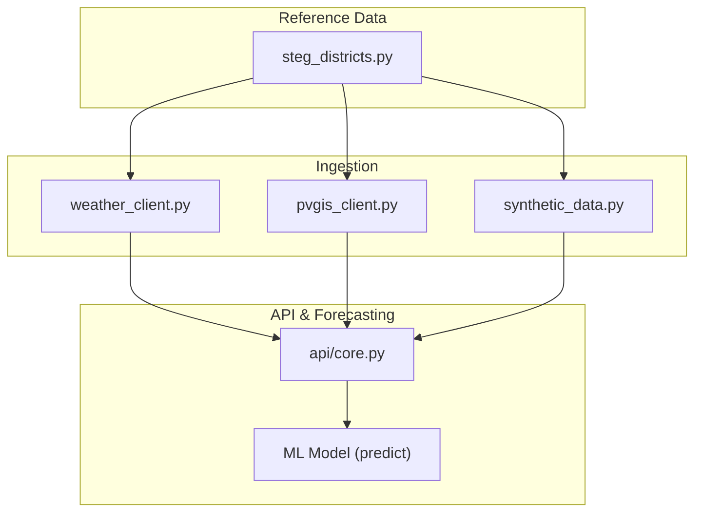
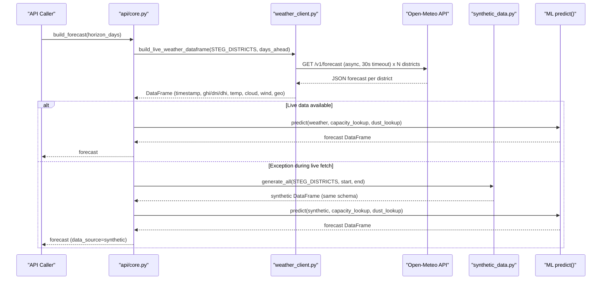
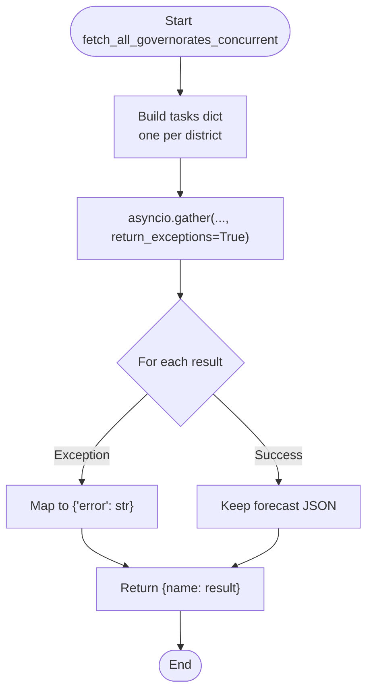
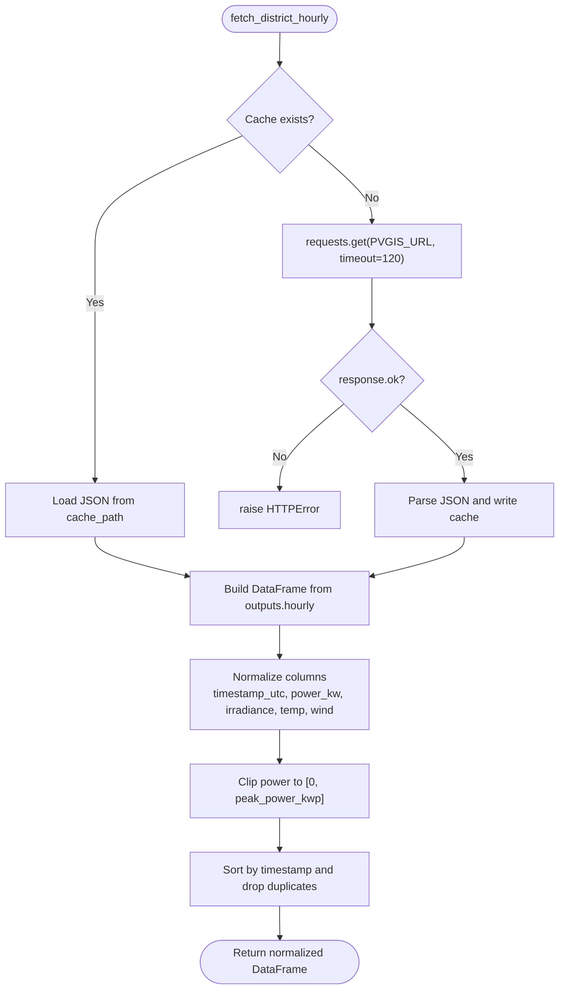
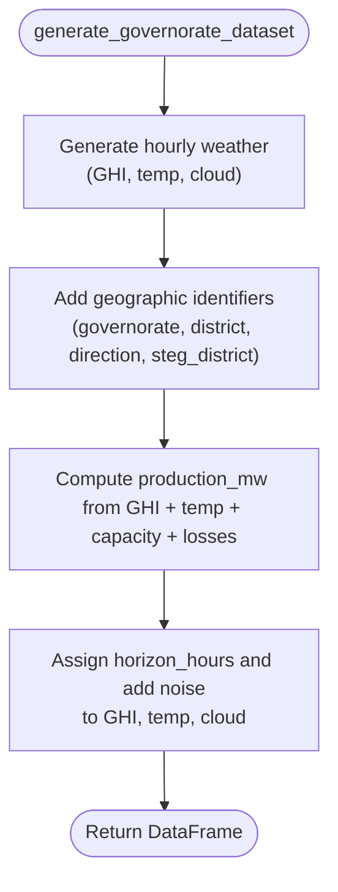
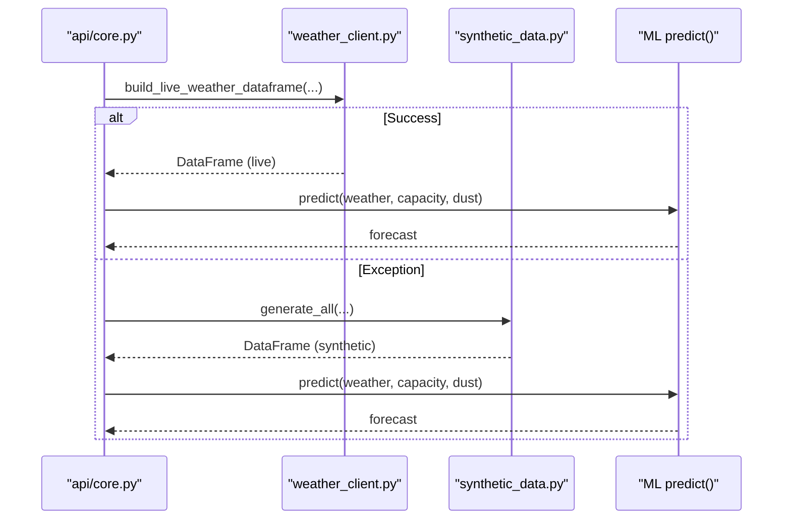
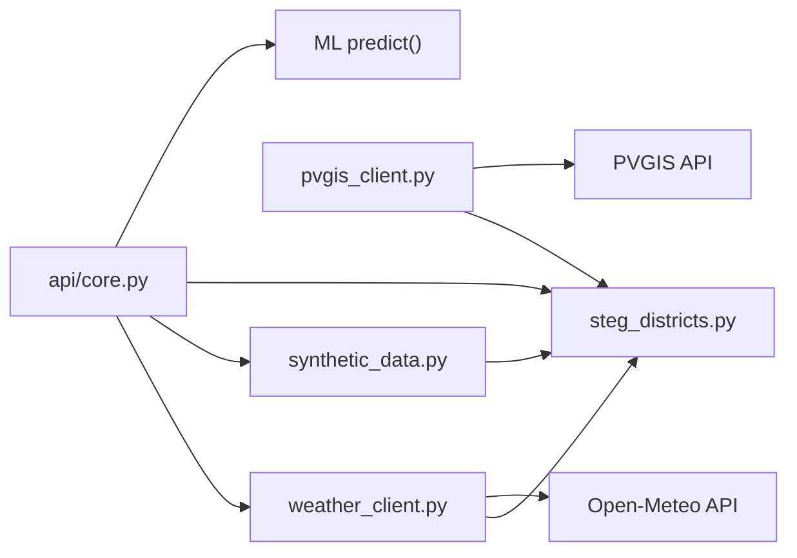

# Weather Data Ingestion

<cite>
**Referenced Files in This Document**
- [weather_client.py](file://ingestion/weather_client.py)
- [pvgis_client.py](file://ingestion/pvgis_client.py)
- [synthetic_data.py](file://ingestion/synthetic_data.py)
- [steg_districts.py](file://data/steg_districts.py)
- [core.py](file://api/core.py)
</cite>

## Table of Contents
1. [Introduction](#introduction)
2. [Project Structure](#project-structure)
3. [Core Components](#core-components)
4. [Architecture Overview](#architecture-overview)
5. [Detailed Component Analysis](#detailed-component-analysis)
6. [Dependency Analysis](#dependency-analysis)
7. [Performance Considerations](#performance-considerations)
8. [Troubleshooting Guide](#troubleshooting-guide)
9. [Conclusion](#conclusion)

## Introduction
This document explains the weather data ingestion system that powers PV generation forecasts across Tunisia’s commercial districts. It focuses on:
- Concurrent fetching from Open-Meteo and PVGIS using async-first patterns
- Connection handling, timeouts, and error recovery with fallback to synthetic data
- Transformation of raw API responses into a standardized DataFrame schema used by downstream forecasting
- Integration points with the main forecasting pipeline and how weather data flows end-to-end

The system is designed to be resilient: if external APIs are unavailable or return incomplete data, it falls back to deterministic synthetic weather so the rest of the platform remains operational.

## Project Structure
At a high level:
- ingestion/weather_client.py provides async concurrent fetching from Open-Meteo and builds a unified DataFrame for all districts
- ingestion/pvgis_client.py fetches historical PV production from PVGIS per district and normalizes it to the shared schema
- ingestion/synthetic_data.py generates realistic synthetic weather and PV output when live data cannot be used
- data/steg_districts.py defines the 50 STEG commercial districts (duck-typed as “governorates” for compatibility)
- api/core.py orchestrates ingestion, caching, and fallback, then feeds weather into the ML forecasting model

**Diagram sources**
- [weather_client.py:53-74](file://ingestion/weather_client.py#L53-L74)
- [pvgis_client.py:27-95](file://ingestion/pvgis_client.py#L27-L95)
- [synthetic_data.py:119-159](file://ingestion/synthetic_data.py#L119-L159)
- [steg_districts.py:61-78](file://data/steg_districts.py#L61-L78)
- [core.py:72-99](file://api/core.py#L72-L99)

**Section sources**
- [weather_client.py:1-180](file://ingestion/weather_client.py#L1-L180)
- [pvgis_client.py:1-96](file://ingestion/pvgis_client.py#L1-L96)
- [synthetic_data.py:1-170](file://ingestion/synthetic_data.py#L1-L170)
- [steg_districts.py:1-247](file://data/steg_districts.py#L1-L247)
- [core.py:1-166](file://api/core.py#L1-L166)

## Core Components
- Async Open-Meteo client:
  - Uses httpx.AsyncClient with a 30-second timeout
  - Fires one request per district concurrently via asyncio.gather
  - Returns a dict mapping district name to either forecast JSON or an error payload
- Live DataFrame builder:
  - Wraps the async fetcher synchronously for callers
  - Normalizes hourly variables into a standard schema including GHI, DNI, DHI, temperature, cloud cover, wind speed, and geographic identifiers
- PVGIS client:
  - Fetches historical hourly PV production per district with caching to disk
  - Normalizes outputs to the same schema used by the forecasting pipeline
- Synthetic generator:
  - Produces realistic weather and PV output series with seasonal cycles, diurnal patterns, and horizon-aware noise
  - Used as a robust fallback when live data is unavailable

**Section sources**
- [weather_client.py:38-74](file://ingestion/weather_client.py#L38-L74)
- [weather_client.py:77-130](file://ingestion/weather_client.py#L77-L130)
- [pvgis_client.py:27-95](file://ingestion/pvgis_client.py#L27-L95)
- [synthetic_data.py:30-60](file://ingestion/synthetic_data.py#L30-L60)
- [synthetic_data.py:119-159](file://ingestion/synthetic_data.py#L119-L159)

## Architecture Overview
The ingestion layer sits between external weather/PV sources and the forecasting pipeline. The API layer attempts live ingestion first; if any exception occurs, it switches to synthetic data. The resulting DataFrame is passed to the ML model to produce forecasts.

**Diagram sources**
- [core.py:72-99](file://api/core.py#L72-L99)
- [weather_client.py:53-74](file://ingestion/weather_client.py#L53-L74)
- [weather_client.py:77-130](file://ingestion/weather_client.py#L77-L130)
- [synthetic_data.py:119-159](file://ingestion/synthetic_data.py#L119-L159)

## Detailed Component Analysis

### Async Open-Meteo Ingestion
- Concurrency pattern:
  - Creates one task per district using httpx.AsyncClient.get
  - Executes all tasks concurrently with asyncio.gather(return_exceptions=True)
  - Total wall-clock time approximates a single request latency regardless of N
- Timeouts and connection handling:
  - AsyncClient uses a 30-second timeout for Open-Meteo requests
  - Errors are captured per-district and returned as {"error": str}
- Data transformation:
  - Maps Open-Meteo hourly fields to standardized columns:
    - shortwave_radiation → ghi_wm2
    - diffuse_radiation → dhi_wm2
    - direct_normal_irradiance → dni_wm2
    - temperature_2m → temp_c
    - cloud_cover → cloud_cover_pct
    - wind_speed_10m → wind_speed_ms
  - Adds geographic identifiers: governorate, district (Direction), steg_district, direction
  - Fills missing values with safe defaults to ensure downstream models receive complete rows

**Diagram sources**
- [weather_client.py:53-74](file://ingestion/weather_client.py#L53-L74)

**Section sources**
- [weather_client.py:38-74](file://ingestion/weather_client.py#L38-L74)
- [weather_client.py:77-130](file://ingestion/weather_client.py#L77-L130)

### PVGIS Historical Production Ingestion
- Purpose:
  - Provides historical hourly PV production per aggregate district for training/validation
- Caching strategy:
  - Reads/writes JSON cache file per district to avoid repeated network calls
- Request parameters:
  - Latitude, longitude, tilt, azimuth (converted to PVGIS aspect), peak power, loss percentage
  - Timeout set to 120 seconds for PVGIS requests
- Response normalization:
  - Converts PVGIS outputs to the shared schema: timestamp_utc, power_kw, ghi_wm2, dni_wm2, dhi_wm2, temp_c, wind_speed_ms, cloud_cover_pct
  - Ensures numeric safety with coercion and fillna(0.0)
  - Clips power to non-negative and upper bound of installed capacity

**Diagram sources**
- [pvgis_client.py:27-95](file://ingestion/pvgis_client.py#L27-L95)

**Section sources**
- [pvgis_client.py:27-95](file://ingestion/pvgis_client.py#L27-L95)

### Synthetic Data Generator (Fallback)
- Generates realistic hourly weather:
  - Seasonal cycle and diurnal bell curve for GHI
  - Cloud cover modeled with noise
  - Temperature with seasonal and diurnal components plus noise
- PV output approximation:
  - Simple physics-based conversion from GHI and temperature to AC power
  - Includes system losses and optional noise
- Horizon-aware noise:
  - Simulates forecast uncertainty increasing with lead time
- Full dataset generation:
  - Produces per-district datasets with consistent schema and metadata (capacity, dust loss, direction)

**Diagram sources**
- [synthetic_data.py:30-60](file://ingestion/synthetic_data.py#L30-L60)
- [synthetic_data.py:63-78](file://ingestion/synthetic_data.py#L63-L78)
- [synthetic_data.py:119-159](file://ingestion/synthetic_data.py#L119-L159)

**Section sources**
- [synthetic_data.py:30-60](file://ingestion/synthetic_data.py#L30-L60)
- [synthetic_data.py:63-78](file://ingestion/synthetic_data.py#L63-L78)
- [synthetic_data.py:119-159](file://ingestion/synthetic_data.py#L119-L159)

### Integration with Forecasting Pipeline
- API orchestration:
  - Attempts live ingestion via weather_client.build_live_weather_dataframe
  - Filters results to the requested horizon window
  - On any exception, switches to synthetic generation for the same window
  - Passes weather DataFrame to ML predict() along with capacity and dust lookups
  - Caches forecast for a short period to reduce redundant computation
- Data source tracking:
  - Records whether the current forecast came from live or synthetic sources

**Diagram sources**
- [core.py:72-99](file://api/core.py#L72-L99)
- [weather_client.py:77-130](file://ingestion/weather_client.py#L77-L130)
- [synthetic_data.py:119-159](file://ingestion/synthetic_data.py#L119-L159)

**Section sources**
- [core.py:72-99](file://api/core.py#L72-L99)

## Dependency Analysis
Key dependencies and relationships:
- weather_client depends on:
  - httpx.AsyncClient for concurrent networking
  - asyncio.gather for parallel execution
  - data.steg_districts for district definitions (duck-typed as governorates)
- pvgis_client depends on:
  - requests for synchronous HTTP
  - pandas for DataFrame construction and normalization
  - filesystem for caching PVGIS payloads
- synthetic_data depends on:
  - numpy and pandas for time series generation
  - data.steg_districts for district metadata
- api/core depends on:
  - ingestion.weather_client and ingestion.synthetic_data
  - data.steg_districts for capacity and dust lookups
  - models.ml_forecast for prediction

**Diagram sources**
- [weather_client.py:53-74](file://ingestion/weather_client.py#L53-L74)
- [pvgis_client.py:27-95](file://ingestion/pvgis_client.py#L27-L95)
- [synthetic_data.py:119-159](file://ingestion/synthetic_data.py#L119-L159)
- [core.py:72-99](file://api/core.py#L72-L99)

**Section sources**
- [weather_client.py:53-74](file://ingestion/weather_client.py#L53-L74)
- [pvgis_client.py:27-95](file://ingestion/pvgis_client.py#L27-L95)
- [synthetic_data.py:119-159](file://ingestion/synthetic_data.py#L119-L159)
- [core.py:72-99](file://api/core.py#L72-L99)

## Performance Considerations
- Parallelism:
  - All 50 districts are fetched concurrently; total latency approximates a single request due to asyncio.gather
- Timeouts:
  - Open-Meteo: 30 seconds per AsyncClient session
  - PVGIS: 120 seconds per request to accommodate larger historical payloads
- Caching:
  - PVGIS payloads cached to disk to avoid repeated network calls
- Schema normalization:
  - Missing values filled with safe defaults to prevent downstream failures
- Caching at API layer:
  - Forecasts are cached for a short window to reduce redundant computation and network usage

[No sources needed since this section provides general guidance]

## Troubleshooting Guide
Common issues and resolutions:
- Network/API unavailability:
  - If Open-Meteo or PVGIS fail, the API layer catches exceptions and falls back to synthetic data automatically
  - Ensure internet connectivity and that external endpoints are reachable
- Timeouts:
  - Open-Meteo requests use a 30-second timeout; consider increasing if network conditions are poor
  - PVGIS requests use a 120-second timeout; large historical ranges may require more time
- Incomplete responses:
  - PVGIS validation checks for required keys; malformed responses raise ValueError
  - Weather DataFrame builder raises RuntimeError if a specific district fetch fails; catch and handle upstream
- Cache corruption:
  - If PVGIS cache becomes invalid, delete the cache file to force a fresh fetch
- Data source verification:
  - The API tracks data_source as "live" or "synthetic"; inspect state to confirm which path was taken

**Section sources**
- [core.py:72-99](file://api/core.py#L72-L99)
- [pvgis_client.py:60-74](file://ingestion/pvgis_client.py#L60-L74)
- [weather_client.py:92-99](file://ingestion/weather_client.py#L92-L99)

## Conclusion
The weather data ingestion system combines async-first concurrency, robust error handling, and a reliable synthetic fallback to ensure continuous operation of the forecasting pipeline. By standardizing outputs into a common DataFrame schema, it enables seamless integration with downstream ML models and dashboards while maintaining resilience against external API failures.

[No sources needed since this section summarizes without analyzing specific files]