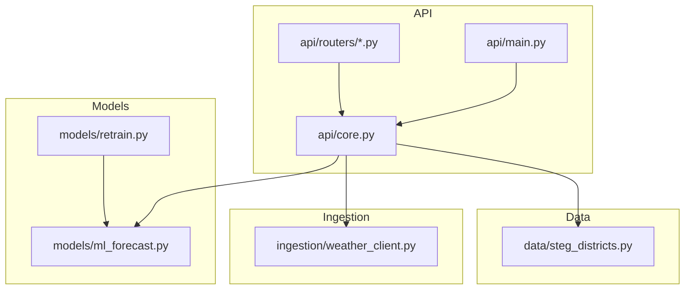
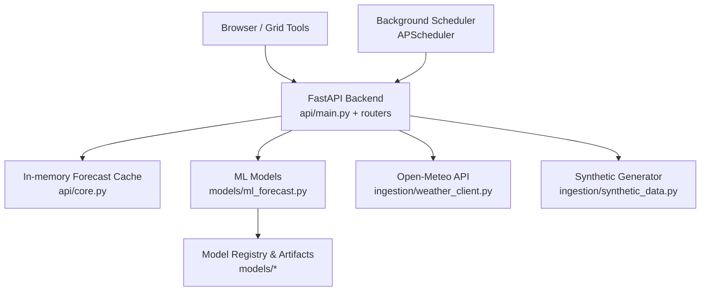
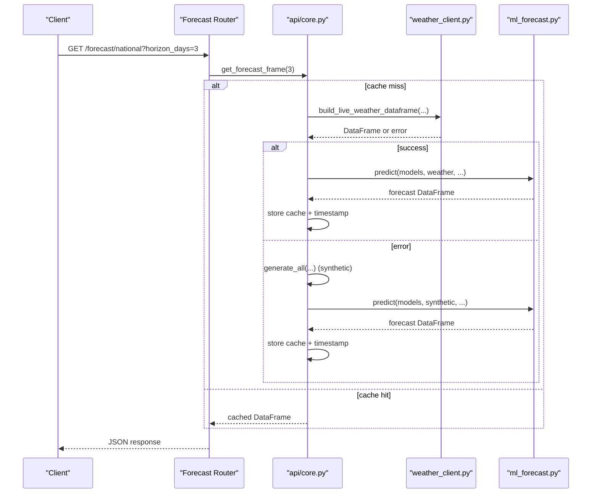
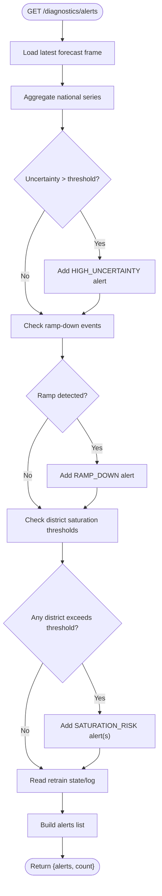
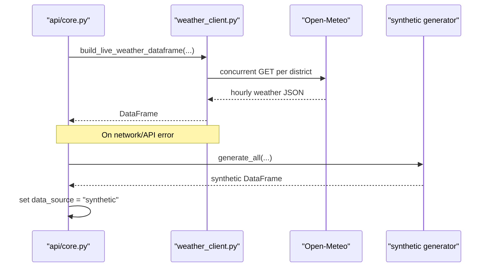
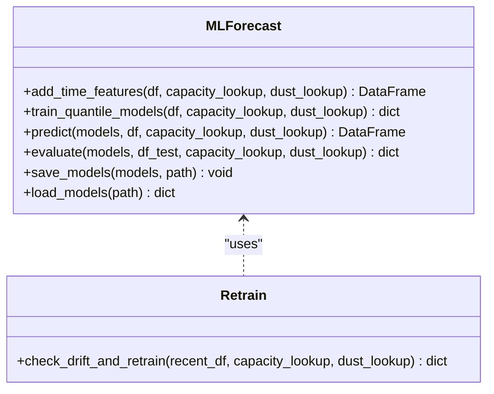
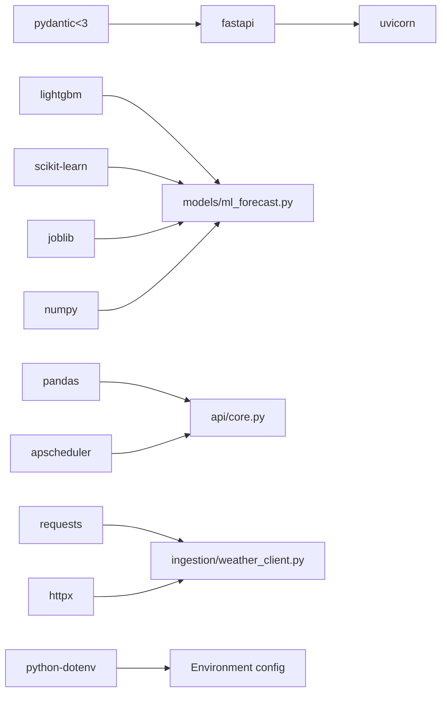

# Deployment Guide

<cite>
**Referenced Files in This Document**
- [requirements.txt](file://requirements.txt)
- [README.md](file://README.md)
- [api/main.py](file://api/main.py)
- [api/core.py](file://api/core.py)
- [api/routers/forecast.py](file://api/routers/forecast.py)
- [api/routers/diagnostics.py](file://api/routers/diagnostics.py)
- [ingestion/weather_client.py](file://ingestion/weather_client.py)
- [models/ml_forecast.py](file://models/ml_forecast.py)
- [models/retrain.py](file://models/retrain.py)
- [data/steg_districts.py](file://data/steg_districts.py)
- [BUILD_PROMPT.md](file://BUILD_PROMPT.md)
</cite>

## Table of Contents
1. [Introduction](#introduction)
2. [Project Structure](#project-structure)
3. [Core Components](#core-components)
4. [Architecture Overview](#architecture-overview)
5. [Detailed Component Analysis](#detailed-component-analysis)
6. [Dependency Analysis](#dependency-analysis)
7. [Performance Considerations](#performance-considerations)
8. [Troubleshooting Guide](#troubleshooting-guide)
9. [Conclusion](#conclusion)
10. [Appendices](#appendices)

## Introduction
This guide provides production deployment instructions for the National Rooftop PV Forecast Platform, a FastAPI-based service that forecasts aggregated rooftop solar production across Tunisia’s districts and governorates with calibrated uncertainty bands. It covers environment setup, containerization, orchestration, configuration management, monitoring, scaling, security, backup and disaster recovery, maintenance, performance tuning, and capacity planning.

The platform:
- Serves forecasts via REST endpoints (FastAPI).
- Loads ML models from disk and caches recent forecasts.
- Ingests live weather data from Open-Meteo with synthetic fallback.
- Supports scheduled forecast refresh and model retraining.
- Exposes diagnostics and alerts for operational visibility.

**Section sources**
- [README.md:1-150](file://README.md#L1-L150)

## Project Structure
At a high level, the application is organized into:
- API layer: FastAPI app, routers, shared state, lifecycle, and background scheduling.
- Data ingestion: Weather clients for live and historical data.
- Models: ML training, inference, evaluation, and model registry utilities.
- Reports and results: Historical imports, metrics, and artifacts.
- Dashboard: Static frontend assets served alongside or separately.

**Diagram sources**
- [api/main.py:1-42](file://api/main.py#L1-L42)
- [api/core.py:1-166](file://api/core.py#L1-L166)
- [ingestion/weather_client.py:1-180](file://ingestion/weather_client.py#L1-L180)
- [models/ml_forecast.py:1-267](file://models/ml_forecast.py#L1-L267)
- [models/retrain.py:1-115](file://models/retrain.py#L1-L115)
- [data/steg_districts.py:1-247](file://data/steg_districts.py#L1-L247)

**Section sources**
- [README.md:75-95](file://README.md#L75-L95)

## Core Components
- API entrypoint and middleware: FastAPI app with CORS and router registration.
- Shared state and lifecycle: Model loading, forecast caching, background scheduler, and health-related helpers.
- Forecast endpoints: National, district, direction, governorate, map, export, and refresh.
- Diagnostics and alerts: Metrics, validation status, and alert aggregation.
- Weather ingestion: Concurrent async fetching from Open-Meteo with fallback to synthetic data.
- ML forecasting: Quantile gradient boosting models for P10/P50/P90 with feature engineering and evaluation.
- Continuous learning: Drift detection and automatic retraining with model registry.

Key runtime behaviors:
- The API loads models once at startup and caches forecasts for a short window.
- If live weather fetch fails, it falls back to synthetic data and marks the data source accordingly.
- Background jobs refresh forecasts periodically and can trigger daily retraining.

**Section sources**
- [api/main.py:10-42](file://api/main.py#L10-L42)
- [api/core.py:29-166](file://api/core.py#L29-L166)
- [api/routers/forecast.py:21-203](file://api/routers/forecast.py#L21-L203)
- [api/routers/diagnostics.py:1-137](file://api/routers/diagnostics.py#L1-L137)
- [ingestion/weather_client.py:1-180](file://ingestion/weather_client.py#L1-L180)
- [models/ml_forecast.py:1-267](file://models/ml_forecast.py#L1-L267)
- [models/retrain.py:1-115](file://models/retrain.py#L1-L115)

## Architecture Overview
The deployed system consists of a FastAPI backend serving forecasts and diagnostics, a static dashboard, and external weather services.

**Diagram sources**
- [api/main.py:10-42](file://api/main.py#L10-L42)
- [api/core.py:55-166](file://api/core.py#L55-L166)
- [ingestion/weather_client.py:53-130](file://ingestion/weather_client.py#L53-L130)
- [models/ml_forecast.py:227-233](file://models/ml_forecast.py#L227-L233)

## Detailed Component Analysis

### API Lifecycle and Forecast Caching
- The lifespan initializes imported snapshots and starts a background scheduler for periodic forecast refresh and daily retraining.
- Forecast computation uses a lock and caches results for a short time window; subsequent requests within the window return cached data.
- Live weather is fetched concurrently; on failure, synthetic data is used and the data source is recorded.

**Diagram sources**
- [api/routers/forecast.py:25-32](file://api/routers/forecast.py#L25-L32)
- [api/core.py:72-99](file://api/core.py#L72-L99)
- [ingestion/weather_client.py:77-130](file://ingestion/weather_client.py#L77-L130)
- [models/ml_forecast.py:118-131](file://models/ml_forecast.py#L118-L131)

**Section sources**
- [api/core.py:142-166](file://api/core.py#L142-L166)
- [api/routers/forecast.py:25-32](file://api/routers/forecast.py#L25-L32)

### Diagnostics and Alerts
- The diagnostics router aggregates alerts based on forecast uncertainty, ramp events, saturation risks, and retraining status.
- Metrics and validation endpoints expose model performance and history summaries when available.

**Diagram sources**
- [api/routers/diagnostics.py:17-80](file://api/routers/diagnostics.py#L17-L80)

**Section sources**
- [api/routers/diagnostics.py:17-137](file://api/routers/diagnostics.py#L17-L137)

### Weather Ingestion and Fallback
- Live weather is fetched concurrently per location using an async client; errors are captured and raised for callers to handle.
- The API catches exceptions and falls back to synthetic generation, marking the data source as synthetic.

**Diagram sources**
- [ingestion/weather_client.py:53-130](file://ingestion/weather_client.py#L53-L130)
- [api/core.py:80-99](file://api/core.py#L80-L99)

**Section sources**
- [ingestion/weather_client.py:1-180](file://ingestion/weather_client.py#L1-L180)
- [api/core.py:80-99](file://api/core.py#L80-L99)

### Model Training, Evaluation, and Retraining
- Models are trained with quantile regression for P10/P50/P90, with extended features and guardrails against quantile crossing.
- Retraining checks drift by comparing model MAE to persistence baseline; if degraded beyond threshold, trains candidate models and promotes if better.

**Diagram sources**
- [models/ml_forecast.py:49-131](file://models/ml_forecast.py#L49-L131)
- [models/retrain.py:40-104](file://models/retrain.py#L40-L104)

**Section sources**
- [models/ml_forecast.py:97-131](file://models/ml_forecast.py#L97-L131)
- [models/retrain.py:40-115](file://models/retrain.py#L40-L115)

### Configuration Management
- API key authentication is enforced via a header; the key is read from an environment variable.
- CORS is currently permissive; for production, restrict allowed origins to known domains.
- Paths for models and results are derived relative to the project root; ensure these paths exist and are writable in production.
- External base URLs and other settings are recommended to be managed via environment variables per the build guidance.

Recommended environment variables:
- PRESOL_API_KEY: API key for protected endpoints.
- OPEN_METEO_BASE_URL: Base URL for Open-Meteo (optional override).
- PVGIS_BASE_URL: Base URL for PVGIS (optional override).
- CORS_ALLOWED_ORIGINS: Comma-separated allow-list for CORS.
- MODEL_PATH: Absolute path to model artifact file.
- LOG_LEVEL: Logging verbosity.

Operational notes:
- Ensure the model artifact exists before starting the API; otherwise, forecast endpoints will fail gracefully with appropriate status codes.
- Use a reverse proxy to enforce HTTPS and manage CORS explicitly.

**Section sources**
- [api/core.py:45-52](file://api/core.py#L45-L52)
- [api/main.py:29-34](file://api/main.py#L29-L34)
- [BUILD_PROMPT.md:65-97](file://BUILD_PROMPT.md#L65-L97)

## Dependency Analysis
Runtime dependencies include Python packages for data processing, ML, web serving, and scheduling.

**Diagram sources**
- [requirements.txt:1-15](file://requirements.txt#L1-L15)
- [api/core.py:142-166](file://api/core.py#L142-L166)
- [ingestion/weather_client.py:17-24](file://ingestion/weather_client.py#L17-L24)
- [models/ml_forecast.py:24-27](file://models/ml_forecast.py#L24-L27)

**Section sources**
- [requirements.txt:1-15](file://requirements.txt#L1-L15)

## Performance Considerations
- Forecast caching: The API caches forecasts for a short window to reduce repeated weather fetches and model inference. Tune cache TTL based on traffic patterns.
- Concurrency: Weather fetching is concurrent; ensure outbound network limits and DNS resolution are optimized in your deployment environment.
- Model size and load time: Keep model artifacts small and pre-warm the process to avoid cold-start latency on first request.
- Background jobs: Schedule forecast refresh and retraining during off-peak hours to minimize contention.
- Export endpoints: CSV/XML streaming avoids large in-memory payloads; consider rate limiting heavy exports.

[No sources needed since this section provides general guidance]

## Troubleshooting Guide
Common issues and resolutions:
- Missing model artifact: Ensure the model file exists at the configured path; if missing, return a clear 503 and log the issue.
- Weather API failures: The API falls back to synthetic data; verify network connectivity and upstream availability.
- CORS errors: Restrict allowed origins to your frontend domain; update proxy and backend CORS settings accordingly.
- Authentication failures: Validate the X-API-Key header matches the configured key; ensure secrets are correctly injected.
- Scheduler not running: Confirm APScheduler is installed; if absent, background refresh is disabled and must be handled externally.

Health and readiness:
- Implement a dedicated health endpoint returning status, model loaded flag, and data source indicator for orchestrators and probes.
- Use diagnostics endpoints to inspect alerts, metrics, and model validation status.

**Section sources**
- [api/routers/diagnostics.py:102-137](file://api/routers/diagnostics.py#L102-L137)
- [api/core.py:142-166](file://api/core.py#L142-L166)
- [BUILD_PROMPT.md:72-81](file://BUILD_PROMPT.md#L72-L81)

## Conclusion
This deployment guide outlines how to run the National Rooftop PV Forecast Platform in production with robust configuration, monitoring, and scaling strategies. By leveraging FastAPI’s capabilities, caching, background scheduling, and external weather services, the platform delivers reliable forecasts with calibrated uncertainty. Follow the security hardening, backup, and maintenance recommendations to ensure long-term stability and performance.

[No sources needed since this section summarizes without analyzing specific files]

## Appendices

### Environment Configuration Checklist
- Set PRESOL_API_KEY and protect sensitive endpoints.
- Configure CORS_ALLOWED_ORIGINS to restrict browser access to trusted domains.
- Provide MODEL_PATH pointing to a valid model artifact.
- Pin dependency versions in requirements.txt and use a reproducible build image.
- Use a reverse proxy for HTTPS termination and request buffering.

**Section sources**
- [api/core.py:45-52](file://api/core.py#L45-L52)
- [api/main.py:29-34](file://api/main.py#L29-L34)
- [BUILD_PROMPT.md:65-97](file://BUILD_PROMPT.md#L65-L97)

### Containerization Options
- Use a minimal Python base image, install pinned dependencies, copy code and model artifacts, and run uvicorn bound to 0.0.0.0.
- Expose the API port and configure environment variables via container orchestration.
- Include health check commands that call a dedicated /health endpoint.

[No sources needed since this section provides general guidance]

### Orchestration with Kubernetes
- Deploy the API as a Deployment with resource requests/limits suitable for model loading and inference.
- Use Probes: liveness for process health, readiness for model loaded and cache warm-up.
- Store model artifacts and results in persistent volumes or mount them via configmaps/secrets where appropriate.
- Configure Horizontal Pod Autoscaler based on CPU/memory or custom metrics like request rate and latency.

[No sources needed since this section provides general guidance]

### Cloud Deployment Strategies
- Host the backend on a platform supporting long-running processes (e.g., VPS with Docker, managed containers).
- Serve the static dashboard from a CDN or static hosting provider.
- Manage secrets via cloud secret managers and inject them at runtime.

[No sources needed since this section provides general guidance]

### Monitoring and Logging
- Enable structured logging for requests, forecast generation, and scheduler tasks.
- Expose metrics via a standard endpoint or integrate with a metrics collector.
- Use diagnostics endpoints to surface alerts, model validation, and history summaries.

[No sources needed since this section provides general guidance]

### Scaling Considerations
- Increase replicas behind a load balancer to handle increased forecast requests.
- Scale out background workers for retraining and data ingestion if needed.
- Monitor external API rate limits and implement retries/backoff for weather services.

[No sources needed since this section provides general guidance]

### Security Hardening
- Enforce HTTPS via reverse proxy.
- Restrict CORS to known domains.
- Protect endpoints with API keys and consider additional auth mechanisms.
- Limit exposure of internal endpoints (e.g., diagnostics) to trusted networks.

**Section sources**
- [api/main.py:29-34](file://api/main.py#L29-L34)
- [api/core.py:45-52](file://api/core.py#L45-L52)
- [BUILD_PROMPT.md:72-81](file://BUILD_PROMPT.md#L72-L81)

### Backup and Disaster Recovery
- Back up model artifacts, results directories, and any local databases used by reports.
- Version control model artifacts and metadata; maintain rollback procedures.
- Test restoration procedures regularly to ensure business continuity.

[No sources needed since this section provides general guidance]

### Maintenance Tasks
- Periodically validate model performance and retrain when drift is detected.
- Update dependencies and security patches regularly.
- Review logs and alerts for anomalies; adjust thresholds as needed.

**Section sources**
- [models/retrain.py:40-115](file://models/retrain.py#L40-L115)
- [api/routers/diagnostics.py:17-80](file://api/routers/diagnostics.py#L17-L80)

### Capacity Planning Guidance
- Estimate peak request rates and model inference costs to size compute resources.
- Plan for weather API throughput and potential throttling.
- Size storage for results, logs, and model artifacts based on retention policies.

[No sources needed since this section provides general guidance]