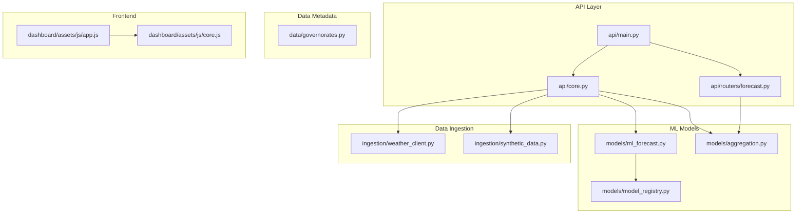
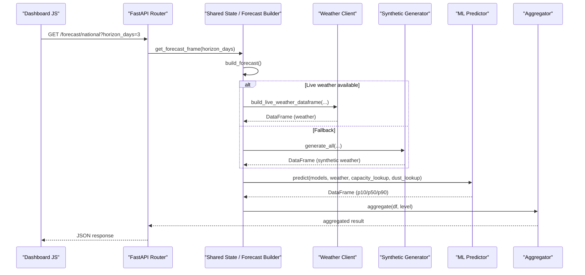
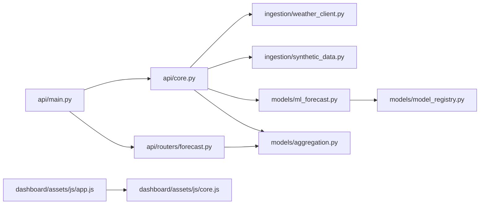

# Codebase Navigation & Conventions

<cite>
**Referenced Files in This Document**
- [README.md](file://README.md)
- [requirements.txt](file://requirements.txt)
- [api/main.py](file://api/main.py)
- [api/core.py](file://api/core.py)
- [api/routers/forecast.py](file://api/routers/forecast.py)
- [models/ml_forecast.py](file://models/ml_forecast.py)
- [models/aggregation.py](file://models/aggregation.py)
- [models/model_registry.py](file://models/model_registry.py)
- [ingestion/weather_client.py](file://ingestion/weather_client.py)
- [ingestion/synthetic_data.py](file://ingestion/synthetic_data.py)
- [data/governorates.py](file://data/governorates.py)
- [dashboard/assets/js/app.js](file://dashboard/assets/js/app.js)
- [dashboard/assets/js/core.js](file://dashboard/assets/js/core.js)
</cite>

## Table of Contents
1. Introduction
2. Project Structure
3. Core Components
4. Architecture Overview
5. Detailed Component Analysis
6. Dependency Analysis
7. Performance Considerations
8. Troubleshooting Guide
9. Conclusion
10. Appendices

## Introduction
This document explains how to navigate and understand the National Rooftop PV Forecast Platform codebase. It focuses on modular architecture, coding conventions, naming patterns, and architectural patterns used across the API layer, ML models, data ingestion, and frontend components. The goal is to help you locate functionality quickly and understand how components relate to each other.

The platform forecasts aggregated rooftop PV production at district, governorate, and national levels with calibrated uncertainty (P10/P50/P90), serves results via a REST API, and visualizes them through an interactive dashboard.

**Section sources**
- [README.md:1-31](file://README.md#L1-L31)

## Project Structure
At a high level, the repository is organized by responsibility:
- api: FastAPI application, shared state, lifecycle, and route modules
- models: ML training, prediction, evaluation, aggregation, and model registry
- ingestion: Weather data clients (real and synthetic)
- data: Geographic and capacity metadata shims and utilities
- report/reports: Report generation and Prosol-related processing
- results: Model artifacts, evaluations, and historical outputs
- dashboard: Static HTML pages and JavaScript modules for the UI

**Diagram sources**
- [api/main.py:10-41](file://api/main.py#L10-L41)
- [api/core.py:55-99](file://api/core.py#L55-L99)
- [api/routers/forecast.py:21-186](file://api/routers/forecast.py#L21-L186)
- [models/ml_forecast.py:24-131](file://models/ml_forecast.py#L24-L131)
- [models/aggregation.py:20-89](file://models/aggregation.py#L20-L89)
- [models/model_registry.py:1-161](file://models/model_registry.py#L1-L161)
- [ingestion/weather_client.py:17-130](file://ingestion/weather_client.py#L17-L130)
- [ingestion/synthetic_data.py:15-159](file://ingestion/synthetic_data.py#L15-L159)
- [data/governorates.py:1-46](file://data/governorates.py#L1-L46)
- [dashboard/assets/js/app.js:1-18](file://dashboard/assets/js/app.js#L1-L18)
- [dashboard/assets/js/core.js:16-18](file://dashboard/assets/js/core.js#L16-L18)

**Section sources**
- [README.md:75-95](file://README.md#L75-L95)

## Core Components
- API entrypoint and routing:
  - Application initialization, CORS, and router registration live in the API module. Routes are grouped by domain under routers.
  - Shared state, caching, background scheduling, and forecast building are centralized for reuse across routes.
- ML forecasting:
  - Quantile gradient boosting trains P10/P50/P90 models per horizon and predicts with monotonicity enforcement.
  - Aggregation rolls up per-district forecasts to direction and national levels with uncertainty band combination.
- Data ingestion:
  - Real-time weather via Open-Meteo and historical irradiance via PVGIS; concurrent fetching across districts.
  - Synthetic generator provides offline-capable, physics-based weather and production series when live data is unavailable.
- Frontend:
  - Modular JavaScript loaded dynamically per page; shared core utilities, i18n, chart helpers, and status polling.

Key responsibilities and interactions:
- API requests trigger forecast computation using cached or fresh weather data, then aggregate and return JSON.
- Background jobs refresh forecasts periodically and can trigger retraining based on drift detection.
- Dashboard consumes API endpoints to render charts, maps, alerts, and reports.

**Section sources**
- [api/main.py:10-41](file://api/main.py#L10-L41)
- [api/core.py:55-166](file://api/core.py#L55-L166)
- [models/ml_forecast.py:24-131](file://models/ml_forecast.py#L24-L131)
- [models/aggregation.py:20-89](file://models/aggregation.py#L20-L89)
- [ingestion/weather_client.py:17-130](file://ingestion/weather_client.py#L17-L130)
- [ingestion/synthetic_data.py:15-159](file://ingestion/synthetic_data.py#L15-L159)
- [dashboard/assets/js/app.js:1-18](file://dashboard/assets/js/app.js#L1-L18)
- [dashboard/assets/js/core.js:507-573](file://dashboard/assets/js/core.js#L507-L573)

## Architecture Overview
The system follows a layered architecture:
- Presentation layer: static HTML + JS dashboard consuming REST endpoints.
- API layer: FastAPI routes exposing forecast, grid integration, learning, diagnostics, and reports.
- Domain services: shared state, caching, scheduling, and business logic for forecast building.
- ML layer: feature engineering, quantile regression models, evaluation, and aggregation.
- Data layer: ingestion from real APIs or synthetic generators, plus geographic metadata.

**Diagram sources**
- [api/routers/forecast.py:25-32](file://api/routers/forecast.py#L25-L32)
- [api/core.py:72-99](file://api/core.py#L72-L99)
- [ingestion/weather_client.py:77-130](file://ingestion/weather_client.py#L77-L130)
- [ingestion/synthetic_data.py:157-159](file://ingestion/synthetic_data.py#L157-L159)
- [models/ml_forecast.py:118-131](file://models/ml_forecast.py#L118-L131)
- [models/aggregation.py:26-89](file://models/aggregation.py#L26-L89)

## Detailed Component Analysis

### API Layer
- Entrypoint registers middleware and includes routers for forecast, grid integration, learning, diagnostics, and reports.
- Shared state manages model loading, cache freshness, capacity/dust lookups, and background scheduling.
- Forecast building attempts live weather first; falls back to synthetic if network/API fails. Results are cached for a short window.

Key behaviors:
- Cache invalidation and refresh via endpoint or scheduled job.
- Bias correction applied to intraday forecasts when recent metering buffer exists.
- Export endpoints support CSV/XML streaming for grid integration.

**Section sources**
- [api/main.py:10-41](file://api/main.py#L10-L41)
- [api/core.py:55-166](file://api/core.py#L55-L166)
- [api/routers/forecast.py:25-186](file://api/routers/forecast.py#L25-L186)

### ML Models
- Feature engineering adds time features, capacity/dust mappings, extended weather features, rolling averages, and horizon hours.
- Training uses LightGBM quantile regression for P10/P50/P90; predictions enforce non-crossing quantiles.
- Evaluation computes MAE, nRMSE, and coverage; horizon-aware backtests compare against persistence and clear-sky baselines.
- Aggregation combines uncertainty bands assuming partial independence across districts.

Patterns:
- Strategy-like separation between feature sets and model types via explicit feature lists and optional columns.
- Factory-like behavior in model loading/saving and registry operations for versioning and promotion.

**Section sources**
- [models/ml_forecast.py:24-131](file://models/ml_forecast.py#L24-L131)
- [models/ml_forecast.py:155-233](file://models/ml_forecast.py#L155-L233)
- [models/aggregation.py:20-89](file://models/aggregation.py#L20-L89)

### Data Ingestion
- Real-time weather client fetches hourly variables concurrently across all districts using async HTTP calls and returns a unified schema DataFrame.
- Synthetic generator produces realistic weather and production series with horizon-dependent noise to simulate NWP skill degradation.

Error handling:
- Network failures raise exceptions; callers catch and fall back to synthetic data.
- Missing columns are filled with defaults to keep downstream code robust.

**Section sources**
- [ingestion/weather_client.py:17-130](file://ingestion/weather_client.py#L17-L130)
- [ingestion/synthetic_data.py:15-159](file://ingestion/synthetic_data.py#L15-L159)

### Frontend
- Module loader dynamically injects page-specific scripts for maintainability.
- Core module centralizes i18n, chart helpers, status polling, and global modal logic.
- Pages initialize specific features based on data-page attributes.

Naming and organization:
- One script per feature area (home, districts, map, performance, alerts, registry, prosol-history).
- Shared constants and utilities reside in core.js; app.js orchestrates module loading.

**Section sources**
- [dashboard/assets/js/app.js:1-18](file://dashboard/assets/js/app.js#L1-L18)
- [dashboard/assets/js/core.js:16-18](file://dashboard/assets/js/core.js#L16-L18)
- [dashboard/assets/js/core.js:507-573](file://dashboard/assets/js/core.js#L507-L573)

### Model Registry
- File-based immutable registry tracks training runs, model versions, and production promotions.
- Promotions validate candidate metrics against current production and copy artifacts safely.

Use cases:
- Track continuous learning runs and ensure only improved candidates become production.
- Provide auditable history of training and model versions.

**Section sources**
- [models/model_registry.py:1-161](file://models/model_registry.py#L1-L161)

## Dependency Analysis
High-level dependencies:
- API depends on shared core for state and forecast building.
- Core depends on ingestion (weather/synthetic) and models (ML predictor and aggregator).
- Routers depend on core and aggregation for responses.
- Frontend depends on API endpoints for data and renders via shared core utilities.

**Diagram sources**
- [api/main.py:10-41](file://api/main.py#L10-L41)
- [api/core.py:55-99](file://api/core.py#L55-L99)
- [api/routers/forecast.py:21-186](file://api/routers/forecast.py#L21-L186)
- [models/ml_forecast.py:24-131](file://models/ml_forecast.py#L24-L131)
- [models/aggregation.py:20-89](file://models/aggregation.py#L20-L89)
- [models/model_registry.py:1-161](file://models/model_registry.py#L1-L161)
- [dashboard/assets/js/app.js:1-18](file://dashboard/assets/js/app.js#L1-L18)
- [dashboard/assets/js/core.js:16-18](file://dashboard/assets/js/core.js#L16-L18)

**Section sources**
- [requirements.txt:1-15](file://requirements.txt#L1-L15)

## Performance Considerations
- Concurrent weather fetching reduces total latency to near single-request time regardless of number of districts.
- Short-lived in-memory cache avoids recomputing forecasts too frequently; background scheduler refreshes periodically.
- Aggregation uses vectorized pandas operations and simple numeric combinations for uncertainty bands.
- Synthetic fallback ensures availability during network outages without blocking the API.

[No sources needed since this section provides general guidance]

## Troubleshooting Guide
Common issues and where to look:
- API key errors: Check header validation and environment variable configuration in shared core.
- Forecast cache staleness: Inspect cache timestamps and force refresh via endpoint.
- Weather fetch failures: Exceptions raised by weather client; ensure network access or rely on synthetic fallback.
- Unknown district/direction: Verify names against lookup tables and error messages returned by routers.
- Model artifact missing: Ensure models are trained and saved to expected paths before starting the API.

**Section sources**
- [api/core.py:45-52](file://api/core.py#L45-L52)
- [api/core.py:72-99](file://api/core.py#L72-L99)
- [ingestion/weather_client.py:77-130](file://ingestion/weather_client.py#L77-L130)
- [api/routers/forecast.py:64-128](file://api/routers/forecast.py#L64-L128)

## Conclusion
This codebase separates concerns cleanly across API, ML, data ingestion, and frontend layers. It employs practical patterns such as layered architecture, strategy-like feature handling, and factory-like model management. The design supports both online and offline operation, provides calibrated uncertainty, and offers a rich dashboard for visualization and operational insights. Use the diagrams and section references to locate functionality quickly and understand component relationships.

[No sources needed since this section summarizes without analyzing specific files]

## Appendices

### Coding Conventions and Naming
- Python:
  - Modules use descriptive snake_case names aligned with responsibilities (e.g., ml_forecast, aggregation, weather_client).
  - Functions and methods use verb-noun patterns (e.g., build_forecast, add_time_features, register_model).
  - Constants and configuration are uppercase with underscores (e.g., HOURLY_VARS, QUANTILES).
  - Classes and data structures use PascalCase (e.g., Governorate, StegDistrict).
  - Error handling raises explicit exceptions with informative messages; callers handle and fallback where appropriate.
- JavaScript:
  - Modular structure with one file per feature; app.js loads modules dynamically.
  - Shared utilities and i18n centralized in core.js; page-specific logic isolated.
  - Constants and design tokens defined centrally; functions use concise, purpose-driven names.
- File organization:
  - Group by domain: api, models, ingestion, data, reports, dashboard.
  - Keep related assets together (CSS, JS, static data under dashboard/assets).
  - Use compatibility shims (e.g., data/governorates.py) to preserve imports while evolving datasets.

[No sources needed since this section provides general guidance]

### Architectural Patterns
- Layered architecture:
  - Presentation (dashboard) → API (FastAPI) → Domain services (core) → ML (models) → Data (ingestion/metadata).
- Strategy pattern for weather sources:
  - Unified interface for weather data; real-time and synthetic implementations interchangeable via shared schema.
- Factory pattern for model management:
  - Model registry abstracts creation, versioning, and promotion of models behind consistent functions.

[No sources needed since this section provides general guidance]

### How to Locate Functionality
- To find forecast endpoints: check api/routers/forecast.py for route definitions and query parameters.
- To understand forecast computation: inspect api/core.py for build_forecast and models/ml_forecast.py for prediction and feature engineering.
- To modify aggregation levels: update models/aggregation.py and ensure routers pass correct levels.
- To change weather source behavior: adjust ingestion/weather_client.py or ingestion/synthetic_data.py; ensure schema remains compatible.
- To extend dashboard features: add a new JS module and include it in app.js; implement logic in core.js for shared utilities.

[No sources needed since this section provides general guidance]