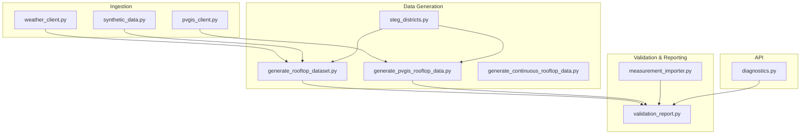
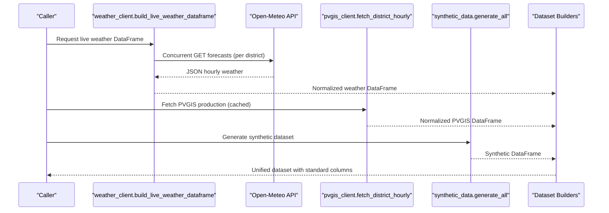
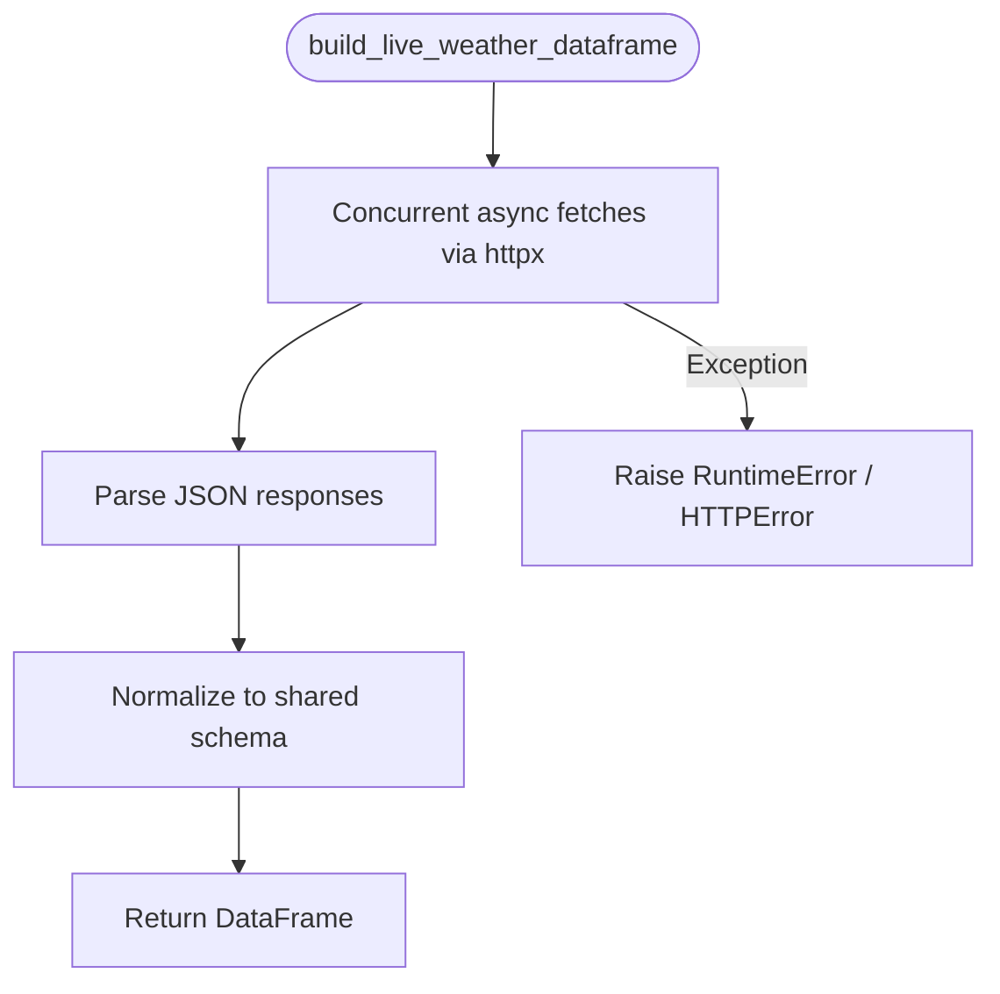
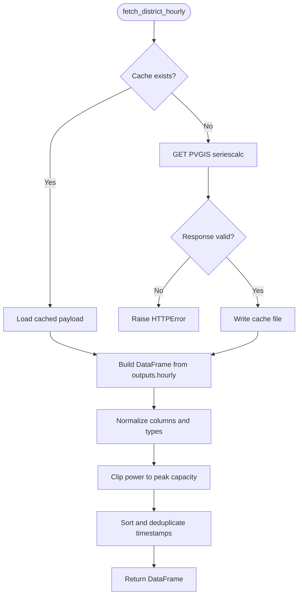
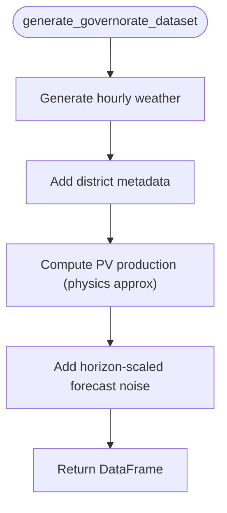
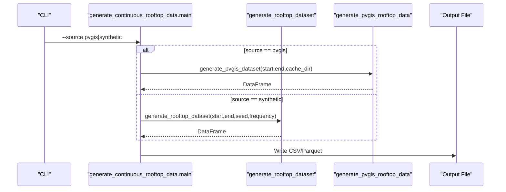
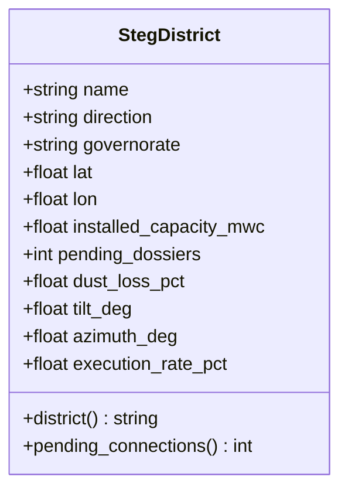
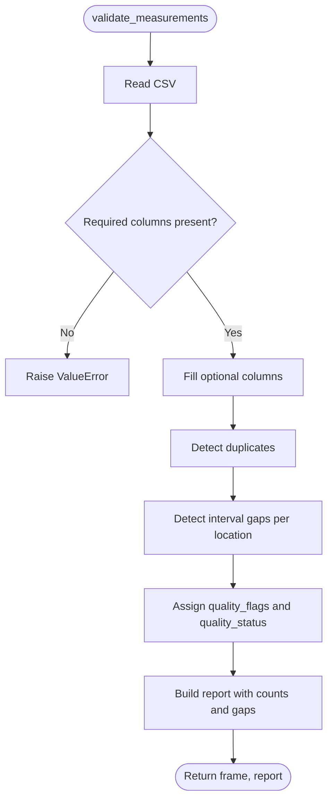
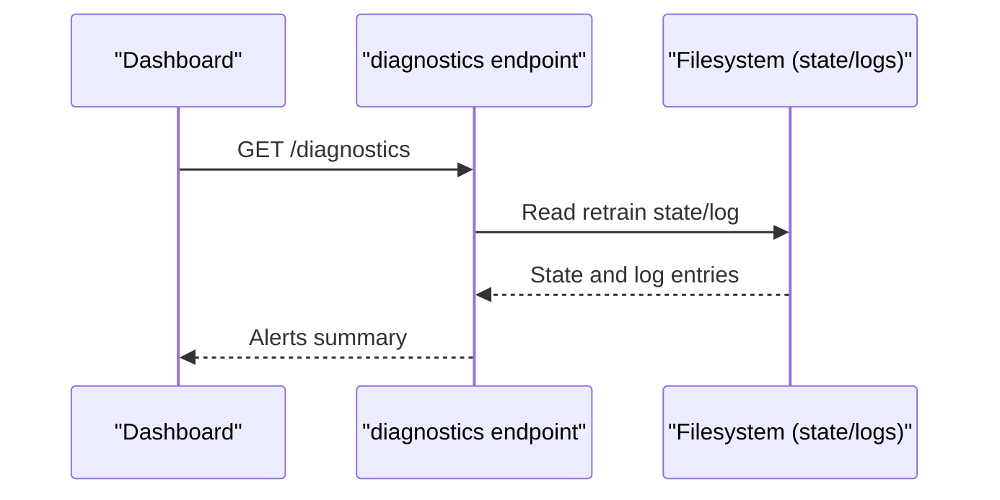
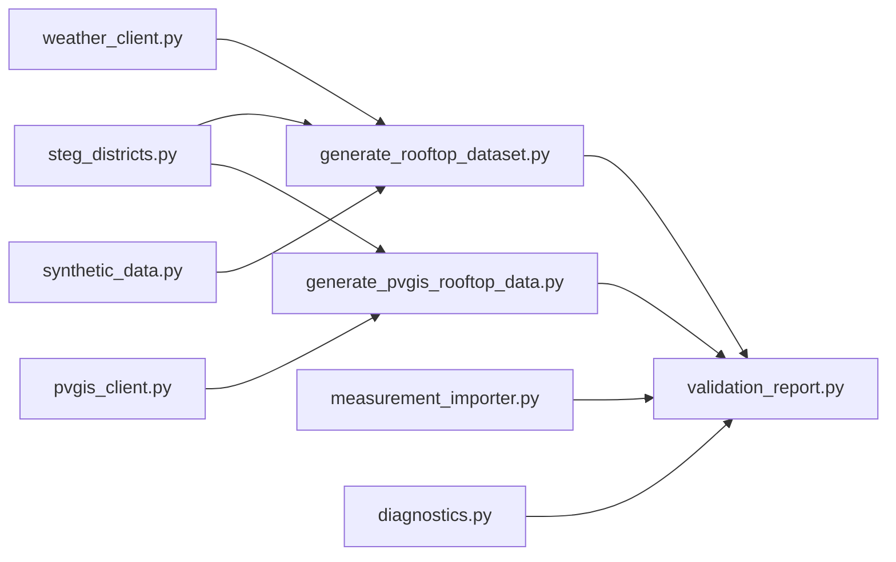

# Data Pipeline Extensions

<cite>
**Referenced Files in This Document**
- [weather_client.py](file://ingestion/weather_client.py)
- [pvgis_client.py](file://ingestion/pvgis_client.py)
- [synthetic_data.py](file://ingestion/synthetic_data.py)
- [generate_rooftop_dataset.py](file://data/generate_rooftop_dataset.py)
- [generate_pvgis_rooftop_data.py](file://data/generate_pvgis_rooftop_data.py)
- [generate_continuous_rooftop_data.py](file://data/generate_continuous_rooftop_data.py)
- [steg_districts.py](file://data/steg_districts.py)
- [measurement_importer.py](file://reports/measurement_importer.py)
- [validation_report.py](file://models/validation_report.py)
- [diagnostics.py](file://api/routers/diagnostics.py)
- [README.md](file://README.md)
</cite>

## Table of Contents
1. [Introduction](#introduction)
2. [Project Structure](#project-structure)
3. [Core Components](#core-components)
4. [Architecture Overview](#architecture-overview)
5. [Detailed Component Analysis](#detailed-component-analysis)
6. [Dependency Analysis](#dependency-analysis)
7. [Performance Considerations](#performance-considerations)
8. [Troubleshooting Guide](#troubleshooting-guide)
9. [Conclusion](#conclusion)
10. [Appendices](#appendices)

## Introduction
This document explains how to extend the data pipeline with new weather sources, data transformations, and synthetic data generation. It focuses on the abstraction layers that make it straightforward to integrate new data providers through a consistent interface, how to add new APIs, implement validation and quality checks, and generate realistic synthetic data for development and testing. It also covers error handling, retry strategies, and monitoring hooks to keep extensions robust and observable.

The platform ingests real weather and PV production from Open-Meteo and PVGIS, supports offline synthetic generation, and produces standardized datasets consumed by forecasting and reporting modules. The design intentionally keeps downstream consumers decoupled from provider specifics by normalizing outputs into a shared schema.

**Section sources**
- [README.md:1-150](file://README.md#L1-L150)

## Project Structure
At a high level:
- ingestion/ contains clients for real weather (Open-Meteo/PVGIS) and a synthetic generator.
- data/ contains dataset generators that assemble training and 15-minute aggregate datasets, plus district metadata.
- reports/ includes measurement import and validation utilities.
- models/ provides model loading and validation metrics.
- api/ exposes diagnostics and operational endpoints.

**Diagram sources**
- [weather_client.py:1-180](file://ingestion/weather_client.py#L1-L180)
- [pvgis_client.py:1-96](file://ingestion/pvgis_client.py#L1-L96)
- [synthetic_data.py:1-170](file://ingestion/synthetic_data.py#L1-L170)
- [generate_rooftop_dataset.py:1-125](file://data/generate_rooftop_dataset.py#L1-L125)
- [generate_pvgis_rooftop_data.py:1-128](file://data/generate_pvgis_rooftop_data.py#L1-L128)
- [generate_continuous_rooftop_data.py:1-48](file://data/generate_continuous_rooftop_data.py#L1-L48)
- [steg_districts.py:1-247](file://data/steg_districts.py#L1-L247)
- [measurement_importer.py:1-88](file://reports/measurement_importer.py#L1-L88)
- [validation_report.py:1-87](file://models/validation_report.py#L1-L87)
- [diagnostics.py:52-80](file://api/routers/diagnostics.py#L52-L80)

**Section sources**
- [README.md:75-95](file://README.md#L75-L95)

## Core Components
- Weather client layer:
  - Real-time Open-Meteo forecasts with concurrent fetching across districts.
  - PVGIS historical production per district with caching.
  - A synchronous wrapper to build a normalized DataFrame for downstream use.
- Synthetic data generator:
  - Physics-inspired hourly weather and PV output with horizon-scaled forecast noise.
  - District-level aggregation using STEG district metadata.
- Dataset builders:
  - Historical-style training dataset generator (synthetic).
  - PVGIS-derived 15-minute aggregate dataset generator.
  - Unified entry point to choose source (PVGIS or synthetic).
- Validation and quality:
  - Measurement importer validates columns, detects duplicates, gaps, and flags rows.
  - Validation report computes train vs validation metrics and coverage.
- Diagnostics:
  - Operational alerts for retraining status and drift signals.

**Section sources**
- [weather_client.py:23-130](file://ingestion/weather_client.py#L23-L130)
- [pvgis_client.py:21-96](file://ingestion/pvgis_client.py#L21-L96)
- [synthetic_data.py:21-159](file://ingestion/synthetic_data.py#L21-L159)
- [generate_rooftop_dataset.py:31-100](file://data/generate_rooftop_dataset.py#L31-L100)
- [generate_pvgis_rooftop_data.py:28-105](file://data/generate_pvgis_rooftop_data.py#L28-L105)
- [generate_continuous_rooftop_data.py:21-43](file://data/generate_continuous_rooftop_data.py#L21-L43)
- [measurement_importer.py:24-88](file://reports/measurement_importer.py#L24-L88)
- [validation_report.py:22-82](file://models/validation_report.py#L22-L82)
- [diagnostics.py:52-80](file://api/routers/diagnostics.py#L52-L80)

## Architecture Overview
The pipeline is designed around a normalization layer that abstracts different providers behind a common schema. Downstream components consume standardized columns regardless of whether data comes from Open-Meteo, PVGIS, or synthetic generation.

**Diagram sources**
- [weather_client.py:53-130](file://ingestion/weather_client.py#L53-L130)
- [pvgis_client.py:27-96](file://ingestion/pvgis_client.py#L27-L96)
- [synthetic_data.py:119-159](file://ingestion/synthetic_data.py#L119-L159)
- [generate_rooftop_dataset.py:43-100](file://data/generate_rooftop_dataset.py#L43-L100)
- [generate_pvgis_rooftop_data.py:39-105](file://data/generate_pvgis_rooftop_data.py#L39-L105)

## Detailed Component Analysis

### Weather Client Abstraction Layer
- Concurrency and performance:
  - Uses async HTTP client to fetch forecasts for all districts concurrently, reducing total latency to near single-request time.
- Schema normalization:
  - Builds a DataFrame with standardized columns including irradiance components, temperature, cloud cover, wind speed, and geographic identifiers.
- Error propagation:
  - Raises exceptions when network/API calls fail; callers should catch and fallback to synthetic data.
- Legacy compatibility:
  - Provides synchronous helpers for scripts/tests.

**Diagram sources**
- [weather_client.py:38-130](file://ingestion/weather_client.py#L38-L130)

**Section sources**
- [weather_client.py:23-146](file://ingestion/weather_client.py#L23-L146)

### PVGIS Client
- Caching strategy:
  - Reads/writes JSON cache per district/year range to avoid repeated API calls.
- Response validation:
  - Ensures required fields exist and raises descriptive errors if not.
- Normalization:
  - Converts PVGIS outputs to a DataFrame with timestamp, power, irradiance components, temperature, wind, and cloud cover.
- Resampling and clipping:
  - Clips power to system capacity and fills missing values.

**Diagram sources**
- [pvgis_client.py:27-96](file://ingestion/pvgis_client.py#L27-L96)

**Section sources**
- [pvgis_client.py:21-96](file://ingestion/pvgis_client.py#L21-L96)

### Synthetic Data Generator
- Physics-based modeling:
  - Generates clear-sky irradiance with seasonal and diurnal cycles, applies cloud attenuation, and adds realistic noise.
- Horizon-aware noise:
  - Simulates NWP skill degradation by scaling forecast noise with lead time buckets.
- District aggregation:
  - Produces per-district datasets with installed capacity, dust loss, and derived production.
- Reproducibility:
  - Seed-controlled RNG ensures deterministic outputs for tests.

**Diagram sources**
- [synthetic_data.py:21-159](file://ingestion/synthetic_data.py#L21-L159)

**Section sources**
- [synthetic_data.py:1-170](file://ingestion/synthetic_data.py#L1-L170)

### Dataset Builders
- Synthetic training dataset:
  - Aggregates synthetic weather and production per district, derives energy, sets quality/source/version, and adds cyclical features.
- PVGIS 15-minute dataset:
  - Queries PVGIS per district, resamples to 15-minute intervals, interpolates missing values, and adds location/system metadata.
- Unified entry point:
  - Chooses between PVGIS and synthetic sources based on arguments and writes CSV/Parquet outputs.

**Diagram sources**
- [generate_continuous_rooftop_data.py:21-43](file://data/generate_continuous_rooftop_data.py#L21-L43)
- [generate_rooftop_dataset.py:43-100](file://data/generate_rooftop_dataset.py#L43-L100)
- [generate_pvgis_rooftop_data.py:39-105](file://data/generate_pvgis_rooftop_data.py#L39-L105)

**Section sources**
- [generate_rooftop_dataset.py:1-125](file://data/generate_rooftop_dataset.py#L1-L125)
- [generate_pvgis_rooftop_data.py:1-128](file://data/generate_pvgis_rooftop_data.py#L1-L128)
- [generate_continuous_rooftop_data.py:1-48](file://data/generate_continuous_rooftop_data.py#L1-L48)

### District Metadata and Consistency
- StegDistrict dataclass:
  - Encapsulates name, direction, governorate, coordinates, capacity, pending dossiers, dust loss, tilt, azimuth, execution rate.
- Backward compatibility:
  - Exposes aliases like Governorate and GOVERNORATES to maintain compatibility with legacy code paths.
- Aggregation helpers:
  - Functions to summarize directions, calculate displacement factors, and project capacity over time.

**Diagram sources**
- [steg_districts.py:61-84](file://data/steg_districts.py#L61-L84)

**Section sources**
- [steg_districts.py:1-247](file://data/steg_districts.py#L1-L247)

### Data Validation and Quality Checks
- Measurement importer:
  - Validates required columns, fills optional ones, detects duplicates, identifies gaps beyond expected intervals, and assigns quality flags/status.
- Validation report:
  - Loads models, predicts on split datasets, computes pinball loss, MAE, RMSE, nRMSE, accuracy, and coverage; writes JSON report.

**Diagram sources**
- [measurement_importer.py:37-88](file://reports/measurement_importer.py#L37-L88)

**Section sources**
- [measurement_importer.py:1-88](file://reports/measurement_importer.py#L1-L88)
- [validation_report.py:22-82](file://models/validation_report.py#L22-L82)

### Monitoring and Diagnostics
- Diagnostics endpoint:
  - Reads retraining state and logs to surface alerts about model retraining start/failure and drift thresholds.
- Integration points:
  - Dashboard displays alerts and retraining status to operators.

**Diagram sources**
- [diagnostics.py:52-80](file://api/routers/diagnostics.py#L52-L80)

**Section sources**
- [diagnostics.py:52-80](file://api/routers/diagnostics.py#L52-L80)

## Dependency Analysis
Key dependencies and relationships:
- Dataset builders depend on district metadata and ingestion clients.
- Ingestion clients depend on external APIs (Open-Meteo, PVGIS) and local caches.
- Validation/reporting depends on generated datasets and model artifacts.
- Diagnostics depend on filesystem state and logs.

**Diagram sources**
- [steg_districts.py:153-177](file://data/steg_districts.py#L153-L177)
- [generate_rooftop_dataset.py:23-25](file://data/generate_rooftop_dataset.py#L23-L25)
- [generate_pvgis_rooftop_data.py:22-23](file://data/generate_pvgis_rooftop_data.py#L22-L23)
- [weather_client.py:53-130](file://ingestion/weather_client.py#L53-L130)
- [pvgis_client.py:27-96](file://ingestion/pvgis_client.py#L27-L96)
- [synthetic_data.py:119-159](file://ingestion/synthetic_data.py#L119-L159)
- [measurement_importer.py:37-88](file://reports/measurement_importer.py#L37-L88)
- [validation_report.py:22-82](file://models/validation_report.py#L22-L82)
- [diagnostics.py:52-80](file://api/routers/diagnostics.py#L52-L80)

**Section sources**
- [README.md:75-95](file://README.md#L75-L95)

## Performance Considerations
- Concurrency:
  - Use async HTTP clients and gather tasks to minimize wall-clock time when fetching multiple districts.
- Caching:
  - Persist PVGIS payloads locally to reduce API load and improve reproducibility.
- Resampling and interpolation:
  - Reindex to target frequency and interpolate to fill gaps efficiently.
- Data normalization:
  - Ensure numeric conversions and clipping to avoid downstream issues and maintain consistent units.
- Synthetic noise scaling:
  - Model forecast uncertainty realistically by increasing noise with horizon to better train quantile models.

[No sources needed since this section provides general guidance]

## Troubleshooting Guide
Common issues and resolutions:
- Network/API failures:
  - Catch HTTP errors from weather clients and fall back to synthetic data to keep pipelines running.
- Missing or invalid response fields:
  - Validate PVGIS responses and raise descriptive errors if required keys are absent.
- Data quality problems:
  - Use measurement importer to detect duplicates, gaps, and flag rows; review quality_status and quality_flags before training.
- Model drift and retraining:
  - Monitor diagnostics for retraining status and drift alerts; investigate failed retraining logs.

**Section sources**
- [weather_client.py:88-99](file://ingestion/weather_client.py#L88-L99)
- [pvgis_client.py:60-74](file://ingestion/pvgis_client.py#L60-L74)
- [measurement_importer.py:37-88](file://reports/measurement_importer.py#L37-L88)
- [diagnostics.py:52-80](file://api/routers/diagnostics.py#L52-L80)

## Conclusion
The pipeline’s abstraction layers enable easy integration of new weather sources and data transformations while maintaining consistency across providers. By normalizing outputs, validating inputs, and generating realistic synthetic data, the system supports robust development, testing, and production operations. Incorporating error handling, retries, and monitoring ensures resilience and observability as you extend the pipeline with additional providers and transformations.

[No sources needed since this section summarizes without analyzing specific files]

## Appendices

### How to Add a New Weather API
Steps to integrate a new provider:
- Implement a client function that returns a DataFrame with the shared schema:
  - Required columns include timestamp, irradiance components (ghi_wm2, dni_wm2, dhi_wm2), temperature (temp_c), cloud cover (cloud_cover_pct), wind speed (wind_speed_ms), and geographic identifiers (governorate, district, steg_district, direction).
- Provide both async and sync interfaces where appropriate.
- Add caching and response validation similar to PVGIS client.
- Integrate with dataset builders by adding a source option and mapping provider-specific fields to the normalized schema.
- Update unified entry points to support the new source.

**Section sources**
- [weather_client.py:23-130](file://ingestion/weather_client.py#L23-L130)
- [pvgis_client.py:27-96](file://ingestion/pvgis_client.py#L27-L96)
- [generate_continuous_rooftop_data.py:21-43](file://data/generate_continuous_rooftop_data.py#L21-L43)

### Implementing Data Validation and Quality Checks
Guidelines:
- Enforce required columns and types at ingestion boundaries.
- Detect duplicates and temporal gaps per location.
- Assign quality flags and status to mark suspicious rows.
- Produce a validation report summarizing issues and counts.

**Section sources**
- [measurement_importer.py:24-88](file://reports/measurement_importer.py#L24-L88)

### Handling Errors and Retries
Recommendations:
- Wrap external calls in try/except blocks to catch HTTP errors and timeouts.
- Implement retry logic with exponential backoff for transient failures.
- Provide fallback to synthetic data when live sources are unavailable.
- Log errors with context (location, timestamp, parameters) for debugging.

**Section sources**
- [weather_client.py:88-99](file://ingestion/weather_client.py#L88-L99)
- [pvgis_client.py:60-74](file://ingestion/pvgis_client.py#L60-L74)

### Monitoring and Observability
Practices:
- Expose diagnostics endpoints to report retraining status and drift alerts.
- Persist state and logs to files for inspection and dashboards.
- Track key metrics (nRMSE, coverage) in validation reports to monitor model performance over time.

**Section sources**
- [diagnostics.py:52-80](file://api/routers/diagnostics.py#L52-L80)
- [validation_report.py:22-82](file://models/validation_report.py#L22-L82)