# Development Guide

<cite>
**Referenced Files in This Document**
- [README.md](file://README.md)
- [PROJECT_CONTEXT.md](file://PROJECT_CONTEXT.md)
- [requirements.txt](file://requirements.txt)
- [api/main.py](file://api/main.py)
- [api/core.py](file://api/core.py)
- [api/routers/forecast.py](file://api/routers/forecast.py)
- [models/ml_forecast.py](file://models/ml_forecast.py)
- [models/aggregation.py](file://models/aggregation.py)
- [models/retrain.py](file://models/retrain.py)
- [ingestion/weather_client.py](file://ingestion/weather_client.py)
- [ingestion/synthetic_data.py](file://ingestion/synthetic_data.py)
- [data/governorates.py](file://data/governorates.py)
- [data/steg_districts.py](file://data/steg_districts.py)
- [dashboard/index.html](file://dashboard/index.html)
</cite>

## Table of Contents
1. Introduction
2. Project Structure
3. Core Components
4. Architecture Overview
5. Detailed Component Analysis
6. Dependency Analysis
7. Performance Considerations
8. Troubleshooting Guide
9. Conclusion
10. Appendices

## Introduction
This guide explains how to contribute to and extend the National Rooftop PV Forecast Platform. It covers code organization, coding conventions, architecture patterns, local setup, testing strategies, debugging techniques, model development workflows, data pipeline extension points, reporting, synthetic datasets, and common development tasks such as adding API endpoints, extending the dashboard, or modifying forecasting models. The platform forecasts Tunisia’s aggregated rooftop PV production at district, governorate, and national levels from intra-day to D+3 with calibrated uncertainty, serves a REST API for grid integration, and provides an interactive dashboard.

Key goals for contributors:
- Maintain modularity: keep data ingestion, modeling, aggregation, API, and dashboard concerns separated.
- Preserve data honesty: clearly label real vs synthetic data and assumptions.
- Ensure robustness: handle network failures gracefully and provide synthetic fallbacks.
- Keep APIs stable: versioned responses and clear error handling.
- Enable continuous learning: drift detection and safe retraining with model registry.

**Section sources**
- [README.md:1-150](file://README.md#L1-L150)
- [PROJECT_CONTEXT.md:1-81](file://PROJECT_CONTEXT.md#L1-L81)

## Project Structure
The repository is organized by functional layers:
- api: FastAPI application, routers, shared state, lifecycle, caching, and background scheduling.
- models: ML training, prediction, evaluation, aggregation, retraining, and model registry.
- ingestion: Real weather clients (Open-Meteo, PVGIS) and synthetic data generator.
- data: Reference geography (STEG districts), capacity/dust lookups, and compatibility shims.
- reports: Report generation and Prosol history import/export utilities.
- dashboard: Static frontend assets and pages that connect live to the API when available.
- results: Backtest metrics, model registry artifacts, and generated outputs.

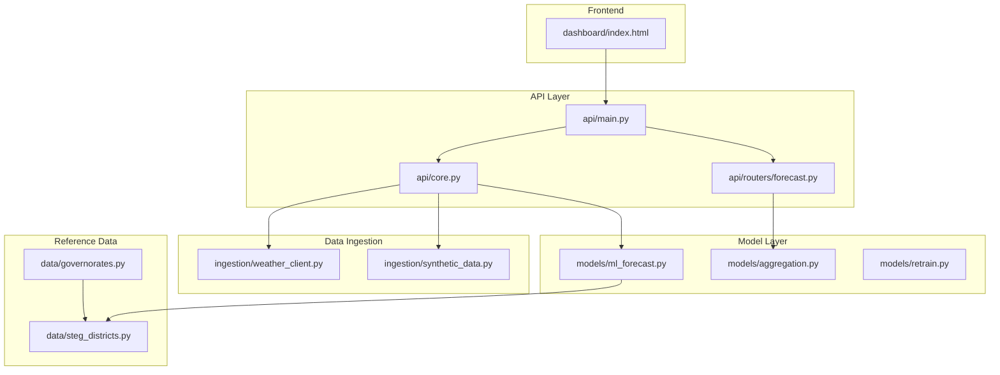

**Diagram sources**
- [api/main.py:10-42](file://api/main.py#L10-L42)
- [api/core.py:1-166](file://api/core.py#L1-L166)
- [api/routers/forecast.py:1-203](file://api/routers/forecast.py#L1-L203)
- [models/ml_forecast.py:1-267](file://models/ml_forecast.py#L1-L267)
- [models/aggregation.py:1-164](file://models/aggregation.py#L1-L164)
- [ingestion/weather_client.py:1-180](file://ingestion/weather_client.py#L1-L180)
- [ingestion/synthetic_data.py:1-170](file://ingestion/synthetic_data.py#L1-L170)
- [data/steg_districts.py:1-247](file://data/steg_districts.py#L1-L247)
- [data/governorates.py:1-46](file://data/governorates.py#L1-L46)
- [dashboard/index.html:1-137](file://dashboard/index.html#L1-L137)

**Section sources**
- [README.md:75-117](file://README.md#L75-L117)
- [PROJECT_CONTEXT.md:17-50](file://PROJECT_CONTEXT.md#L17-L50)

## Core Components
- API entrypoint and routing: FastAPI app with CORS, lifespan, and router registration.
- Shared state and services: model loading, forecast building with cache, bias correction, scheduled refresh and retraining.
- Forecast endpoints: national, intraday, directions, districts, governorates, map snapshots, timelapse, export, and refresh.
- ML forecasting: quantile gradient boosting (P10/P50/P90), feature engineering, evaluation, backtesting against baselines.
- Aggregation: district → direction → national roll-up with uncertainty propagation.
- Weather ingestion: concurrent async fetches from Open-Meteo; historical PVGIS support; synthetic fallback.
- Synthetic data: physics-based hourly weather and production generator with horizon-scaled noise.
- Reference data: STEG commercial districts, capacities, dust losses, displacement factors, projections.
- Dashboard: static HTML/JS/CSS that connects to the API when reachable, otherwise falls back to embedded data.

**Section sources**
- [api/main.py:10-42](file://api/main.py#L10-L42)
- [api/core.py:55-166](file://api/core.py#L55-L166)
- [api/routers/forecast.py:25-203](file://api/routers/forecast.py#L25-L203)
- [models/ml_forecast.py:30-153](file://models/ml_forecast.py#L30-L153)
- [models/aggregation.py:20-133](file://models/aggregation.py#L20-L133)
- [ingestion/weather_client.py:23-130](file://ingestion/weather_client.py#L23-L130)
- [ingestion/synthetic_data.py:21-159](file://ingestion/synthetic_data.py#L21-L159)
- [data/steg_districts.py:17-229](file://data/steg_districts.py#L17-L229)
- [dashboard/index.html:14-137](file://dashboard/index.html#L14-L137)

## Architecture Overview
The system follows a layered architecture:
- API layer exposes REST endpoints and manages lifecycle, caching, and background jobs.
- Model layer trains and serves quantile forecasts and aggregates them across administrative levels.
- Data ingestion layer provides live weather or synthetic data with graceful fallbacks.
- Frontend consumes the API and renders dashboards, maps, and charts.

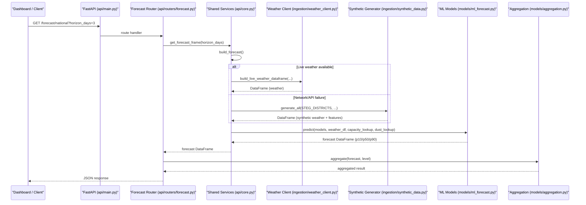

**Diagram sources**
- [api/main.py:20-42](file://api/main.py#L20-L42)
- [api/routers/forecast.py:25-33](file://api/routers/forecast.py#L25-L33)
- [api/core.py:72-99](file://api/core.py#L72-L99)
- [ingestion/weather_client.py:77-130](file://ingestion/weather_client.py#L77-L130)
- [ingestion/synthetic_data.py:157-159](file://ingestion/synthetic_data.py#L157-L159)
- [models/ml_forecast.py:118-131](file://models/ml_forecast.py#L118-L131)
- [models/aggregation.py:26-89](file://models/aggregation.py#L26-L89)

## Detailed Component Analysis

### API Application and Lifecycle
- App initialization registers routers and enables CORS.
- Lifespan imports historical snapshots and starts background scheduler for periodic forecast refresh and daily retraining.
- Shared state holds models, cache, and lookup tables; includes thread-safe refresh lock.

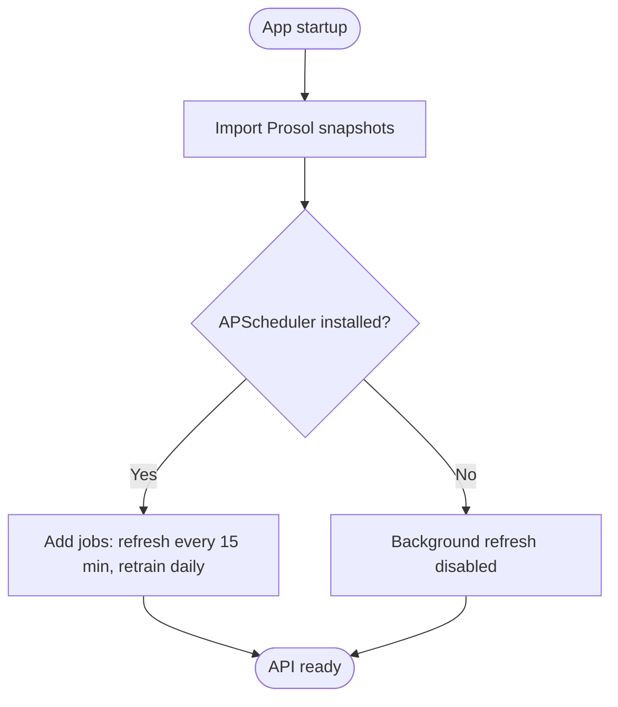

**Diagram sources**
- [api/main.py:20-42](file://api/main.py#L20-L42)
- [api/core.py:142-166](file://api/core.py#L142-L166)

**Section sources**
- [api/main.py:10-42](file://api/main.py#L10-L42)
- [api/core.py:142-166](file://api/core.py#L142-L166)

### Forecast Endpoints
- National, intraday, directions, districts, governorates, map, timelapse, export, and refresh endpoints.
- Intraday endpoint interpolates to 15-min resolution and applies bias correction when recent metering buffer exists.
- Map/timelapse endpoints compute per-district snapshots with uncertainty ratios and utilization percentages.

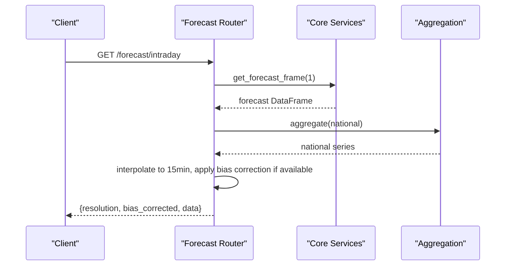

**Diagram sources**
- [api/routers/forecast.py:35-54](file://api/routers/forecast.py#L35-L54)
- [api/core.py:72-99](file://api/core.py#L72-L99)
- [models/aggregation.py:26-89](file://models/aggregation.py#L26-L89)

**Section sources**
- [api/routers/forecast.py:25-203](file://api/routers/forecast.py#L25-L203)

### ML Forecasting Model
- Feature engineering adds time features, capacity/dust lookups, extended irradiance/wind features, temperature interaction, and rolling GHI.
- Quantile regression trains P10/P50/P90 simultaneously using LightGBM.
- Prediction enforces non-negative outputs and monotonicity across quantiles.
- Evaluation computes MAE, nRMSE, and P10-P90 coverage; by-horizon backtests compare against persistence and clear-sky baselines.

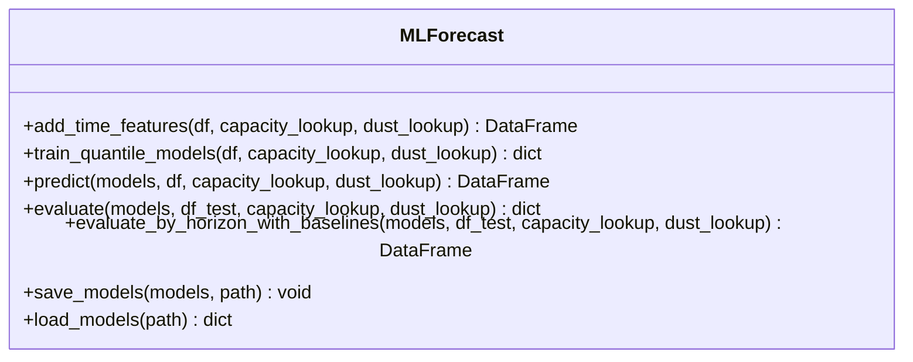

**Diagram sources**
- [models/ml_forecast.py:49-153](file://models/ml_forecast.py#L49-L153)
- [models/ml_forecast.py:227-233](file://models/ml_forecast.py#L227-L233)

**Section sources**
- [models/ml_forecast.py:1-267](file://models/ml_forecast.py#L1-L267)

### Aggregation and Uncertainty Propagation
- Aggregates forecasts to national, direction, steg_district, or legacy district levels.
- Combines uncertainty bands using sqrt-sum-of-squares of half-widths, assuming partial independence of errors.
- Provides variant that carries mean weather conditions per group for visualization.

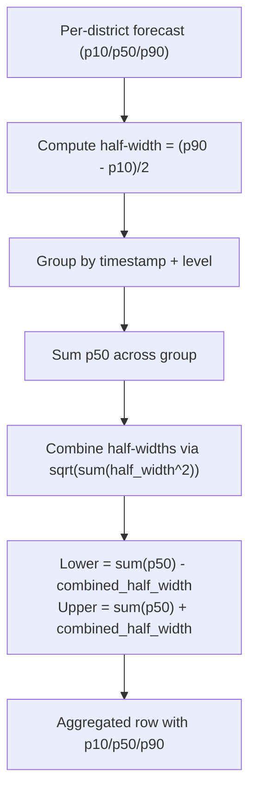

**Diagram sources**
- [models/aggregation.py:20-89](file://models/aggregation.py#L20-L89)

**Section sources**
- [models/aggregation.py:1-164](file://models/aggregation.py#L1-L164)

### Weather Ingestion and Synthetic Fallback
- Concurrent async fetching from Open-Meteo for all districts/governorates; returns standardized schema with GHI/DNI/DHI, wind speed, temperature, cloud cover, and geographic identifiers.
- If network/API fails, synthetic generator produces realistic weather and production series with horizon-scaled noise.

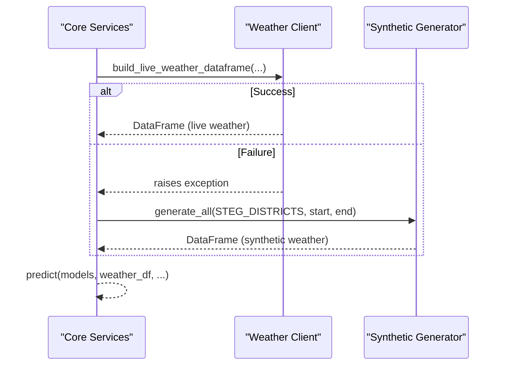

**Diagram sources**
- [api/core.py:72-99](file://api/core.py#L72-L99)
- [ingestion/weather_client.py:53-130](file://ingestion/weather_client.py#L53-L130)
- [ingestion/synthetic_data.py:119-159](file://ingestion/synthetic_data.py#L119-L159)

**Section sources**
- [ingestion/weather_client.py:1-180](file://ingestion/weather_client.py#L1-L180)
- [ingestion/synthetic_data.py:1-170](file://ingestion/synthetic_data.py#L1-L170)

### Continuous Learning and Drift Detection
- Compares recent forecast error against persistence baseline; if performance degrades beyond threshold, retrains candidate models and promotes if better.
- Uses model registry to track runs, versions, and promotion status.

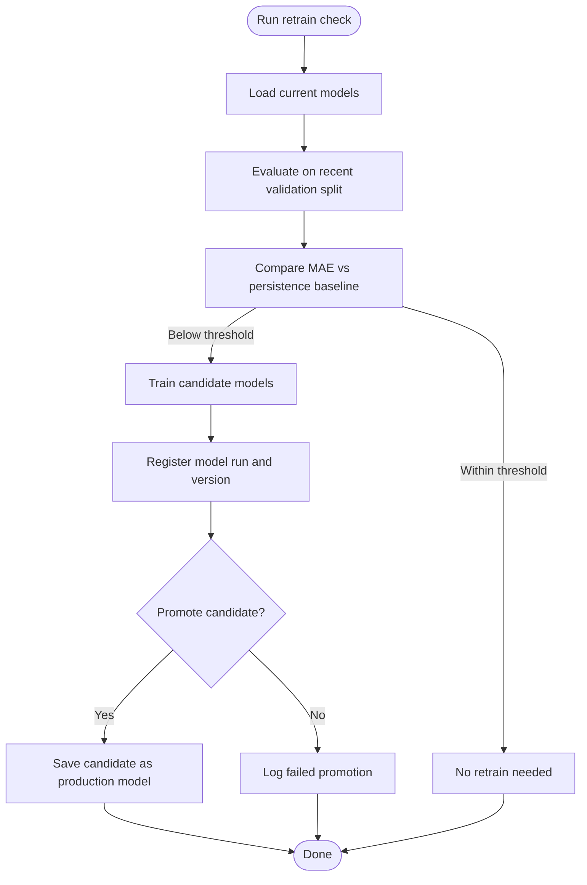

**Diagram sources**
- [models/retrain.py:40-104](file://models/retrain.py#L40-L104)

**Section sources**
- [models/retrain.py:1-115](file://models/retrain.py#L1-L115)

### Reference Geography and Capacity Data
- STEG commercial districts define coordinates, capacities, pending dossiers, dust loss, and direction affiliations.
- Includes displacement factors and capacity projection utilities based on backlog and execution rates.

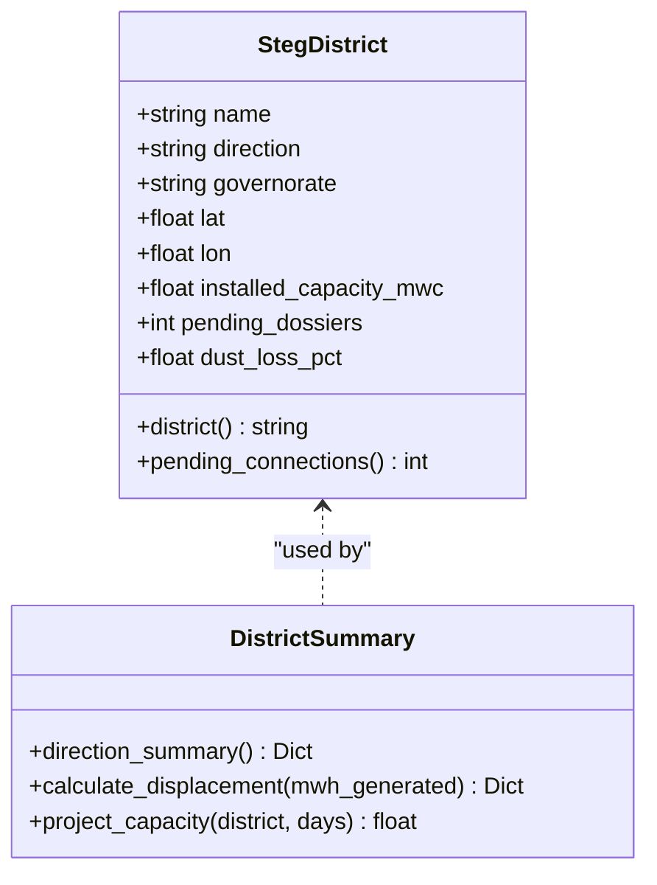

**Diagram sources**
- [data/steg_districts.py:61-229](file://data/steg_districts.py#L61-L229)

**Section sources**
- [data/steg_districts.py:1-247](file://data/steg_districts.py#L1-L247)
- [data/governorates.py:1-46](file://data/governorates.py#L1-L46)

### Dashboard Integration
- Single-page dashboard loads assets and connects to the API when reachable; displays KPIs, charts, and status indicators.
- Graceful fallback ensures demo reliability even without backend connectivity.

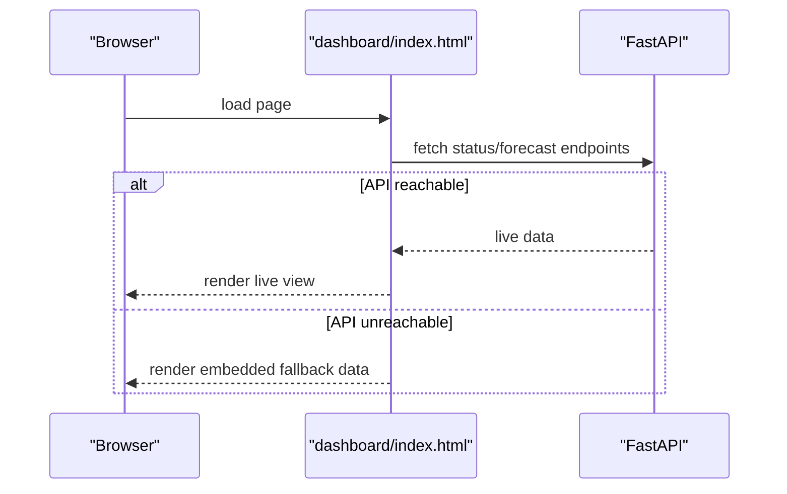

**Diagram sources**
- [dashboard/index.html:14-137](file://dashboard/index.html#L14-L137)

**Section sources**
- [dashboard/index.html:1-137](file://dashboard/index.html#L1-L137)

## Dependency Analysis
- API depends on core services, which depend on weather ingestion and ML models.
- ML models depend on reference geography and optional synthetic data.
- Aggregation depends on forecast output schema and grouping metadata.
- Dashboard depends on API availability and falls back to embedded assets.

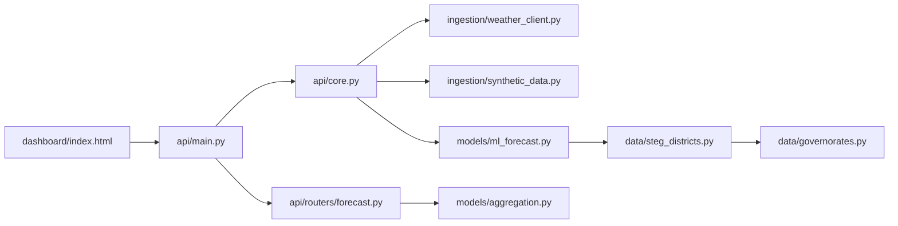

**Diagram sources**
- [api/main.py:10-42](file://api/main.py#L10-L42)
- [api/core.py:17-27](file://api/core.py#L17-L27)
- [api/routers/forecast.py:9-19](file://api/routers/forecast.py#L9-L19)
- [models/ml_forecast.py:24-28](file://models/ml_forecast.py#L24-L28)
- [data/steg_districts.py:153-176](file://data/steg_districts.py#L153-L176)
- [data/governorates.py:7-25](file://data/governorates.py#L7-L25)
- [dashboard/index.html:134-137](file://dashboard/index.html#L134-L137)

**Section sources**
- [requirements.txt:1-15](file://requirements.txt#L1-L15)

## Performance Considerations
- Use concurrent async fetching for weather data to minimize latency across multiple locations.
- Cache forecasts in memory with time-based expiration to reduce repeated computation.
- Apply interpolation and bias correction only where necessary to avoid unnecessary overhead.
- Aggregate uncertainties using sqrt-sum-of-squares; be aware this may understate uncertainty for adjacent regions sharing cloud systems.
- Prefer vectorized operations in feature engineering and aggregation to optimize pandas/numpy performance.
- Limit horizon length in endpoints to balance responsiveness and resource usage.

[No sources needed since this section provides general guidance]

## Troubleshooting Guide
Common issues and resolutions:
- API key errors: ensure X-API-Key header matches configured key; default is dev-key unless overridden.
- Weather fetch failures: verify network access; platform automatically falls back to synthetic data.
- Empty forecast frames: confirm timestamps are within requested range; adjust horizon parameters.
- Bias correction not applied: check metering buffer existence and recency; ensure recent actuals exist.
- Scheduler not running: APScheduler must be installed; otherwise background refresh is disabled.

**Section sources**
- [api/core.py:45-52](file://api/core.py#L45-L52)
- [api/core.py:72-99](file://api/core.py#L72-L99)
- [api/core.py:125-139](file://api/core.py#L125-L139)
- [api/routers/forecast.py:182-186](file://api/routers/forecast.py#L182-L186)

## Conclusion
This platform provides a robust, modular foundation for forecasting Tunisia’s rooftop PV production with calibrated uncertainty, live weather integration, and continuous learning. Contributors should focus on maintaining separation of concerns, preserving data transparency, ensuring resilient ingestion, and keeping APIs stable and well-documented. The provided diagrams and sections outline how to extend models, add data sources, implement new endpoints, and enhance the dashboard while adhering to established patterns.

[No sources needed since this section summarizes without analyzing specific files]

## Appendices

### Local Setup and Quickstart
- Install dependencies from requirements.txt.
- Train models using the ML script; optionally run drift detection and retraining.
- Launch the API server and open the dashboard in a browser.

**Section sources**
- [README.md:97-117](file://README.md#L97-L117)
- [requirements.txt:1-15](file://requirements.txt#L1-L15)

### Adding a New Forecast Endpoint
- Define a new route in the appropriate router module.
- Reuse core services for forecast frame generation and aggregation.
- Validate inputs and return consistent JSON structures; include uncertainty fields where relevant.

**Section sources**
- [api/routers/forecast.py:25-203](file://api/routers/forecast.py#L25-L203)
- [api/core.py:72-99](file://api/core.py#L72-L99)

### Extending the Dashboard
- Add UI elements in the HTML and corresponding JS logic in assets/js.
- Fetch data from existing endpoints or create new ones if needed.
- Ensure graceful fallback when API is unavailable.

**Section sources**
- [dashboard/index.html:14-137](file://dashboard/index.html#L14-L137)

### Modifying Forecasting Models
- Extend feature engineering in the model module; ensure backward compatibility with missing columns.
- Retrain models and evaluate metrics; save artifacts and update registry if promoting.
- Validate by-horizon backtests and coverage metrics.

**Section sources**
- [models/ml_forecast.py:49-153](file://models/ml_forecast.py#L49-L153)
- [models/retrain.py:40-104](file://models/retrain.py#L40-L104)

### Adding a New Weather Source
- Implement a client function returning the standard schema (timestamp, irradiance variables, temperature, cloud cover, wind, geographic identifiers).
- Integrate into core services with try/except to fall back to synthetic data on failure.
- Test concurrency and error handling for multiple locations.

**Section sources**
- [ingestion/weather_client.py:77-130](file://ingestion/weather_client.py#L77-L130)
- [api/core.py:72-99](file://api/core.py#L72-L99)

### Generating Synthetic Datasets
- Use the synthetic generator to produce realistic weather and production series for development and demos.
- Adjust horizon noise scaling and physical parameters to match desired scenarios.

**Section sources**
- [ingestion/synthetic_data.py:119-159](file://ingestion/synthetic_data.py#L119-L159)

### Writing Tests and Reports
- Validate model metrics and aggregation outputs using built-in evaluation functions.
- Generate reports using report utilities; ensure figures and tables reflect actual data.

**Section sources**
- [models/ml_forecast.py:134-224](file://models/ml_forecast.py#L134-L224)
- [README.md:46-49](file://README.md#L46-L49)

### Code Review and Version Control Practices
- Follow modular structure and naming conventions; keep changes scoped to single responsibilities.
- Document new endpoints, models, and data sources with clear comments and references.
- Use descriptive commit messages and maintain branch hygiene; tag releases for model artifacts.

[No sources needed since this section provides general guidance]