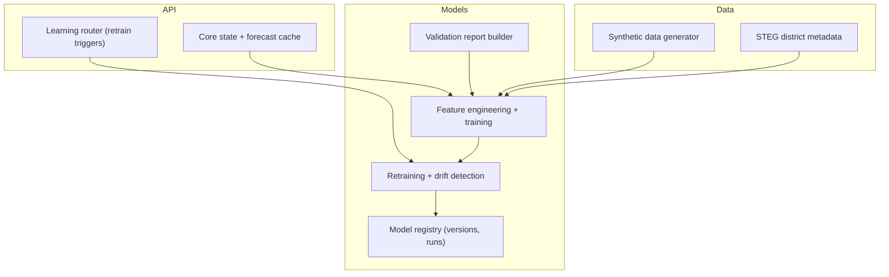
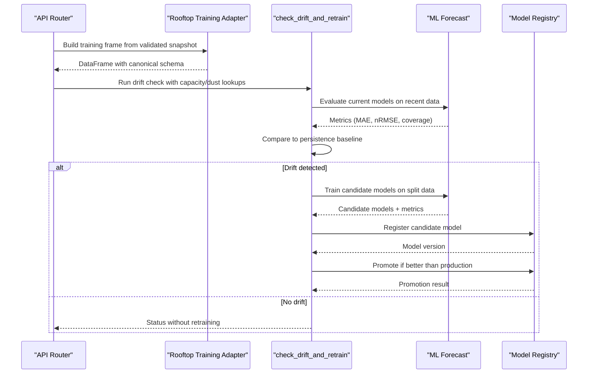
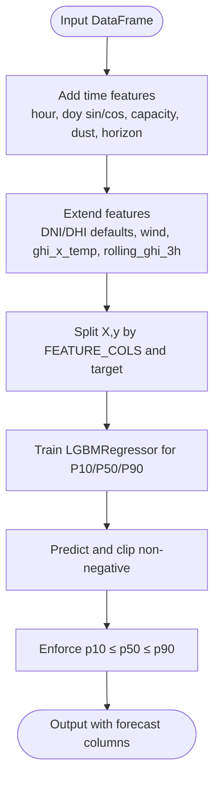
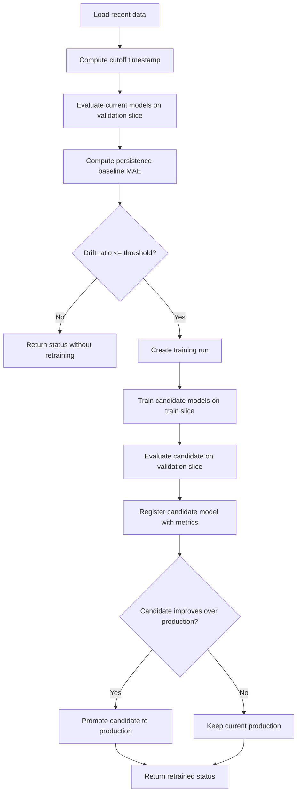
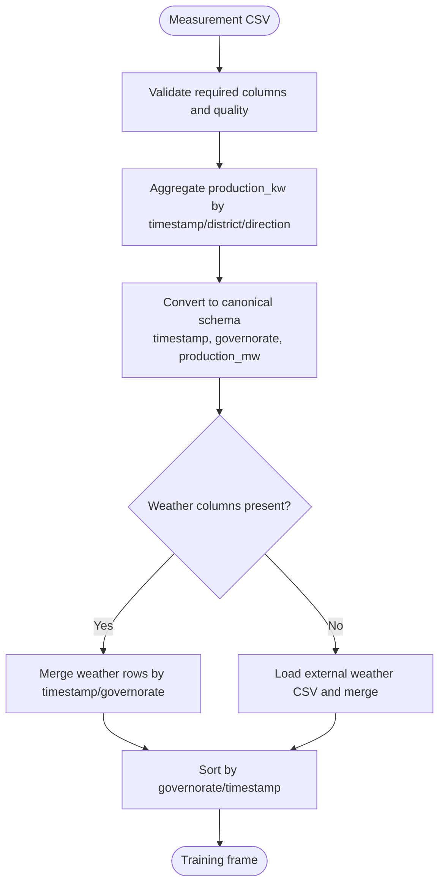
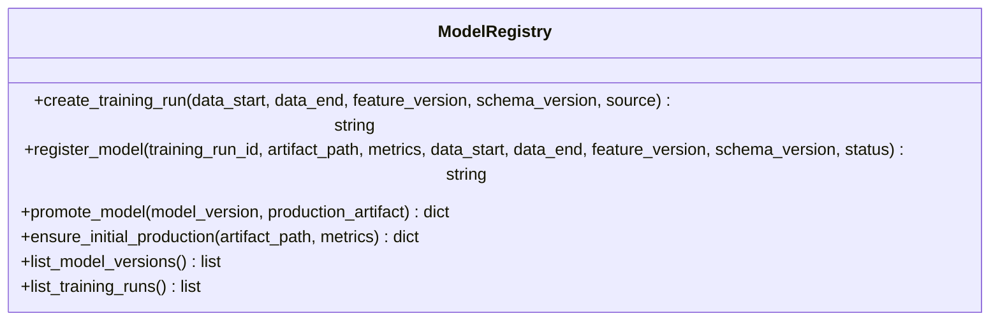
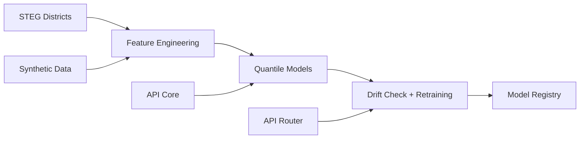

# Model Development & Training

<cite>
**Referenced Files in This Document**
- [ml_forecast.py](file://models/ml_forecast.py)
- [retrain.py](file://models/retrain.py)
- [rooftop_training_adapter.py](file://models/rooftop_training_adapter.py)
- [model_registry.py](file://models/model_registry.py)
- [validation_report.py](file://models/validation_report.py)
- [retrain_historical.py](file://models/retrain_historical.py)
- [history.py](file://models/history.py)
- [learning.py](file://api/routers/learning.py)
- [core.py](file://api/core.py)
- [synthetic_data.py](file://ingestion/synthetic_data.py)
- [steg_districts.py](file://data/steg_districts.py)
- [model_versions.json](file://results/model_registry/model_versions.json)
- [training_runs.json](file://results/model_registry/training_runs.json)
</cite>

## Table of Contents
1. [Introduction](#introduction)
2. [Project Structure](#project-structure)
3. [Core Components](#core-components)
4. [Architecture Overview](#architecture-overview)
5. [Detailed Component Analysis](#detailed-component-analysis)
6. [Dependency Analysis](#dependency-analysis)
7. [Performance Considerations](#performance-considerations)
8. [Troubleshooting Guide](#troubleshooting-guide)
9. [Conclusion](#conclusion)
10. [Appendices](#appendices)

## Introduction
This document explains how to develop, train, validate, and deploy forecasting models in the platform. It covers the end-to-end workflow from preparing historical data to automatic retraining and model promotion. Key topics include:
- Building training frames from validated rooftop measurements using a rooftop training adapter
- Training gradient-boosted quantile regression models for P10/P50/P90 forecasts
- Retraining via drift detection against a persistence baseline
- Feature engineering, validation procedures, and performance metrics
- Adding new algorithms, modifying features, and integrating custom features
- Model versioning, artifact management, and testing strategies

## Project Structure
The ML pipeline is organized into modular components:
- Data preparation and feature engineering live in the models package
- Retraining logic orchestrates evaluation, candidate training, and promotion
- A file-based registry tracks versions, artifacts, and training runs
- API endpoints expose continuous learning triggers and status
- Synthetic and real ingestion modules supply weather and production signals

**Diagram sources**
- [ml_forecast.py:49-115](file://models/ml_forecast.py#L49-L115)
- [retrain.py:40-104](file://models/retrain.py#L40-L104)
- [model_registry.py:35-131](file://models/model_registry.py#L35-L131)
- [learning.py:77-130](file://api/routers/learning.py#L77-L130)
- [core.py:72-99](file://api/core.py#L72-L99)

**Section sources**
- [ml_forecast.py:1-267](file://models/ml_forecast.py#L1-L267)
- [retrain.py:1-115](file://models/retrain.py#L1-L115)
- [model_registry.py:1-161](file://models/model_registry.py#L1-L161)
- [learning.py:1-163](file://api/routers/learning.py#L1-L163)
- [core.py:1-166](file://api/core.py#L1-L166)

## Core Components
- Feature engineering and model training:
  - Adds time-based features, capacity/dust lookups, extended weather interactions, and rolling windows
  - Trains three LightGBM quantile regressors for P10/P50/P90 per horizon
- Retraining and drift detection:
  - Evaluates current model vs persistence baseline on recent data
  - If drift exceeds threshold, trains a candidate, registers it, and promotes if better
- Model registry:
  - Immutable tracking of training runs, model versions, and promotions
  - Ensures candidates outperform production before promotion
- Validation reporting:
  - Computes pinball loss, MAE, RMSE, nRMSE, coverage, and accuracy on split datasets
- API integration:
  - Exposes manual retrain triggers and status endpoints
  - Schedules background tasks for periodic refresh and retraining

**Section sources**
- [ml_forecast.py:49-152](file://models/ml_forecast.py#L49-L152)
- [retrain.py:40-104](file://models/retrain.py#L40-L104)
- [model_registry.py:35-131](file://models/model_registry.py#L35-L131)
- [validation_report.py:22-82](file://models/validation_report.py#L22-L82)
- [learning.py:122-163](file://api/routers/learning.py#L122-L163)
- [core.py:125-159](file://api/core.py#L125-L159)

## Architecture Overview
The system implements a continuous learning loop:
- Ingestion provides weather and production signals (synthetic or real)
- The rooftop training adapter converts validated measurements into the canonical schema
- The ML module engineers features and trains quantile models
- Drift detection compares current model error to a persistence baseline
- Candidate models are registered and promoted only if they improve over production
- API endpoints trigger and monitor retraining; background schedulers automate operations

**Diagram sources**
- [learning.py:77-130](file://api/routers/learning.py#L77-L130)
- [rooftop_training_adapter.py:26-88](file://models/rooftop_training_adapter.py#L26-L88)
- [retrain.py:40-104](file://models/retrain.py#L40-L104)
- [ml_forecast.py:97-152](file://models/ml_forecast.py#L97-L152)
- [model_registry.py:69-131](file://models/model_registry.py#L69-L131)

## Detailed Component Analysis

### Feature Engineering and Model Training
- Time features: hour, day-of-year sine/cosine, capacity mapping, dust loss, horizon hours
- Extended features: DNI/DHI defaults when missing, wind speed default, temperature interaction, rolling GHI
- Quantile models: Three LightGBM regressors trained for P10/P50/P90 with conservative hyperparameters
- Prediction safeguards: Non-negative clipping and monotonicity enforcement across quantiles
- Evaluation: Daylight-only MAE/nRMSE and P10-P90 coverage

**Diagram sources**
- [ml_forecast.py:49-115](file://models/ml_forecast.py#L49-L115)
- [ml_forecast.py:118-131](file://models/ml_forecast.py#L118-L131)

**Section sources**
- [ml_forecast.py:49-152](file://models/ml_forecast.py#L49-L152)

### Retraining Pipeline and Drift Detection
- Recent data evaluation: Uses a cutoff quantile to split recent data into train/validation
- Baseline comparison: Computes persistence MAE based on median interval and shifts by 24-hour equivalent steps
- Drift threshold: Retrains if current model’s MAE is within a configured percentage of persistence
- Candidate lifecycle: Creates a training run, trains candidate models, registers with metrics, and promotes if better
- Error handling: Marks failed runs and logs errors

**Diagram sources**
- [retrain.py:40-104](file://models/retrain.py#L40-L104)
- [model_registry.py:69-131](file://models/model_registry.py#L69-L131)

**Section sources**
- [retrain.py:40-104](file://models/retrain.py#L40-L104)
- [model_registry.py:69-131](file://models/model_registry.py#L69-L131)

### Rooftop Training Adapter
- Validates required measurement columns and quality status
- Aggregates power by timestamp, district, direction
- Converts timestamps and units to canonical schema
- Merges weather data either from the measurement snapshot or an external weather CSV
- Raises clear errors when data is insufficient or mismatched

**Diagram sources**
- [rooftop_training_adapter.py:26-88](file://models/rooftop_training_adapter.py#L26-L88)

**Section sources**
- [rooftop_training_adapter.py:26-88](file://models/rooftop_training_adapter.py#L26-L88)

### Model Registry and Versioning
- Training runs: Created with data ranges, feature/schema versions, and source description
- Model versions: Registered with artifact path, metrics, and data ranges; statuses transition through candidate → production → archived
- Promotion policy: Requires candidate MAE to be strictly better than current production
- Atomic writes: Temporary files replaced atomically to avoid corruption

**Diagram sources**
- [model_registry.py:35-131](file://models/model_registry.py#L35-L131)

**Section sources**
- [model_registry.py:35-131](file://models/model_registry.py#L35-L131)
- [model_versions.json:1-35](file://results/model_registry/model_versions.json#L1-L35)
- [training_runs.json:1-32](file://results/model_registry/training_runs.json#L1-L32)

### Validation Report Builder
- Reads dataset, aggregates to hourly, converts to model schema
- Splits into train/validation by timestamp quantile
- Computes pinball loss for quantiles, MAE, RMSE, nRMSE, coverage, and accuracy
- Writes JSON report with source, paths, split timestamp, and metrics

**Section sources**
- [validation_report.py:22-82](file://models/validation_report.py#L22-L82)

### API Integration and Automation
- Manual retrain endpoint triggers retraining from latest validated snapshot
- Retraining runs in a background thread with locking to prevent concurrent jobs
- Status endpoint returns recent retrain log entries and schedule configuration
- Background scheduler periodically refreshes forecasts and attempts daily retraining

**Section sources**
- [learning.py:77-163](file://api/routers/learning.py#L77-L163)
- [core.py:125-159](file://api/core.py#L125-L159)

## Dependency Analysis
Key dependencies and relationships:
- Models depend on STEG district metadata for capacity and dust losses
- Retraining depends on model registry for immutable versioning and promotion
- API depends on core state for model caching and scheduled tasks
- Synthetic data provides deterministic inputs for development and testing

**Diagram sources**
- [steg_districts.py:167-176](file://data/steg_districts.py#L167-L176)
- [ml_forecast.py:49-115](file://models/ml_forecast.py#L49-L115)
- [retrain.py:40-104](file://models/retrain.py#L40-L104)
- [model_registry.py:35-131](file://models/model_registry.py#L35-L131)
- [learning.py:77-130](file://api/routers/learning.py#L77-L130)
- [core.py:72-99](file://api/core.py#L72-L99)
- [synthetic_data.py:119-159](file://ingestion/synthetic_data.py#L119-L159)

**Section sources**
- [steg_districts.py:167-176](file://data/steg_districts.py#L167-L176)
- [ml_forecast.py:49-115](file://models/ml_forecast.py#L49-L115)
- [retrain.py:40-104](file://models/retrain.py#L40-L104)
- [model_registry.py:35-131](file://models/model_registry.py#L35-L131)
- [learning.py:77-130](file://api/routers/learning.py#L77-L130)
- [core.py:72-99](file://api/core.py#L72-L99)
- [synthetic_data.py:119-159](file://ingestion/synthetic_data.py#L119-L159)

## Performance Considerations
- Feature computation: Rolling GHI grouped by governorate can be expensive on large datasets; ensure proper sorting and indexing
- Model training: LightGBM quantile training scales with number of estimators and leaves; tune hyperparameters for your data size
- Drift detection: Persistence baseline calculation depends on median intervals; handle irregular sampling carefully
- Registry writes: Use atomic temporary files to avoid partial writes during high-frequency updates
- API caching: Forecast results are cached for short periods to reduce recomputation; adjust cache TTL based on update frequency

[No sources needed since this section provides general guidance]

## Troubleshooting Guide
Common issues and resolutions:
- Missing weather columns in training frame: Ensure weather data includes required columns or provide separate weather CSV
- Empty valid measurements: Verify quality_status equals "valid" and required fields are populated
- No matching weather rows: Confirm timestamp and governorate alignment between measurements and weather
- Promotion failures: Candidate must have strictly lower MAE than current production; review metrics and data splits
- Concurrent retraining: Lock prevents overlapping jobs; wait for completion or investigate stuck states

**Section sources**
- [rooftop_training_adapter.py:26-88](file://models/rooftop_training_adapter.py#L26-L88)
- [retrain.py:71-104](file://models/retrain.py#L71-L104)
- [model_registry.py:104-131](file://models/model_registry.py#L104-L131)
- [learning.py:77-108](file://api/routers/learning.py#L77-L108)

## Conclusion
The platform provides a robust, automated ML workflow for PV forecasting:
- Clear separation of concerns between data preparation, modeling, and deployment
- Strong emphasis on validation and drift detection to maintain forecast quality
- Immutable versioning and transparent promotion policies ensure reliability
- API and scheduling support continuous operation and easy integration

[No sources needed since this section summarizes without analyzing specific files]

## Appendices

### How to Add a New Forecasting Algorithm
Steps:
- Implement a new training function that accepts a DataFrame and returns a model object
- Add feature engineering functions if the algorithm requires different inputs
- Integrate with the retraining pipeline by calling your new training function in the candidate training step
- Update evaluation to compute relevant metrics for the new algorithm
- Test with synthetic data and validated snapshots before promoting

**Section sources**
- [ml_forecast.py:97-115](file://models/ml_forecast.py#L97-L115)
- [retrain.py:71-89](file://models/retrain.py#L71-L89)

### How to Modify Existing Models
Options:
- Adjust feature sets by adding/removing columns in the feature engineering function
- Tune LightGBM hyperparameters for improved performance
- Change quantile targets or add additional percentiles
- Update evaluation metrics to reflect new objectives

**Section sources**
- [ml_forecast.py:49-94](file://models/ml_forecast.py#L49-L94)
- [ml_forecast.py:105-115](file://models/ml_forecast.py#L105-L115)
- [ml_forecast.py:134-152](file://models/ml_forecast.py#L134-L152)

### How to Integrate Custom Features
Approach:
- Identify the new feature and its source (weather, metadata, derived)
- Add feature computation in the feature engineering function with sensible defaults
- Ensure backward compatibility by checking column presence before assignment
- Validate impact on model performance through retraining and evaluation

**Section sources**
- [ml_forecast.py:71-94](file://models/ml_forecast.py#L71-L94)

### Model Versioning and Artifact Management
- Each training run creates a unique ID and records data ranges, feature/schema versions, and source
- Model versions store artifact paths, metrics, and lifecycle status
- Production promotion copies artifacts and updates version statuses atomically
- Historical examples show successful transitions from legacy to candidate to production

**Section sources**
- [model_registry.py:35-131](file://models/model_registry.py#L35-L131)
- [model_versions.json:1-35](file://results/model_registry/model_versions.json#L1-L35)
- [training_runs.json:1-32](file://results/model_registry/training_runs.json#L1-L32)

### Testing Strategies for ML Components
- Unit tests: Validate feature engineering functions with edge cases (missing columns, empty dataframes)
- Integration tests: Run full retraining pipeline with synthetic data and verify registry updates
- Regression tests: Compare new model metrics against baselines to detect performance degradation
- API tests: Trigger retrain endpoints and verify status responses and logging

**Section sources**
- [retrain_historical.py:26-40](file://models/retrain_historical.py#L26-L40)
- [learning.py:122-163](file://api/routers/learning.py#L122-L163)
- [validation_report.py:62-82](file://models/validation_report.py#L62-L82)