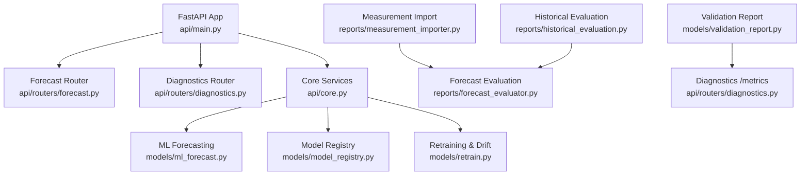
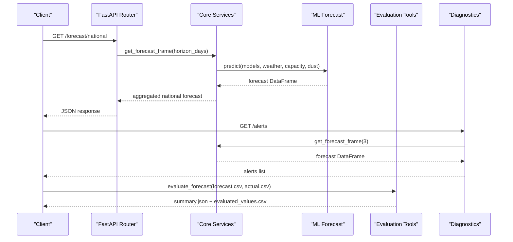
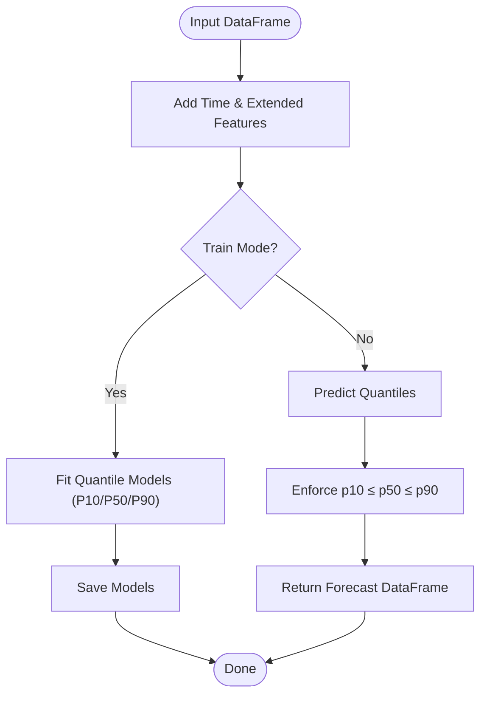
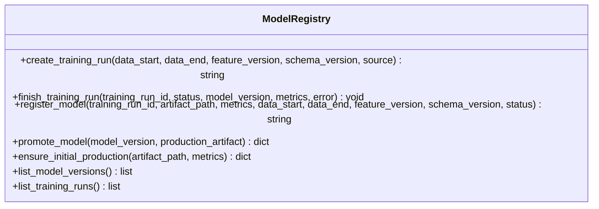
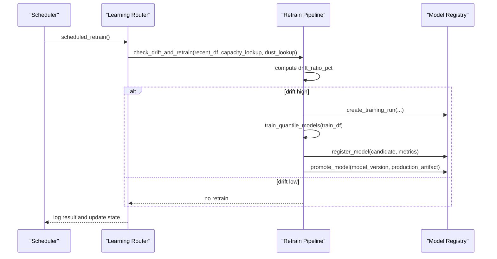
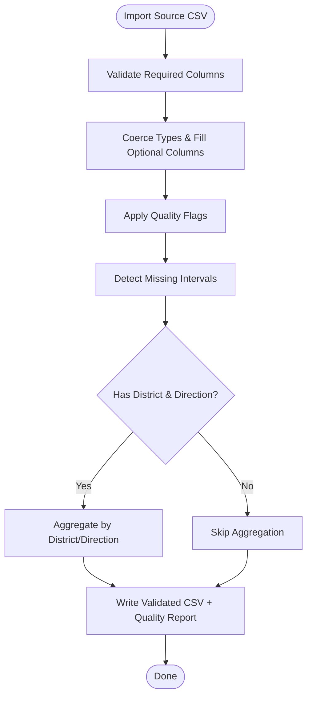
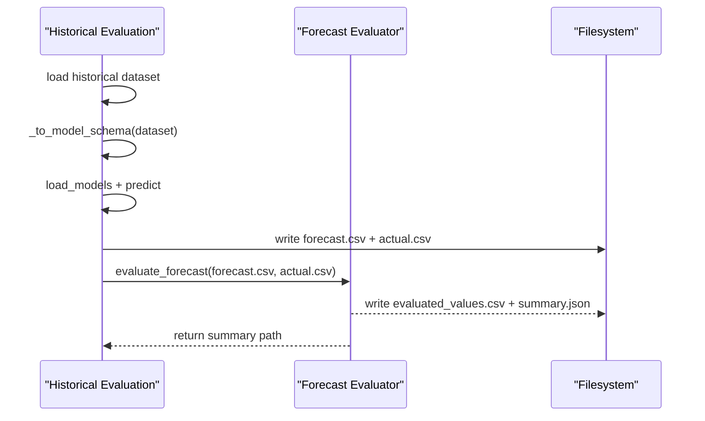
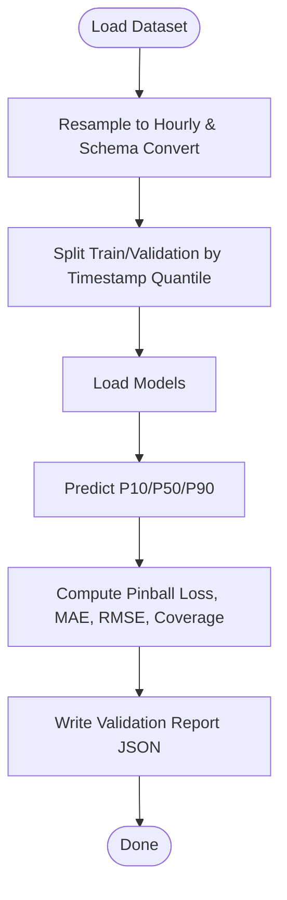
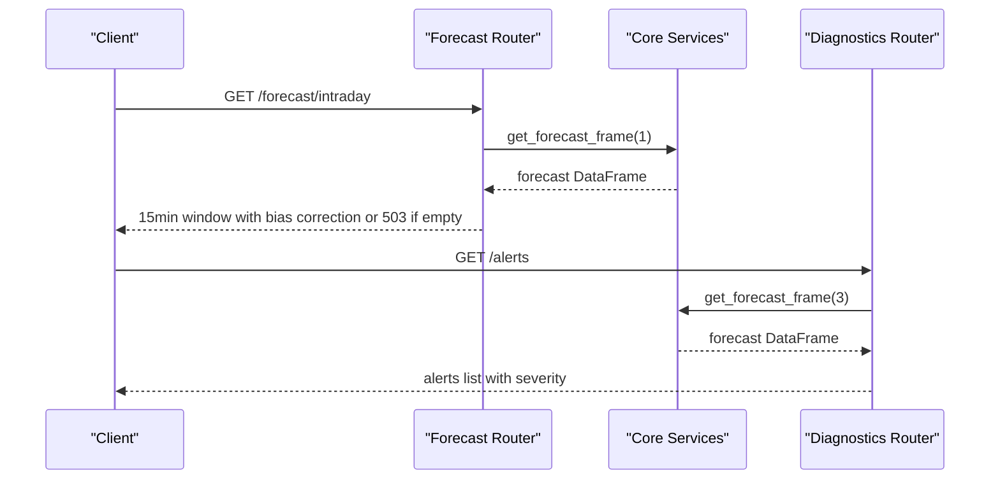
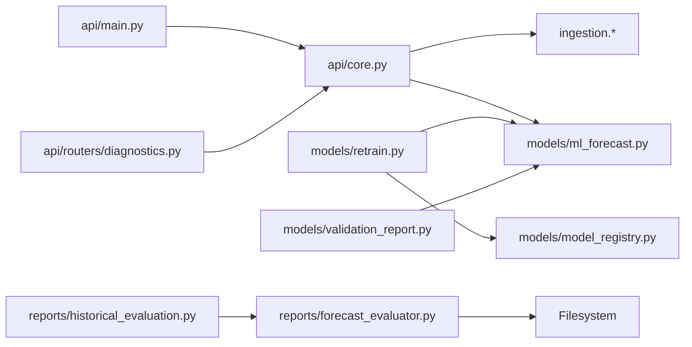

# Testing & Debugging Strategies

<cite>
**Referenced Files in This Document**
- [api/main.py](file://api/main.py)
- [api/core.py](file://api/core.py)
- [api/routers/forecast.py](file://api/routers/forecast.py)
- [api/routers/diagnostics.py](file://api/routers/diagnostics.py)
- [models/ml_forecast.py](file://models/ml_forecast.py)
- [models/validation_report.py](file://models/validation_report.py)
- [models/model_registry.py](file://models/model_registry.py)
- [models/retrain.py](file://models/retrain.py)
- [reports/forecast_evaluator.py](file://reports/forecast_evaluator.py)
- [reports/historical_evaluation.py](file://reports/historical_evaluation.py)
- [reports/measurement_importer.py](file://reports/measurement_importer.py)
</cite>

## Table of Contents
1. Introduction
2. Project Structure
3. Core Components
4. Architecture Overview
5. Detailed Component Analysis
6. Dependency Analysis
7. Performance Considerations
8. Troubleshooting Guide
9. Conclusion
10. Appendices

## Introduction
This document provides a comprehensive testing and debugging strategy for the forecasting platform, focusing on ML models, API endpoints, data processing pipelines, validation reports, and historical evaluation tools. It also covers model drift detection, data quality checks, API error handling, performance profiling, memory optimization, and operational monitoring using built-in diagnostics and logging patterns.

## Project Structure
The platform is organized into clear layers:
- API layer (FastAPI): entrypoint, routers for forecast, learning, diagnostics, and reports
- Models layer: ML training, prediction, evaluation, model registry, and retraining with drift detection
- Reports layer: immutable forecast snapshots, evaluation against actuals, measurement import and validation
- Ingestion and data utilities: synthetic and live weather data generation, district metadata
- Dashboard: visualization and operational status (not analyzed here)

**Diagram sources**
- [api/main.py:10-41](file://api/main.py#L10-L41)
- [api/routers/forecast.py:21-203](file://api/routers/forecast.py#L21-L203)
- [api/routers/diagnostics.py:17-137](file://api/routers/diagnostics.py#L17-L137)
- [api/core.py:55-103](file://api/core.py#L55-L103)
- [models/ml_forecast.py:97-152](file://models/ml_forecast.py#L97-L152)
- [models/model_registry.py:35-161](file://models/model_registry.py#L35-L161)
- [models/retrain.py:40-114](file://models/retrain.py#L40-L114)
- [reports/measurement_importer.py:37-119](file://reports/measurement_importer.py#L37-L119)
- [reports/forecast_evaluator.py:29-189](file://reports/forecast_evaluator.py#L29-L189)
- [reports/historical_evaluation.py:32-77](file://reports/historical_evaluation.py#L32-L77)
- [models/validation_report.py:22-82](file://models/validation_report.py#L22-L82)

**Section sources**
- [api/main.py:1-42](file://api/main.py#L1-L42)
- [api/core.py:1-166](file://api/core.py#L1-L166)

## Core Components
- Forecasting model: gradient-boosted quantile regression producing P10/P50/P90 forecasts with feature engineering and monotonicity enforcement.
- Model registry: immutable versioning, training run tracking, candidate promotion with performance guardrails.
- Retraining pipeline: drift detection comparing current model MAE to persistence baseline; triggers candidate training and optional promotion.
- Measurement importer: validates incoming measurements, flags quality issues, aggregates by district/direction when available.
- Forecast evaluator: stores immutable forecast runs and evaluates against actuals with metrics per location, horizon bucket, and geography.
- Historical evaluation: builds forecast/actual pairs from historical dataset and runs evaluation.
- Validation report: splits dataset into train/validation, computes pinball loss, MAE, RMSE, coverage, and writes JSON.
- API diagnostics: exposes alerts, metrics, model validation results, and history endpoints.

**Section sources**
- [models/ml_forecast.py:97-152](file://models/ml_forecast.py#L97-L152)
- [models/model_registry.py:35-161](file://models/model_registry.py#L35-L161)
- [models/retrain.py:40-114](file://models/retrain.py#L40-L114)
- [reports/measurement_importer.py:37-119](file://reports/measurement_importer.py#L37-L119)
- [reports/forecast_evaluator.py:29-189](file://reports/forecast_evaluator.py#L29-L189)
- [reports/historical_evaluation.py:32-77](file://reports/historical_evaluation.py#L32-L77)
- [models/validation_report.py:22-82](file://models/validation_report.py#L22-L82)
- [api/routers/diagnostics.py:17-137](file://api/routers/diagnostics.py#L17-L137)

## Architecture Overview
The system integrates forecasting, evaluation, and diagnostics through well-defined interfaces:
- API requests trigger forecast computation via core services that cache and refresh predictions.
- Data ingestion and validation produce clean datasets used for evaluation and retraining.
- Model registry ensures reproducibility and safe promotion of improved candidates.
- Diagnostics expose operational health, alerts, and evaluation summaries.

**Diagram sources**
- [api/routers/forecast.py:25-32](file://api/routers/forecast.py#L25-L32)
- [api/core.py:72-103](file://api/core.py#L72-L103)
- [models/ml_forecast.py:118-131](file://models/ml_forecast.py#L118-L131)
- [api/routers/diagnostics.py:17-80](file://api/routers/diagnostics.py#L17-L80)
- [reports/forecast_evaluator.py:119-189](file://reports/forecast_evaluator.py#L119-L189)

## Detailed Component Analysis

### ML Forecasting Model
- Feature engineering adds time-based features, capacity and dust lookups, extended weather features, and rolling averages.
- Training trains three quantile regressors (P10/P50/P90) with LightGBM.
- Prediction enforces non-negative outputs and monotonicity across quantiles.
- Evaluation computes MAE, nRMSE, and P10-P90 coverage over daylight hours.

**Diagram sources**
- [models/ml_forecast.py:49-94](file://models/ml_forecast.py#L49-L94)
- [models/ml_forecast.py:97-115](file://models/ml_forecast.py#L97-L115)
- [models/ml_forecast.py:118-131](file://models/ml_forecast.py#L118-L131)
- [models/ml_forecast.py:134-152](file://models/ml_forecast.py#L134-L152)

**Section sources**
- [models/ml_forecast.py:49-152](file://models/ml_forecast.py#L49-L152)

### Model Registry and Promotion
- Tracks training runs and model versions immutably.
- Promotes candidates only if they outperform production based on MAE.
- Ensures artifacts exist and copies them safely to production path.

**Diagram sources**
- [models/model_registry.py:35-161](file://models/model_registry.py#L35-L161)

**Section sources**
- [models/model_registry.py:35-161](file://models/model_registry.py#L35-L161)

### Retraining and Drift Detection
- Computes current model MAE vs persistence baseline to estimate drift ratio.
- If drift exceeds threshold, trains candidate models and registers them.
- Attempts promotion; logs failures and updates state for diagnostics.

**Diagram sources**
- [api/routers/learning.py:31-49](file://api/routers/learning.py#L31-L49)
- [models/retrain.py:40-114](file://models/retrain.py#L40-L114)
- [models/model_registry.py:35-161](file://models/model_registry.py#L35-L161)

**Section sources**
- [models/retrain.py:40-114](file://models/retrain.py#L40-L114)
- [api/routers/learning.py:31-49](file://api/routers/learning.py#L31-L49)

### Measurement Import and Quality Validation
- Validates required columns, coerces types, flags invalid timestamps/power/energy, detects duplicates and gaps.
- Produces validated CSV and a quality report with gap details and aggregation status.

**Diagram sources**
- [reports/measurement_importer.py:37-119](file://reports/measurement_importer.py#L37-L119)

**Section sources**
- [reports/measurement_importer.py:37-119](file://reports/measurement_importer.py#L37-L119)

### Forecast Evaluation and Historical Evaluation
- Saves immutable forecast snapshots with metadata and computes metrics grouped by location, horizon bucket, and geography.
- Historical evaluation constructs forecast/actual pairs from historical dataset and runs evaluation.

**Diagram sources**
- [reports/historical_evaluation.py:32-77](file://reports/historical_evaluation.py#L32-L77)
- [reports/forecast_evaluator.py:29-189](file://reports/forecast_evaluator.py#L29-L189)

**Section sources**
- [reports/historical_evaluation.py:32-77](file://reports/historical_evaluation.py#L32-L77)
- [reports/forecast_evaluator.py:29-189](file://reports/forecast_evaluator.py#L29-L189)

### Validation Report Generation
- Loads hourly dataset, splits at quantile timestamp, loads models, predicts, and computes pinball loss, MAE, RMSE, coverage.
- Writes JSON report with training and validation metrics.

**Diagram sources**
- [models/validation_report.py:22-82](file://models/validation_report.py#L22-L82)

**Section sources**
- [models/validation_report.py:22-82](file://models/validation_report.py#L22-L82)

### API Endpoints and Error Handling
- Forecast endpoints aggregate predictions and handle missing data or unknown locations with HTTP exceptions.
- Diagnostics endpoint surfaces alerts including high uncertainty, ramp-down risks, saturation risk, retraining status, and model drift.

**Diagram sources**
- [api/routers/forecast.py:35-54](file://api/routers/forecast.py#L35-L54)
- [api/routers/forecast.py:57-128](file://api/routers/forecast.py#L57-L128)
- [api/routers/diagnostics.py:17-80](file://api/routers/diagnostics.py#L17-L80)
- [api/core.py:72-103](file://api/core.py#L72-L103)

**Section sources**
- [api/routers/forecast.py:25-128](file://api/routers/forecast.py#L25-L128)
- [api/routers/diagnostics.py:17-80](file://api/routers/diagnostics.py#L17-L80)

## Dependency Analysis
Key dependencies and coupling:
- API depends on core services for forecast building and caching.
- Core services depend on ML forecasting and ingestion modules.
- Retraining depends on model registry and ML forecasting.
- Evaluation tools depend on ML forecasting and historical datasets.
- Diagnostics depend on core services and filesystem artifacts.

**Diagram sources**
- [api/main.py:10-41](file://api/main.py#L10-L41)
- [api/core.py:55-103](file://api/core.py#L55-L103)
- [models/retrain.py:40-114](file://models/retrain.py#L40-L114)
- [models/model_registry.py:35-161](file://models/model_registry.py#L35-L161)
- [reports/forecast_evaluator.py:29-189](file://reports/forecast_evaluator.py#L29-L189)
- [reports/historical_evaluation.py:32-77](file://reports/historical_evaluation.py#L32-L77)
- [models/validation_report.py:22-82](file://models/validation_report.py#L22-L82)
- [api/routers/diagnostics.py:17-137](file://api/routers/diagnostics.py#L17-L137)

**Section sources**
- [api/core.py:55-103](file://api/core.py#L55-L103)
- [models/retrain.py:40-114](file://models/retrain.py#L40-L114)
- [reports/forecast_evaluator.py:29-189](file://reports/forecast_evaluator.py#L29-L189)

## Performance Considerations
- Caching: Core services cache forecasts for up to 14 minutes to reduce recomputation and external calls.
- Bias correction: Applies recent metering ratios to scale forecasts when sufficient data exists.
- Aggregation: Forecast endpoints aggregate by national/direction/district to minimize payload size.
- Memory usage: Use pandas groupby and transform efficiently; avoid unnecessary copies; leverage vectorized operations.
- Profiling: Use Python profilers (cProfile, line_profiler) around heavy functions like add_time_features, predict, and evaluate_by_horizon_with_baselines.
- Optimization opportunities:
  - Precompute capacity and dust lookups once and reuse.
  - Limit rolling windows and groupby scopes to necessary regions.
  - Batch predictions and enforce monotonicity in vectorized form.
  - Stream large exports via StreamingResponse to reduce memory spikes.

[No sources needed since this section provides general guidance]

## Troubleshooting Guide
Common issues and techniques:
- Model drift detection:
  - Monitor drift_ratio_pct in retrain logs; alerts surface MODEL_DRIFT when drift exceeds threshold.
  - Check persistence baseline MAE and ensure interval consistency for reliable drift estimates.
- Data quality problems:
  - Use measurement importer quality flags to identify invalid timestamps, negative power, above-capacity values, duplicates, and gaps.
  - Validate schemas before evaluation to prevent mismatches between forecast and actual units (kW vs MW).
- API errors:
  - Handle 503 responses when no forecast data is available for requested windows.
  - Handle 404 responses for unknown districts or governorates; verify names against lookup tables.
- Logging and monitoring:
  - Inspect retrain logs and state files for retraining status and errors.
  - Use diagnostics endpoints (/alerts, /metrics, /model/validation) to observe operational health.
  - Dashboard displays alerts and model registry information for quick triage.

**Section sources**
- [api/routers/diagnostics.py:52-80](file://api/routers/diagnostics.py#L52-L80)
- [reports/measurement_importer.py:54-88](file://reports/measurement_importer.py#L54-L88)
- [reports/forecast_evaluator.py:103-117](file://reports/forecast_evaluator.py#L103-L117)
- [api/routers/forecast.py:42-44](file://api/routers/forecast.py#L42-L44)
- [api/routers/forecast.py:68-82](file://api/routers/forecast.py#L68-L82)
- [models/retrain.py:40-114](file://models/retrain.py#L40-L114)

## Conclusion
The platform provides robust testing and debugging capabilities through:
- Clear separation of concerns across API, models, reports, and diagnostics.
- Immutable model and evaluation artifacts enabling reproducible analysis.
- Built-in drift detection and alerting to maintain model performance.
- Comprehensive data validation and quality reporting to ensure input integrity.
- Operational endpoints and dashboard integration for real-time monitoring.

Adopt unit tests for feature engineering and model metrics, integration tests for data pipelines and evaluations, and end-to-end tests for API workflows. Use profiling and memory optimization techniques to sustain performance under load. Leverage diagnostics and logging to quickly identify and resolve issues in production.

[No sources needed since this section summarizes without analyzing specific files]

## Appendices

### Unit Test Examples for Forecasting Algorithms
- Test feature enrichment:
  - Verify add_time_features produces expected columns and handles missing optional columns gracefully.
  - Assert capacity and dust lookups are applied correctly.
- Test model training and prediction:
  - Ensure train_quantile_models returns three models and predict adds forecast_p10_mw/p50_mw/p90_mw.
  - Validate monotonicity constraint holds across all rows.
- Test evaluation metrics:
  - Confirm evaluate computes MAE, nRMSE, and coverage over daylight hours.
  - Check edge cases with empty or zero-production inputs.

**Section sources**
- [models/ml_forecast.py:49-94](file://models/ml_forecast.py#L49-L94)
- [models/ml_forecast.py:97-152](file://models/ml_forecast.py#L97-L152)

### Integration Tests for Data Pipelines
- Measurement import:
  - Validate required columns and type coercion.
  - Assert quality flags are set for invalid entries and gaps detected.
- Forecast evaluation:
  - Provide forecast and actual CSVs and assert summary metrics and evaluated values are written.
  - Test schema validation rejects mixed units (MW vs kW).

**Section sources**
- [reports/measurement_importer.py:37-119](file://reports/measurement_importer.py#L37-L119)
- [reports/forecast_evaluator.py:119-189](file://reports/forecast_evaluator.py#L119-L189)

### End-to-End Tests for Complete Workflows
- API workflow:
  - Call /forecast/national and /forecast/intraday; assert responses contain expected fields and handle missing data with appropriate HTTP status codes.
- Diagnostics workflow:
  - Call /alerts and /metrics; assert presence of alerts and metrics when data is available.
- Retraining workflow:
  - Trigger scheduled retrain; verify retrain state updates and logs reflect success or failure.

**Section sources**
- [api/routers/forecast.py:25-54](file://api/routers/forecast.py#L25-L54)
- [api/routers/diagnostics.py:17-137](file://api/routers/diagnostics.py#L17-L137)
- [api/routers/learning.py:31-49](file://api/routers/learning.py#L31-L49)