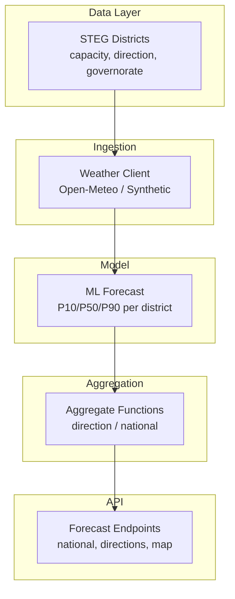
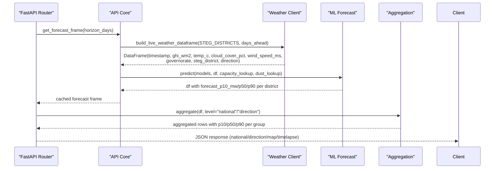
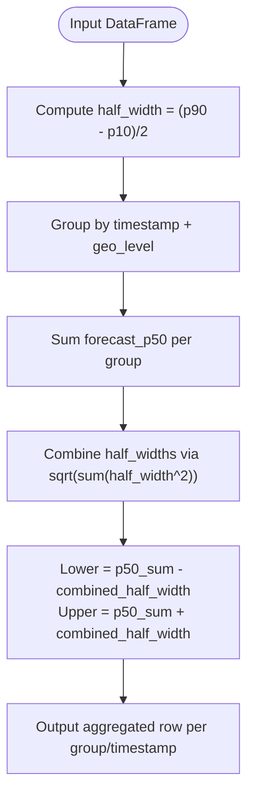
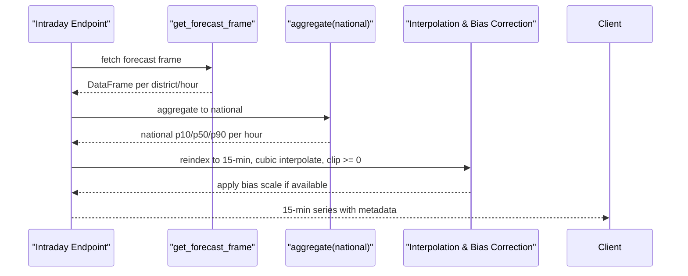
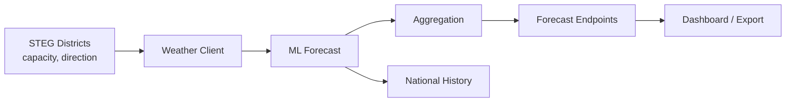

# Aggregation Engine

<cite>
**Referenced Files in This Document**
- [models/aggregation.py](file://models/aggregation.py)
- [data/steg_districts.py](file://data/steg_districts.py)
- [api/routers/forecast.py](file://api/routers/forecast.py)
- [api/core.py](file://api/core.py)
- [ingestion/weather_client.py](file://ingestion/weather_client.py)
- [ingestion/synthetic_data.py](file://ingestion/synthetic_data.py)
- [models/ml_forecast.py](file://models/ml_forecast.py)
- [models/history.py](file://models/history.py)
- [models/validation_report.py](file://models/validation_report.py)
</cite>

## Table of Contents
1. [Introduction](#introduction)
2. [Project Structure](#project-structure)
3. [Core Components](#core-components)
4. [Architecture Overview](#architecture-overview)
5. [Detailed Component Analysis](#detailed-component-analysis)
6. [Dependency Analysis](#dependency-analysis)
7. [Performance Considerations](#performance-considerations)
8. [Troubleshooting Guide](#troubleshooting-guide)
9. [Conclusion](#conclusion)
10. [Appendices](#appendices)

## Introduction
This document explains the multi-level aggregation system that rolls up rooftop PV forecasts from individual STEG commercial districts to Direction de Distribution groups and national totals. It covers:
- The hierarchical aggregation path from district to direction to national
- Uncertainty propagation using sqrt-sum-of-squares for combining per-district uncertainty bands, with notes on spatial correlation of weather errors
- Capacity-weighted feature engineering and temporal alignment across geographic levels
- Data validation checks and error handling
- Examples of aggregated outputs and performance metrics at each level
- Troubleshooting common issues such as missing capacity data or inconsistent timestamps

## Project Structure
The aggregation pipeline is implemented across several modules:
- Forecast generation per district via ML models and weather ingestion
- Aggregation functions that sum point forecasts and combine uncertainty bands by geographic group
- API endpoints exposing aggregated forecasts at multiple levels
- Reference datasets defining STEG districts, directions, capacities, and metadata

**Diagram sources**
- [data/steg_districts.py:61-177](file://data/steg_districts.py#L61-L177)
- [ingestion/weather_client.py:77-130](file://ingestion/weather_client.py#L77-L130)
- [models/ml_forecast.py:118-131](file://models/ml_forecast.py#L118-L131)
- [models/aggregation.py:26-89](file://models/aggregation.py#L26-L89)
- [api/routers/forecast.py:25-158](file://api/routers/forecast.py#L25-L158)

**Section sources**
- [data/steg_districts.py:1-247](file://data/steg_districts.py#L1-L247)
- [ingestion/weather_client.py:1-180](file://ingestion/weather_client.py#L1-L180)
- [models/ml_forecast.py:1-267](file://models/ml_forecast.py#L1-L267)
- [models/aggregation.py:1-164](file://models/aggregation.py#L1-L164)
- [api/routers/forecast.py:1-203](file://api/routers/forecast.py#L1-L203)

## Core Components
- STEG Districts reference: defines 50 commercial districts grouped into 7 Directions, with installed capacity, pending dossiers, dust loss, and geographic coordinates. Provides lookup tables used throughout the pipeline.
- Weather ingestion: builds a unified DataFrame with hourly weather features per district; supports live Open-Meteo or synthetic fallback.
- ML forecasting: trains quantile regression models (P10/P50/P90) per district using engineered features including capacity and dust loss; enforces monotonicity of quantiles.
- Aggregation: sums P50 forecasts within groups and combines uncertainty half-widths via sqrt-sum-of-squares; supports national, direction, governorate, and steg_district levels.
- API layer: exposes aggregated forecasts at multiple levels, including time interpolation and bias correction for intraday windows.

**Section sources**
- [data/steg_districts.py:61-177](file://data/steg_districts.py#L61-L177)
- [ingestion/weather_client.py:77-130](file://ingestion/weather_client.py#L77-L130)
- [models/ml_forecast.py:49-131](file://models/ml_forecast.py#L49-L131)
- [models/aggregation.py:20-89](file://models/aggregation.py#L20-L89)
- [api/routers/forecast.py:25-158](file://api/routers/forecast.py#L25-L158)

## Architecture Overview
The end-to-end flow from raw weather to aggregated forecasts:

**Diagram sources**
- [api/core.py:72-103](file://api/core.py#L72-L103)
- [ingestion/weather_client.py:77-130](file://ingestion/weather_client.py#L77-L130)
- [models/ml_forecast.py:118-131](file://models/ml_forecast.py#L118-L131)
- [models/aggregation.py:26-89](file://models/aggregation.py#L26-L89)
- [api/routers/forecast.py:25-158](file://api/routers/forecast.py#L25-L158)

## Detailed Component Analysis

### Hierarchical Aggregation: District → Direction → National
- Grouping keys: timestamp plus geographic grouping column (steg_district, governorate, direction).
- Point forecast aggregation: sum of P50 within each group per timestamp.
- Uncertainty combination: compute per-row half-width from P10/P90, then combine via sqrt-sum-of-squares to produce lower/upper bounds around the summed P50.
- Levels supported:
  - steg_district: keep per-district rows
  - governorate: group by governorate if present
  - direction: group by Direction de Distribution (7 groups)
  - national: aggregate across all districts per timestamp
  - district: legacy alias mapping to direction

**Diagram sources**
- [models/aggregation.py:20-89](file://models/aggregation.py#L20-L89)

**Section sources**
- [models/aggregation.py:26-89](file://models/aggregation.py#L26-L89)

### Uncertainty Propagation and Spatial Correlation
- Method: sqrt-sum-of-squares of per-district half-widths assumes partial independence of forecast errors across districts.
- Spatial correlation caveat: adjacent districts often share cloud systems, so errors are positively correlated; this approach slightly underestimates true uncertainty compared to a full covariance model.
- Practical implication: national-level uncertainty bands are conservative but may be narrower than physically exact covariance-based combinations.

**Section sources**
- [models/aggregation.py:10-14](file://models/aggregation.py#L10-L14)
- [models/ml_forecast.py:165-172](file://models/ml_forecast.py#L165-L172)

### Capacity-Weighted Feature Engineering
- Capacity lookup: per-district installed capacity (MWc) mapped into features for modeling and utilization calculations.
- Dust loss: per-district soiling loss fraction applied during feature creation and physics approximations.
- Additional features: hour, day-of-year sin/cos, horizon_hours, rolling GHI averages, temperature interactions.
- Utilization metrics: derived at API level as percentage of forecast P50 relative to installed capacity.

**Section sources**
- [data/steg_districts.py:167-177](file://data/steg_districts.py#L167-L177)
- [models/ml_forecast.py:49-94](file://models/ml_forecast.py#L49-L94)
- [api/routers/forecast.py:74-90](file://api/routers/forecast.py#L74-L90)

### Temporal Alignment Across Geographic Levels
- All aggregations align by timestamp; grouping includes timestamp as a key.
- Intraday endpoint interpolates to 15-minute resolution over a rolling window and clips non-negative values.
- Bias correction: optional scaling factor computed from recent metered vs forecasted production, applied to P10/P50/P90 when available.

**Diagram sources**
- [api/routers/forecast.py:35-54](file://api/routers/forecast.py#L35-L54)
- [api/core.py:106-122](file://api/core.py#L106-L122)

**Section sources**
- [api/routers/forecast.py:35-54](file://api/routers/forecast.py#L35-L54)
- [api/core.py:106-122](file://api/core.py#L106-L122)

### Data Validation and Error Handling
- Missing grouping columns raise explicit KeyErrors for unsupported aggregation levels.
- Unknown directions or districts return HTTP 404 with available options.
- Weather ingestion failures fall back to synthetic data; cache state tracks source type.
- Quantile crossing guard ensures p10 ≤ p50 ≤ p90 after prediction.
- Bias correction only applied when recent metered data exists and ratio is valid.

**Section sources**
- [models/aggregation.py:41-65](file://models/aggregation.py#L41-L65)
- [api/routers/forecast.py:64-106](file://api/routers/forecast.py#L64-L106)
- [api/core.py:72-99](file://api/core.py#L72-L99)
- [models/ml_forecast.py:127-131](file://models/ml_forecast.py#L127-L131)
- [api/core.py:106-122](file://api/core.py#L106-L122)

### Example Aggregated Outputs
- National endpoint returns records with timestamp and aggregated p10/p50/p90; optional split adds injected/self-consumed shares.
- Directions endpoint returns aggregated forecasts per Direction de Distribution.
- Map endpoint provides a snapshot with per-district fields including uncertainty ratios and utilization percentages.
- Timelapse endpoint returns frames of snapshots with national totals and per-district metrics.

**Section sources**
- [api/routers/forecast.py:25-32](file://api/routers/forecast.py#L25-L32)
- [api/routers/forecast.py:57-71](file://api/routers/forecast.py#L57-L71)
- [api/routers/forecast.py:131-158](file://api/routers/forecast.py#L131-L158)
- [api/routers/forecast.py:161-179](file://api/routers/forecast.py#L161-L179)

### Performance Metrics at Each Level
- Model-level metrics: MAE, nRMSE (%), P10-P90 coverage computed on daylight hours; saved to results.
- By-horizon evaluation: compares against persistence and clear-sky baselines; includes coverage and sample counts per horizon bucket.
- Historical national history: aggregates actual and forecasted production to hourly national series for dashboard comparison.

**Section sources**
- [models/ml_forecast.py:134-152](file://models/ml_forecast.py#L134-L152)
- [models/ml_forecast.py:155-224](file://models/ml_forecast.py#L155-L224)
- [models/history.py:42-82](file://models/history.py#L42-L82)
- [models/validation_report.py:33-59](file://models/validation_report.py#L33-L59)

## Dependency Analysis
Key dependencies and relationships:
- Aggregation depends on forecast output schema (timestamp, geographic identifiers, p10/p50/p90).
- Forecast generation depends on weather ingestion and ML models trained with capacity and dust features.
- API endpoints depend on aggregation functions and optionally bias correction.
- Reference data (STEG districts) supplies capacity and direction mappings used across modules.

**Diagram sources**
- [data/steg_districts.py:167-177](file://data/steg_districts.py#L167-L177)
- [ingestion/weather_client.py:77-130](file://ingestion/weather_client.py#L77-L130)
- [models/ml_forecast.py:118-131](file://models/ml_forecast.py#L118-L131)
- [models/aggregation.py:26-89](file://models/aggregation.py#L26-L89)
- [api/routers/forecast.py:25-158](file://api/routers/forecast.py#L25-L158)
- [models/history.py:42-82](file://models/history.py#L42-L82)

**Section sources**
- [data/steg_districts.py:167-177](file://data/steg_districts.py#L167-L177)
- [ingestion/weather_client.py:77-130](file://ingestion/weather_client.py#L77-L130)
- [models/ml_forecast.py:118-131](file://models/ml_forecast.py#L118-L131)
- [models/aggregation.py:26-89](file://models/aggregation.py#L26-L89)
- [api/routers/forecast.py:25-158](file://api/routers/forecast.py#L25-L158)
- [models/history.py:42-82](file://models/history.py#L42-L82)

## Performance Considerations
- Concurrent weather fetching reduces latency by parallelizing requests across districts.
- Caching of forecast frames avoids recomputation within short intervals.
- Interpolation to 15-minute cadence improves usability for near-real-time dashboards.
- Bias correction leverages recent metered data to improve accuracy when available.
- Quantile crossing guard prevents invalid uncertainty bands post-prediction.

[No sources needed since this section provides general guidance]

## Troubleshooting Guide
Common issues and resolutions:
- Missing capacity data: ensure capacity lookup contains entries for all districts; otherwise utilization and features may default or fail. Validate district names match reference dataset.
- Inconsistent timestamps: confirm timestamps are timezone-naive and aligned to hourly cadence; intraday endpoint expects contiguous ranges and will interpolate gaps.
- Unknown direction/district: verify input names against available lists; endpoints return 404 with options when mismatch occurs.
- Weather fetch failures: pipeline falls back to synthetic data; check network connectivity and API availability.
- Bias correction not applied: requires recent metered data and valid ratio; absence yields no scaling.

**Section sources**
- [api/routers/forecast.py:64-106](file://api/routers/forecast.py#L64-L106)
- [api/core.py:72-99](file://api/core.py#L72-L99)
- [api/core.py:106-122](file://api/core.py#L106-L122)
- [models/aggregation.py:41-65](file://models/aggregation.py#L41-L65)

## Conclusion
The aggregation engine provides a robust, multi-level rollup of rooftop PV forecasts from STEG commercial districts to Direction de Distribution groups and national totals. It combines point forecasts via summation and propagates uncertainty using sqrt-sum-of-squares, acknowledging spatial correlation limitations. Capacity-weighted features and temporal alignment ensure consistent processing across geographic levels, while API endpoints expose flexible outputs for dashboards and exports. Validation and error handling maintain reliability under varying data conditions.

[No sources needed since this section summarizes without analyzing specific files]

## Appendices

### API Endpoints Summary
- National forecast: GET /forecast/national
- Intraday forecast: GET /forecast/intraday
- All directions: GET /forecast/directions
- Specific direction: GET /forecast/direction/{direction}
- Specific district: GET /forecast/steg-district/{name}
- Legacy district: GET /forecast/district/{district}
- All districts: GET /forecast/districts
- Governorate: GET /forecast/governorate/{governorate}
- Map snapshot: GET /forecast/map
- Timelapse: GET /forecast/timelapse
- Export: POST /grid/export/forecast

**Section sources**
- [api/routers/forecast.py:25-203](file://api/routers/forecast.py#L25-L203)