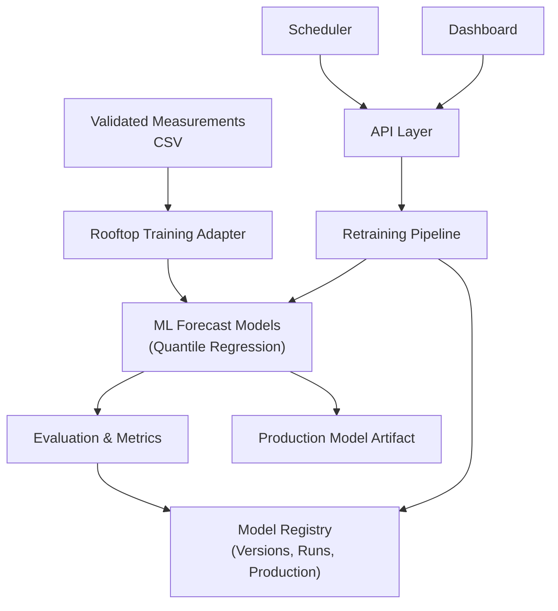
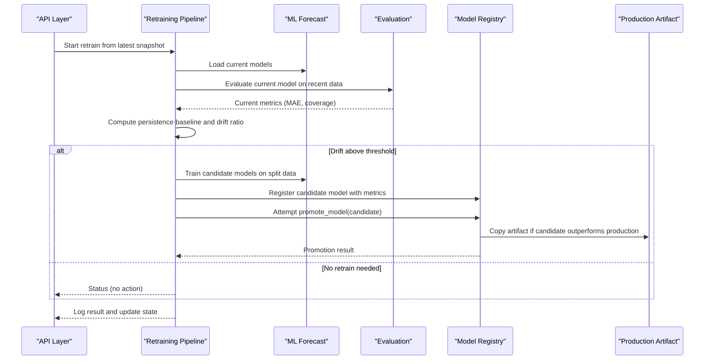
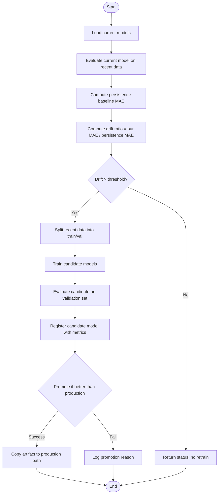
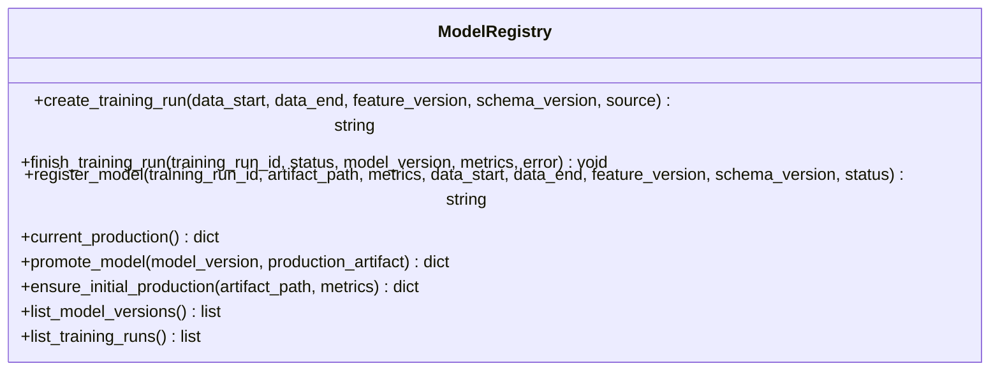
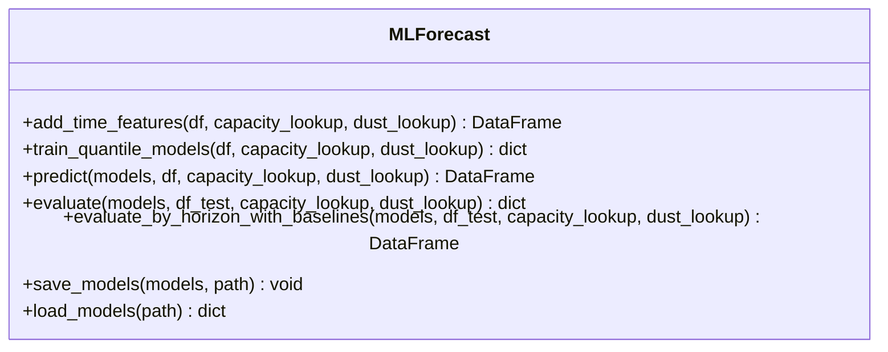
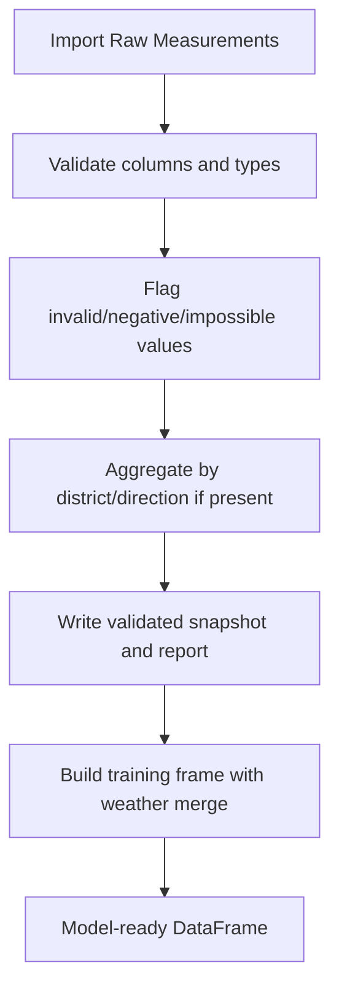
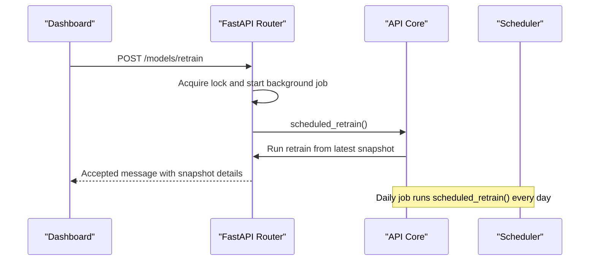
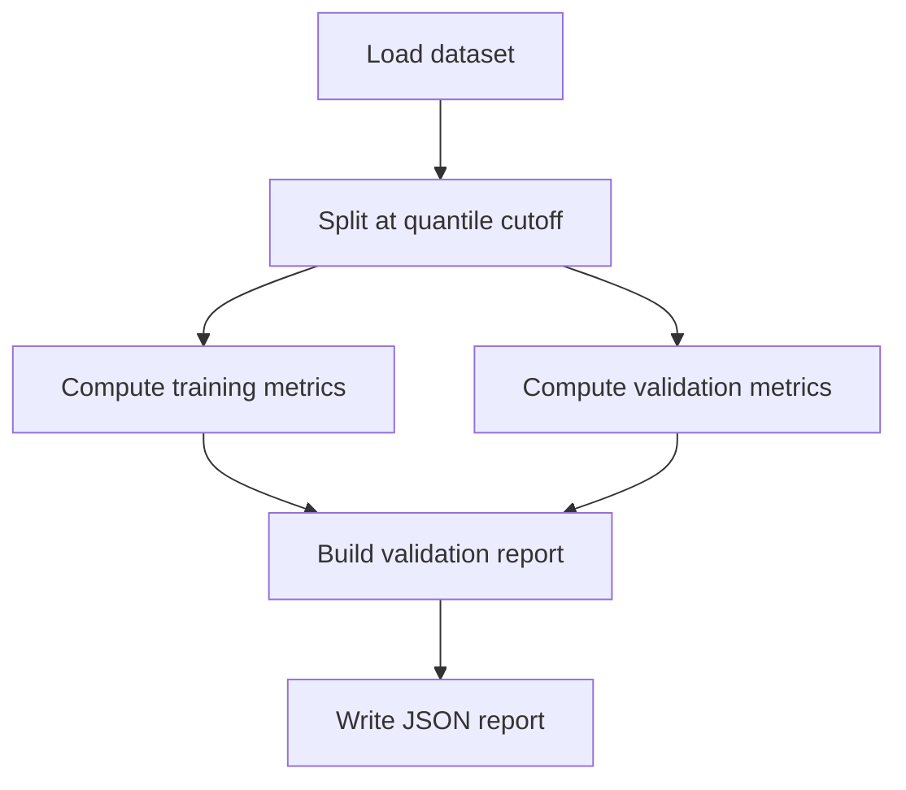
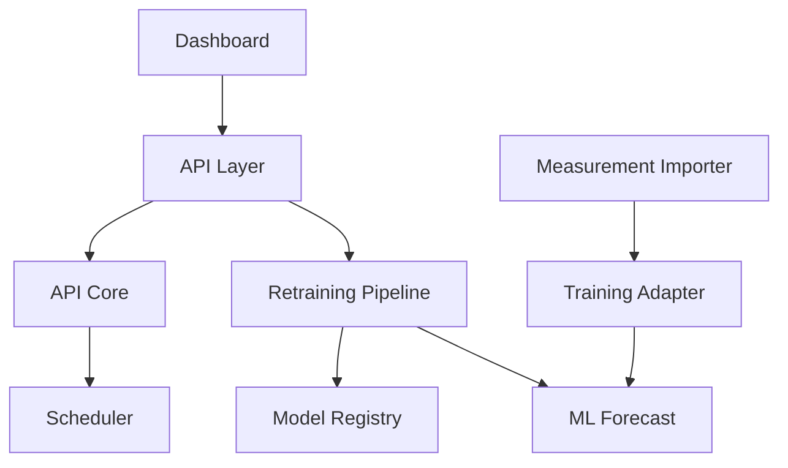

# Continuous Learning System

<cite>
**Referenced Files in This Document**
- [models/retrain.py](file://models/retrain.py)
- [models/model_registry.py](file://models/model_registry.py)
- [models/ml_forecast.py](file://models/ml_forecast.py)
- [api/routers/learning.py](file://api/routers/learning.py)
- [api/core.py](file://api/core.py)
- [reports/measurement_importer.py](file://reports/measurement_importer.py)
- [models/rooftop_training_adapter.py](file://models/rooftop_training_adapter.py)
- [reports/forecast_evaluator.py](file://reports/forecast_evaluator.py)
- [models/validation_report.py](file://models/validation_report.py)
- [results/model_registry/model_versions.json](file://results/model_registry/model_versions.json)
- [results/model_registry/production_model.json](file://results/model_registry/production_model.json)
- [dashboard/assets/js/performance.js](file://dashboard/assets/js/performance.js)
</cite>

## Table of Contents
1. [Introduction](#introduction)
2. [Project Structure](#project-structure)
3. [Core Components](#core-components)
4. [Architecture Overview](#architecture-overview)
5. [Detailed Component Analysis](#detailed-component-analysis)
6. [Dependency Analysis](#dependency-analysis)
7. [Performance Considerations](#performance-considerations)
8. [Troubleshooting Guide](#troubleshooting-guide)
9. [Conclusion](#conclusion)
10. [Appendices](#appendices)

## Introduction
This document describes the continuous learning system that monitors forecast accuracy, detects drift against a persistence baseline, and automatically retrains models when performance degrades beyond configured thresholds. It also documents the model registry for versioning trained models, tracking metrics across versions, and promoting safe production deployments. The system includes data preparation from validated rooftop measurements, training with updated datasets, validation procedures, and automated or manual retraining triggers exposed via API endpoints. Configuration options include retraining schedules, drift detection sensitivity, and rollback behavior through immutable artifacts and promotion policies.

## Project Structure
The continuous learning system spans several modules:
- Data ingestion and validation layer to produce validated measurement snapshots
- Training adapter to convert validated measurements into model-ready frames
- Forecast model module implementing quantile regression and evaluation
- Retraining pipeline that evaluates drift and trains candidates
- Model registry that records versions, training runs, and promotes production
- API layer exposing endpoints to trigger retraining and query status
- Scheduler integration for periodic refresh and daily retraining checks
- Dashboard UI components to visualize performance and registry state

**Diagram sources**
- [models/rooftop_training_adapter.py:26-88](file://models/rooftop_training_adapter.py#L26-L88)
- [models/ml_forecast.py:97-152](file://models/ml_forecast.py#L97-L152)
- [models/retrain.py:40-104](file://models/retrain.py#L40-L104)
- [models/model_registry.py:35-160](file://models/model_registry.py#L35-L160)
- [api/routers/learning.py:122-162](file://api/routers/learning.py#L122-L162)
- [api/core.py:125-159](file://api/core.py#L125-L159)

**Section sources**
- [models/rooftop_training_adapter.py:26-88](file://models/rooftop_training_adapter.py#L26-L88)
- [models/ml_forecast.py:97-152](file://models/ml_forecast.py#L97-L152)
- [models/retrain.py:40-104](file://models/retrain.py#L40-L104)
- [models/model_registry.py:35-160](file://models/model_registry.py#L35-L160)
- [api/routers/learning.py:122-162](file://api/routers/learning.py#L122-L162)
- [api/core.py:125-159](file://api/core.py#L125-L159)

## Core Components
- Drift detection and retraining: Evaluates current model MAE versus a persistence baseline on recent data; if drift exceeds threshold, trains candidate models and attempts promotion.
- Model registry: Immutable file-based registry storing model versions, training runs, and production artifact references with metrics and timestamps.
- Forecast model: Gradient-boosted quantile regression (P10/P50/P90) with feature engineering and evaluation functions.
- Measurement import and validation: Validates raw measurements, flags quality issues, and writes validated snapshots used by training.
- API endpoints: Expose manual retraining triggers, status queries, and model registry access.
- Scheduler: Background jobs periodically refresh forecasts and run daily retraining checks.

**Section sources**
- [models/retrain.py:40-104](file://models/retrain.py#L40-L104)
- [models/model_registry.py:35-160](file://models/model_registry.py#L35-L160)
- [models/ml_forecast.py:97-152](file://models/ml_forecast.py#L97-L152)
- [reports/measurement_importer.py:37-119](file://reports/measurement_importer.py#L37-L119)
- [api/routers/learning.py:122-162](file://api/routers/learning.py#L122-L162)
- [api/core.py:125-159](file://api/core.py#L125-L159)

## Architecture Overview
The system implements a closed-loop continuous learning process:
- Ingest validated measurements and build training frames
- Evaluate current model performance on recent data
- Compare against persistence baseline to compute drift ratio
- If drift is above threshold, train candidate models and register them
- Promote candidate only if it improves over current production
- Update production artifact safely and log outcomes

**Diagram sources**
- [api/routers/learning.py:31-49](file://api/routers/learning.py#L31-L49)
- [models/retrain.py:40-104](file://models/retrain.py#L40-L104)
- [models/model_registry.py:104-131](file://models/model_registry.py#L104-L131)

## Detailed Component Analysis

### Drift Detection and Retraining Pipeline
- Monitors forecast accuracy degradation by computing MAE on daylight hours using the current model and comparing it to a persistence baseline derived from recent measurements.
- Uses a configurable drift threshold percentage to decide whether to retrain.
- Splits recent data into training and validation sets at a quantile cutoff to ensure temporal separation.
- Trains candidate models and registers them with metrics; promotes only if candidate improves over production.

**Diagram sources**
- [models/retrain.py:40-104](file://models/retrain.py#L40-L104)

**Section sources**
- [models/retrain.py:40-104](file://models/retrain.py#L40-L104)

### Model Registry System
- Stores immutable records of model versions and training runs with timestamps, artifact paths, feature/schema versions, and metrics.
- Ensures initial production baseline exists so candidates can be compared.
- Promotes a candidate only if its MAE is strictly better than current production; otherwise raises an error and logs the reason.
- Maintains separate files for model versions, training runs, and current production record.

**Diagram sources**
- [models/model_registry.py:35-160](file://models/model_registry.py#L35-L160)

**Section sources**
- [models/model_registry.py:35-160](file://models/model_registry.py#L35-L160)
- [results/model_registry/model_versions.json:1-35](file://results/model_registry/model_versions.json#L1-L35)
- [results/model_registry/production_model.json:1-18](file://results/model_registry/production_model.json#L1-L18)

### Forecast Model and Evaluation
- Implements gradient-boosted quantile regression for P10/P50/P90 forecasts with extended features including temperature interactions and rolling averages.
- Provides prediction, evaluation (MAE, nRMSE, coverage), and horizon-based backtesting against persistence and clear-sky baselines.
- Saves and loads model artifacts for reuse in production and retraining.

**Diagram sources**
- [models/ml_forecast.py:49-152](file://models/ml_forecast.py#L49-L152)
- [models/ml_forecast.py:155-233](file://models/ml_forecast.py#L155-L233)

**Section sources**
- [models/ml_forecast.py:49-152](file://models/ml_forecast.py#L49-L152)
- [models/ml_forecast.py:155-233](file://models/ml_forecast.py#L155-L233)

### Data Preparation and Validation
- Measurement importer validates raw CSVs, flags quality issues, aggregates by district/direction when available, and writes validated snapshots under results.
- Rooftop training adapter converts validated measurements into canonical training schema required by the model, merging weather data when necessary.

**Diagram sources**
- [reports/measurement_importer.py:37-119](file://reports/measurement_importer.py#L37-L119)
- [models/rooftop_training_adapter.py:26-88](file://models/rooftop_training_adapter.py#L26-L88)

**Section sources**
- [reports/measurement_importer.py:37-119](file://reports/measurement_importer.py#L37-L119)
- [models/rooftop_training_adapter.py:26-88](file://models/rooftop_training_adapter.py#L26-L88)

### API and Scheduling Integration
- API exposes endpoints to push metering rows, trigger manual retraining, query retrain status, and access model registry information.
- Background scheduler refreshes forecasts periodically and triggers daily retraining checks.
- Retraining runs asynchronously with thread-safe locking to avoid concurrent executions.

**Diagram sources**
- [api/routers/learning.py:122-162](file://api/routers/learning.py#L122-L162)
- [api/core.py:125-159](file://api/core.py#L125-L159)

**Section sources**
- [api/routers/learning.py:122-162](file://api/routers/learning.py#L122-L162)
- [api/core.py:125-159](file://api/core.py#L125-L159)

### Validation Reports and Backtesting
- Builds validation reports splitting data into training and validation periods, computing pinball loss, MAE, RMSE, nRMSE, accuracy, and coverage.
- Supports evaluation of forecast snapshots against actual measurements, producing summaries by location, horizon bucket, and geographic groups.

**Diagram sources**
- [models/validation_report.py:22-82](file://models/validation_report.py#L22-L82)
- [reports/forecast_evaluator.py:119-189](file://reports/forecast_evaluator.py#L119-L189)

**Section sources**
- [models/validation_report.py:22-82](file://models/validation_report.py#L22-L82)
- [reports/forecast_evaluator.py:119-189](file://reports/forecast_evaluator.py#L119-L189)

## Dependency Analysis
Key dependencies and relationships:
- Retraining depends on ML forecast model for training and evaluation, and on the model registry for versioning and promotion.
- API layer depends on core state and scheduling to orchestrate retraining and forecast generation.
- Data preparation depends on validated measurement snapshots and optional weather data.
- Dashboard consumes API endpoints to display performance, registry, and retrain status.

**Diagram sources**
- [models/retrain.py:40-104](file://models/retrain.py#L40-L104)
- [models/ml_forecast.py:97-152](file://models/ml_forecast.py#L97-L152)
- [models/model_registry.py:35-160](file://models/model_registry.py#L35-L160)
- [api/routers/learning.py:122-162](file://api/routers/learning.py#L122-L162)
- [api/core.py:125-159](file://api/core.py#L125-L159)
- [reports/measurement_importer.py:37-119](file://reports/measurement_importer.py#L37-L119)
- [models/rooftop_training_adapter.py:26-88](file://models/rooftop_training_adapter.py#L26-L88)
- [dashboard/assets/js/performance.js:212-255](file://dashboard/assets/js/performance.js#L212-L255)

**Section sources**
- [models/retrain.py:40-104](file://models/retrain.py#L40-L104)
- [models/ml_forecast.py:97-152](file://models/ml_forecast.py#L97-L152)
- [models/model_registry.py:35-160](file://models/model_registry.py#L35-L160)
- [api/routers/learning.py:122-162](file://api/routers/learning.py#L122-L162)
- [api/core.py:125-159](file://api/core.py#L125-L159)
- [reports/measurement_importer.py:37-119](file://reports/measurement_importer.py#L37-L119)
- [models/rooftop_training_adapter.py:26-88](file://models/rooftop_training_adapter.py#L26-L88)
- [dashboard/assets/js/performance.js:212-255](file://dashboard/assets/js/performance.js#L212-L255)

## Performance Considerations
- Quantile regression models use gradient boosting with tuned hyperparameters; training time scales with dataset size and number of quantiles.
- Feature engineering includes rolling windows and groupby operations; ensure data is sorted by timestamp within governorate to avoid incorrect windows.
- Persistence baseline computation uses groupby shifts; large datasets may benefit from indexing and efficient sorting.
- Model promotion enforces strict improvement over production to prevent regressions; consider adding additional metrics (e.g., coverage) for multi-criteria promotion decisions.
- Background scheduling avoids frequent redundant work; cache forecasts and models to reduce load.

[No sources needed since this section provides general guidance]

## Troubleshooting Guide
Common issues and resolutions:
- Missing validated measurements: Ensure a validated snapshot exists before triggering retraining; the API will return an error if none are found.
- Weather data mismatch: Training requires weather columns; provide weather data or include them in the validated measurement snapshot.
- Promotion failures: Candidate must improve MAE over production; review metrics and consider adjusting thresholds or data quality.
- Scheduler not running: APScheduler may not be installed; background refresh and daily retraining will be disabled in that case.
- API authentication: Requests require a valid X-API-Key header; invalid keys will be rejected.

**Section sources**
- [api/routers/learning.py:77-130](file://api/routers/learning.py#L77-L130)
- [models/rooftop_training_adapter.py:26-88](file://models/rooftop_training_adapter.py#L26-L88)
- [models/model_registry.py:104-131](file://models/model_registry.py#L104-L131)
- [api/core.py:142-159](file://api/core.py#L142-L159)
- [api/core.py:49-52](file://api/core.py#L49-L52)

## Conclusion
The continuous learning system provides robust monitoring, drift detection, and automated retraining with safe promotion policies. It integrates data validation, model training, evaluation, and registry management into a cohesive pipeline. The API and dashboard enable operational control and visibility, while scheduling ensures ongoing maintenance. Configuration options allow tuning drift sensitivity and retraining frequency, and rollback is handled through immutable artifacts and strict promotion criteria.

[No sources needed since this section summarizes without analyzing specific files]

## Appendices

### Configuration Options
- Drift threshold: Configurable percentage controlling when retraining is triggered based on drift ratio relative to persistence baseline.
- Retraining schedule: Daily background job triggers retraining from the latest validated snapshot; can be adjusted or disabled depending on deployment needs.
- Promotion policy: Candidates must outperform current production by MAE; additional metrics can be added for stricter criteria.
- Rollback procedure: Promotion copies artifacts atomically; failed promotions retain previous production artifact, enabling immediate rollback by reverting to prior version.

**Section sources**
- [models/retrain.py:37-69](file://models/retrain.py#L37-L69)
- [api/core.py:125-159](file://api/core.py#L125-L159)
- [models/model_registry.py:104-131](file://models/model_registry.py#L104-L131)