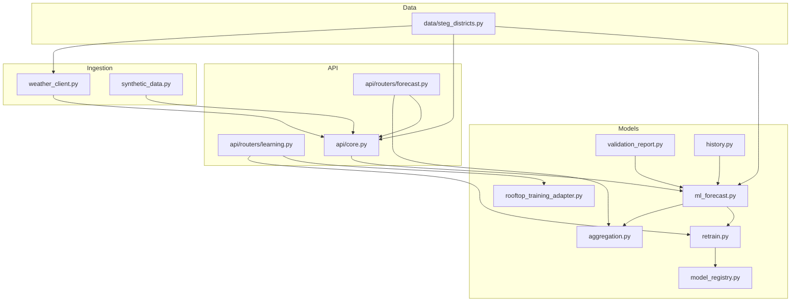
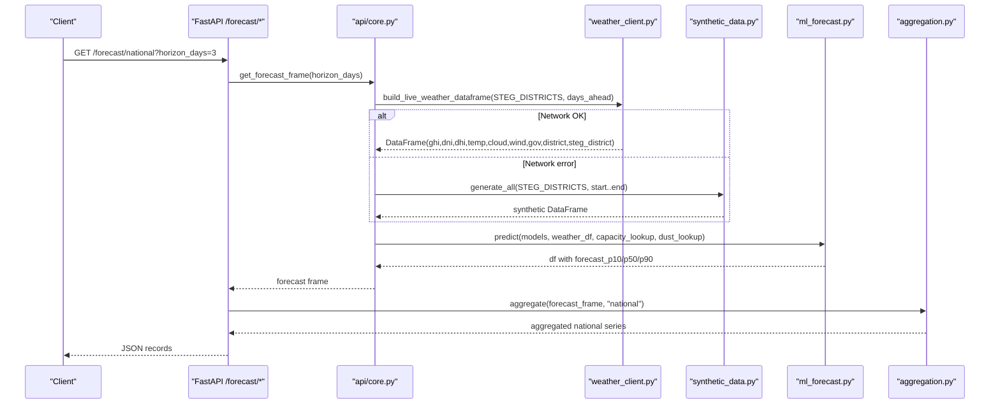
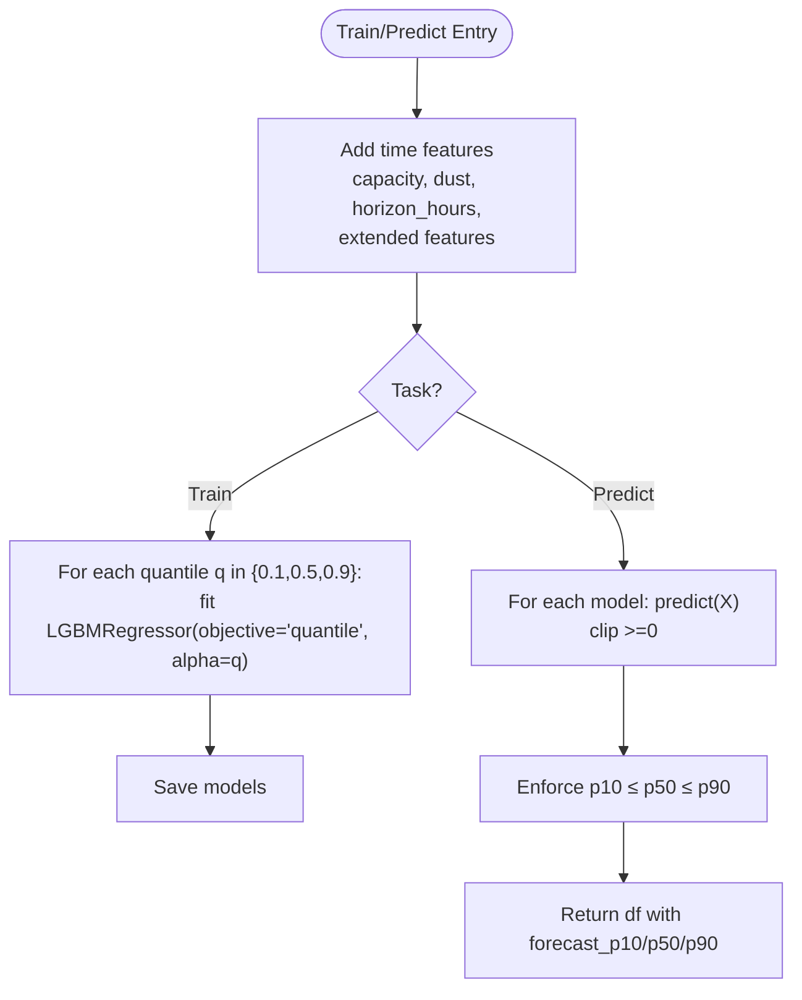
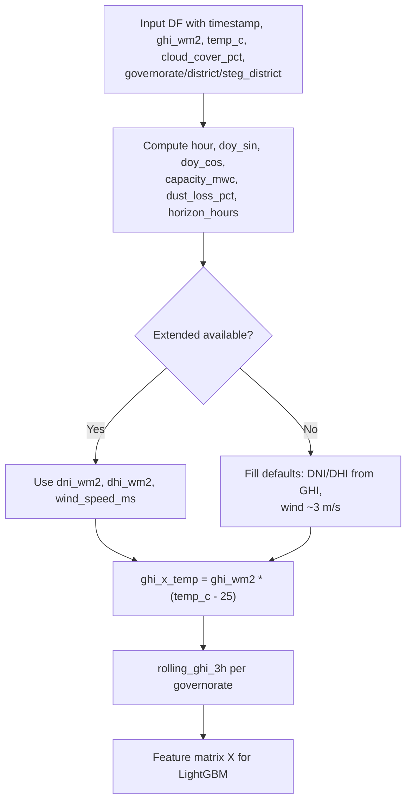
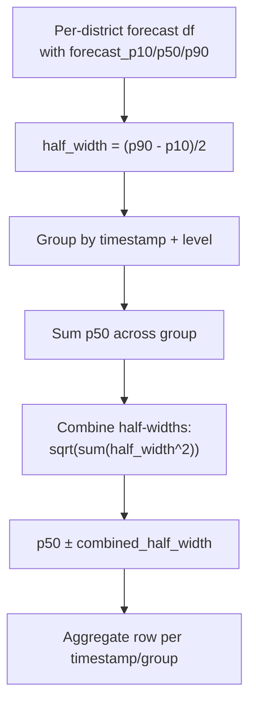
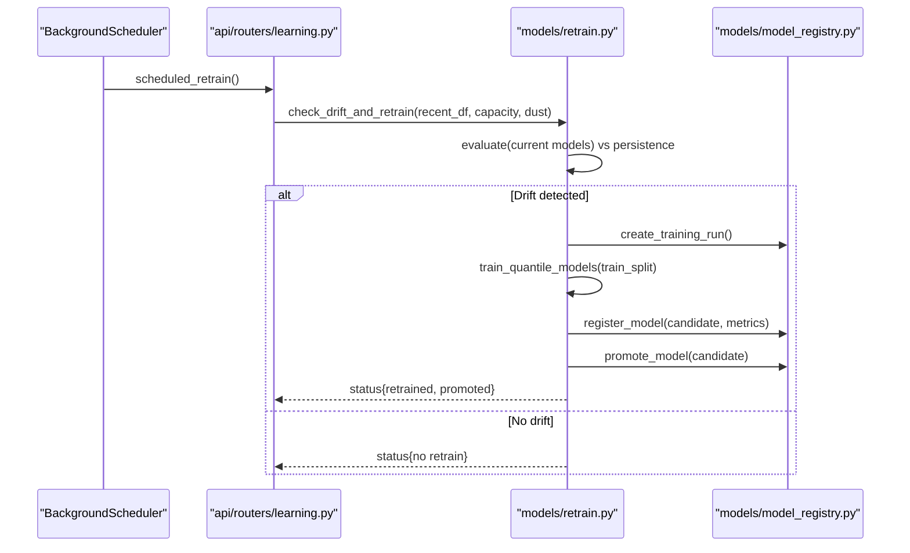
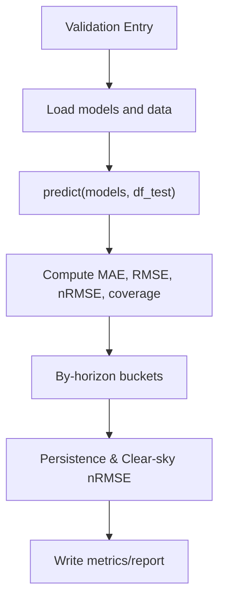
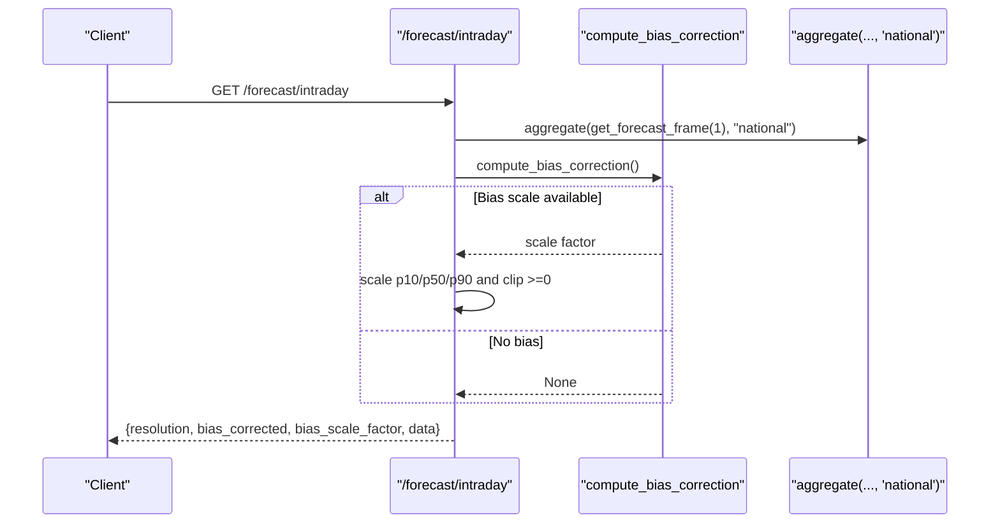
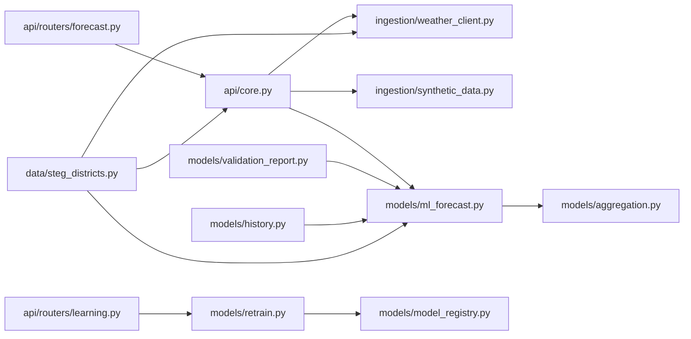

# Forecasting Engine

<cite>
**Referenced Files in This Document**
- [ml_forecast.py](file://models/ml_forecast.py)
- [aggregation.py](file://models/aggregation.py)
- [retrain.py](file://models/retrain.py)
- [validation_report.py](file://models/validation_report.py)
- [model_registry.py](file://models/model_registry.py)
- [rooftop_training_adapter.py](file://models/rooftop_training_adapter.py)
- [history.py](file://models/history.py)
- [forecast.py](file://api/routers/forecast.py)
- [learning.py](file://api/routers/learning.py)
- [core.py](file://api/core.py)
- [weather_client.py](file://ingestion/weather_client.py)
- [synthetic_data.py](file://ingestion/synthetic_data.py)
- [steg_districts.py](file://data/steg_districts.py)
- [README.md](file://README.md)
</cite>

## Table of Contents
1. [Introduction](#introduction)
2. [Project Structure](#project-structure)
3. [Core Components](#core-components)
4. [Architecture Overview](#architecture-overview)
5. [Detailed Component Analysis](#detailed-component-analysis)
6. [Dependency Analysis](#dependency-analysis)
7. [Performance Considerations](#performance-considerations)
8. [Troubleshooting Guide](#troubleshooting-guide)
9. [Conclusion](#conclusion)
10. [Appendices](#appendices)

## Introduction
This document explains the forecasting engine for Tunisia’s multi-horizon rooftop solar prediction system. It covers:
- LightGBM quantile regression to produce P10/P50/P90 uncertainty bands per horizon
- Horizon-aware feature engineering including temperature derating and regional dust losses specific to Tunisia
- Model training pipeline, validation against persistence and clear-sky baselines, and continuous learning with drift detection
- Aggregation from district-level forecasts to direction and national levels with proper uncertainty propagation
- Configuration options for model parameters, retraining triggers, and performance tuning
- API integration patterns and example outputs

The platform supports intra-day to D+3 forecasts at district, governorate, and national levels, with calibrated uncertainty that widens realistically with lead time.

**Section sources**
- [README.md:1-31](file://README.md#L1-L31)

## Project Structure
At a high level:
- Ingestion: weather data (real Open-Meteo or synthetic), historical PVGIS datasets
- Models: ML forecasting, aggregation, retraining, validation reporting, model registry
- API: FastAPI endpoints serving forecasts, exports, and continuous learning controls
- Data: STEG district metadata, capacities, dust loss rates, directions

**Diagram sources**
- [weather_client.py:77-130](file://ingestion/weather_client.py#L77-L130)
- [synthetic_data.py:119-159](file://ingestion/synthetic_data.py#L119-L159)
- [core.py:72-99](file://api/core.py#L72-L99)
- [ml_forecast.py:97-131](file://models/ml_forecast.py#L97-L131)
- [aggregation.py:26-89](file://models/aggregation.py#L26-L89)
- [retrain.py:40-104](file://models/retrain.py#L40-L104)
- [model_registry.py:35-131](file://models/model_registry.py#L35-L131)
- [forecast.py:25-158](file://api/routers/forecast.py#L25-L158)
- [learning.py:31-130](file://api/routers/learning.py#L31-L130)
- [steg_districts.py:153-176](file://data/steg_districts.py#L153-L176)

**Section sources**
- [README.md:75-95](file://README.md#L75-L95)

## Core Components
- Quantile forecasting model: trains three LightGBM models per horizon for P10/P50/P90 using horizon-aware features
- Aggregation engine: rolls up district forecasts to direction and national levels with uncertainty propagation
- Continuous learning: drift detection vs persistence baseline; automatic retraining and promotion via model registry
- Validation: metrics on p50 (MAE, nRMSE), coverage of P10–P90, by-horizon evaluation vs persistence and clear-sky baselines
- API layer: REST endpoints for national/direction/district forecasts, map/timelapse views, export, and retraining control

Key responsibilities:
- Feature engineering: time-of-day, seasonality, capacity, dust loss, horizon hours, GHI×temperature interaction, rolling GHI, optional DNI/DHI/wind
- Uncertainty handling: enforce monotonicity across quantiles; combine half-widths via sqrt-sum-of-squares when aggregating
- Baseline comparisons: persistence (24h lag) and clear-sky physics upper bound without cloud attenuation

**Section sources**
- [ml_forecast.py:32-46](file://models/ml_forecast.py#L32-L46)
- [ml_forecast.py:97-131](file://models/ml_forecast.py#L97-L131)
- [aggregation.py:20-89](file://models/aggregation.py#L20-L89)
- [retrain.py:40-104](file://models/retrain.py#L40-L104)
- [validation_report.py:33-59](file://models/validation_report.py#L33-L59)

## Architecture Overview
End-to-end flow from weather ingestion to forecast delivery and continuous learning:

**Diagram sources**
- [forecast.py:25-32](file://api/routers/forecast.py#L25-L32)
- [core.py:72-99](file://api/core.py#L72-L99)
- [weather_client.py:77-130](file://ingestion/weather_client.py#L77-L130)
- [synthetic_data.py:119-159](file://ingestion/synthetic_data.py#L119-L159)
- [ml_forecast.py:118-131](file://models/ml_forecast.py#L118-L131)
- [aggregation.py:26-89](file://models/aggregation.py#L26-L89)

## Detailed Component Analysis

### Multi-Horizon LightGBM Quantile Regression (P10/P50/P90)
- Trains three separate LGBMRegressor models per horizon label (p10, p50, p90) using quantile objective with alpha set to the target quantile
- Features include base columns (GHI, temperature, cloud cover, hour, seasonal sin/cos, capacity, dust loss, horizon hours) plus extended features (DNI/DHI, wind speed, GHI×temperature interaction, rolling 3-hour GHI per governorate)
- Predictions are clipped to non-negative values and quantile crossing is enforced by sorting predictions across p10/p50/p90
- Evaluation computes MAE and nRMSE on daylight hours for p50, plus P10–P90 coverage percentage
- By-horizon backtest compares against persistence (24h lag) and clear-sky baseline (physics-based output ignoring clouds)

**Diagram sources**
- [ml_forecast.py:49-94](file://models/ml_forecast.py#L49-L94)
- [ml_forecast.py:97-131](file://models/ml_forecast.py#L97-L131)

**Section sources**
- [ml_forecast.py:32-46](file://models/ml_forecast.py#L32-L46)
- [ml_forecast.py:97-131](file://models/ml_forecast.py#L97-L131)
- [ml_forecast.py:155-224](file://models/ml_forecast.py#L155-L224)

### Horizon-Aware Feature Engineering
- Time features: hour, day-of-year sin/cos, horizon_hours (lead time in hours)
- Capacity and dust: installed capacity per district/governorate and dust loss percentages tuned for Tunisia’s arid regions
- Extended features: DNI/DHI split (defaults if missing), wind speed (defaults if missing), GHI×temperature interaction capturing efficiency drop at high temperatures, rolling 3-hour GHI per governorate to smooth transient clouds
- Synthetic data simulates NWP skill degradation by adding horizon-dependent noise to GHI, temperature, and cloud cover, enabling the model to learn widening uncertainty with lead time

**Diagram sources**
- [ml_forecast.py:49-94](file://models/ml_forecast.py#L49-L94)
- [synthetic_data.py:104-116](file://ingestion/synthetic_data.py#L104-L116)

**Section sources**
- [ml_forecast.py:49-94](file://models/ml_forecast.py#L49-L94)
- [synthetic_data.py:104-116](file://ingestion/synthetic_data.py#L104-L116)

### Aggregation Engine (District → Direction → National)
- Groups forecasts by timestamp and grouping key (national, direction, steg_district, governorate, legacy district)
- Computes sum of p50 and combines uncertainty bands using sqrt-sum-of-squares of per-district half-widths, assuming partial independence of errors
- Provides an alternate aggregator that also carries mean weather variables per group for visualization

**Diagram sources**
- [aggregation.py:20-89](file://models/aggregation.py#L20-L89)

**Section sources**
- [aggregation.py:20-89](file://models/aggregation.py#L20-L89)

### Continuous Learning and Drift Detection
- Compares recent model MAE against persistence baseline MAE; if model error is within a threshold of persistence (drift ratio), triggers retraining
- Retraining uses a train/validation split on recent data, evaluates candidate models, registers them in the model registry, and promotes only if they outperform current production
- Background scheduler triggers daily retraining; manual trigger via API; state logged to CSV

**Diagram sources**
- [core.py:125-139](file://api/core.py#L125-L139)
- [learning.py:31-130](file://api/routers/learning.py#L31-L130)
- [retrain.py:40-104](file://models/retrain.py#L40-L104)
- [model_registry.py:35-131](file://models/model_registry.py#L35-L131)

**Section sources**
- [retrain.py:40-104](file://models/retrain.py#L40-L104)
- [learning.py:31-130](file://api/routers/learning.py#L31-L130)
- [model_registry.py:35-131](file://models/model_registry.py#L35-L131)

### Validation Procedures and Baselines
- Overall metrics: MAE_MW, nRMSE_% on daylight hours for p50; P10–P90 coverage_%
- By-horizon evaluation: buckets (nowcast, +6h, J+1, J+2, J+3) comparing nRMSE of our model vs persistence and clear-sky baselines; coverage maintained
- Historical validation: builds hourly dataset from PVGIS, aggregates to national, computes pinball loss, MAE, RMSE, nRMSE, accuracy, coverage

**Diagram sources**
- [ml_forecast.py:134-224](file://models/ml_forecast.py#L134-L224)
- [validation_report.py:33-59](file://models/validation_report.py#L33-L59)

**Section sources**
- [ml_forecast.py:134-224](file://models/ml_forecast.py#L134-L224)
- [validation_report.py:33-59](file://models/validation_report.py#L33-L59)

### API Integration Patterns
- National forecast: returns aggregated national series with timestamps and P10/P50/P90
- Intraday: 15-minute window with cubic interpolation and optional bias correction based on recent metering buffer
- Directions and districts: filtered aggregated forecasts with 404 handling for unknown names
- Map and timelapse: snapshots with utilization and uncertainty ratios, plus weather fields
- Export: CSV/XML streaming for any supported level
- Bias correction: scales forecasts by recent actual-to-predicted ratio when metering buffer exists

**Diagram sources**
- [forecast.py:35-54](file://api/routers/forecast.py#L35-L54)
- [core.py:106-122](file://api/core.py#L106-L122)

**Section sources**
- [forecast.py:25-158](file://api/routers/forecast.py#L25-L158)
- [core.py:106-122](file://api/core.py#L106-L122)

## Dependency Analysis
Key dependencies and coupling:
- API depends on core for forecast building and caching; core depends on weather_client or synthetic_data for inputs; both feed into ml_forecast.predict
- Aggregation depends on ml_forecast outputs and uses district metadata for grouping keys
- Retraining depends on model registry for versioning and promotion; learning router orchestrates background jobs and logs
- Validation and history modules depend on ml_forecast and model artifacts

**Diagram sources**
- [forecast.py:25-158](file://api/routers/forecast.py#L25-L158)
- [core.py:72-99](file://api/core.py#L72-L99)
- [weather_client.py:77-130](file://ingestion/weather_client.py#L77-L130)
- [synthetic_data.py:119-159](file://ingestion/synthetic_data.py#L119-L159)
- [ml_forecast.py:97-131](file://models/ml_forecast.py#L97-L131)
- [aggregation.py:26-89](file://models/aggregation.py#L26-L89)
- [learning.py:31-130](file://api/routers/learning.py#L31-L130)
- [retrain.py:40-104](file://models/retrain.py#L40-L104)
- [model_registry.py:35-131](file://models/model_registry.py#L35-L131)
- [validation_report.py:33-59](file://models/validation_report.py#L33-L59)
- [history.py:42-82](file://models/history.py#L42-L82)
- [steg_districts.py:153-176](file://data/steg_districts.py#L153-L176)

**Section sources**
- [core.py:72-99](file://api/core.py#L72-L99)
- [ml_forecast.py:97-131](file://models/ml_forecast.py#L97-L131)
- [aggregation.py:26-89](file://models/aggregation.py#L26-L89)
- [retrain.py:40-104](file://models/retrain.py#L40-L104)
- [model_registry.py:35-131](file://models/model_registry.py#L35-L131)

## Performance Considerations
- Feature computation includes per-governorate rolling windows; ensure data is sorted by timestamp within groups before transformation
- Quantile crossing guard sorts predictions post-inference; avoid downstream logic relying on strict ordering beyond this step
- Aggregation assumes partial independence of district errors; spatial correlation may understate true uncertainty for adjacent regions
- Bias correction uses recent metering buffer; ensure sufficient samples and reasonable scaling bounds to avoid instability
- Background refresh runs every 15 minutes; consider cache age thresholds and concurrency limits for high-frequency calls

[No sources needed since this section provides general guidance]

## Troubleshooting Guide
Common issues and resolutions:
- Unknown district/direction: endpoints raise 404; verify names against STEG district list and direction enumeration
- No forecast data for intraday window: ensure weather ingestion succeeded and cache contains rows; force refresh via endpoint
- Retraining failures: check retrain log and state; ensure validated measurement snapshot exists and has required columns; review error messages in retrain state
- Model not loaded: ensure model artifact exists and is loadable; API caches models in memory; restart service after promotion

**Section sources**
- [forecast.py:64-87](file://api/routers/forecast.py#L64-L87)
- [forecast.py:93-106](file://api/routers/forecast.py#L93-L106)
- [forecast.py:118-128](file://api/routers/forecast.py#L118-L128)
- [forecast.py:182-186](file://api/routers/forecast.py#L182-L186)
- [learning.py:77-130](file://api/routers/learning.py#L77-L130)
- [model_registry.py:104-131](file://models/model_registry.py#L104-L131)

## Conclusion
The forecasting engine delivers robust, horizon-aware multi-horizon solar forecasts with calibrated uncertainty bands, validated against strong baselines and continuously improved through drift detection and automated retraining. The aggregation engine ensures accurate roll-ups to direction and national levels with sensible uncertainty propagation. The API exposes clean integration points for grid operations and dashboards, while the model registry maintains traceability and safe promotion policies.

[No sources needed since this section summarizes without analyzing specific files]

## Appendices

### Configuration Options
- Model parameters: number of estimators, max depth, learning rate, num leaves, min child samples, subsample, colsample_bytree, quantile alpha per model
- Retraining triggers: drift threshold percentage relative to persistence baseline; schedule interval (daily); manual trigger via API
- Performance tuning: feature selection (base vs extended), rolling window size, horizon bucket definitions, bias correction thresholds

**Section sources**
- [ml_forecast.py:105-113](file://models/ml_forecast.py#L105-L113)
- [retrain.py:36-38](file://models/retrain.py#L36-L38)
- [synthetic_data.py:87-101](file://ingestion/synthetic_data.py#L87-L101)
- [core.py:106-122](file://api/core.py#L106-L122)

### Example Outputs and Metrics
- Forecast outputs: national, direction, district, governorate series with timestamps and P10/P50/P90; map/timelapse frames with utilization and uncertainty ratios; export formats CSV/XML
- Accuracy metrics: MAE_MW, nRMSE_%, P10–P90 coverage_%; by-horizon nRMSE vs persistence and clear-sky; pinball loss, RMSE, accuracy_% in validation report

**Section sources**
- [forecast.py:25-158](file://api/routers/forecast.py#L25-L158)
- [ml_forecast.py:134-224](file://models/ml_forecast.py#L134-L224)
- [validation_report.py:33-59](file://models/validation_report.py#L33-L59)

### Integration Patterns with API Layer
- Authentication: require_api_key via X-API-Key header for protected endpoints
- Forecast retrieval: GET endpoints for national, intraday, directions, districts, governorates, map, timelapse
- Exports: POST-free streaming responses for CSV/XML
- Continuous learning: POST /models/retrain to trigger retraining; GET /retrain/status for logs; GET /models/production and /models/versions for registry info

**Section sources**
- [core.py:49-52](file://api/core.py#L49-L52)
- [forecast.py:25-158](file://api/routers/forecast.py#L25-L158)
- [forecast.py:189-203](file://api/routers/forecast.py#L189-L203)
- [learning.py:122-163](file://api/routers/learning.py#L122-L163)