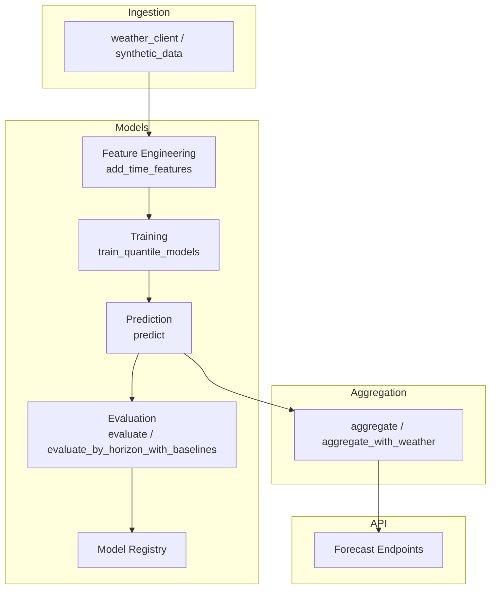
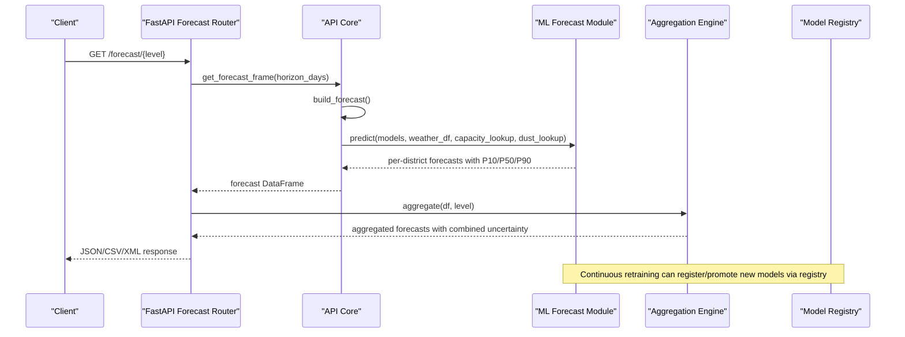
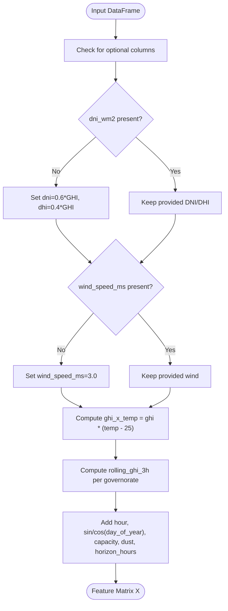
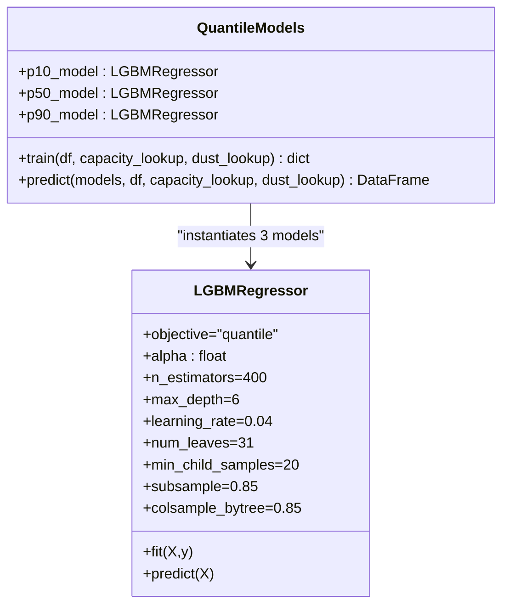
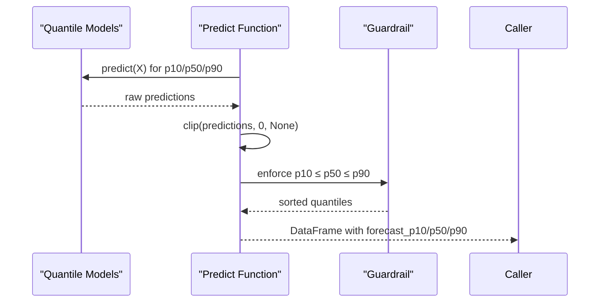
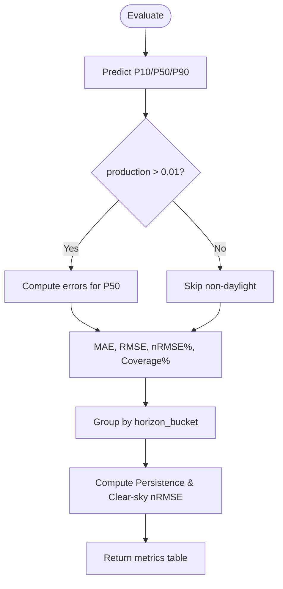
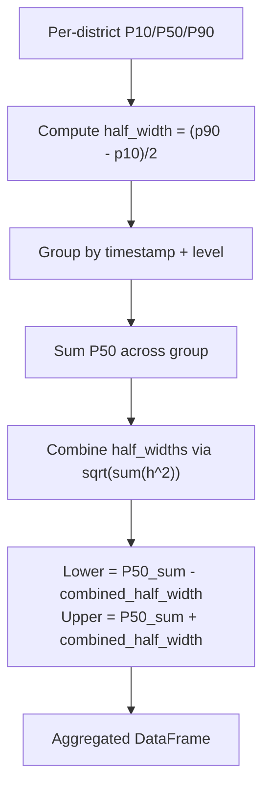
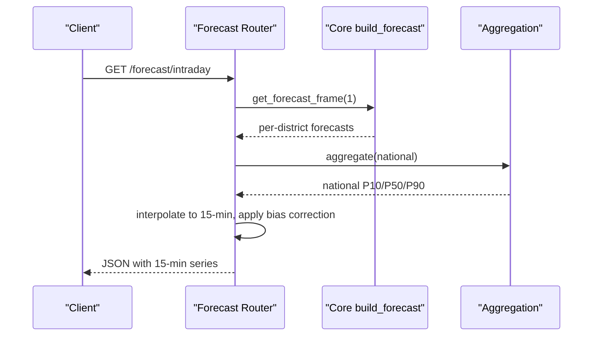
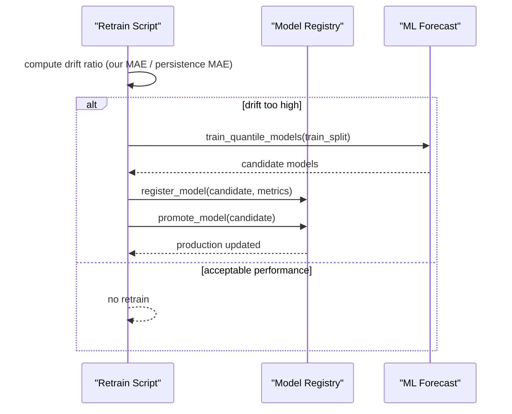
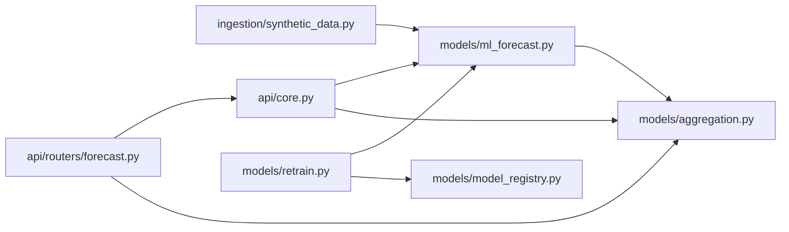

# Machine Learning Models

<cite>
**Referenced Files in This Document**
- [ml_forecast.py](file://models/ml_forecast.py)
- [aggregation.py](file://models/aggregation.py)
- [retrain.py](file://models/retrain.py)
- [validation_report.py](file://models/validation_report.py)
- [forecast.py](file://api/routers/forecast.py)
- [core.py](file://api/core.py)
- [synthetic_data.py](file://ingestion/synthetic_data.py)
- [model_registry.py](file://models/model_registry.py)
</cite>

## Table of Contents
1. [Introduction](#introduction)
2. [Project Structure](#project-structure)
3. [Core Components](#core-components)
4. [Architecture Overview](#architecture-overview)
5. [Detailed Component Analysis](#detailed-component-analysis)
6. [Dependency Analysis](#dependency-analysis)
7. [Performance Considerations](#performance-considerations)
8. [Troubleshooting Guide](#troubleshooting-guide)
9. [Conclusion](#conclusion)
10. [Appendices](#appendices)

## Introduction
This document explains the machine learning models that power multi-horizon solar production forecasts for Tunisia. The system trains gradient-boosted quantile regression models to produce P10/P50/P90 uncertainty bands per location and horizon, enabling both point forecasts and calibrated uncertainty intervals. It covers feature engineering (base and extended features), model training with specified hyperparameters, validation against persistence and clear-sky baselines, evaluation metrics (MAE, nRMSE, coverage), forecast outputs, accuracy assessment by horizon bucket, and integration with the aggregation engine and API.

## Project Structure
The forecasting pipeline spans ingestion, modeling, aggregation, and API exposure:
- Ingestion provides weather and synthetic data used for training and inference.
- Modeling implements feature engineering, quantile model training, prediction, evaluation, and model lifecycle management.
- Aggregation combines district-level forecasts into direction and national totals with uncertainty band combination rules.
- API endpoints expose forecasts at multiple granularities and formats.

**Diagram sources**
- [ml_forecast.py:49-131](file://models/ml_forecast.py#L49-L131)
- [aggregation.py:26-89](file://models/aggregation.py#L26-L89)
- [forecast.py:25-158](file://api/routers/forecast.py#L25-L158)
- [synthetic_data.py:30-159](file://ingestion/synthetic_data.py#L30-L159)

**Section sources**
- [ml_forecast.py:1-267](file://models/ml_forecast.py#L1-L267)
- [aggregation.py:1-164](file://models/aggregation.py#L1-L164)
- [forecast.py:1-203](file://api/routers/forecast.py#L1-L203)
- [synthetic_data.py:1-170](file://ingestion/synthetic_data.py#L1-L170)

## Core Components
- Quantile regression models: Three LightGBM regressors trained per horizon to estimate P10, P50, and P90 using alpha parameters.
- Feature engineering: Base features (GHI, temperature, cloud cover, time features, capacity, dust loss, horizon hours) plus extended features (DNI/DHI split, wind speed, GHI×temperature interaction, rolling GHI averages).
- Evaluation: MAE, nRMSE, and P10–P90 coverage; horizon-bucketed backtests vs persistence and clear-sky baselines.
- Aggregation: Summation of P50 and sqrt-sum-of-squares combination of half-widths for uncertainty bands across districts/directions/national levels.
- Model lifecycle: Drift detection, candidate training, registration, and promotion with immutable registry.

**Section sources**
- [ml_forecast.py:30-115](file://models/ml_forecast.py#L30-L115)
- [ml_forecast.py:134-224](file://models/ml_forecast.py#L134-L224)
- [aggregation.py:20-89](file://models/aggregation.py#L20-L89)
- [retrain.py:40-104](file://models/retrain.py#L40-L104)
- [model_registry.py:35-131](file://models/model_registry.py#L35-L131)

## Architecture Overview
The end-to-end flow from data to API responses:

**Diagram sources**
- [forecast.py:25-158](file://api/routers/forecast.py#L25-L158)
- [core.py:72-99](file://api/core.py#L72-L99)
- [ml_forecast.py:118-131](file://models/ml_forecast.py#L118-L131)
- [aggregation.py:26-89](file://models/aggregation.py#L26-L89)
- [model_registry.py:69-131](file://models/model_registry.py#L69-L131)

## Detailed Component Analysis

### Feature Engineering Pipeline
- Base features:
  - ghi_wm2, temp_c, cloud_cover_pct
  - hour, day_of_year_sin, day_of_year_cos
  - capacity_mwc (from governorate/district lookup)
  - dust_loss_pct (per location)
  - horizon_hours (lead time in hours)
- Extended features (added when available or filled with defaults):
  - dni_wm2, dhi_wm2 (split from GHI if missing)
  - wind_speed_ms (default ~3 m/s if missing)
  - ghi_x_temp = ghi_wm2 × (temp_c − 25) to capture temperature-dependent efficiency loss
  - rolling_ghi_3h per governorate to smooth transient cloud effects
- Time handling:
  - Horizon hours computed relative to current hour; clipped to non-negative values
  - Seasonal sinusoidal encoding of day-of-year

**Diagram sources**
- [ml_forecast.py:49-94](file://models/ml_forecast.py#L49-L94)

**Section sources**
- [ml_forecast.py:32-46](file://models/ml_forecast.py#L32-L46)
- [ml_forecast.py:49-94](file://models/ml_forecast.py#L49-L94)

### Quantile Regression Training
- Three LGBMRegressor models are trained per horizon with objective="quantile" and alpha set to 0.1, 0.5, 0.9 for P10, P50, P90 respectively.
- Hyperparameters:
  - n_estimators=400
  - max_depth=6
  - learning_rate=0.04
  - num_leaves=31
  - min_child_samples=20
  - subsample=0.85
  - colsample_bytree=0.85
- Input features: FEATURE_COLS (base + extended)
- Target: production_mw

**Diagram sources**
- [ml_forecast.py:97-115](file://models/ml_forecast.py#L97-L115)

**Section sources**
- [ml_forecast.py:97-115](file://models/ml_forecast.py#L97-L115)

### Prediction and Uncertainty Guardrails
- Predictions are generated for each quantile model and clipped to non-negative values.
- Monotonicity enforcement ensures p10 ≤ p50 ≤ p90 by sorting predicted quantiles row-wise.

**Diagram sources**
- [ml_forecast.py:118-131](file://models/ml_forecast.py#L118-L131)

**Section sources**
- [ml_forecast.py:118-131](file://models/ml_forecast.py#L118-L131)

### Evaluation Metrics and Baselines
- Overall evaluation computes:
  - MAE on P50 during daylight hours
  - RMSE and nRMSE normalized by total installed capacity
  - Coverage percentage of actual within P10–P90 band
- Horizon-bucketed evaluation compares:
  - Ours (P50) vs Persistence (24-hour lag)
  - Ours (P50) vs Clear-sky baseline (physics-based upper bound without clouds)
  - Coverage of P10–P90 per bucket
- Horizon buckets: nowcast, +6h, J+1, J+2, J+3

**Diagram sources**
- [ml_forecast.py:134-224](file://models/ml_forecast.py#L134-L224)
- [synthetic_data.py:87-101](file://ingestion/synthetic_data.py#L87-L101)

**Section sources**
- [ml_forecast.py:134-224](file://models/ml_forecast.py#L134-L224)
- [synthetic_data.py:87-101](file://ingestion/synthetic_data.py#L87-L101)

### Aggregation Engine Integration
- Aggregates per-district forecasts to direction and national levels.
- Combines uncertainty bands using sqrt-sum-of-squares of half-widths, assuming partial spatial independence of errors.
- Supports multiple grouping keys and carries weather means for visualization.

**Diagram sources**
- [aggregation.py:20-89](file://models/aggregation.py#L20-L89)

**Section sources**
- [aggregation.py:20-89](file://models/aggregation.py#L20-L89)

### API Exposure and Outputs
- Endpoints provide national, intraday, direction, district, and map views.
- Intraday endpoint interpolates to 15-minute resolution and applies bias correction when metering buffer is available.
- Map/timelapse endpoints include uncertainty ratios and utilization percentages.

**Diagram sources**
- [forecast.py:35-54](file://api/routers/forecast.py#L35-L54)
- [core.py:72-99](file://api/core.py#L72-L99)

**Section sources**
- [forecast.py:25-158](file://api/routers/forecast.py#L25-L158)
- [core.py:106-122](file://api/core.py#L106-L122)

### Continuous Learning and Model Registry
- Drift check compares recent model MAE to persistence MAE; if degraded beyond threshold, a candidate model is trained and registered.
- Registry tracks training runs, model versions, and promotes only if candidate outperforms production.

**Diagram sources**
- [retrain.py:40-104](file://models/retrain.py#L40-L104)
- [model_registry.py:69-131](file://models/model_registry.py#L69-L131)

**Section sources**
- [retrain.py:40-104](file://models/retrain.py#L40-L104)
- [model_registry.py:35-131](file://models/model_registry.py#L35-L131)

## Dependency Analysis
Key dependencies and coupling:
- ml_forecast.py depends on lightgbm, pandas, numpy, joblib; integrates with ingestion.synthetic_data for horizon buckets and PV physics functions.
- aggregation.py depends on pandas/numpy and consumes ml_forecast.predict outputs.
- api/core.py orchestrates weather ingestion (live or synthetic), loads models, caches forecasts, and schedules refresh/retrain.
- api/routers/forecast.py composes core.get_forecast_frame with aggregation and exposes REST endpoints.
- retrain.py uses model_registry to manage versioning and promotion.

**Diagram sources**
- [ml_forecast.py:1-267](file://models/ml_forecast.py#L1-L267)
- [aggregation.py:1-164](file://models/aggregation.py#L1-L164)
- [core.py:1-166](file://api/core.py#L1-L166)
- [forecast.py:1-203](file://api/routers/forecast.py#L1-L203)
- [retrain.py:1-115](file://models/retrain.py#L1-L115)
- [model_registry.py:1-161](file://models/model_registry.py#L1-L161)

**Section sources**
- [ml_forecast.py:1-267](file://models/ml_forecast.py#L1-L267)
- [aggregation.py:1-164](file://models/aggregation.py#L1-L164)
- [core.py:1-166](file://api/core.py#L1-L166)
- [forecast.py:1-203](file://api/routers/forecast.py#L1-L203)
- [retrain.py:1-115](file://models/retrain.py#L1-L115)
- [model_registry.py:1-161](file://models/model_registry.py#L1-L161)

## Performance Considerations
- Feature computation includes per-governorate rolling windows; ensure data is sorted by timestamp within groups before computing rolling averages to avoid incorrect windows.
- Quantile crossing guard sorts predictions post-prediction; this enforces monotonicity but may slightly widen bands if models disagree significantly.
- Aggregation assumes partial independence of district errors; adjacent districts sharing cloud systems may have correlated errors, potentially underestimating true uncertainty at higher aggregation levels.
- Bias correction uses recent metering buffer; insufficient data or extreme ratios will disable correction to avoid instability.

[No sources needed since this section provides general guidance]

## Troubleshooting Guide
- Missing extended features: add_time_features fills defaults for DNI/DHI, wind speed, and computes interactions; verify column presence to avoid unexpected behavior.
- No forecast data: API endpoints raise HTTP exceptions when no forecast window exists; ensure cache has been built and horizon days are sufficient.
- Aggregation key errors: aggregate requires specific grouping columns; ensure input DataFrame contains expected keys like steg_district/governorate/direction.
- Drift detection thresholds: retrain triggers when drift ratio exceeds configured threshold; adjust DRIFT_THRESHOLD_PCT if needed based on operational tolerance.
- Model promotion failures: registry prevents promoting candidates that do not improve upon production; review candidate metrics and training splits.

**Section sources**
- [ml_forecast.py:49-94](file://models/ml_forecast.py#L49-L94)
- [forecast.py:35-54](file://api/routers/forecast.py#L35-L54)
- [aggregation.py:42-65](file://models/aggregation.py#L42-L65)
- [retrain.py:36-69](file://models/retrain.py#L36-L69)
- [model_registry.py:104-131](file://models/model_registry.py#L104-L131)

## Conclusion
The platform implements robust multi-horizon solar forecasting using gradient-boosted quantile regression to deliver P10/P50/P90 uncertainty bands. Feature engineering incorporates both base and extended variables to capture physical and temporal dynamics. Evaluation against persistence and clear-sky baselines demonstrates performance across horizons, while the aggregation engine provides scalable summaries with principled uncertainty combination. Continuous learning and an immutable model registry support reliable model evolution and deployment.

[No sources needed since this section summarizes without analyzing specific files]

## Appendices

### Example Forecast Outputs
- National and direction endpoints return arrays of rows with timestamp and P10/P50/P90 forecasts.
- District endpoints include uncertainty_mw and uncertainty_ratio derived from P10/P90 width relative to P50.
- Intraday endpoint returns 15-minute interpolated series with optional bias correction flags.

**Section sources**
- [forecast.py:25-158](file://api/routers/forecast.py#L25-L158)

### Accuracy Assessment by Horizon Bucket
- Horizons: nowcast, +6h, J+1, J+2, J+3
- Metrics per bucket: nRMSE for ours, persistence, clear-sky; coverage of P10–P90; sample counts
- Baseline comparisons help identify where ML adds value versus naive or physics bounds

**Section sources**
- [ml_forecast.py:155-224](file://models/ml_forecast.py#L155-L224)
- [synthetic_data.py:87-101](file://ingestion/synthetic_data.py#L87-L101)