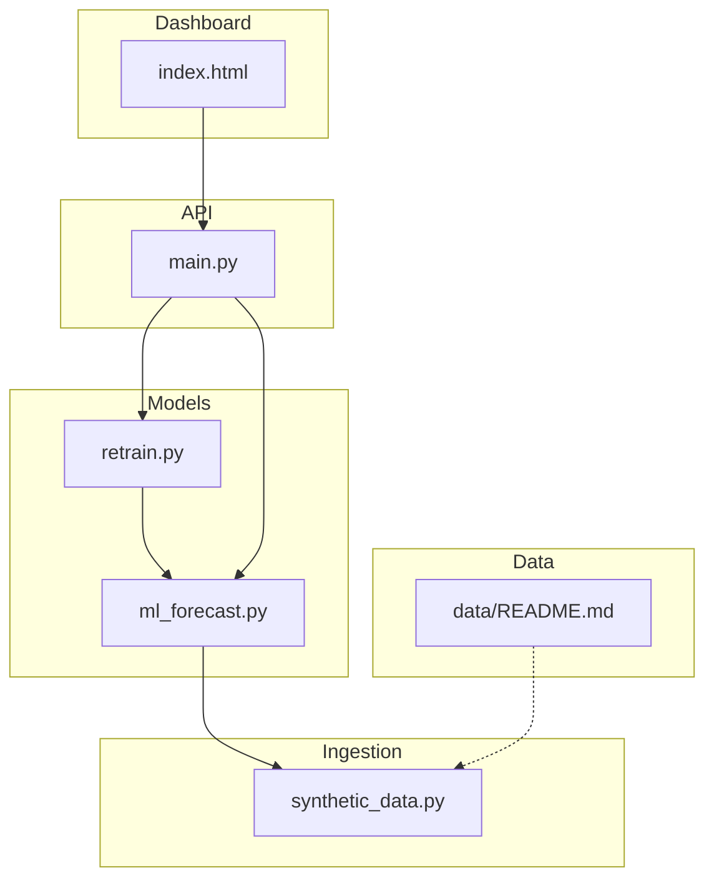
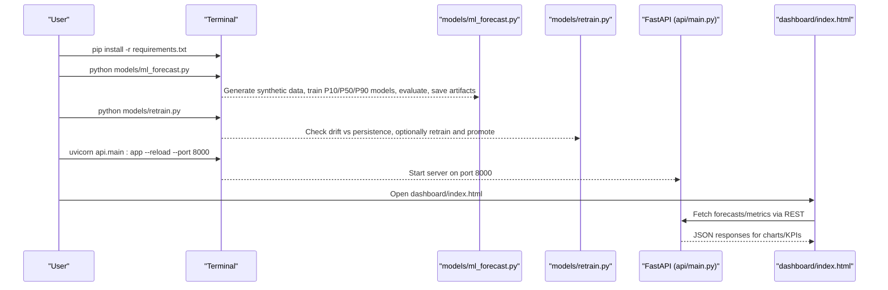
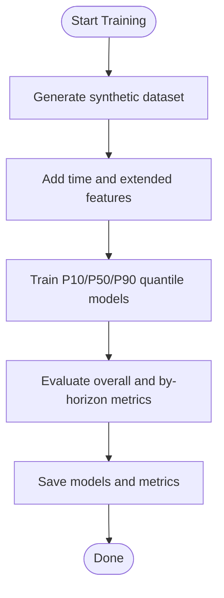
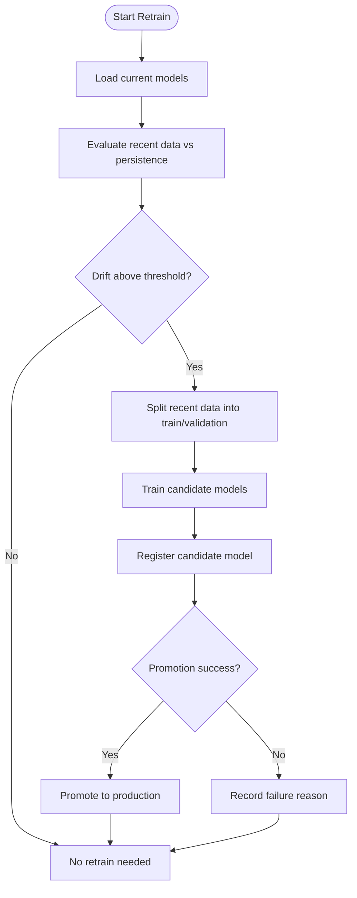
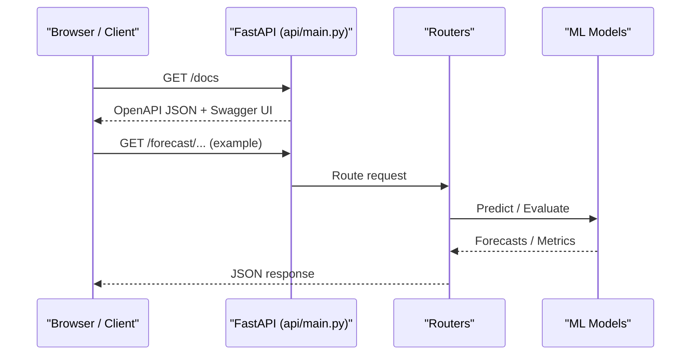
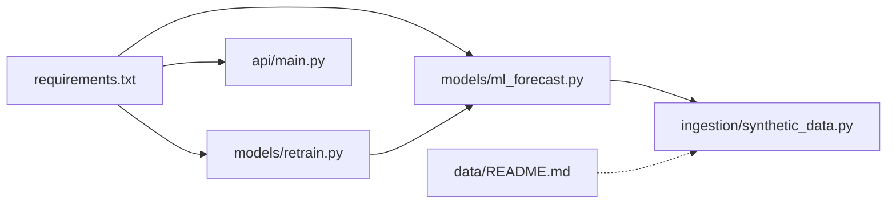

# Getting Started

<cite>
**Referenced Files in This Document**
- [requirements.txt](file://requirements.txt)
- [README.md](file://README.md)
- [models/ml_forecast.py](file://models/ml_forecast.py)
- [models/retrain.py](file://models/retrain.py)
- [api/main.py](file://api/main.py)
- [dashboard/index.html](file://dashboard/index.html)
- [ingestion/synthetic_data.py](file://ingestion/synthetic_data.py)
- [data/README.md](file://data/README.md)
</cite>

## Table of Contents
1. [Introduction](#introduction)
2. [Project Structure](#project-structure)
3. [Core Components](#core-components)
4. [Architecture Overview](#architecture-overview)
5. [Detailed Component Analysis](#detailed-component-analysis)
6. [Dependency Analysis](#dependency-analysis)
7. [Performance Considerations](#performance-considerations)
8. [Troubleshooting Guide](#troubleshooting-guide)
9. [Conclusion](#conclusion)
10. [Appendices](#appendices)

## Introduction
This guide helps you install, initialize, and run the National Rooftop PV Forecast Platform end-to-end. You will:
- Install dependencies
- Train the forecasting model using synthetic data
- Run continuous learning to detect drift and retrain when needed
- Launch the API server and access interactive documentation
- Open the dashboard to visualize forecasts and platform health

The platform forecasts aggregated rooftop PV production across Tunisia’s districts, governorates, and nationally for horizons from nowcast through D+3, with calibrated uncertainty bands and a REST API for integration.

## Project Structure
At a high level:
- models/: ML training, prediction, evaluation, and continuous retraining
- api/: FastAPI application exposing forecast, diagnostics, learning, meta, and reports endpoints
- ingestion/: Synthetic and real weather/data ingestion utilities
- data/: District metadata and dataset generation helpers
- dashboard/: Static frontend that connects to the running API
- results/: Outputs such as metrics and model registry artifacts

**Diagram sources**
- [models/ml_forecast.py:1-267](file://models/ml_forecast.py#L1-L267)
- [models/retrain.py:1-115](file://models/retrain.py#L1-L115)
- [api/main.py:1-42](file://api/main.py#L1-L42)
- [ingestion/synthetic_data.py:1-170](file://ingestion/synthetic_data.py#L1-L170)
- [data/README.md:1-43](file://data/README.md#L1-L43)
- [dashboard/index.html:1-137](file://dashboard/index.html#L1-L137)

**Section sources**
- [README.md:75-117](file://README.md#L75-L117)

## Core Components
- Model training and inference: gradient-boosted quantile regression (P10/P50/P90), feature engineering, evaluation, and artifact persistence
- Continuous learning: drift detection against a persistence baseline, candidate model creation, registration, and promotion
- API server: FastAPI app with CORS enabled and multiple routers for forecast, learning, diagnostics, meta, and reports
- Dashboard: static HTML/JS UI that calls the API to render charts and KPIs

Key responsibilities and entry points:
- Training: python models/ml_forecast.py generates synthetic data, trains models, evaluates backtests, and saves artifacts
- Continuous learning: python models/retrain.py checks recent performance vs persistence and retrains if drift is detected
- API: uvicorn api.main:app --reload --port 8000 serves the REST API and auto-generated docs at /docs
- Dashboard: open dashboard/index.html in a browser; it connects live to the API when available

**Section sources**
- [models/ml_forecast.py:236-267](file://models/ml_forecast.py#L236-L267)
- [models/retrain.py:107-115](file://models/retrain.py#L107-L115)
- [api/main.py:1-42](file://api/main.py#L1-L42)
- [dashboard/index.html:1-137](file://dashboard/index.html#L1-L137)

## Architecture Overview
The quickstart workflow orchestrates data generation, model training, optional continuous learning, and serving via the API. The dashboard consumes the API for visualization.

**Diagram sources**
- [README.md:97-117](file://README.md#L97-L117)
- [models/ml_forecast.py:236-267](file://models/ml_forecast.py#L236-L267)
- [models/retrain.py:107-115](file://models/retrain.py#L107-L115)
- [api/main.py:1-42](file://api/main.py#L1-L42)
- [dashboard/index.html:1-137](file://dashboard/index.html#L1-L137)

## Detailed Component Analysis

### Installation and Environment Setup
- Python version: Not explicitly specified in repository files. Use a recent stable Python 3.x release compatible with the listed packages.
- System dependencies: None declared beyond standard Python packages.
- Install dependencies:
  - Run: pip install -r requirements.txt
- Verify installation:
  - After starting the API, open http://localhost:8000/docs to confirm the FastAPI docs are served.

Notes:
- The API enables CORS for all origins, allowing the dashboard to call it from a local file or any origin during development.

**Section sources**
- [requirements.txt:1-15](file://requirements.txt#L1-L15)
- [api/main.py:29-34](file://api/main.py#L29-L34)
- [README.md:97-117](file://README.md#L97-L117)

### Quickstart Workflow

Step-by-step:
1. Install dependencies
   - Command: pip install -r requirements.txt
2. Train the model
   - Command: python models/ml_forecast.py
   - What happens: Generates synthetic training data, trains P10/P50/P90 models, evaluates backtests, and saves model artifacts to models/artifacts
3. Optional: Run continuous learning
   - Command: python models/retrain.py
   - What happens: Evaluates recent performance versus a persistence baseline; if drift exceeds threshold, creates a candidate model, registers it, and promotes it if better
4. Launch the API server
   - Command: uvicorn api.main:app --reload --port 8000
   - Access: http://localhost:8000/docs for interactive API documentation
5. Open the dashboard
   - Open dashboard/index.html in your browser
   - The dashboard connects to the running API to display forecasts, KPIs, and charts

Verification steps:
- API docs: http://localhost:8000/docs should load without errors
- Dashboard: dashboard/index.html should show live data if the API is running; otherwise, it displays connection status indicators

**Section sources**
- [README.md:97-117](file://README.md#L97-L117)
- [models/ml_forecast.py:236-267](file://models/ml_forecast.py#L236-L267)
- [models/retrain.py:107-115](file://models/retrain.py#L107-L115)
- [api/main.py:1-42](file://api/main.py#L1-L42)
- [dashboard/index.html:1-137](file://dashboard/index.html#L1-L137)

### Model Training Details
- Data source: By default, uses synthetic data generator to produce realistic hourly weather and PV output per district/governorate
- Features: Includes time-based features, capacity, dust loss, horizon hours, and extended features like DNI/DHI, wind speed, temperature interaction, and rolling GHI
- Models: Trains three LightGBM quantile regressors for P10/P50/P90 per horizon
- Evaluation: Computes MAE, nRMSE, and P10–P90 coverage; compares against persistence and clear-sky baselines by horizon
- Artifacts: Saves trained models to models/artifacts for later use by the API and retraining pipeline

**Diagram sources**
- [models/ml_forecast.py:236-267](file://models/ml_forecast.py#L236-L267)
- [ingestion/synthetic_data.py:119-159](file://ingestion/synthetic_data.py#L119-L159)

**Section sources**
- [models/ml_forecast.py:1-267](file://models/ml_forecast.py#L1-L267)
- [ingestion/synthetic_data.py:1-170](file://ingestion/synthetic_data.py#L1-L170)

### Continuous Learning (Drift Detection and Retraining)
- Drift check: Compares current model MAE on recent data against a persistence baseline
- Threshold: Retrains if the model’s error approaches within a defined percentage of the persistence baseline
- Candidate model: Creates a new model on a training split, evaluates on validation split, registers it, and attempts promotion
- Registry: Tracks training runs, model versions, and production model state

**Diagram sources**
- [models/retrain.py:40-105](file://models/retrain.py#L40-L105)

**Section sources**
- [models/retrain.py:1-115](file://models/retrain.py#L1-L115)

### API Server and Endpoints
- Entry point: FastAPI app with title, description, version, and lifespan hooks
- Middleware: CORS enabled for all origins
- Routers: Includes forecast, grid, learning, diagnostics, meta, and reports routers
- Documentation: Auto-generated OpenAPI schema accessible at /docs

**Diagram sources**
- [api/main.py:1-42](file://api/main.py#L1-L42)

**Section sources**
- [api/main.py:1-42](file://api/main.py#L1-L42)

### Dashboard
- Static site: dashboard/index.html provides the national overview
- Assets: CSS and JS under dashboard/assets/{css,js,data}
- Live mode: Connects to the running API to fetch forecasts and update KPIs/charts
- Offline mode: Can be opened standalone; UI shows connection status

**Section sources**
- [dashboard/index.html:1-137](file://dashboard/index.html#L1-L137)
- [README.md:114-117](file://README.md#L114-L117)

## Dependency Analysis
- Runtime dependencies include numerical computing, machine learning, web framework, scheduling, and reporting libraries
- The training script depends on synthetic data generation and district metadata
- The retraining script depends on model registry utilities and the training module
- The API depends on routers and shared core logic

**Diagram sources**
- [requirements.txt:1-15](file://requirements.txt#L1-L15)
- [models/ml_forecast.py:236-267](file://models/ml_forecast.py#L236-L267)
- [models/retrain.py:107-115](file://models/retrain.py#L107-L115)
- [api/main.py:1-42](file://api/main.py#L1-L42)
- [ingestion/synthetic_data.py:119-159](file://ingestion/synthetic_data.py#L119-L159)
- [data/README.md:1-43](file://data/README.md#L1-L43)

**Section sources**
- [requirements.txt:1-15](file://requirements.txt#L1-L15)

## Performance Considerations
- Synthetic data generation is CPU-bound due to time series construction and physics-based calculations
- Model training uses gradient boosting with quantile objectives; tune estimators and depth based on available resources
- Continuous learning runs on recent windows; ensure sufficient data volume for meaningful splits
- API latency depends on model loading and computation; consider caching predictions for repeated requests

[No sources needed since this section provides general guidance]

## Troubleshooting Guide
Common issues and resolutions:
- Missing dependencies
  - Symptom: Import errors when running scripts or starting the API
  - Resolution: Ensure pip install -r requirements.txt completed successfully
- Python version incompatibility
  - Symptom: Package build failures or runtime errors
  - Resolution: Use a modern Python 3.x version compatible with the listed packages
- API not reachable
  - Symptom: Browser cannot connect to http://localhost:8000/docs
  - Resolution: Confirm uvicorn is running with the correct port and no other process is bound to port 8000
- Dashboard shows “Connecting…” or no data
  - Symptom: Charts remain blank; status indicator shows connection issues
  - Resolution: Ensure the API is running; verify CORS is enabled; open dashboard/index.html from a local server or allow file:// access depending on your environment
- Synthetic data generation fails
  - Symptom: Errors during training due to missing inputs
  - Resolution: Verify district metadata and synthetic data generator availability; consult data/README.md for dataset generation options
- Continuous learning does not retrain
  - Symptom: No retraining occurs even with degraded performance
  - Resolution: Check drift threshold configuration and ensure enough recent data exists for evaluation and splitting

**Section sources**
- [requirements.txt:1-15](file://requirements.txt#L1-L15)
- [api/main.py:29-34](file://api/main.py#L29-L34)
- [data/README.md:1-43](file://data/README.md#L1-L43)
- [models/retrain.py:40-105](file://models/retrain.py#L40-L105)

## Conclusion
You now have everything needed to install, train, continuously learn, serve, and visualize the National Rooftop PV Forecast Platform. Follow the quickstart steps to generate synthetic data, train models, run drift detection, launch the API, and open the dashboard. Use the troubleshooting guide to resolve common setup issues and verify functionality via the API docs and dashboard.

[No sources needed since this section summarizes without analyzing specific files]

## Appendices

### Quickstart Commands Summary
- Install dependencies: pip install -r requirements.txt
- Train model: python models/ml_forecast.py
- Run continuous learning: python models/retrain.py
- Launch API: uvicorn api.main:app --reload --port 8000
- Verify API docs: http://localhost:8000/docs
- Open dashboard: dashboard/index.html in your browser

**Section sources**
- [README.md:97-117](file://README.md#L97-L117)