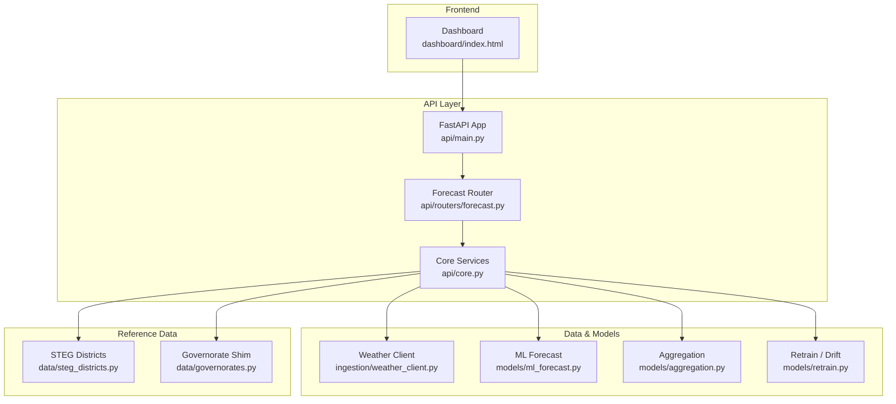
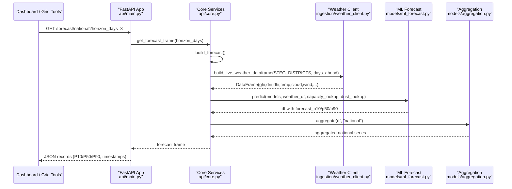
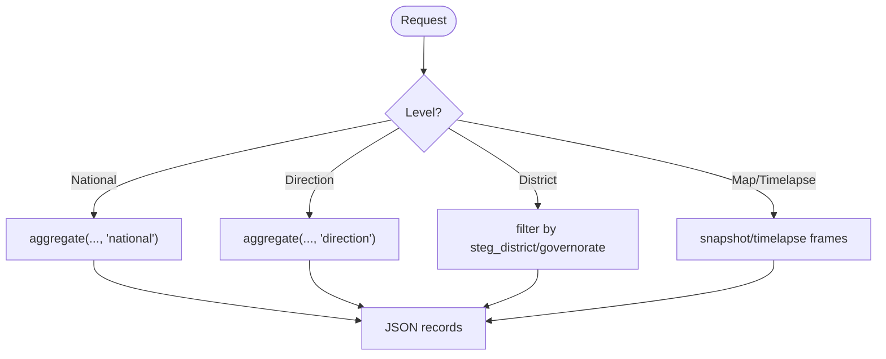
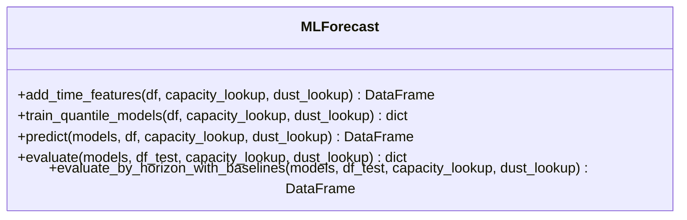
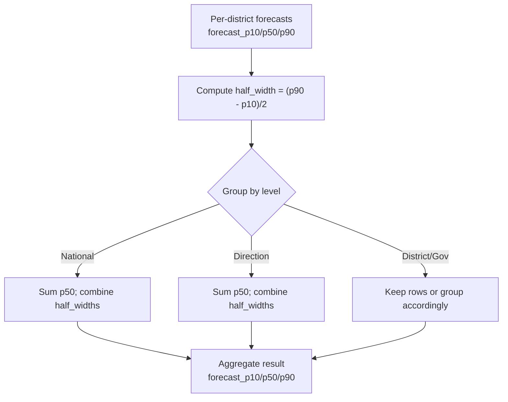
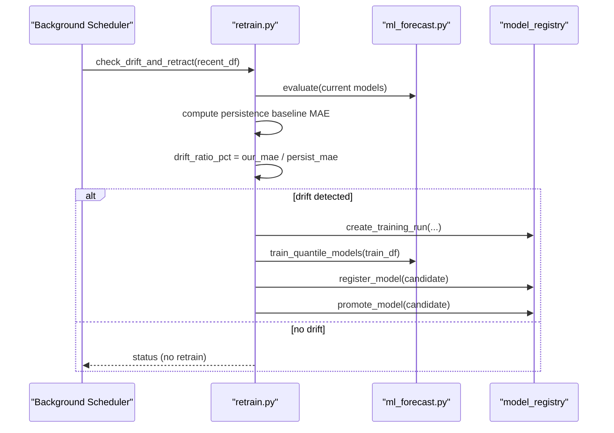
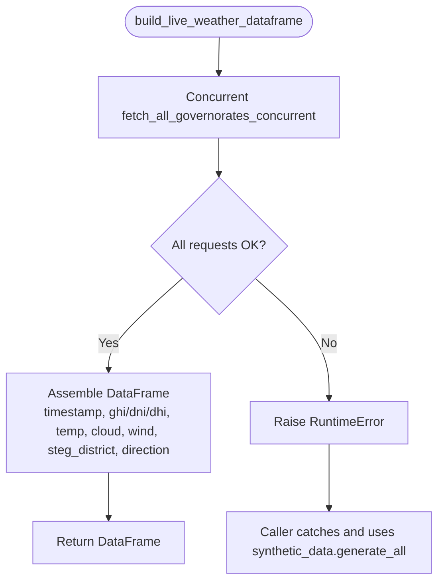
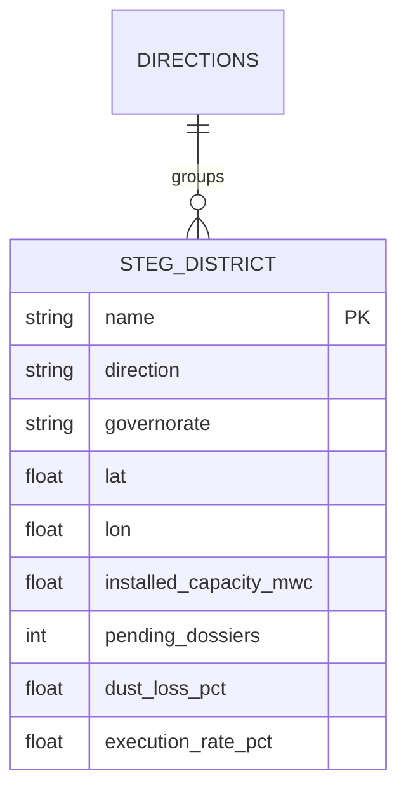
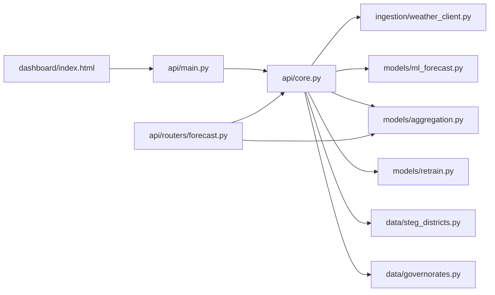

# Project Overview

<cite>
**Referenced Files in This Document**
- [README.md](file://README.md)
- [PROJECT_CONTEXT.md](file://PROJECT_CONTEXT.md)
- [api/main.py](file://api/main.py)
- [api/core.py](file://api/core.py)
- [api/routers/forecast.py](file://api/routers/forecast.py)
- [models/ml_forecast.py](file://models/ml_forecast.py)
- [models/aggregation.py](file://models/aggregation.py)
- [models/retrain.py](file://models/retrain.py)
- [ingestion/weather_client.py](file://ingestion/weather_client.py)
- [data/steg_districts.py](file://data/steg_districts.py)
- [data/governorates.py](file://data/governorates.py)
- [dashboard/index.html](file://dashboard/index.html)
- [requirements.txt](file://requirements.txt)
</cite>

## Table of Contents
1. [Introduction](#introduction)
2. [Project Structure](#project-structure)
3. [Core Components](#core-components)
4. [Architecture Overview](#architecture-overview)
5. [Detailed Component Analysis](#detailed-component-analysis)
6. [Dependency Analysis](#dependency-analysis)
7. [Performance Considerations](#performance-considerations)
8. [Troubleshooting Guide](#troubleshooting-guide)
9. [Conclusion](#conclusion)

## Introduction
The National Rooftop PV Forecast Platform for STEG is a production-ready forecasting system that predicts Tunisia’s aggregated rooftop solar (autoproduction) output from intra-day to D+3 across STEG districts, Directions de Distribution, and the national level. It provides calibrated uncertainty bands (P10/P50/P90), continuous learning with drift detection against a persistence baseline, and an interactive dashboard for dispatchers. The platform integrates real STEG Prosol data on installed capacity and pending connections, live weather forecasts, and LightGBM-based quantile regression to deliver actionable, grid-aware forecasts for STEG’s National Dispatching.

Key capabilities:
- Multi-horizon forecasting: nowcast through D+3 at district, Direction de Distribution, governorate, and national levels.
- Uncertainty quantification: P10/P50/P90 bands that widen realistically with forecast lead time.
- Continuous learning: automated drift detection and retraining when performance degrades relative to a naive persistence baseline.
- Operational integration: REST API endpoints for grid/dispatch tools; exportable CSV/XML; bias correction using recent metering.
- Visualization: interactive map, timelapse, KPI dashboards, and model health views built with Chart.js.

Operational value for STEG:
- Intraday planning: 15-minute resolution forecasts with bias correction to adjust for morning actuals.
- Regional planning: per Direction de Distribution and STEG district forecasts to manage local saturation risks and reserve needs.
- National balancing: aggregated forecasts with uncertainty to support reserve procurement and contingency planning.

**Section sources**
- [README.md:1-30](file://README.md#L1-L30)
- [PROJECT_CONTEXT.md:6-15](file://PROJECT_CONTEXT.md#L6-L15)

## Project Structure
The platform is organized into clear layers:
- API layer (FastAPI): routes for forecasts, registry, diagnostics, reports, and learning.
- Data ingestion: live weather via Open-Meteo and historical irradiance via PVGIS-JRC, with synthetic fallback.
- ML models: horizon-aware quantile gradient boosting (LightGBM) and aggregation utilities.
- Continuous learning: drift detection and automatic retraining pipeline.
- Dashboard: single-page HTML app with Chart.js visualizations and live API connectivity.
- Reference data: STEG commercial districts, Directions de Distribution, and capacity/backlog metrics.

**Diagram sources**
- [api/main.py:10-41](file://api/main.py#L10-L41)
- [api/routers/forecast.py:21-22](file://api/routers/forecast.py#L21-L22)
- [api/core.py:72-103](file://api/core.py#L72-L103)
- [ingestion/weather_client.py:77-130](file://ingestion/weather_client.py#L77-L130)
- [models/ml_forecast.py:97-131](file://models/ml_forecast.py#L97-L131)
- [models/aggregation.py:26-89](file://models/aggregation.py#L26-L89)
- [models/retrain.py:40-104](file://models/retrain.py#L40-L104)
- [data/steg_districts.py:153-176](file://data/steg_districts.py#L153-L176)
- [data/governorates.py:7-25](file://data/governorates.py#L7-L25)
- [dashboard/index.html:1-137](file://dashboard/index.html#L1-L137)

**Section sources**
- [README.md:75-95](file://README.md#L75-L95)
- [PROJECT_CONTEXT.md:17-44](file://PROJECT_CONTEXT.md#L17-L44)

## Core Components
- FastAPI application: mounts routers for forecast, grid integration, learning, diagnostics, and reports; CORS enabled; lifespan manages background scheduling.
- Forecast engine: builds a weather frame (live or synthetic), runs LightGBM quantile models (P10/P50/P90), aggregates to national/direction/district levels, and applies bias correction if metering buffer exists.
- Aggregation: sums point forecasts and combines uncertainty bands using sum-of-squares of half-widths; supports multiple grouping levels including STEG districts and Directions de Distribution.
- Continuous learning: compares recent model error vs persistence baseline; triggers retraining and model promotion when drift threshold is exceeded.
- Weather ingestion: concurrent async fetching of hourly forecasts for all districts; includes GHI/DNI/DHI, temperature, cloud cover, wind speed; falls back to synthetic generator if network/API fails.
- Reference data: 50 STEG commercial districts across 7 Directions de Distribution with coordinates, installed capacity, pending dossiers, dust loss factors, and displacement ratios.

**Section sources**
- [api/main.py:20-41](file://api/main.py#L20-L41)
- [api/core.py:55-103](file://api/core.py#L55-L103)
- [models/ml_forecast.py:97-131](file://models/ml_forecast.py#L97-L131)
- [models/aggregation.py:26-89](file://models/aggregation.py#L26-L89)
- [models/retrain.py:40-104](file://models/retrain.py#L40-L104)
- [ingestion/weather_client.py:53-130](file://ingestion/weather_client.py#L53-L130)
- [data/steg_districts.py:17-34](file://data/steg_districts.py#L17-L34)

## Architecture Overview
The platform exposes a REST API that serves multi-horizon forecasts with uncertainty bands, regionally aggregated across STEG districts and Directions de Distribution. The API orchestrates weather ingestion, model inference, aggregation, and optional bias correction. The dashboard consumes these endpoints to visualize national and regional forecasts, timelapse animations, and model health.

**Diagram sources**
- [api/routers/forecast.py:25-32](file://api/routers/forecast.py#L25-L32)
- [api/core.py:72-103](file://api/core.py#L72-L103)
- [ingestion/weather_client.py:77-130](file://ingestion/weather_client.py#L77-L130)
- [models/ml_forecast.py:118-131](file://models/ml_forecast.py#L118-L131)
- [models/aggregation.py:26-89](file://models/aggregation.py#L26-L89)

## Detailed Component Analysis

### Forecast API Endpoints
- National forecast: returns aggregated national P10/P50/P90 over requested horizon; optional split into injected/self-consumed shares.
- Intraday: 15-minute resolution next 6 hours with cubic interpolation and bias correction scaling when metering buffer is available.
- Direction and district forecasts: grouped by Direction de Distribution or specific STEG district; includes utilization and uncertainty metrics.
- Map and timelapse: snapshot and animation frames for spatial visualization with weather overlays.
- Export: CSV/XML export for grid integration.

**Diagram sources**
- [api/routers/forecast.py:25-186](file://api/routers/forecast.py#L25-L186)

**Section sources**
- [api/routers/forecast.py:25-203](file://api/routers/forecast.py#L25-L203)

### ML Forecast Engine
- Feature engineering: adds time features (hour, day-of-year sin/cos), capacity and dust lookup, extended features (DNI/DHI/wind, GHI×temp interaction, rolling GHI).
- Quantile training: trains three LightGBM regressors (alpha=0.1/0.5/0.9) for P10/P50/P90 simultaneously.
- Prediction: enforces non-negative outputs and monotonicity (P10 ≤ P50 ≤ P90).
- Evaluation: MAE/nRMSE on daylight hours; coverage of P10–P90 band; by-horizon comparison vs persistence and clear-sky baselines.

**Diagram sources**
- [models/ml_forecast.py:49-131](file://models/ml_forecast.py#L49-L131)
- [models/ml_forecast.py:155-224](file://models/ml_forecast.py#L155-L224)

**Section sources**
- [models/ml_forecast.py:1-267](file://models/ml_forecast.py#L1-L267)

### Aggregation and Uncertainty Propagation
- Aggregates forecasts to national, direction, governorate, and STEG district levels.
- Combines uncertainty bands using sqrt-sum-of-squares of per-district half-widths; acknowledges partial spatial correlation limitations.

**Diagram sources**
- [models/aggregation.py:20-89](file://models/aggregation.py#L20-L89)

**Section sources**
- [models/aggregation.py:1-164](file://models/aggregation.py#L1-L164)

### Continuous Learning and Drift Detection
- Compares recent model MAE vs persistence baseline; if drift ratio exceeds threshold, retrains candidate models and promotes if better.
- Uses model registry to track runs, versions, and artifacts; ensures immutable candidate evaluation before promotion.

**Diagram sources**
- [models/retrain.py:40-104](file://models/retrain.py#L40-L104)
- [api/core.py:125-139](file://api/core.py#L125-L139)

**Section sources**
- [models/retrain.py:1-115](file://models/retrain.py#L1-L115)
- [api/core.py:125-139](file://api/core.py#L125-L139)

### Weather Ingestion and Synthetic Fallback
- Concurrently fetches hourly forecasts for all STEG districts using Open-Meteo; includes GHI/DNI/DHI, temperature, cloud cover, wind speed.
- Builds a unified DataFrame schema compatible with the ML pipeline; raises errors on network/API failure to trigger synthetic fallback.
- Provides PVGIS historical irradiance simulation for training/validation when needed.

**Diagram sources**
- [ingestion/weather_client.py:53-130](file://ingestion/weather_client.py#L53-L130)
- [api/core.py:80-99](file://api/core.py#L80-L99)

**Section sources**
- [ingestion/weather_client.py:1-180](file://ingestion/weather_client.py#L1-L180)
- [api/core.py:72-99](file://api/core.py#L72-L99)

### Reference Data: STEG Districts and Directions de Distribution
- Contains 50 commercial districts across 7 Directions de Distribution with coordinates, installed capacity, pending dossiers, dust loss factors, execution rates, and displacement ratios.
- Provides lookups for capacity and dust, direction summaries, and capacity projections based on backlog and execution rate.

**Diagram sources**
- [data/steg_districts.py:17-34](file://data/steg_districts.py#L17-L34)
- [data/steg_districts.py:153-176](file://data/steg_districts.py#L153-L176)

**Section sources**
- [data/steg_districts.py:1-247](file://data/steg_districts.py#L1-L247)
- [data/governorates.py:1-46](file://data/governorates.py#L1-L46)

### Dashboard and Visualization
- Single-page HTML dashboard with Chart.js for national overview, intraday charts, map, performance, alerts, and registry views.
- Live-connect layer attempts to fetch from FastAPI backend; gracefully falls back to embedded demo data if unreachable.
- Displays KPIs (current output, peak forecasts, installed capacity), uncertainty badges, and bias-correction banners.

**Section sources**
- [dashboard/index.html:1-137](file://dashboard/index.html#L1-L137)
- [PROJECT_CONTEXT.md:40-44](file://PROJECT_CONTEXT.md#L40-L44)

## Dependency Analysis
- API depends on core services for state management, model loading, weather ingestion, and aggregation.
- Forecast router depends on aggregation and core forecast frame builder.
- ML model depends on feature engineering and LightGBM; evaluation includes baselines.
- Continuous learning depends on model registry and evaluation functions.
- Weather client depends on external APIs (Open-Meteo, PVGIS) and provides synthetic fallback.
- Reference data underpins capacity and dust lookups used throughout the pipeline.

**Diagram sources**
- [api/main.py:10-41](file://api/main.py#L10-L41)
- [api/core.py:17-31](file://api/core.py#L17-L31)
- [api/routers/forecast.py:9-19](file://api/routers/forecast.py#L9-L19)
- [ingestion/weather_client.py:17-35](file://ingestion/weather_client.py#L17-L35)
- [models/ml_forecast.py:24-46](file://models/ml_forecast.py#L24-L46)
- [models/aggregation.py:16-18](file://models/aggregation.py#L16-L18)
- [models/retrain.py:14-34](file://models/retrain.py#L14-L34)
- [data/steg_districts.py:153-176](file://data/steg_districts.py#L153-L176)
- [data/governorates.py:7-25](file://data/governorates.py#L7-L25)
- [dashboard/index.html:1-137](file://dashboard/index.html#L1-L137)

**Section sources**
- [requirements.txt:1-15](file://requirements.txt#L1-L15)

## Performance Considerations
- Concurrency: Weather ingestion uses asyncio.gather to fetch all districts concurrently, reducing total latency to near single-request time.
- Caching: API caches forecast frames for ~14 minutes to reduce recomputation; background scheduler refreshes periodically during operational hours.
- Bias correction: Applies scaling factor derived from recent metering buffer to improve intraday accuracy.
- Uncertainty combination: Sum-of-squares assumes partial independence; adjacent districts sharing clouds may have correlated errors, slightly underestimating true uncertainty.
- Model complexity: LightGBM quantile regression with tuned hyperparameters balances accuracy and inference speed; horizon-aware features help uncertainty widen appropriately.

[No sources needed since this section provides general guidance]

## Troubleshooting Guide
- Weather API failures: If Open-Meteo or PVGIS are unreachable, the platform falls back to synthetic data; check logs for RuntimeError and ensure network access or configure fallback behavior.
- Missing metering buffer: Bias correction requires a recent metering buffer file; absence results in no scaling applied.
- Unknown district/governorate: Forecast endpoints return 404 for unknown names; verify district names against STEG district registry.
- Drift detection thresholds: Adjust DRIFT_THRESHOLD_PCT if retraining frequency needs tuning; monitor drift_ratio_pct in retrain logs.
- Background scheduler: APScheduler must be installed; otherwise, scheduled refresh and daily retraining are disabled.

**Section sources**
- [ingestion/weather_client.py:87-90](file://ingestion/weather_client.py#L87-L90)
- [api/core.py:106-122](file://api/core.py#L106-L122)
- [api/routers/forecast.py:68-82](file://api/routers/forecast.py#L68-L82)
- [models/retrain.py:37-68](file://models/retrain.py#L37-L68)
- [api/core.py:150-159](file://api/core.py#L150-L159)

## Conclusion
The National Rooftop PV Forecast Platform delivers robust, multi-horizon forecasts with calibrated uncertainty for STEG’s grid dispatching. By integrating real STEG Prosol data, live weather, and continuous learning, it supports both intraday operations and longer-term planning across STEG districts and Directions de Distribution. The platform’s architecture emphasizes reliability (fallbacks, caching), transparency (baseline comparisons, honest limitations), and operational utility (REST API, exports, dashboards). It is designed to evolve with real metering data and can be deployed as a live service for ongoing grid integration.

[No sources needed since this section summarizes without analyzing specific files]