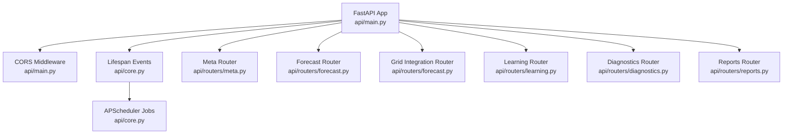
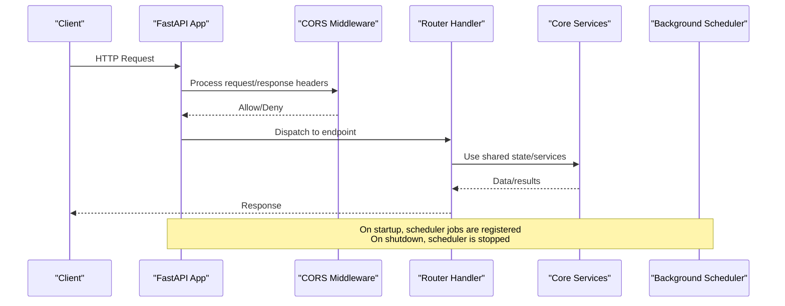
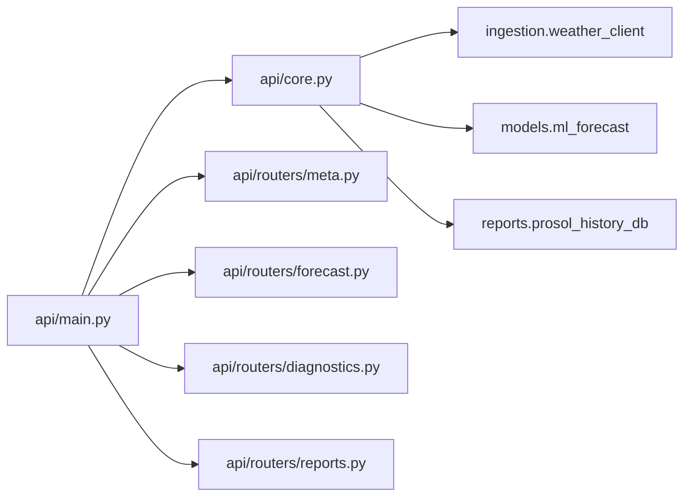

# Application Lifecycle & Configuration

<cite>
**Referenced Files in This Document**
- [api/main.py](file://api/main.py)
- [api/core.py](file://api/core.py)
- [api/routers/meta.py](file://api/routers/meta.py)
- [api/routers/forecast.py](file://api/routers/forecast.py)
- [api/routers/diagnostics.py](file://api/routers/diagnostics.py)
- [api/routers/reports.py](file://api/routers/reports.py)
</cite>

## Table of Contents
1. Introduction
2. Project Structure
3. Core Components
4. Architecture Overview
5. Detailed Component Analysis
6. Dependency Analysis
7. Performance Considerations
8. Troubleshooting Guide
9. Conclusion
10. Appendices

## Introduction
This document explains how the FastAPI application is initialized, configured, and managed throughout its lifecycle. It covers CORS middleware setup, lifespan event handling for startup and shutdown, router registration, environment configuration, and global state management. It also provides guidance on extending the application with additional middleware or services.

## Project Structure
The API entrypoint constructs the FastAPI app, attaches CORS middleware, wires a lifespan context manager for startup/shutdown tasks, and mounts domain-scoped routers under shared prefixes. Shared state, authentication helpers, forecasting utilities, and background scheduling live in a central module.

**Diagram sources**
- [api/main.py:20-41](file://api/main.py#L20-L41)
- [api/core.py:142-165](file://api/core.py#L142-L165)

**Section sources**
- [api/main.py:1-41](file://api/main.py#L1-L41)
- [api/core.py:1-166](file://api/core.py#L1-L166)

## Core Components
- Application initialization: The FastAPI instance is created with title, description, version, and a lifespan handler.
- CORS middleware: A permissive CORS policy is added to allow cross-origin requests from any origin, method, and header.
- Routers: Domain-specific routers are mounted to the main application.
- Global state and configuration: Centralized state dictionary holds models, cache, data source, locks, and lookup tables; environment variables provide runtime secrets like API keys.
- Lifespan events: Startup imports historical snapshots and starts background jobs; shutdown gracefully stops them.

**Section sources**
- [api/main.py:20-41](file://api/main.py#L20-L41)
- [api/core.py:45-63](file://api/core.py#L45-L63)
- [api/core.py:142-165](file://api/core.py#L142-L165)

## Architecture Overview
The application follows a layered structure:
- Entry point constructs the app and configures middleware and routers.
- Shared core module exposes reusable functions and state.
- Routers implement domain endpoints that consume core services.
- Background scheduler performs periodic refresh and retraining tasks during the app’s lifetime.

**Diagram sources**
- [api/main.py:20-41](file://api/main.py#L20-L41)
- [api/core.py:142-165](file://api/core.py#L142-L165)

## Detailed Component Analysis

### Application Initialization and CORS Setup
- The FastAPI app is instantiated with metadata and a lifespan handler.
- CORS middleware is added with broad allowances for origins, methods, and headers.
- Routers are included immediately after middleware setup so they can be served by the app.

Key behaviors:
- Title, description, and version are set for OpenAPI documentation.
- CORS allows all origins/methods/headers for development flexibility.
- Routers are mounted in a deterministic order for consistent URL resolution.

**Section sources**
- [api/main.py:20-41](file://api/main.py#L20-L41)

### Lifespan Event Handling (Startup and Shutdown)
- Startup:
  - Imports generated Prosol snapshots into history storage.
  - Attempts to start a background scheduler with two jobs:
    - Forecast refresh every 15 minutes.
    - Daily model retraining.
  - Stores the scheduler reference in app.state for later access.
- Shutdown:
  - Gracefully shuts down the scheduler without waiting for long-running tasks.

Error handling:
- Snapshot import failures are logged but do not prevent startup.
- If APScheduler is unavailable, startup continues with background jobs disabled.

**Section sources**
- [api/core.py:142-165](file://api/core.py#L142-L165)

### Environment Configuration and Global Settings
- API key:
  - Read from an environment variable with a development default.
  - Used by a security helper to enforce access control via a custom header.
- Paths and directories:
  - Root path derived from the module location.
  - Results directory created if missing.
  - Model and buffer file paths defined for forecasting and metrics.
- Lookup tables:
  - Capacity and dust loss mappings built from district/governorate data.
- Global state:
  - Thread-safe lock for concurrent forecast computation.
  - Cache for recent forecasts with time-based freshness checks.
  - Data source tracking (live vs synthetic).

Security note:
- Sensitive values should be provided via environment variables in production.

**Section sources**
- [api/core.py:29-63](file://api/core.py#L29-L63)
- [api/core.py:45-52](file://api/core.py#L45-L52)

### Router Registration and Mounting
- Routers are imported and mounted to the main app:
  - Meta router for service info and registry endpoints.
  - Forecast router for national, direction, district, and map endpoints.
  - Grid integration router for export endpoints.
  - Learning router for metering and retraining endpoints.
  - Diagnostics router for alerts, metrics, and history.
  - Reports router for Prosol reports and evaluations.

Prefixes and tags:
- Some routers define prefixes (e.g., /forecast) and tags for grouping in OpenAPI docs.

**Section sources**
- [api/main.py:36-41](file://api/main.py#L36-L41)
- [api/routers/forecast.py:21-22](file://api/routers/forecast.py#L21-L22)
- [api/routers/meta.py:9](file://api/routers/meta.py#L9)
- [api/routers/diagnostics.py:14](file://api/routers/diagnostics.py#L14)
- [api/routers/reports.py:35](file://api/routers/reports.py#L35)

### Authentication and Access Control
- API key validation:
  - A security helper reads a custom header and compares it against the configured key.
  - Endpoints requiring protection use this helper to enforce access.
- Example usage:
  - A protected endpoint forces a valid API key before executing logic.

Best practices:
- Set PRESOL_API_KEY in production environments.
- Restrict allowed origins and headers in CORS for production deployments.

**Section sources**
- [api/core.py:45-52](file://api/core.py#L45-L52)
- [api/routers/forecast.py:182-186](file://api/routers/forecast.py#L182-L186)

### Background Scheduling and Periodic Tasks
- Scheduled refresh:
  - Runs every 15 minutes to precompute forecasts within operational hours.
  - Uses thread-safe locking to avoid concurrent recomputation.
- Scheduled retraining:
  - Runs daily to validate and update models based on recent data.
- Scheduler lifecycle:
  - Started during lifespan startup; shut down during lifespan shutdown.

Operational notes:
- If APScheduler is not installed, background tasks are disabled gracefully.
- Errors in scheduled tasks are logged without crashing the server.

**Section sources**
- [api/core.py:125-139](file://api/core.py#L125-L139)
- [api/core.py:142-165](file://api/core.py#L142-L165)

### Extending the Application
Adding new middleware:
- Insert additional middleware before or after CORS depending on desired ordering.
- Example pattern: add_middleware with a custom class or function.

Adding new routers:
- Create a new router module with endpoints and tags.
- Import and include the router in the main application.

Adding new services:
- Implement service functions in the core module to encapsulate business logic.
- Expose them through routers while keeping shared state and configuration centralized.

Example patterns to follow:
- Use dependency injection or direct calls to core functions from endpoints.
- Keep error handling consistent using HTTPException where appropriate.

[No sources needed since this section provides general guidance]

## Dependency Analysis
The application exhibits clear separation between:
- Entry point (app construction and routing).
- Core services (state, auth, forecasting, scheduling).
- Routers (domain endpoints).

Coupling:
- Routers depend on core services for data and operations.
- Core services depend on external modules for weather ingestion, model loading, and reporting.

Potential risks:
- Tight coupling to APScheduler availability; handled via graceful fallback.
- Global mutable state requires careful concurrency control (already implemented with a lock).

**Diagram sources**
- [api/main.py:13-18](file://api/main.py#L13-L18)
- [api/core.py:17-27](file://api/core.py#L17-L27)

**Section sources**
- [api/main.py:13-18](file://api/main.py#L13-L18)
- [api/core.py:17-27](file://api/core.py#L17-L27)

## Performance Considerations
- Forecast caching:
  - Recent forecasts are cached with a time-based freshness check to reduce recomputation.
  - A thread lock prevents race conditions during updates.
- Bias correction:
  - Optional scaling factor applied to improve accuracy when recent metering data is available.
- Background tasks:
  - Precomputing forecasts reduces latency for frequent requests.
  - Daily retraining keeps models aligned with current data distributions.

Recommendations:
- Tune cache age thresholds based on traffic patterns.
- Monitor scheduler job execution times and adjust intervals if necessary.
- Ensure sufficient memory for large dataframes and model artifacts.

[No sources needed since this section provides general guidance]

## Troubleshooting Guide
Common issues and resolutions:
- Missing API key:
  - Ensure the X-API-Key header matches the configured key.
  - Verify PRESOL_API_KEY is set correctly in the environment.
- CORS errors:
  - Confirm browser requests include allowed headers and methods.
  - Adjust CORS settings for production to restrict origins and headers.
- No forecast data:
  - Check network connectivity to weather APIs.
  - Validate that the forecast window contains data; otherwise, synthetic fallback may be used.
- Scheduler not running:
  - Verify APScheduler is installed; otherwise, background tasks will be disabled.
  - Inspect logs for ImportError messages indicating missing dependencies.
- Snapshot import failures:
  - Review logs for exceptions during snapshot import at startup.
  - Ensure required files exist and are readable.

**Section sources**
- [api/core.py:45-52](file://api/core.py#L45-L52)
- [api/core.py:142-165](file://api/core.py#L142-L165)
- [api/routers/forecast.py:35-54](file://api/routers/forecast.py#L35-L54)

## Conclusion
The FastAPI application is structured around a clean separation of concerns:
- The entry point configures middleware, lifespan, and routers.
- The core module centralizes state, configuration, and shared services.
- Routers implement domain-specific endpoints that leverage core services.
- Lifespan events manage background tasks and resource cleanup.
Following the patterns outlined here enables safe extension with additional middleware, routers, and services while maintaining robust lifecycle management and configuration.

[No sources needed since this section summarizes without analyzing specific files]

## Appendices

### Environment Variables
- PRESOL_API_KEY: Secret key used to protect sensitive endpoints via a custom header.

[No sources needed since this section lists configuration options without analyzing specific files]

### Endpoint Examples Referenced
- Service root and status endpoints for discovery and health checks.
- Forecast endpoints for national, intraday, directions, districts, governorates, maps, and timelapse.
- Protected refresh endpoint requiring API key.
- Diagnostics endpoints for alerts, metrics, and history.
- Reports endpoints for Prosol summaries, snapshots, HTML reports, and evaluation history.

**Section sources**
- [api/routers/meta.py:12-31](file://api/routers/meta.py#L12-L31)
- [api/routers/forecast.py:25-186](file://api/routers/forecast.py#L25-L186)
- [api/routers/diagnostics.py:17-137](file://api/routers/diagnostics.py#L17-L137)
- [api/routers/reports.py:38-149](file://api/routers/reports.py#L38-L149)