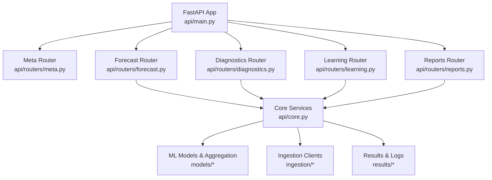
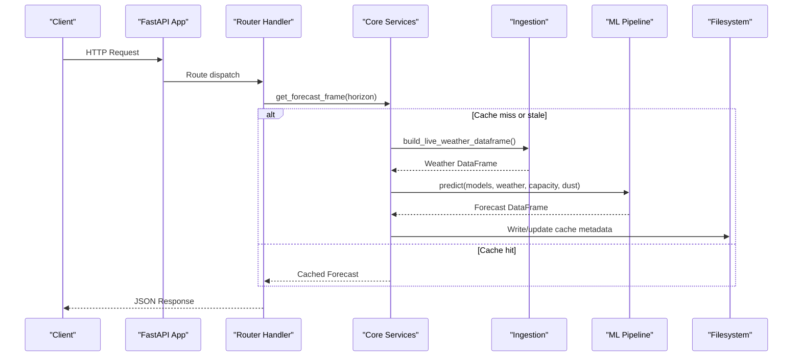
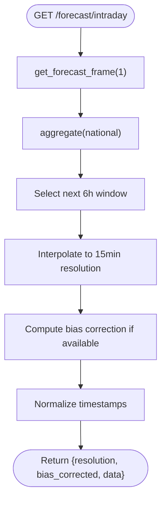
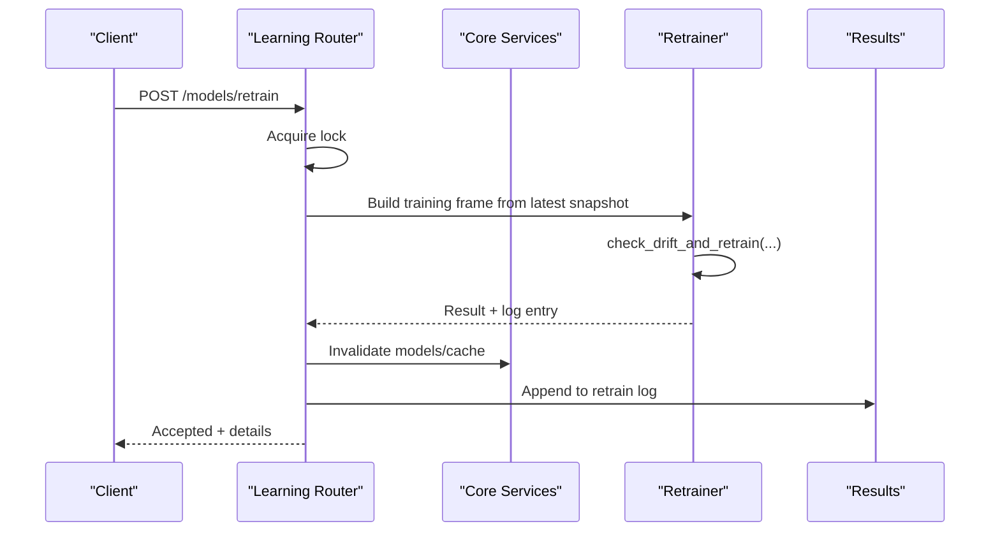
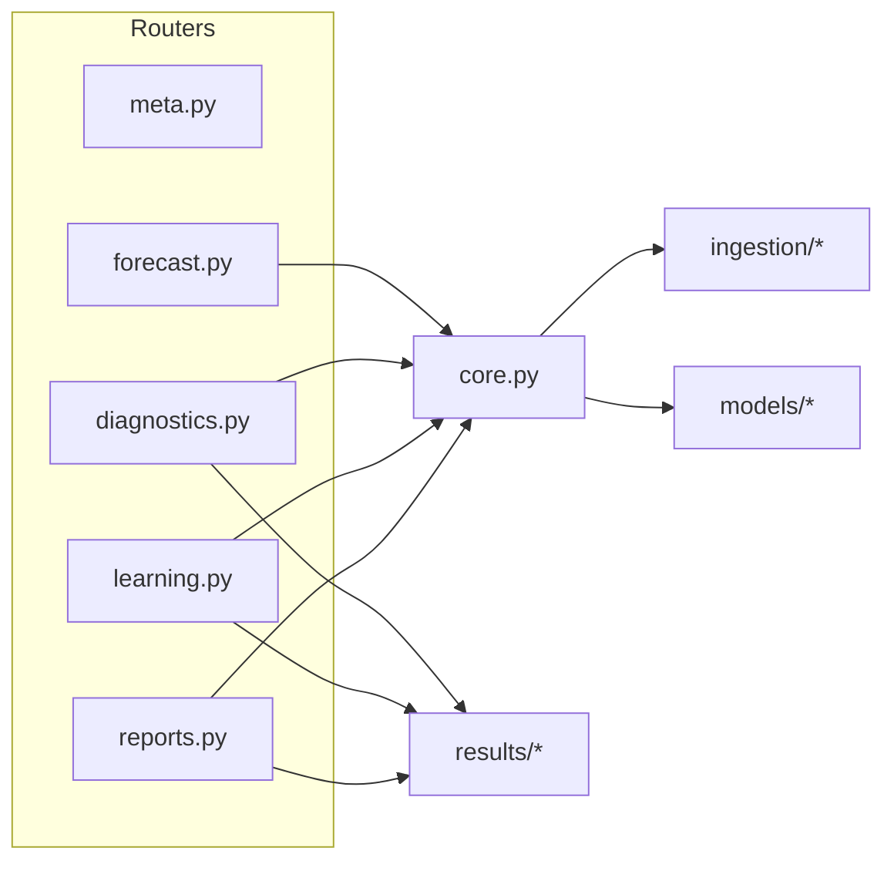

# Backend API Layer

<cite>
**Referenced Files in This Document**
- [main.py](file://api/main.py)
- [core.py](file://api/core.py)
- [forecast.py](file://api/routers/forecast.py)
- [diagnostics.py](file://api/routers/diagnostics.py)
- [learning.py](file://api/routers/learning.py)
- [reports.py](file://api/routers/reports.py)
- [meta.py](file://api/routers/meta.py)
</cite>

## Table of Contents
1. [Introduction](#introduction)
2. [Project Structure](#project-structure)
3. [Core Components](#core-components)
4. [Architecture Overview](#architecture-overview)
5. [Detailed Component Analysis](#detailed-component-analysis)
6. [Dependency Analysis](#dependency-analysis)
7. [Performance Considerations](#performance-considerations)
8. [Troubleshooting Guide](#troubleshooting-guide)
9. [Conclusion](#conclusion)

## Introduction
This document describes the FastAPI backend layer for the PréSol PV Forecast Platform. It explains the modular router architecture with domain-separated endpoints for forecasting, diagnostics, learning, and reports; the application lifecycle management; CORS middleware configuration; request/response handling patterns; separation of concerns between core services and route handlers; error handling strategies; authentication patterns; API versioning; RESTful design principles; and integration points with the ML pipeline and data ingestion systems.

## Project Structure
The API is organized around a single FastAPI application that includes multiple routers by domain:
- Meta and registry endpoints under meta
- Forecasting endpoints under forecast
- Diagnostics and alerts under diagnostics
- Continuous learning and model registry under learning
- Reports and evaluations under reports

Shared state, caching, scheduling, and cross-cutting utilities live in a central core module. Routers are thin and delegate to core services and domain libraries.

**Diagram sources**
- [main.py:20-41](file://api/main.py#L20-L41)
- [core.py:55-166](file://api/core.py#L55-L166)

**Section sources**
- [main.py:1-42](file://api/main.py#L1-L42)

## Core Components
- Application entrypoint and middleware:
  - Creates the FastAPI app with title, description, and version.
  - Configures CORS with permissive settings for development.
  - Includes all domain routers.
- Lifecycle management:
  - Uses an async lifespan to import historical snapshots and start background schedulers for periodic forecast refresh and daily retraining.
  - Gracefully shuts down the scheduler on app exit.
- Shared state and services:
  - Centralized in-memory cache for forecasts with time-based staleness and thread-safe refresh.
  - Bias correction computation from recent metering buffer.
  - Model loading and prediction orchestration.
  - Capacity and dust loss lookups for aggregation and utilization metrics.
- Authentication:
  - API key header guard via a reusable dependency that enforces a configured key.

Key responsibilities are split so routers focus on HTTP concerns (validation, routing, serialization) while core handles business logic, caching, and integration with ML and ingestion layers.

**Section sources**
- [main.py:20-41](file://api/main.py#L20-L41)
- [core.py:45-166](file://api/core.py#L45-L166)

## Architecture Overview
The API follows a layered approach:
- Presentation layer: FastAPI routers define REST endpoints with clear domain tags.
- Service layer: api/core exposes functions for building forecasts, computing bias corrections, and managing shared state.
- Domain layer: models and reports modules implement aggregation, evaluation, and report generation.
- Data layer: ingestion clients fetch live weather or synthetic fallback; results files persist logs, metrics, and datasets.

**Diagram sources**
- [forecast.py:25-54](file://api/routers/forecast.py#L25-L54)
- [core.py:72-99](file://api/core.py#L72-L99)

**Section sources**
- [forecast.py:25-54](file://api/routers/forecast.py#L25-L54)
- [core.py:72-99](file://api/core.py#L72-L99)

## Detailed Component Analysis

### Forecasting Endpoints
Domain: Forecasting and grid export
- National and intraday forecasts with optional bias correction and interpolation.
- Direction, district, steg-district, governorate queries with normalized name matching.
- Map and timelapse endpoints returning aggregated snapshots for visualization.
- Export endpoint streaming CSV/XML for different aggregation levels.

Patterns:
- Input validation via query parameters and enums.
- Consistent response shape with timestamp normalization.
- Error responses for missing data or unknown locations.

Integration:
- Uses core.get_forecast_frame which orchestrates ingestion and ML prediction.
- Aggregates across national, direction, district, and steg-district levels.

**Diagram sources**
- [forecast.py:35-54](file://api/routers/forecast.py#L35-L54)
- [core.py:72-123](file://api/core.py#L72-L123)

**Section sources**
- [forecast.py:25-186](file://api/routers/forecast.py#L25-L186)

### Diagnostics Endpoints
Domain: Operational alerts, metrics, and history
- Alerts endpoint computes uncertainty, ramp-down risks, saturation risks, and model retraining status.
- Metrics endpoint reads horizon-based performance metrics.
- History endpoints expose rooftop dataset summaries and national historical series.
- Model validation metrics endpoint serves JSON validation results.

Patterns:
- Threshold-driven alert generation with severity classification.
- Defensive checks for file existence and schema compatibility.
- Clear 404 responses when required artifacts are missing.

Integration:
- Reads from results directory for metrics, logs, and datasets.
- Consumes forecast frames and aggregations for alert computation.

**Section sources**
- [diagnostics.py:17-137](file://api/routers/diagnostics.py#L17-L137)

### Learning Endpoints
Domain: Continuous learning, metering ingestion, and model registry
- Metering push accepts batches of actual measurements into a buffer for later analysis.
- Manual retrain trigger starts a background job using the latest validated snapshot.
- Retraining status endpoint exposes schedule and recent runs.
- Model registry endpoints expose production model info, versions, and training runs.

Patterns:
- Thread-safe locking to prevent concurrent retraining jobs.
- Asynchronous background execution for long-running tasks.
- State persistence for retrain lifecycle tracking.

Integration:
- Delegates drift detection and retraining to models.retrain.
- Updates shared model cache and clears forecast cache after successful retraining.

**Diagram sources**
- [learning.py:77-130](file://api/routers/learning.py#L77-L130)
- [core.py:134-139](file://api/core.py#L134-L139)

**Section sources**
- [learning.py:24-163](file://api/routers/learning.py#L24-L163)

### Reports Endpoints
Domain: STEG Prosol reports, evaluations, and displacement summary
- Summary and snapshot endpoints serve Prosol report data.
- HTML report generation returns rendered HTML.
- History endpoints list and retrieve imported snapshots with new installations and live updates.
- Evaluation endpoints list evaluations and return evaluated values.
- Displacement summary calculates CO2 displacement based on forecast output.

Patterns:
- Path traversal protection for snapshot imports.
- Rich response composition combining static reports and live updates.
- Streaming text/csv responses for large exports.

Integration:
- Uses models.aggregation and data.steg_districts for calculations.
- Persists and reads from results and reports directories.

**Section sources**
- [reports.py:38-149](file://api/routers/reports.py#L38-L149)

### Meta Endpoints
Domain: Service metadata, registry, and cache status
- Root endpoint lists available endpoints and service info.
- Status and cache status provide operational insights including cache age and data source.
- Registry endpoints enumerate districts, positions, and projected capacity pipelines.

Patterns:
- Read-only endpoints exposing system state and reference data.
- Consistent naming and grouping for discoverability.

**Section sources**
- [meta.py:12-127](file://api/routers/meta.py#L12-L127)

## Dependency Analysis
Routers depend on core services for shared state and cross-cutting functionality. Core depends on ingestion clients and ML models. Reports and diagnostics depend on results files and domain libraries.

**Diagram sources**
- [forecast.py:9-19](file://api/routers/forecast.py#L9-L19)
- [diagnostics.py:9-12](file://api/routers/diagnostics.py#L9-L12)
- [learning.py:11-13](file://api/routers/learning.py#L11-L13)
- [reports.py:10-33](file://api/routers/reports.py#L10-L33)
- [core.py:17-34](file://api/core.py#L17-L34)

**Section sources**
- [forecast.py:9-19](file://api/routers/forecast.py#L9-L19)
- [diagnostics.py:9-12](file://api/routers/diagnostics.py#L9-L12)
- [learning.py:11-13](file://api/routers/learning.py#L11-L13)
- [reports.py:10-33](file://api/routers/reports.py#L10-L33)
- [core.py:17-34](file://api/core.py#L17-L34)

## Performance Considerations
- Forecast caching:
  - In-memory cache with time-based staleness reduces repeated ingestion and ML calls.
  - Refresh interval enforced by background scheduler improves responsiveness.
- Bias correction:
  - Optional scaling factor computed from recent metering buffer can improve accuracy without extra IO on every request.
- Interpolation and aggregation:
  - Cubic interpolation ensures smooth intraday series; aggregation minimizes payload size for dashboards.
- Streaming exports:
  - CSV/XML exports use streaming responses to avoid large memory allocations.
- Concurrency:
  - Locks protect critical sections during retraining and cache refresh.

[No sources needed since this section provides general guidance]

## Troubleshooting Guide
Common issues and resolutions:
- Missing forecast data:
  - Ensure weather ingestion succeeded; otherwise synthetic fallback is used. Check cache status and data source flags.
- Unknown location errors:
  - Verify district names against registry endpoints; ensure case-insensitive matching.
- Retraining not starting:
  - Confirm a validated rooftop measurement snapshot exists; check retrain status endpoint for messages.
- Metrics or validation files missing:
  - Run model evaluation scripts to generate required artifacts before querying diagnostics endpoints.
- CORS or auth failures:
  - For local development, CORS allows all origins; ensure X-API-Key header matches configured key for protected endpoints.

**Section sources**
- [core.py:72-99](file://api/core.py#L72-L99)
- [diagnostics.py:83-137](file://api/routers/diagnostics.py#L83-L137)
- [learning.py:122-144](file://api/routers/learning.py#L122-L144)
- [meta.py:34-58](file://api/routers/meta.py#L34-L58)

## Conclusion
The FastAPI backend layer implements a clean, modular architecture with domain-separated routers, centralized core services, and robust lifecycle management. It integrates seamlessly with ML and ingestion systems, supports continuous learning, and provides comprehensive diagnostics and reporting. The API adheres to RESTful principles, uses consistent error handling, and offers clear authentication and versioning. This design enables scalable forecasting operations, actionable insights through diagnostics, and extensible reporting capabilities.