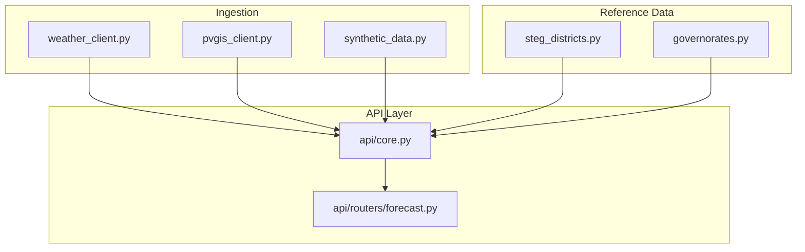
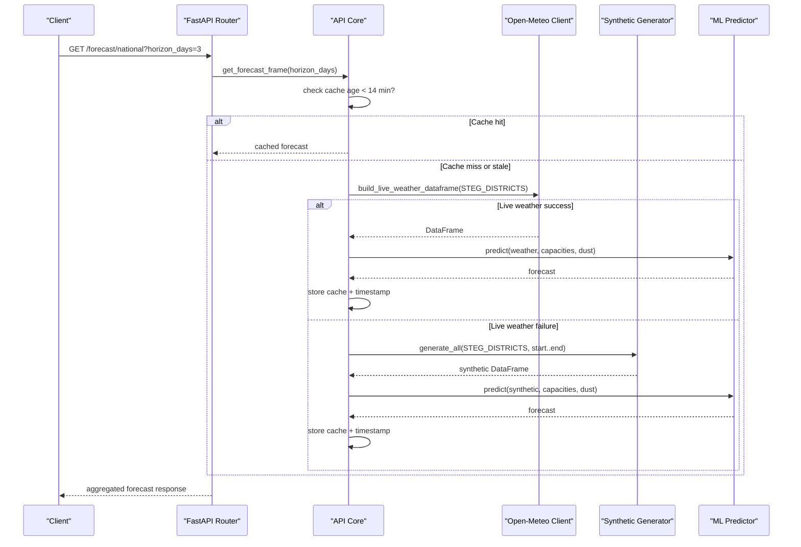
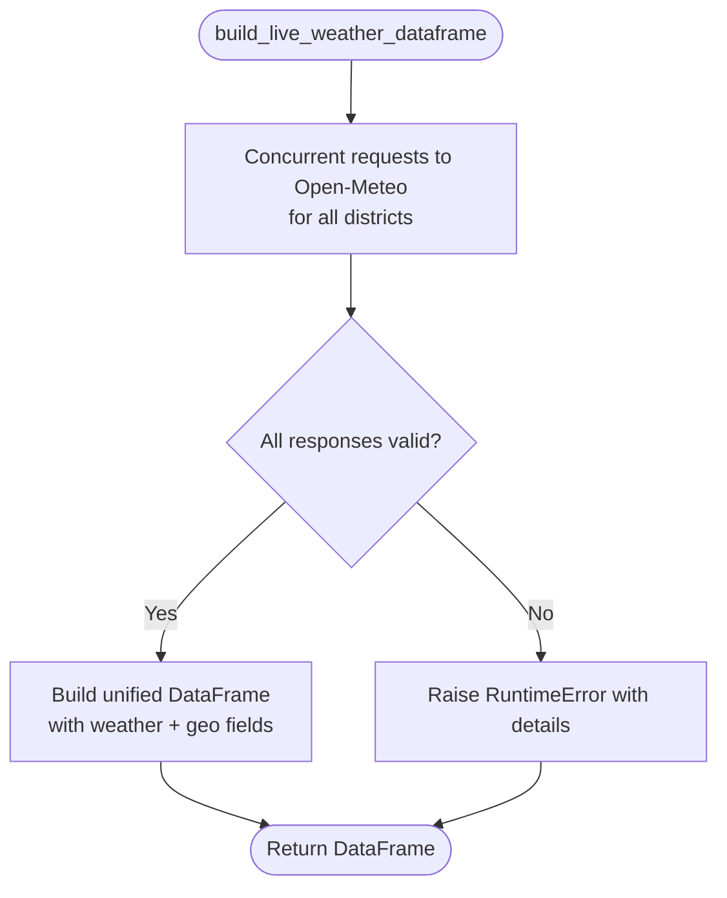
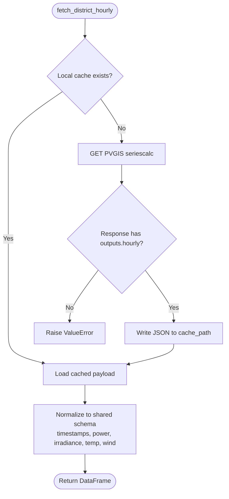
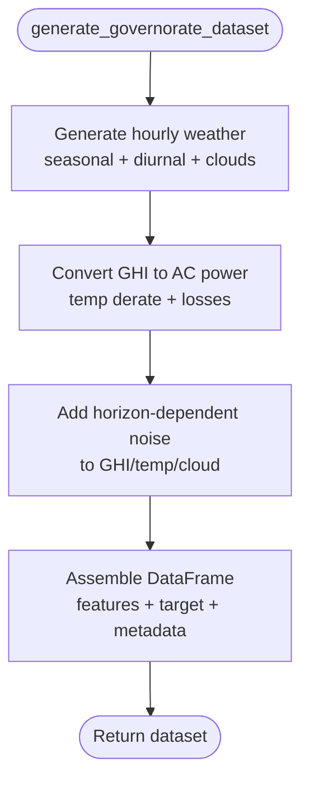
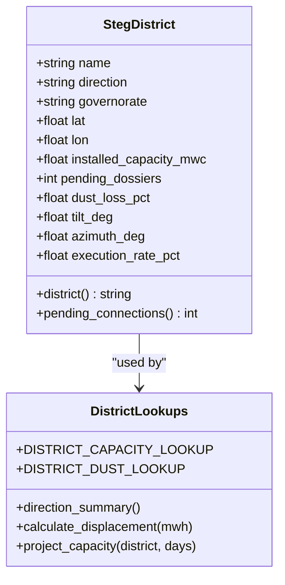
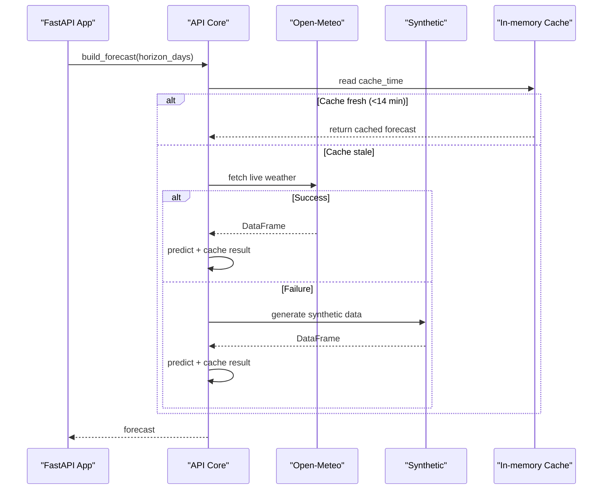
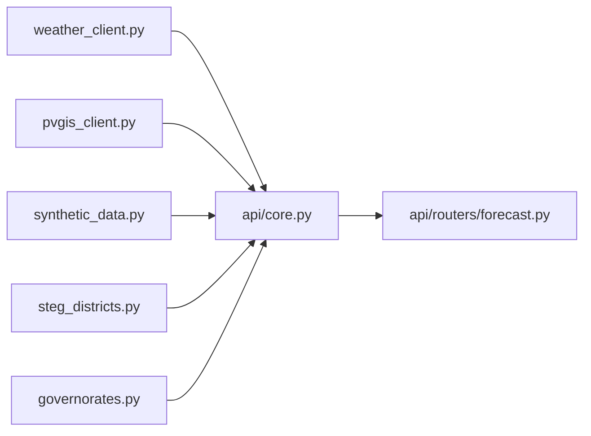

# Data Ingestion System

<cite>
**Referenced Files in This Document**
- [weather_client.py](file://ingestion/weather_client.py)
- [pvgis_client.py](file://ingestion/pvgis_client.py)
- [synthetic_data.py](file://ingestion/synthetic_data.py)
- [steg_districts.py](file://data/steg_districts.py)
- [governorates.py](file://data/governorates.py)
- [core.py](file://api/core.py)
- [forecast.py](file://api/routers/forecast.py)
</cite>

## Table of Contents
1. [Introduction](#introduction)
2. [Project Structure](#project-structure)
3. [Core Components](#core-components)
4. [Architecture Overview](#architecture-overview)
5. [Detailed Component Analysis](#detailed-component-analysis)
6. [Dependency Analysis](#dependency-analysis)
7. [Performance Considerations](#performance-considerations)
8. [Troubleshooting Guide](#troubleshooting-guide)
9. [Conclusion](#conclusion)

## Introduction
This document describes the data ingestion system that powers rooftop PV forecasting across STEG’s commercial districts and Directions de Distribution in Tunisia. It explains how real-time weather is fetched concurrently from Open-Meteo, how historical PV production can be simulated via PVGIS, how synthetic data supports development and testing, and how reference data for STEG districts and governorates is managed. It also covers error handling, fallback mechanisms, data validation, caching strategies, and performance optimizations used to deliver near-real-time forecasts.

## Project Structure
The ingestion layer sits under ingestion/, with reference data under data/. The FastAPI application orchestrates ingestion, model prediction, caching, and API exposure.

**Diagram sources**
- [weather_client.py:53-130](file://ingestion/weather_client.py#L53-L130)
- [pvgis_client.py:27-95](file://ingestion/pvgis_client.py#L27-L95)
- [synthetic_data.py:119-159](file://ingestion/synthetic_data.py#L119-L159)
- [steg_districts.py:61-177](file://data/steg_districts.py#L61-L177)
- [core.py:72-99](file://api/core.py#L72-L99)
- [forecast.py:25-186](file://api/routers/forecast.py#L25-L186)

**Section sources**
- [weather_client.py:1-180](file://ingestion/weather_client.py#L1-L180)
- [pvgis_client.py:1-96](file://ingestion/pvgis_client.py#L1-L96)
- [synthetic_data.py:1-170](file://ingestion/synthetic_data.py#L1-L170)
- [steg_districts.py:1-247](file://data/steg_districts.py#L1-L247)
- [governorates.py:1-46](file://data/governorates.py#L1-L46)
- [core.py:1-166](file://api/core.py#L1-L166)
- [forecast.py:1-203](file://api/routers/forecast.py#L1-L203)

## Core Components
- Concurrent Open-Meteo client: fetches hourly weather variables for all districts simultaneously using async HTTP calls.
- PVGIS district producer: generates hourly PV production per aggregate district with local JSON caching.
- Synthetic generator: produces realistic weather and PV output series for offline development and testing.
- Reference data: defines 50 STEG commercial districts with coordinates, capacity, pending connections, dust loss, and direction groupings; provides backward-compatible aliases for legacy code.
- API orchestration: builds forecasts by fetching live weather or falling back to synthetic data, caches results, and exposes endpoints for national, direction, district, and map views.

**Section sources**
- [weather_client.py:23-130](file://ingestion/weather_client.py#L23-L130)
- [pvgis_client.py:17-95](file://ingestion/pvgis_client.py#L17-L95)
- [synthetic_data.py:21-159](file://ingestion/synthetic_data.py#L21-L159)
- [steg_districts.py:17-177](file://data/steg_districts.py#L17-L177)
- [core.py:36-99](file://api/core.py#L36-L99)

## Architecture Overview
The system uses a layered architecture:
- Data source layer: Open-Meteo (real-time), PVGIS (historical simulation), synthetic generator (offline).
- Reference data layer: STEG district definitions and aggregations.
- Orchestration layer: API core manages lifecycle, caching, and fallback logic.
- API layer: Endpoints expose forecasts at multiple granularities and export formats.

**Diagram sources**
- [core.py:72-99](file://api/core.py#L72-L99)
- [weather_client.py:77-130](file://ingestion/weather_client.py#L77-L130)
- [synthetic_data.py:119-159](file://ingestion/synthetic_data.py#L119-L159)
- [forecast.py:25-32](file://api/routers/forecast.py#L25-L32)

## Detailed Component Analysis

### Concurrent Weather Fetching from Open-Meteo
- Concurrency: Uses an async HTTP client to issue one request per district and gathers them concurrently, reducing total latency to roughly the time of a single request regardless of the number of districts.
- Variables: Retrieves shortwave radiation (GHI), diffuse radiation (DHI), direct normal irradiance (DNI), temperature, cloud cover, and wind speed.
- Output schema: Produces a unified DataFrame with standardized columns for timestamps, irradiance components, temperature, cloud cover, wind, and geographic identifiers (governorate/district/steg_district/direction).
- Error propagation: If any district fetch fails, the wrapper raises a runtime error so callers can trigger fallback logic.

**Diagram sources**
- [weather_client.py:53-130](file://ingestion/weather_client.py#L53-L130)

**Section sources**
- [weather_client.py:23-130](file://ingestion/weather_client.py#L23-L130)

### PVGIS Historical Production for Districts
- Purpose: Simulates hourly PV production for an aggregate district fleet using representative coordinates and installed capacity.
- Caching: Persists raw PVGIS JSON locally to avoid repeated network calls; reads from disk when available.
- Validation: Ensures required keys exist and that time and power columns are present; coerces numeric values and fills missing entries.
- Normalization: Converts PVGIS outputs into the shared schema including timestamp_utc, power_kw, GHI/DNI/DHI, temperature, wind, and cloud cover.

**Diagram sources**
- [pvgis_client.py:27-95](file://ingestion/pvgis_client.py#L27-L95)

**Section sources**
- [pvgis_client.py:17-95](file://ingestion/pvgis_client.py#L17-L95)

### Synthetic Data Generation for Development and Testing
- Realistic climatology: Generates hourly weather with seasonal cycles, diurnal patterns, and cloud noise to mimic Tunisian solar conditions.
- PV physics approximation: Converts GHI to AC power using temperature effects, system losses, and optional dust losses.
- Horizon-aware noise: Adds forecast noise that scales with lead time to simulate NWP skill degradation.
- Dataset assembly: Builds per-governorate datasets including true and noisy features, horizon labels, and production targets.

**Diagram sources**
- [synthetic_data.py:21-159](file://ingestion/synthetic_data.py#L21-L159)

**Section sources**
- [synthetic_data.py:1-170](file://ingestion/synthetic_data.py#L1-L170)

### Reference Data Management for STEG Districts and Governorates
- District model: Each district includes name, direction, governorate, coordinates, installed capacity (MWc), pending dossiers, dust loss percentage, tilt/azimuth defaults, and execution rate.
- Aggregations and lookups: Provides capacity and dust lookup tables, direction summaries, displacement calculations, and capacity projections based on pending connections and execution rates.
- Backward compatibility: Legacy imports are redirected to the new district module to maintain compatibility with existing code.

**Diagram sources**
- [steg_districts.py:61-177](file://data/steg_districts.py#L61-L177)
- [steg_districts.py:180-229](file://data/steg_districts.py#L180-L229)

**Section sources**
- [steg_districts.py:17-229](file://data/steg_districts.py#L17-L229)
- [governorates.py:1-46](file://data/governorates.py#L1-L46)

### API Orchestration, Fallback, and Caching
- Forecast building: Attempts live weather first; if it fails or returns no rows, falls back to synthetic generation. Marks the data source accordingly.
- Caching: Stores the last forecast and its refresh time; serves cached results within a 14-minute window to reduce load and improve latency.
- Scheduled tasks: Background scheduler periodically refreshes forecasts and triggers daily retraining when available.
- Bias correction: Optionally scales recent intraday forecasts using meter buffer ratios when sufficient data exists.

**Diagram sources**
- [core.py:55-99](file://api/core.py#L55-L99)
- [core.py:125-166](file://api/core.py#L125-L166)

**Section sources**
- [core.py:55-166](file://api/core.py#L55-L166)
- [forecast.py:25-186](file://api/routers/forecast.py#L25-L186)

## Dependency Analysis
- Ingestion depends on external APIs (Open-Meteo, PVGIS) and local file I/O for PVGIS cache.
- API core depends on ingestion modules and reference data; it also integrates ML prediction and scheduling.
- Forecast router depends on API core for data retrieval and aggregation utilities for multi-level outputs.

**Diagram sources**
- [weather_client.py:53-130](file://ingestion/weather_client.py#L53-L130)
- [pvgis_client.py:27-95](file://ingestion/pvgis_client.py#L27-L95)
- [synthetic_data.py:119-159](file://ingestion/synthetic_data.py#L119-L159)
- [steg_districts.py:61-177](file://data/steg_districts.py#L61-L177)
- [core.py:72-99](file://api/core.py#L72-L99)
- [forecast.py:25-186](file://api/routers/forecast.py#L25-L186)

**Section sources**
- [core.py:1-166](file://api/core.py#L1-L166)
- [forecast.py:1-203](file://api/routers/forecast.py#L1-L203)

## Performance Considerations
- Concurrent fetching: Open-Meteo requests are issued in parallel across all districts, minimizing wall-clock time to near a single-request latency.
- Caching strategy: In-memory cache serves forecasts for up to 14 minutes, reducing redundant computation and API calls.
- PVGIS local cache: Avoids repeated network calls by persisting raw JSON payloads to disk; only recomputed when missing.
- Time-window filtering: Forecasts are filtered to the requested horizon to minimize processing overhead.
- Bias correction: Optional scaling of intraday forecasts improves accuracy without heavy computation.

[No sources needed since this section provides general guidance]

## Troubleshooting Guide
- Live weather failures: If Open-Meteo requests fail or return empty results, the system automatically falls back to synthetic data and marks the data source as synthetic. Inspect logs for exceptions raised during weather fetching.
- PVGIS errors: Missing or malformed responses raise explicit value errors; ensure the cache path is writable and that the PVGIS endpoint is reachable.
- Scheduler issues: If APScheduler is not installed, background refresh and retraining are disabled; verify dependencies and environment.
- Cache staleness: Use status endpoints to inspect cache age and data source; force a refresh via the refresh endpoint when necessary.

**Section sources**
- [core.py:72-99](file://api/core.py#L72-L99)
- [core.py:125-166](file://api/core.py#L125-L166)
- [forecast.py:182-186](file://api/routers/forecast.py#L182-L186)

## Conclusion
The ingestion system combines concurrent real-time weather fetching, robust fallback to synthetic data, and efficient caching to deliver reliable forecasts across STEG’s districts and directions. Reference data encapsulates district-specific capacity and geography, enabling accurate aggregation and analysis. The design emphasizes resilience, performance, and maintainability, supporting both operational forecasting and development workflows.