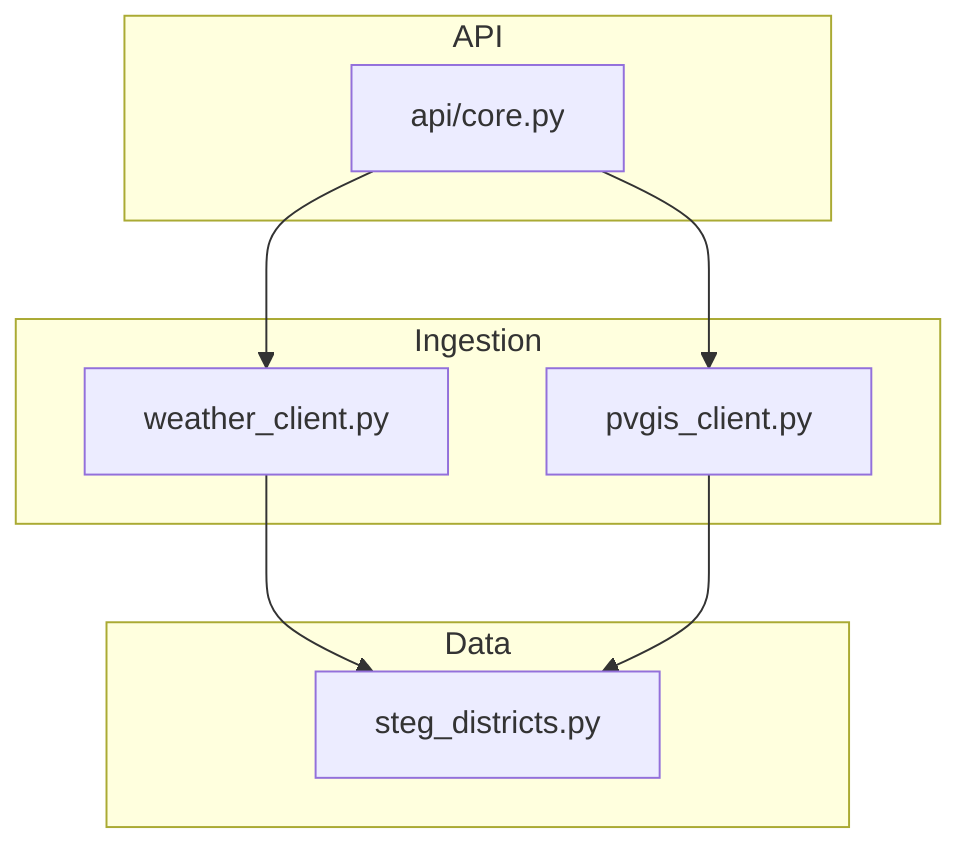
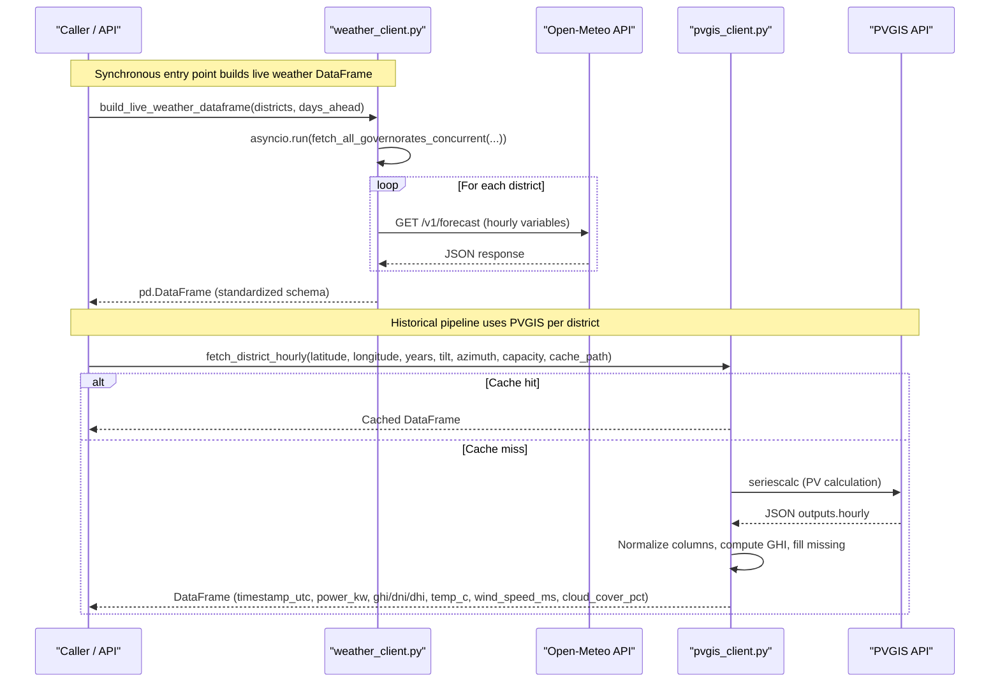
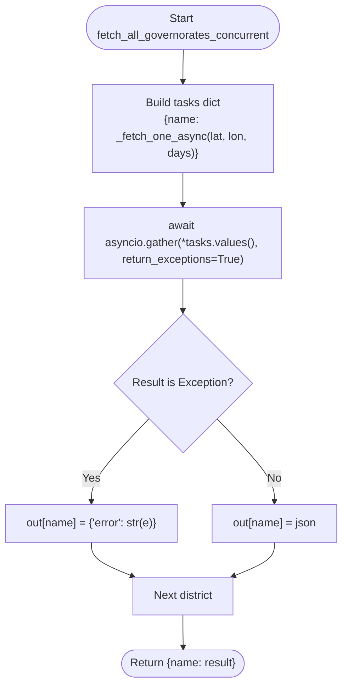
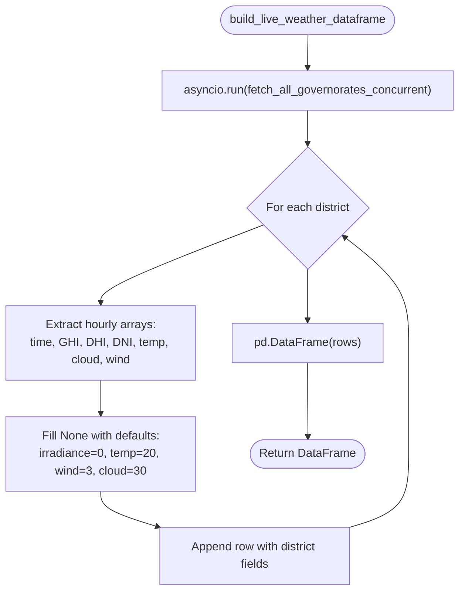
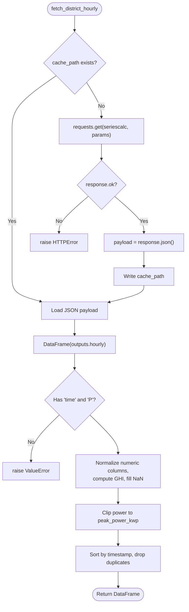
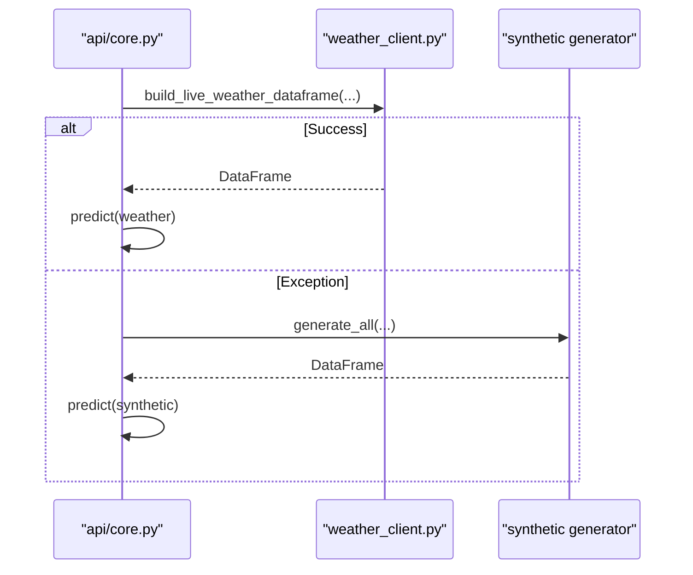
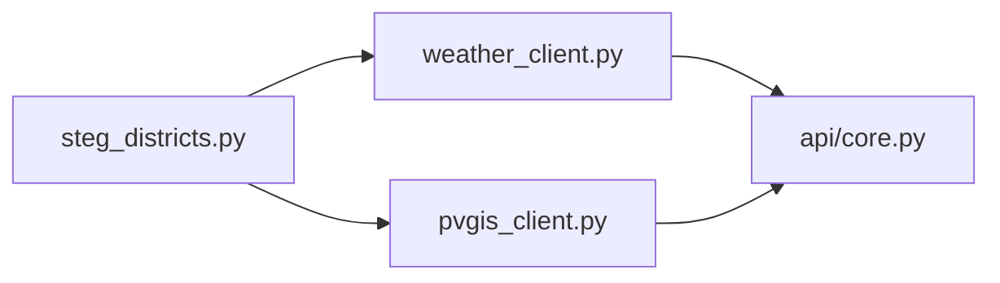

# Weather Data Clients

<cite>
**Referenced Files in This Document**
- [weather_client.py](file://ingestion/weather_client.py)
- [pvgis_client.py](file://ingestion/pvgis_client.py)
- [steg_districts.py](file://data/steg_districts.py)
- [core.py](file://api/core.py)
</cite>

## Table of Contents
1. [Introduction](#introduction)
2. [Project Structure](#project-structure)
3. [Core Components](#core-components)
4. [Architecture Overview](#architecture-overview)
5. [Detailed Component Analysis](#detailed-component-analysis)
6. [Dependency Analysis](#dependency-analysis)
7. [Performance Considerations](#performance-considerations)
8. [Troubleshooting Guide](#troubleshooting-guide)
9. [Conclusion](#conclusion)
10. [Appendices](#appendices)

## Introduction
This document explains the weather data clients that power real-time and historical PV production forecasting for all STEG commercial districts (governorates). It covers:
- Concurrent fetching of Open-Meteo forecasts across all districts using asyncio and httpx
- Integration with PVGIS for historical PV production simulation
- Error handling, timeouts, and fallback to synthetic data when APIs are unavailable
- Data transformation from raw API responses into a standardized DataFrame schema with GHI, DNI, DHI, temperature, cloud cover, and wind speed
- Usage patterns for both synchronous and asynchronous contexts

## Project Structure
The weather ingestion layer is implemented under ingestion/, with district metadata under data/ and usage within the API layer under api/. The key files are:
- ingestion/weather_client.py: Async-first client for Open-Meteo and helper functions for building live weather DataFrames
- ingestion/pvgis_client.py: Client for PVGIS historical PV production per district with local caching
- data/steg_districts.py: District definitions used as inputs to the weather clients
- api/core.py: Orchestrates forecast generation with fallback logic

**Diagram sources**
- [weather_client.py:53-130](file://ingestion/weather_client.py#L53-L130)
- [pvgis_client.py:27-95](file://ingestion/pvgis_client.py#L27-L95)
- [steg_districts.py:61-177](file://data/steg_districts.py#L61-L177)
- [core.py:72-99](file://api/core.py#L72-L99)

**Section sources**
- [weather_client.py:1-180](file://ingestion/weather_client.py#L1-L180)
- [pvgis_client.py:1-96](file://ingestion/pvgis_client.py#L1-L96)
- [steg_districts.py:1-200](file://data/steg_districts.py#L1-L200)
- [core.py:72-166](file://api/core.py#L72-L166)

## Core Components
- Open-Meteo concurrent fetcher: Uses httpx.AsyncClient and asyncio.gather to request hourly forecasts for all districts concurrently, returning a dictionary keyed by district name.
- Live DataFrame builder: Wraps the async fetcher via asyncio.run to provide a synchronous interface for scripts and the FastAPI scheduler; transforms raw JSON into a standardized DataFrame.
- PVGIS district producer: Fetches or loads cached hourly PV production per district, normalizes fields, and returns a DataFrame with irradiance, temperature, wind speed, and derived GHI.

Key responsibilities:
- Concurrency: All districts fetched in parallel to minimize wall-clock time
- Standardization: Output DataFrames include timestamp, GHI/DNI/DHI, temperature, cloud cover, wind speed, and district identifiers
- Resilience: Timeouts, exception capture, and fallback to synthetic data at the API layer

**Section sources**
- [weather_client.py:23-35](file://ingestion/weather_client.py#L23-L35)
- [weather_client.py:38-74](file://ingestion/weather_client.py#L38-L74)
- [weather_client.py:77-130](file://ingestion/weather_client.py#L77-L130)
- [pvgis_client.py:21-95](file://ingestion/pvgis_client.py#L21-L95)
- [core.py:72-99](file://api/core.py#L72-L99)

## Architecture Overview
The system composes two data sources:
- Real-time Open-Meteo forecasts for current and near-future hours
- Historical PVGIS production for training and evaluation

**Diagram sources**
- [weather_client.py:53-130](file://ingestion/weather_client.py#L53-L130)
- [pvgis_client.py:27-95](file://ingestion/pvgis_client.py#L27-L95)

## Detailed Component Analysis

### Open-Meteo Concurrent Fetcher
- Asynchronous single-request function issues an HTTP GET with hourly variables including shortwave radiation (GHI), diffuse radiation (DHI), direct normal irradiance (DNI), temperature, cloud cover, and wind speed.
- Concurrent fetcher constructs one task per district and gathers results with return_exceptions=True so partial failures do not abort the entire batch.
- Timeout is set on the shared AsyncClient to avoid hanging requests.

**Diagram sources**
- [weather_client.py:53-74](file://ingestion/weather_client.py#L53-L74)

**Section sources**
- [weather_client.py:38-74](file://ingestion/weather_client.py#L38-L74)

### Live DataFrame Builder
- Synchronous wrapper runs the async fetcher and converts raw JSON arrays into rows with standardized column names.
- Missing values are filled with safe defaults (e.g., zero irradiance, default temperature/wind/cloud) to ensure downstream ML pipelines receive complete numeric features.
- District metadata (name, direction) is attached to each row for aggregation.

**Diagram sources**
- [weather_client.py:77-130](file://ingestion/weather_client.py#L77-L130)

**Section sources**
- [weather_client.py:77-130](file://ingestion/weather_client.py#L77-L130)

### PVGIS Historical Producer
- Fetches or loads cached hourly PV production per district using a file-based cache to avoid repeated network calls.
- Normalizes numeric columns, computes GHI as beam + diffuse + reflected, and ensures required fields exist.
- Clips power output to the installed capacity and fills missing values with zeros.

**Diagram sources**
- [pvgis_client.py:27-95](file://ingestion/pvgis_client.py#L27-L95)

**Section sources**
- [pvgis_client.py:21-95](file://ingestion/pvgis_client.py#L21-L95)

### API Fallback Mechanism
- The API attempts to build forecasts using live weather data. If any exception occurs (network/API failure or empty result), it falls back to synthetic data generation and marks the data source accordingly.

**Diagram sources**
- [core.py:72-99](file://api/core.py#L72-L99)

**Section sources**
- [core.py:72-99](file://api/core.py#L72-L99)

## Dependency Analysis
- weather_client.py depends on:
  - httpx.AsyncClient for concurrent I/O
  - asyncio.gather for parallel execution
  - pandas for DataFrame construction
  - data.steg_districts for district objects (duck-typed: name, lat, lon, direction)
- pvgis_client.py depends on:
  - requests for HTTP calls
  - pandas for normalization and transformations
  - filesystem for caching PVGIS payloads
- api/core.py orchestrates both clients and applies fallback logic

**Diagram sources**
- [weather_client.py:53-130](file://ingestion/weather_client.py#L53-L130)
- [pvgis_client.py:27-95](file://ingestion/pvgis_client.py#L27-L95)
- [core.py:72-99](file://api/core.py#L72-L99)
- [steg_districts.py:61-177](file://data/steg_districts.py#L61-L177)

**Section sources**
- [weather_client.py:17-24](file://ingestion/weather_client.py#L17-L24)
- [pvgis_client.py:10-18](file://ingestion/pvgis_client.py#L10-L18)
- [core.py:72-99](file://api/core.py#L72-L99)
- [steg_districts.py:61-177](file://data/steg_districts.py#L61-L177)

## Performance Considerations
- Concurrency model: Using asyncio.gather to issue all district requests simultaneously reduces total latency to approximately the slowest single request rather than the sum of all requests.
- Timeouts:
  - Open-Meteo client sets a 30-second timeout on the AsyncClient to prevent indefinite hangs.
  - PVGIS client accepts a configurable timeout_seconds parameter (default 120 seconds) to accommodate longer historical queries.
- Caching: PVGIS payloads are cached locally to disk to avoid repeated network calls during dataset generation.
- Data shaping: Defaulting missing values to safe numbers avoids downstream errors and keeps ML feature matrices dense.

[No sources needed since this section provides general guidance]

## Troubleshooting Guide
Common issues and remedies:
- Network or API unavailability:
  - Open-Meteo: Exceptions raised by httpx propagate up; callers should catch and fall back to synthetic data.
  - PVGIS: Non-OK responses raise HTTPError; malformed responses raise ValueError indicating missing expected fields.
- Empty results:
  - If live weather returns no rows in the requested time window, the API raises a ValueError and triggers synthetic fallback.
- Timeouts:
  - Adjust AsyncClient timeout for Open-Meteo if needed.
  - Increase timeout_seconds for PVGIS when querying long date ranges.
- Cache corruption:
  - If PVGIS cache becomes invalid, delete the cache file to force a fresh fetch.

Operational hints:
- In the API layer, always check the data_source flag to know whether forecasts were built from live or synthetic data.
- When debugging, print or log the first few rows of the DataFrame and verify presence of required columns: timestamp, ghi_wm2, dni_wm2, dhi_wm2, temp_c, cloud_cover_pct, wind_speed_ms, and district identifiers.

**Section sources**
- [weather_client.py:60-74](file://ingestion/weather_client.py#L60-L74)
- [weather_client.py:77-99](file://ingestion/weather_client.py#L77-L99)
- [pvgis_client.py:60-74](file://ingestion/pvgis_client.py#L60-L74)
- [core.py:80-94](file://api/core.py#L80-L94)

## Conclusion
The weather data clients provide robust, concurrent access to real-time Open-Meteo forecasts and historical PVGIS production data. They standardize outputs into consistent DataFrames suitable for ML pipelines and incorporate resilient error handling with automatic fallback to synthetic data. The design balances performance (parallel requests, caching) with reliability (timeouts, validation, fallbacks), enabling accurate PV forecasting across all STEG districts.

[No sources needed since this section summarizes without analyzing specific files]

## Appendices

### Standardized DataFrame Schema
- Columns produced by the live weather client:
  - timestamp: Hourly timestamps
  - ghi_wm2: Global horizontal irradiance
  - dni_wm2: Direct normal irradiance
  - dhi_wm2: Diffuse horizontal irradiance
  - temp_c: Temperature at 2 meters
  - cloud_cover_pct: Cloud cover percentage
  - wind_speed_ms: Wind speed at 10 meters
  - governorate: District name used for feature lookup
  - district: Direction de Distribution or regional group
  - steg_district: District identifier for STEG pipeline
  - direction: Direction de Distribution when available

- Columns produced by the PVGIS client:
  - timestamp_utc: UTC-aligned hourly timestamps
  - power_kw: Simulated PV power clipped to installed capacity
  - ghi_wm2: Derived as beam + diffuse + reflected
  - dni_wm2: Beam component
  - dhi_wm2: Diffuse component
  - temp_c: Ambient temperature
  - wind_speed_ms: Wind speed
  - cloud_cover_pct: Set to 0.0 (not provided by PVGIS)

**Section sources**
- [weather_client.py:28-35](file://ingestion/weather_client.py#L28-L35)
- [weather_client.py:112-128](file://ingestion/weather_client.py#L112-L128)
- [pvgis_client.py:76-95](file://ingestion/pvgis_client.py#L76-L95)

### Usage Patterns

- Synchronous context (scripts, schedulers):
  - Use build_live_weather_dataframe(STEG_DISTRICTS, days_ahead=N) to obtain a DataFrame for all districts.
  - Wrap in try/except to handle network/API errors and fall back to synthetic data if needed.

- Asynchronous context (FastAPI handlers, background tasks):
  - Use fetch_all_governorates_concurrent(STEG_DISTRICTS, days_ahead=N) directly within an async function to get per-district JSON responses.
  - Process exceptions per district and aggregate successful results.

- Historical PV production:
  - Use fetch_district_hourly(latitude, longitude, start_year, end_year, tilt, azimuth, peak_power_kwp, cache_path) to retrieve or cache district-level PV simulations.
  - Integrate with dataset generators to produce continuous training data.

**Section sources**
- [weather_client.py:53-74](file://ingestion/weather_client.py#L53-L74)
- [weather_client.py:77-130](file://ingestion/weather_client.py#L77-L130)
- [pvgis_client.py:27-95](file://ingestion/pvgis_client.py#L27-L95)
- [core.py:72-99](file://api/core.py#L72-L99)