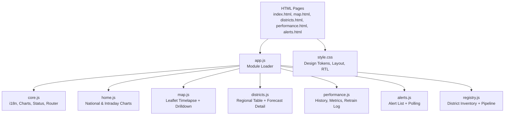
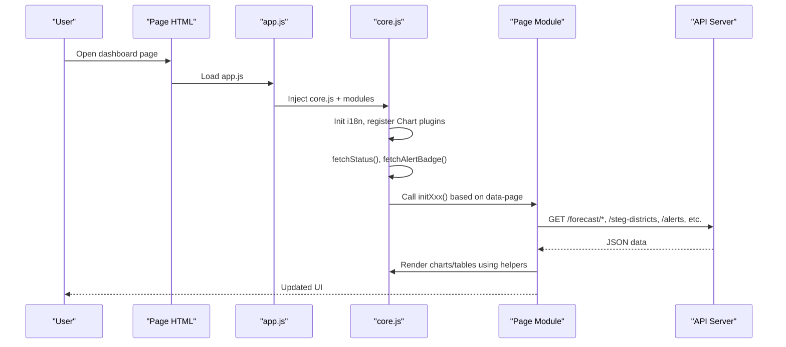
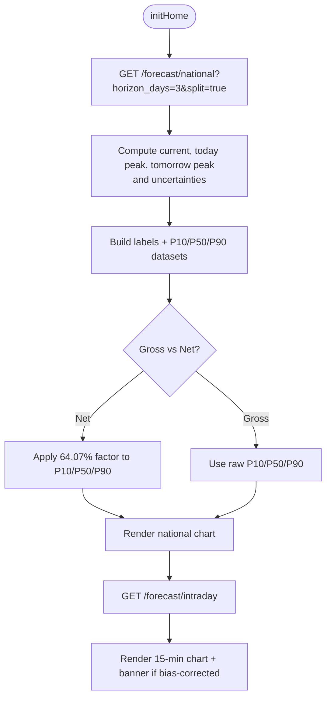
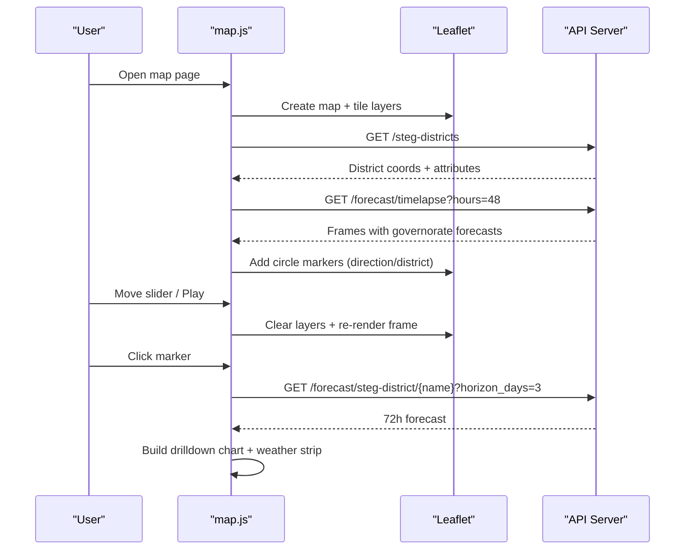
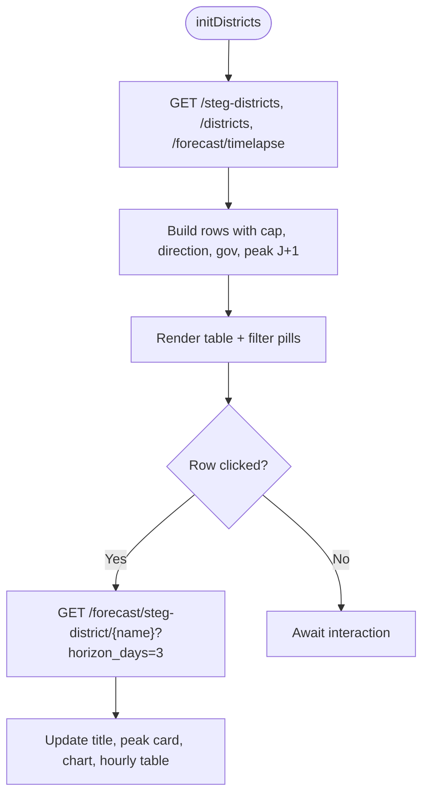
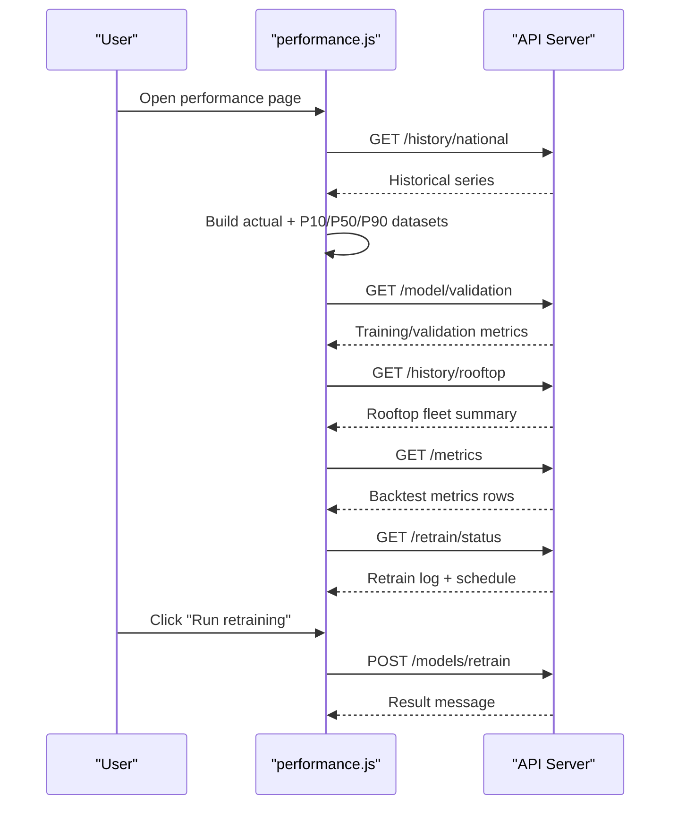
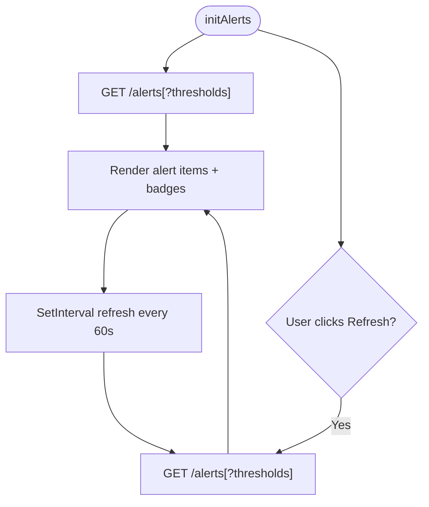
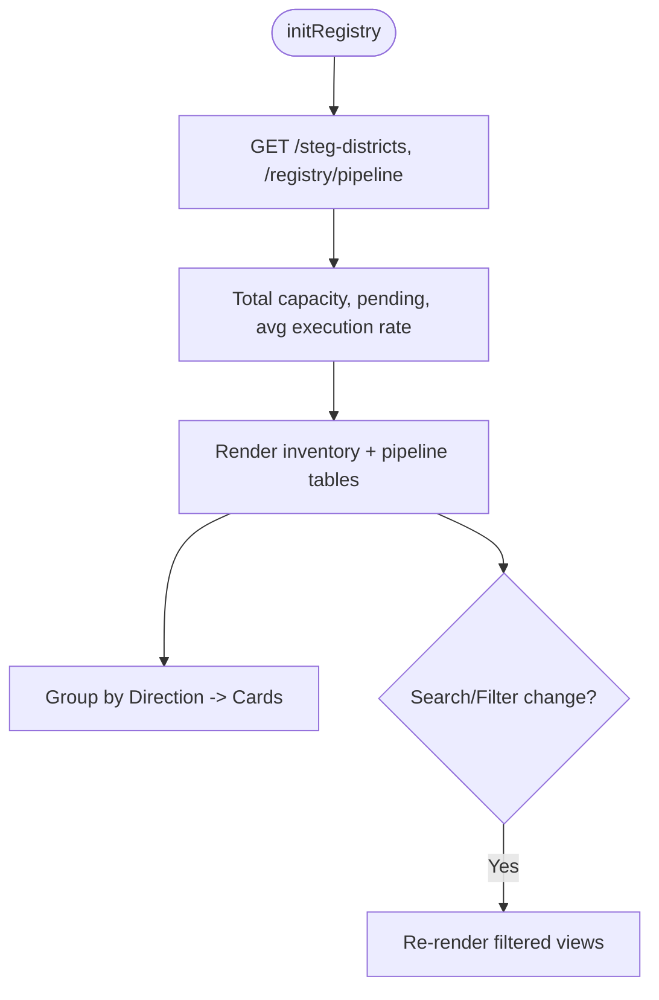
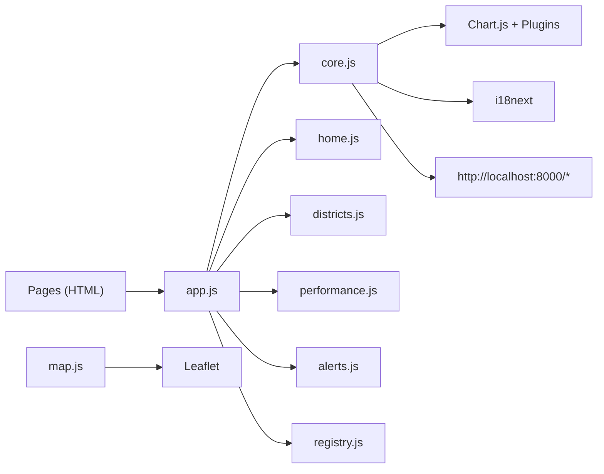

# Frontend Dashboard Architecture

<cite>
**Referenced Files in This Document**
- [index.html](file://dashboard/index.html)
- [alerts.html](file://dashboard/alerts.html)
- [performance.html](file://dashboard/performance.html)
- [map.html](file://dashboard/map.html)
- [districts.html](file://dashboard/districts.html)
- [app.js](file://dashboard/assets/js/app.js)
- [core.js](file://dashboard/assets/js/core.js)
- [home.js](file://dashboard/assets/js/home.js)
- [map.js](file://dashboard/assets/js/map.js)
- [performance.js](file://dashboard/assets/js/performance.js)
- [alerts.js](file://dashboard/assets/js/alerts.js)
- [districts.js](file://dashboard/assets/js/districts.js)
- [registry.js](file://dashboard/assets/js/registry.js)
- [style.css](file://dashboard/assets/css/style.css)
</cite>

## Table of Contents
1. [Introduction](#introduction)
2. [Project Structure](#project-structure)
3. [Core Components](#core-components)
4. [Architecture Overview](#architecture-overview)
5. [Detailed Component Analysis](#detailed-component-analysis)
6. [Dependency Analysis](#dependency-analysis)
7. [Performance Considerations](#performance-considerations)
8. [Troubleshooting Guide](#troubleshooting-guide)
9. [Conclusion](#conclusion)

## Introduction
This document describes the static frontend dashboard for a PV forecasting platform. The system is built from plain HTML pages, a shared CSS design system, and modular JavaScript files that implement page-specific logic. It integrates Chart.js for time-series visualizations with zoom and annotations, and Leaflet for interactive spatial maps. The dashboard supports responsive layouts and multi-language content (English, French, Arabic), consumes REST endpoints from a local API server, and provides user interactions such as toggles, filters, drilldown panels, and alert monitoring.

## Project Structure
The dashboard consists of multiple HTML entry points, each declaring a data-page attribute to route initialization to the correct module. A single app loader dynamically injects shared and feature modules. Shared utilities, i18n resources, and chart helpers live in core.js. Each page has its own JS file implementing initialization and API calls.

**Diagram sources**
- [app.js:1-18](file://dashboard/assets/js/app.js#L1-L18)
- [core.js:550-573](file://dashboard/assets/js/core.js#L550-L573)
- [index.html:1-137](file://dashboard/index.html#L1-L137)
- [map.html:1-252](file://dashboard/map.html#L1-L252)
- [districts.html:1-293](file://dashboard/districts.html#L1-L293)
- [performance.html:1-145](file://dashboard/performance.html#L1-L145)
- [alerts.html:1-84](file://dashboard/alerts.html#L1-L84)

**Section sources**
- [app.js:1-18](file://dashboard/assets/js/app.js#L1-L18)
- [core.js:550-573](file://dashboard/assets/js/core.js#L550-L573)
- [index.html:1-137](file://dashboard/index.html#L1-L137)

## Core Components
- Module loader: Dynamically injects shared and page-specific scripts via document.write.
- Shared runtime: Provides i18n setup, Chart.js defaults, helper functions for quantile datasets and “now” annotation, global status polling, and a router that initializes page modules based on data-page.
- Page modules: home.js, map.js, districts.js, performance.js, alerts.js, registry.js implement per-page behavior and API consumption.
- Styling: style.css defines tokens, layout, charts, tables, modals, and RTL support for Arabic.

Key responsibilities:
- i18n: Centralized translations for EN/FR/AR with fallback and interpolation; persists language choice and sets document direction for RTL.
- Charts: Reusable makeChart, p10p50p90Datasets, nowAnnotation, and zoom configuration.
- API status: fetchStatus updates sidebar indicators and cache age; fetchAlertBadge updates nav badge.
- Routing: DOMContentLoaded triggers applyI18n, status checks, modal wiring, and page init functions.

**Section sources**
- [app.js:1-18](file://dashboard/assets/js/app.js#L1-L18)
- [core.js:38-313](file://dashboard/assets/js/core.js#L38-L313)
- [core.js:388-497](file://dashboard/assets/js/core.js#L388-L497)
- [core.js:506-573](file://dashboard/assets/js/core.js#L506-L573)
- [style.css:8-40](file://dashboard/assets/css/style.css#L8-L40)
- [style.css:67-178](file://dashboard/assets/css/style.css#L67-L178)
- [style.css:781-800](file://dashboard/assets/css/style.css#L781-L800)

## Architecture Overview
The dashboard follows a static-site architecture with client-side routing by page type. Each HTML page includes the shared stylesheet and loads app.js, which injects core.js and feature modules. core.js initializes i18n, registers Chart plugins, and dispatches to page-specific init functions. Modules call REST endpoints under a configurable base URL to render KPIs, charts, tables, and interactive features.

**Diagram sources**
- [app.js:1-18](file://dashboard/assets/js/app.js#L1-L18)
- [core.js:550-573](file://dashboard/assets/js/core.js#L550-L573)
- [home.js:5-55](file://dashboard/assets/js/home.js#L5-L55)
- [map.js:21-112](file://dashboard/assets/js/map.js#L21-L112)
- [districts.js:8-118](file://dashboard/assets/js/districts.js#L8-L118)
- [performance.js:5-95](file://dashboard/assets/js/performance.js#L5-L95)
- [alerts.js:91-123](file://dashboard/assets/js/alerts.js#L91-L123)

## Detailed Component Analysis

### Home Page (National Overview)
- Loads national forecast and intraday forecast series.
- Computes KPIs: current estimated output, peak forecasts for today/tomorrow, uncertainty bands.
- Renders two charts:
  - National forecast with gross/net toggle (applies a fixed factor for net injection).
  - Intraday 15-minute resolution with bias-correction banner.
- Uses shared chart helpers and quantile dataset builder.

**Diagram sources**
- [home.js:5-133](file://dashboard/assets/js/home.js#L5-L133)
- [core.js:426-497](file://dashboard/assets/js/core.js#L426-L497)

**Section sources**
- [home.js:5-133](file://dashboard/assets/js/home.js#L5-L133)
- [index.html:85-111](file://dashboard/index.html#L85-L111)

### Map Page (Spatial Timelapse)
- Initializes Leaflet map with basemap layers and layer switcher.
- Fetches timelapse frames and district coordinates; merges metadata.
- Renders markers at direction or district level depending on zoom.
- Supports play/pause timeline slider and drilldown panel with weather metrics and a 72-hour forecast chart.
- Aggregates live weather across 7 directions into cards.

**Diagram sources**
- [map.js:21-112](file://dashboard/assets/js/map.js#L21-L112)
- [map.js:167-246](file://dashboard/assets/js/map.js#L167-L246)
- [map.js:248-299](file://dashboard/assets/js/map.js#L248-L299)
- [map.html:133-252](file://dashboard/map.html#L133-L252)

**Section sources**
- [map.js:21-112](file://dashboard/assets/js/map.js#L21-L112)
- [map.js:167-246](file://dashboard/assets/js/map.js#L167-L246)
- [map.js:248-299](file://dashboard/assets/js/map.js#L248-L299)
- [map.html:133-252](file://dashboard/map.html#L133-L252)

### Regional Analysis (Districts)
- Loads district inventory and directions; computes J+1 peak per district from timelapse frames.
- Renders a sortable/filterable table with search and direction pills.
- On row selection, shows a drilldown chart and hour-by-hour prediction breakdown with uncertainty classification.

**Diagram sources**
- [districts.js:8-118](file://dashboard/assets/js/districts.js#L8-L118)
- [districts.js:121-206](file://dashboard/assets/js/districts.js#L121-L206)
- [districts.html:194-285](file://dashboard/districts.html#L194-L285)

**Section sources**
- [districts.js:8-118](file://dashboard/assets/js/districts.js#L8-L118)
- [districts.js:121-206](file://dashboard/assets/js/districts.js#L121-L206)
- [districts.html:194-285](file://dashboard/districts.html#L194-L285)

### Performance Page (Model Health)
- Displays historical accuracy (actual vs P10/P50/P90) over recent hours.
- Shows training/validation bar charts for loss and accuracy/coverage.
- Presents backtest metrics table, rooftop summary, and continuous learning retrain log.
- Exposes model registry view and manual retraining trigger.

**Diagram sources**
- [performance.js:5-95](file://dashboard/assets/js/performance.js#L5-L95)
- [performance.js:99-191](file://dashboard/assets/js/performance.js#L99-L191)
- [performance.js:194-293](file://dashboard/assets/js/performance.js#L194-L293)
- [performance.html:53-139](file://dashboard/performance.html#L53-L139)

**Section sources**
- [performance.js:5-95](file://dashboard/assets/js/performance.js#L5-L95)
- [performance.js:99-191](file://dashboard/assets/js/performance.js#L99-L191)
- [performance.js:194-293](file://dashboard/assets/js/performance.js#L194-L293)
- [performance.html:53-139](file://dashboard/performance.html#L53-L139)

### Alerts Page
- Lists operational alerts with severity styling and icons.
- Supports threshold inputs for uncertainty and ramp-down filtering.
- Auto-refreshes alerts every minute and updates nav badge.
- Highlights automatic retraining status messages.

**Diagram sources**
- [alerts.js:91-123](file://dashboard/assets/js/alerts.js#L91-L123)
- [alerts.html:41-75](file://dashboard/alerts.html#L41-L75)

**Section sources**
- [alerts.js:91-123](file://dashboard/assets/js/alerts.js#L91-L123)
- [alerts.html:41-75](file://dashboard/alerts.html#L41-L75)

### Registry Page
- Fetches district inventory and pipeline projections.
- Computes totals and renders cards grouped by Direction.
- Provides search and filter by direction for both inventory and pipeline tables.

**Diagram sources**
- [registry.js:5-159](file://dashboard/assets/js/registry.js#L5-L159)

**Section sources**
- [registry.js:5-159](file://dashboard/assets/js/registry.js#L5-L159)

## Dependency Analysis
- Entry point: index.html and other pages load app.js, which injects core.js and feature modules.
- Shared dependencies:
  - Chart.js, HammerJS, zoom plugin, annotation plugin loaded in HTML where needed.
  - Leaflet loaded in map.html for interactive mapping.
  - i18next loaded in each page for localization.
- Module coupling:
  - All modules depend on core.js for i18n, chart helpers, and API base URL.
  - Pages are decoupled by responsibility; no cross-module imports beyond shared utilities.
- External services:
  - Local API server at http://localhost:8000 for forecasts, registry, alerts, models, and reports.
  - OpenStreetMap and Esri basemaps via Leaflet.

**Diagram sources**
- [app.js:1-18](file://dashboard/assets/js/app.js#L1-L18)
- [core.js:16-36](file://dashboard/assets/js/core.js#L16-L36)
- [map.html:9-13](file://dashboard/map.html#L9-L13)
- [index.html:9-12](file://dashboard/index.html#L9-L12)

**Section sources**
- [app.js:1-18](file://dashboard/assets/js/app.js#L1-L18)
- [core.js:16-36](file://dashboard/assets/js/core.js#L16-L36)
- [index.html:9-12](file://dashboard/index.html#L9-L12)
- [map.html:9-13](file://dashboard/map.html#L9-L13)

## Performance Considerations
- Chart rendering:
  - Reuses shared chart defaults and quantile dataset builder to minimize duplication.
  - Disables unnecessary legend and uses minimal point radius for large series.
  - Enables x-axis zoom/pan for better exploration without heavy redraws.
- Data fetching:
  - Parallel fetches where possible (e.g., districts and pipeline in registry).
  - Cache busting with query parameters for report summaries and validation metrics.
- UI responsiveness:
  - Responsive grid layouts and conditional rendering for mobile (sidebar hidden below thresholds).
  - Debounced or throttled interactions not explicitly used; consider adding for heavy computations if needed.
- Cross-browser compatibility:
  - Uses standard fetch and modern JS features present in current browsers.
  - Polyfills not included; ensure target environments support ES2017+ features.
- Network resilience:
  - Graceful error handling in modules with console logging and user-facing fallback states.
  - Global status indicator reflects connectivity and cache staleness.

[No sources needed since this section provides general guidance]

## Troubleshooting Guide
Common issues and remedies:
- API offline or unreachable:
  - Sidebar status dot turns red and text shows offline state; check network and API_BASE configuration.
  - Alert list shows an error state when fetch fails.
- Missing translations:
  - Console warnings indicate missing keys in non-English languages; add entries to I18N object.
- Chart not rendering:
  - Ensure Chart.js and plugins are loaded before core.js runs; verify canvas IDs exist.
- Map markers not visible:
  - Verify timelapse and district coordinate endpoints return valid data; check browser console for errors.
- Language switching not applied:
  - Confirm i18next is initialized and elements have data-i18n attributes; check localStorage persistence.

**Section sources**
- [core.js:506-548](file://dashboard/assets/js/core.js#L506-L548)
- [alerts.js:91-123](file://dashboard/assets/js/alerts.js#L91-L123)
- [core.js:345-351](file://dashboard/assets/js/core.js#L345-L351)

## Conclusion
The dashboard is a modular, static frontend that cleanly separates concerns across pages while sharing common functionality. It leverages Chart.js for robust time-series visualization and Leaflet for interactive mapping, with a consistent design system and strong internationalization support. The architecture enables easy extension with new pages or features, clear API integration patterns, and resilient error handling. For further optimization, consider lazy-loading heavy modules, caching API responses, and debouncing frequent interactions.