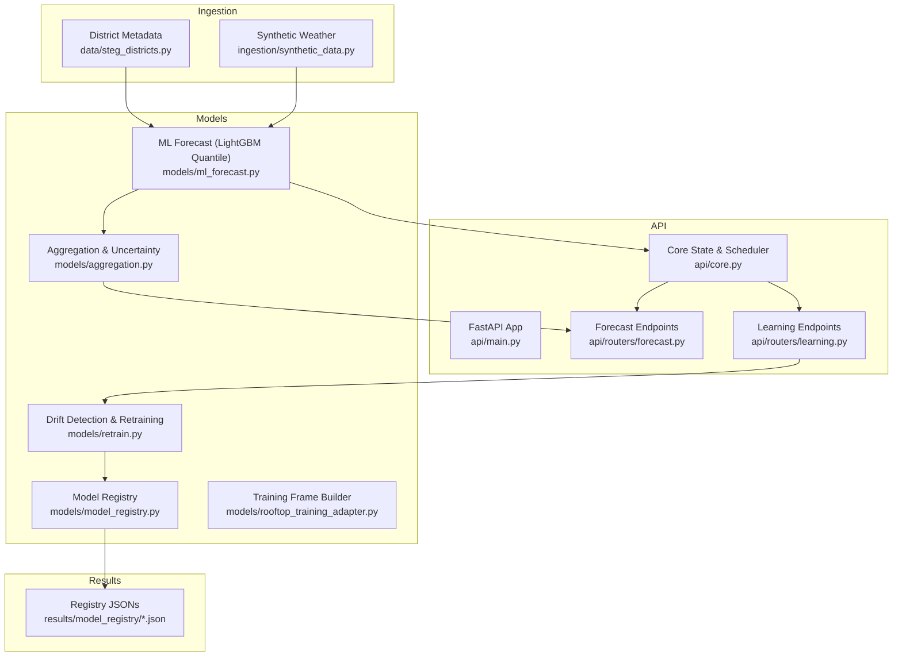
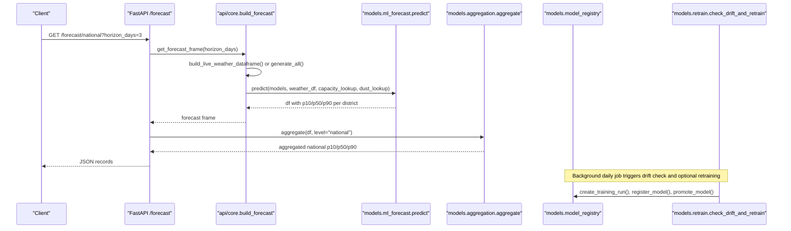
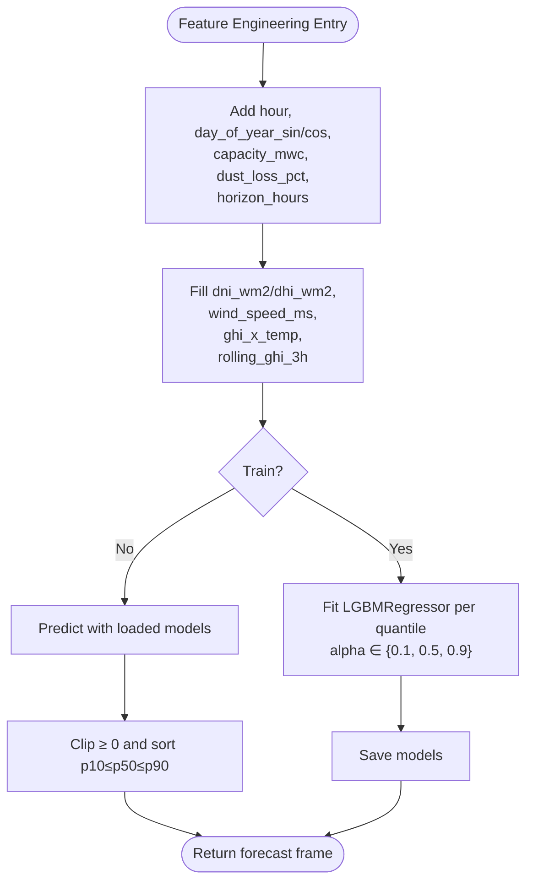
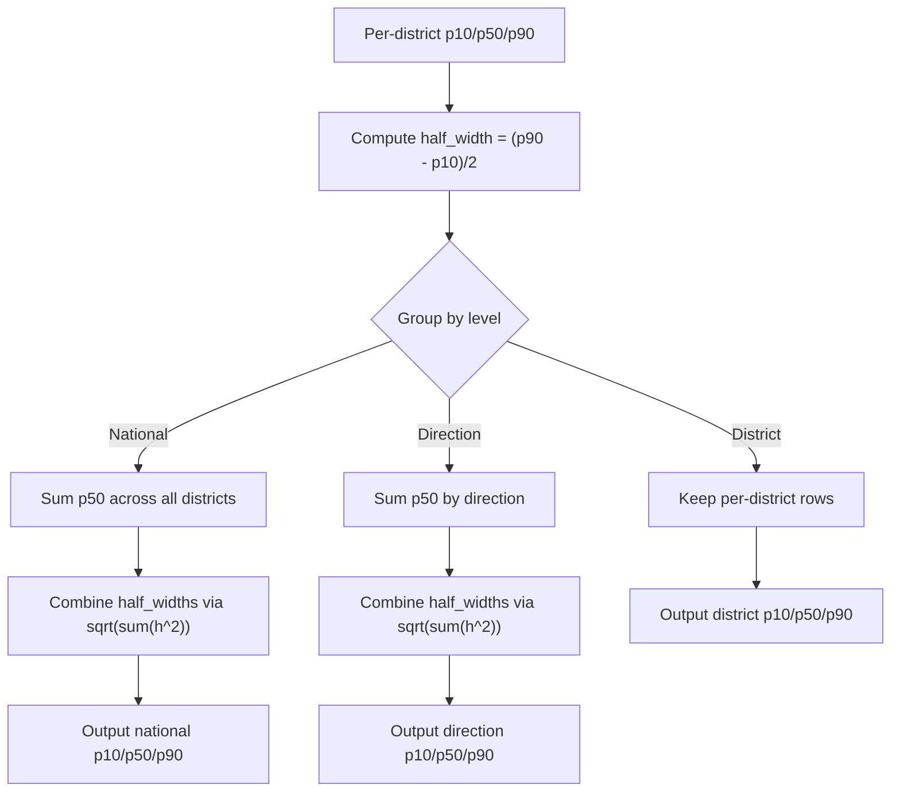
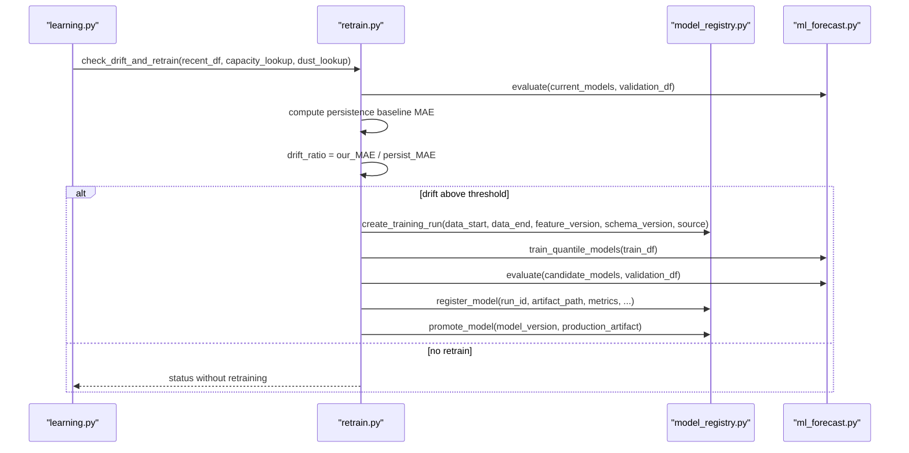
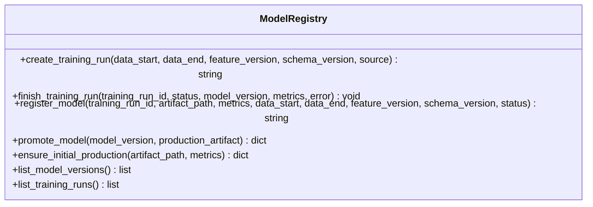
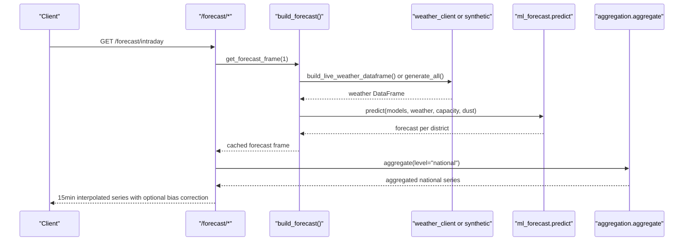
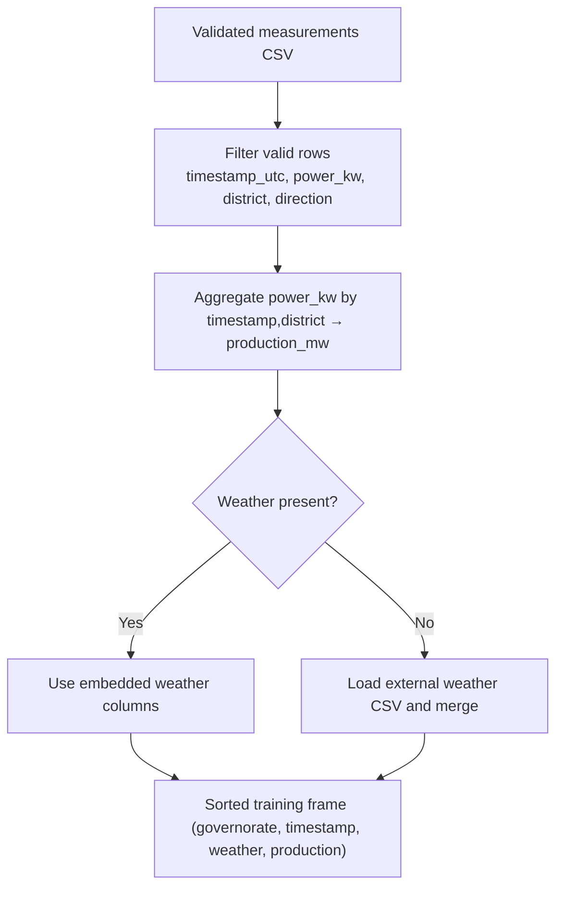
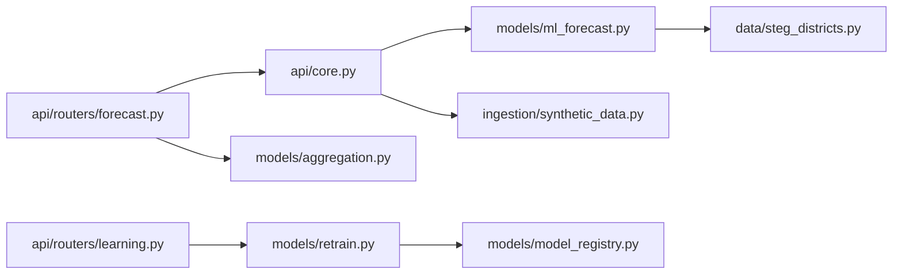

# Machine Learning Pipeline Architecture

<cite>
**Referenced Files in This Document**
- [ml_forecast.py](file://models/ml_forecast.py)
- [aggregation.py](file://models/aggregation.py)
- [retrain.py](file://models/retrain.py)
- [model_registry.py](file://models/model_registry.py)
- [rooftop_training_adapter.py](file://models/rooftop_training_adapter.py)
- [synthetic_data.py](file://ingestion/synthetic_data.py)
- [steg_districts.py](file://data/steg_districts.py)
- [main.py](file://api/main.py)
- [forecast.py](file://api/routers/forecast.py)
- [learning.py](file://api/routers/learning.py)
- [core.py](file://api/core.py)
- [model_versions.json](file://results/model_registry/model_versions.json)
- [training_runs.json](file://results/model_registry/training_runs.json)
- [production_model.json](file://results/model_registry/production_model.json)
</cite>

## Table of Contents
1. Introduction
2. Project Structure
3. Core Components
4. Architecture Overview
5. Detailed Component Analysis
6. Dependency Analysis
7. Performance Considerations
8. Troubleshooting Guide
9. Conclusion

## Introduction
This document describes the machine learning pipeline that delivers multi-horizon rooftop PV production forecasts across 50 STEG commercial districts and aggregates them to Direction and national levels. The system uses LightGBM quantile regression models to produce P10/P50/P90 predictions, supports continuous learning with drift detection against a persistence baseline, and provides an API for real-time forecasting and model registry operations. It also documents feature engineering, training workflows, aggregation with uncertainty propagation, model versioning, retraining triggers, performance optimization, and scalability considerations.

## Project Structure
The platform is organized into clear layers:
- Ingestion: synthetic or live weather generation and district metadata
- Models: ML forecasting, aggregation, retraining, and model registry
- API: FastAPI endpoints exposing forecasts, grid integration tools, and continuous learning controls
- Data and results: district definitions, model artifacts, and registry files

**Diagram sources**
- [ml_forecast.py:1-267](file://models/ml_forecast.py#L1-L267)
- [aggregation.py:1-164](file://models/aggregation.py#L1-L164)
- [retrain.py:1-115](file://models/retrain.py#L1-L115)
- [model_registry.py:1-161](file://models/model_registry.py#L1-L161)
- [rooftop_training_adapter.py:1-89](file://models/rooftop_training_adapter.py#L1-L89)
- [synthetic_data.py:1-170](file://ingestion/synthetic_data.py#L1-L170)
- [steg_districts.py:1-200](file://data/steg_districts.py#L1-L200)
- [main.py:1-42](file://api/main.py#L1-L42)
- [forecast.py:1-203](file://api/routers/forecast.py#L1-L203)
- [learning.py:1-163](file://api/routers/learning.py#L1-L163)
- [core.py:1-166](file://api/core.py#L1-L166)

**Section sources**
- [main.py:1-42](file://api/main.py#L1-L42)
- [core.py:1-166](file://api/core.py#L1-L166)
- [steg_districts.py:1-200](file://data/steg_districts.py#L1-L200)

## Core Components
- Multi-horizon quantile forecasting: Three LightGBM quantile regressors per horizon produce P10/P50/P90 predictions using engineered features including time-of-day, seasonal cycles, capacity, dust loss, DNI/DHI splits, wind speed, temperature interaction, and rolling GHI.
- Aggregation engine: Sums P50 across districts and combines uncertainty bands using sqrt-sum-of-squares of half-widths to propagate uncertainty from district to direction and national levels.
- Continuous learning: Compares recent forecast error to a persistence baseline; if drift exceeds threshold, trains candidate models on recent data, registers versions, and promotes only when validation improves.
- Model registry: Immutable file-based registry tracking training runs, model versions, metrics, and promotion status; ensures candidates outperform current production before promotion.
- API layer: Exposes endpoints for national/direction/district forecasts, map/timelapse views, export, bias correction, and continuous learning controls.

**Section sources**
- [ml_forecast.py:30-152](file://models/ml_forecast.py#L30-L152)
- [aggregation.py:20-89](file://models/aggregation.py#L20-L89)
- [retrain.py:40-104](file://models/retrain.py#L40-L104)
- [model_registry.py:35-131](file://models/model_registry.py#L35-L131)
- [forecast.py:25-158](file://api/routers/forecast.py#L25-L158)
- [learning.py:52-163](file://api/routers/learning.py#L52-L163)

## Architecture Overview
The pipeline ingests weather and district metadata, engineers features, predicts quantiles, aggregates to higher levels, and exposes results via API. A continuous learning loop monitors drift and retrains models when needed, with strict promotion policies enforced by the registry.

**Diagram sources**
- [forecast.py:25-32](file://api/routers/forecast.py#L25-L32)
- [core.py:72-99](file://api/core.py#L72-L99)
- [ml_forecast.py:118-131](file://models/ml_forecast.py#L118-L131)
- [aggregation.py:26-89](file://models/aggregation.py#L26-L89)
- [retrain.py:40-104](file://models/retrain.py#L40-L104)
- [model_registry.py:35-131](file://models/model_registry.py#L35-L131)

## Detailed Component Analysis

### Feature Engineering and Multi-Horizon Forecasting
- Features include base time and capacity features plus extended weather interactions and rolling averages. Optional columns are filled with sensible defaults so pipelines remain robust with incomplete inputs.
- Three LightGBM quantile regressors are trained per horizon to output P10/P50/P90. Predictions are clipped to non-negative values and sorted to enforce monotonicity (P10 ≤ P50 ≤ P90).
- Evaluation computes MAE and nRMSE on daylight hours and coverage of the P10–P90 band.

**Diagram sources**
- [ml_forecast.py:49-94](file://models/ml_forecast.py#L49-L94)
- [ml_forecast.py:97-131](file://models/ml_forecast.py#L97-L131)

**Section sources**
- [ml_forecast.py:30-152](file://models/ml_forecast.py#L30-L152)

### Aggregation Engine and Uncertainty Propagation
- Aggregates per-district forecasts to direction and national levels by summing P50 and combining uncertainty bands using sqrt-sum-of-squares of half-widths. This assumes partial independence of district-level errors; adjacent districts sharing cloud systems may have correlated errors, slightly underestimating true uncertainty.
- Supports multiple grouping keys and legacy aliases for compatibility.

**Diagram sources**
- [aggregation.py:20-89](file://models/aggregation.py#L20-L89)

**Section sources**
- [aggregation.py:1-164](file://models/aggregation.py#L1-L164)

### Continuous Learning and Drift Detection
- Drift detection compares recent model MAE to a persistence baseline (24-hour lag). If the ratio indicates degradation beyond a threshold, a candidate model is trained on a recent training split and validated on a holdout split.
- Candidate models are registered with metrics and promoted only if they improve upon current production MAE. Training runs are tracked with start/end timestamps, feature/schema versions, and status transitions.

**Diagram sources**
- [learning.py:31-49](file://api/routers/learning.py#L31-L49)
- [retrain.py:40-104](file://models/retrain.py#L40-L104)
- [model_registry.py:35-131](file://models/model_registry.py#L35-L131)
- [ml_forecast.py:97-152](file://models/ml_forecast.py#L97-L152)

**Section sources**
- [retrain.py:1-115](file://models/retrain.py#L1-L115)
- [model_registry.py:1-161](file://models/model_registry.py#L1-L161)
- [learning.py:1-163](file://api/routers/learning.py#L1-L163)

### Model Versioning and Registry Management
- File-based immutable registry tracks training runs and model versions with timestamps, metrics, feature/schema versions, and statuses (candidate, production, archived).
- Promotion enforces improvement over current production MAE and copies artifacts safely. Ensure_initial_production initializes the registry for existing artifacts.

**Diagram sources**
- [model_registry.py:35-161](file://models/model_registry.py#L35-L161)

**Section sources**
- [model_registry.py:1-161](file://models/model_registry.py#L1-L161)
- [production_model.json:1-18](file://results/model_registry/production_model.json#L1-L18)
- [model_versions.json:1-35](file://results/model_registry/model_versions.json#L1-L35)
- [training_runs.json:1-32](file://results/model_registry/training_runs.json#L1-L32)

### API Workflows and Real-Time Forecasting
- Endpoints provide national, direction, and district forecasts; map snapshots; timelapse frames; and export to CSV/XML. Bias correction scales forecasts using recent metered data when available.
- Cache avoids recomputation within a short window; background scheduler refreshes periodically and triggers daily retraining checks.

**Diagram sources**
- [forecast.py:35-54](file://api/routers/forecast.py#L35-L54)
- [core.py:72-99](file://api/core.py#L72-L99)
- [ml_forecast.py:118-131](file://models/ml_forecast.py#L118-L131)
- [aggregation.py:26-89](file://models/aggregation.py#L26-L89)

**Section sources**
- [forecast.py:1-203](file://api/routers/forecast.py#L1-L203)
- [core.py:1-166](file://api/core.py#L1-L166)

### Data Preparation for Retraining
- Validated rooftop measurement snapshots are converted to the canonical training schema, aggregating power by timestamp and district, merging weather if necessary, and enforcing quality filters.

**Diagram sources**
- [rooftop_training_adapter.py:26-89](file://models/rooftop_training_adapter.py#L26-L89)

**Section sources**
- [rooftop_training_adapter.py:1-89](file://models/rooftop_training_adapter.py#L1-L89)

## Dependency Analysis
Key dependencies and coupling:
- API depends on core state and model prediction; core orchestrates weather ingestion and caching.
- ML forecasting depends on district metadata for capacity and dust loss; aggregation depends on forecast outputs and grouping keys.
- Retraining depends on model registry for versioning and promotion; learning endpoints orchestrate background jobs and logging.

**Diagram sources**
- [forecast.py:1-203](file://api/routers/forecast.py#L1-L203)
- [core.py:1-166](file://api/core.py#L1-L166)
- [ml_forecast.py:1-267](file://models/ml_forecast.py#L1-L267)
- [synthetic_data.py:1-170](file://ingestion/synthetic_data.py#L1-L170)
- [steg_districts.py:1-200](file://data/steg_districts.py#L1-L200)
- [aggregation.py:1-164](file://models/aggregation.py#L1-L164)
- [learning.py:1-163](file://api/routers/learning.py#L1-L163)
- [retrain.py:1-115](file://models/retrain.py#L1-L115)
- [model_registry.py:1-161](file://models/model_registry.py#L1-L161)

**Section sources**
- [core.py:1-166](file://api/core.py#L1-L166)
- [ml_forecast.py:1-267](file://models/ml_forecast.py#L1-L267)
- [aggregation.py:1-164](file://models/aggregation.py#L1-L164)
- [retrain.py:1-115](file://models/retrain.py#L1-L115)
- [model_registry.py:1-161](file://models/model_registry.py#L1-L161)

## Performance Considerations
- Caching: Forecasts are cached for up to 14 minutes to reduce repeated computation; background scheduler refreshes every 15 minutes during operational hours.
- Efficient feature engineering: Rolling GHI computed per governorate; optional columns filled with defaults to avoid branching overhead.
- Quantile crossing guard: Sorting predictions ensures consistent uncertainty bands without post-processing complexity.
- Aggregation efficiency: Groupby operations on pandas DataFrames scale well to 50 districts; uncertainty combination uses vectorized numpy operations.
- Bias correction: Applied only when sufficient recent metering exists; prevents unnecessary scaling.

Scalability considerations:
- District count (50) and horizon length (up to 3 days) fit comfortably in memory; groupby and vectorized ops remain efficient.
- For larger scale, consider:
  - Parallelizing per-district feature computations where applicable
  - Using batched model inference with optimized LightGBM settings
  - Partitioning aggregation by direction to reduce cross-group operations
  - Streaming updates for metering buffer and incremental retraining windows

[No sources needed since this section provides general guidance]

## Troubleshooting Guide
Common issues and resolutions:
- No forecast data available: Ensure weather ingestion returns rows within the requested horizon; fallback to synthetic data if live calls fail.
- Unknown district or direction: Validate names against district metadata; endpoints return 404 with options when not found.
- Retraining failures: Check validated measurement snapshots and required columns; ensure weather data matches timestamps and districts; review retrain logs and status endpoints.
- Promotion blocked: Candidate must improve MAE over current production; verify metrics and artifact paths exist.

**Section sources**
- [forecast.py:64-89](file://api/routers/forecast.py#L64-L89)
- [learning.py:77-108](file://api/routers/learning.py#L77-L108)
- [model_registry.py:104-131](file://models/model_registry.py#L104-L131)
- [core.py:106-122](file://api/core.py#L106-L122)

## Conclusion
The pipeline delivers robust multi-horizon PV forecasts with calibrated uncertainty bands across 50 districts, aggregates to higher administrative levels, and continuously learns from observed production while maintaining strict model governance. The architecture balances accuracy, interpretability, and operational reliability through careful feature design, quantile modeling, uncertainty propagation, and automated drift-aware retraining with immutable versioning.

[No sources needed since this section summarizes without analyzing specific files]