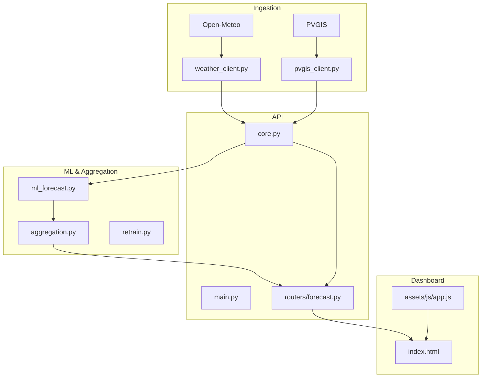
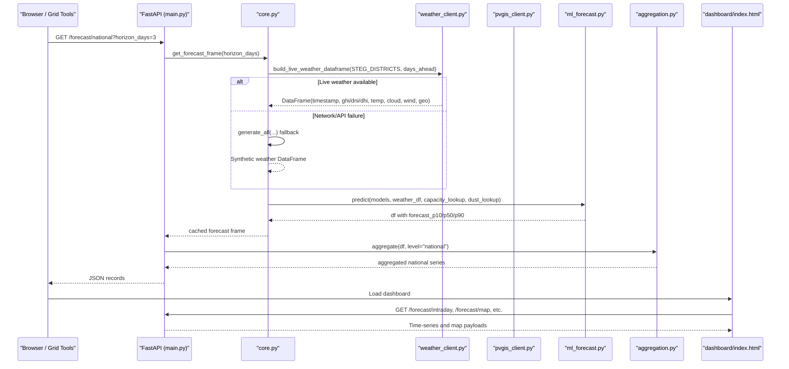
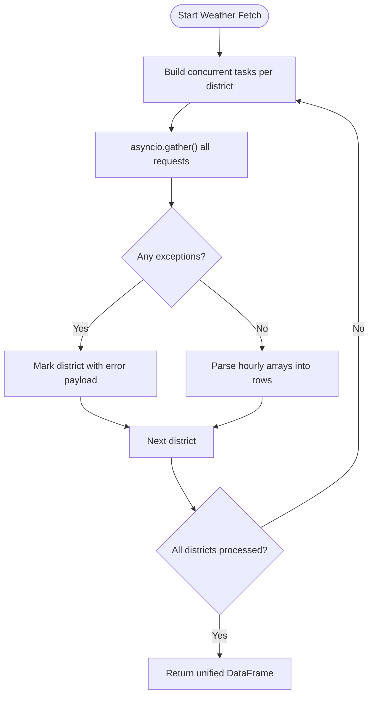
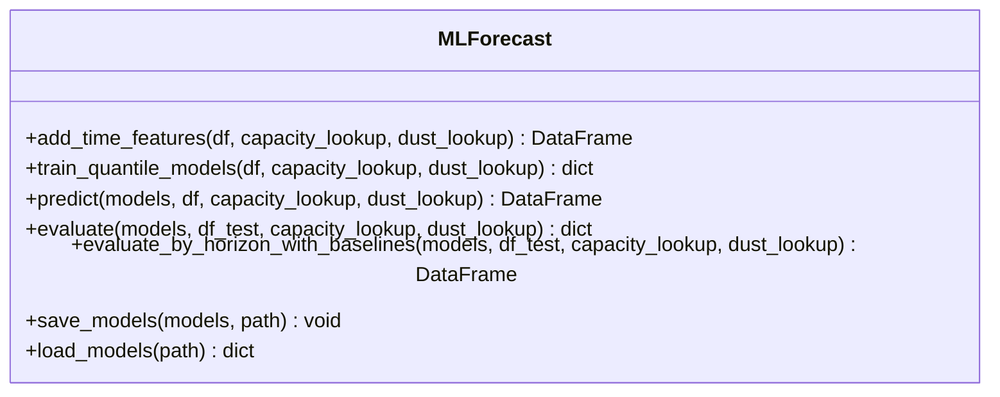
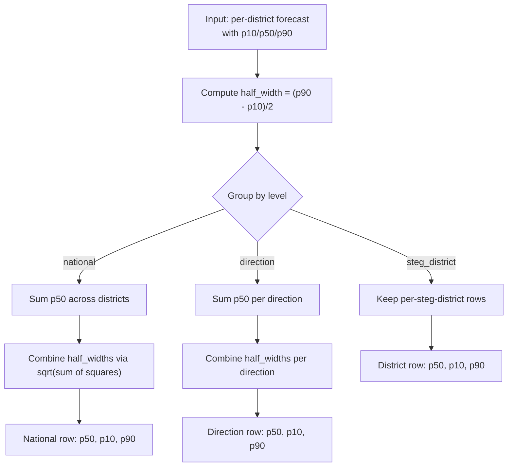
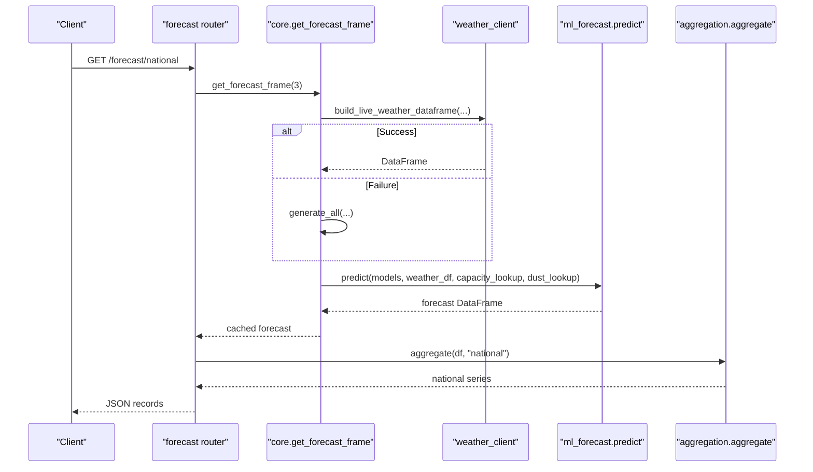
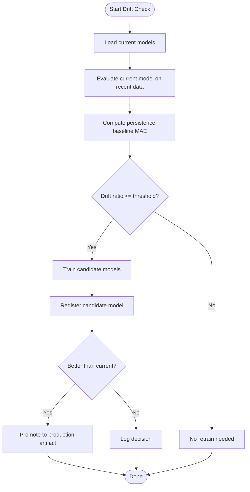
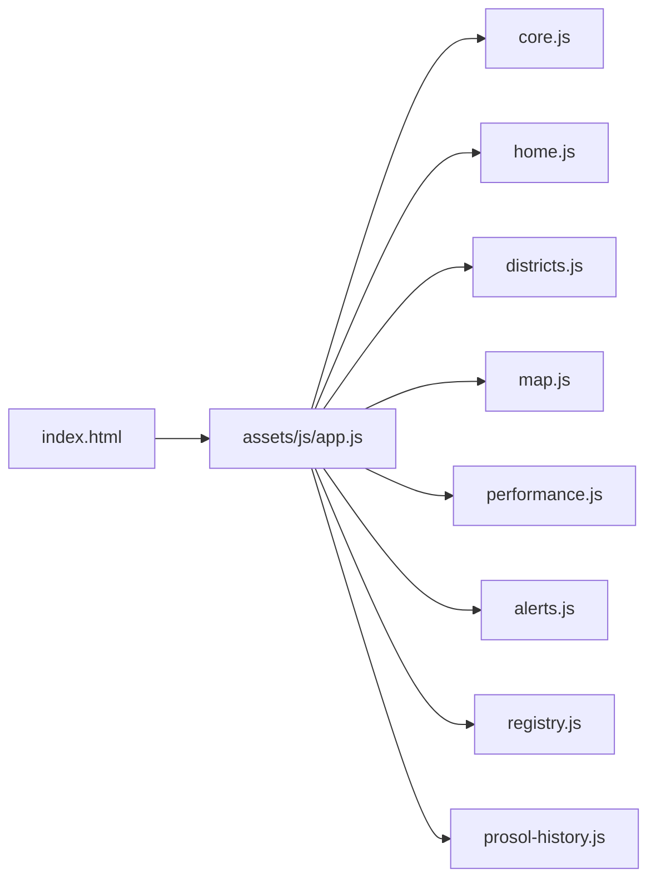
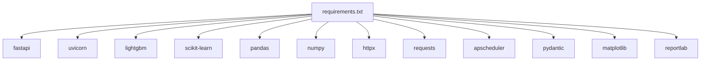

# System Architecture

<cite>
**Referenced Files in This Document**
- [README.md](file://README.md)
- [requirements.txt](file://requirements.txt)
- [api/main.py](file://api/main.py)
- [api/core.py](file://api/core.py)
- [api/routers/forecast.py](file://api/routers/forecast.py)
- [models/ml_forecast.py](file://models/ml_forecast.py)
- [models/aggregation.py](file://models/aggregation.py)
- [models/retrain.py](file://models/retrain.py)
- [ingestion/weather_client.py](file://ingestion/weather_client.py)
- [ingestion/pvgis_client.py](file://ingestion/pvgis_client.py)
- [data/governorates.py](file://data/governorates.py)
- [dashboard/index.html](file://dashboard/index.html)
- [dashboard/assets/js/app.js](file://dashboard/assets/js/app.js)
</cite>

## Table of Contents
1. Introduction
2. Project Structure
3. Core Components
4. Architecture Overview
5. Detailed Component Analysis
6. Dependency Analysis
7. Performance Considerations
8. Troubleshooting Guide
9. Conclusion

## Introduction
This document describes the architecture of the National Rooftop PV Forecast Platform for Tunisia, designed to forecast aggregated rooftop solar production from nowcast through D+3 at district, governorate, and national levels with calibrated uncertainty bands (P10/P50/P90). The system ingests weather data from Open-Meteo and historical PV simulation from PVGIS, processes features and forecasts via a gradient-boosted quantile model, aggregates results across administrative boundaries, exposes them through a FastAPI REST service, and visualizes outcomes in an interactive dashboard. It also includes continuous learning: drift detection compares recent forecast error against a persistence baseline and triggers retraining when performance degrades.

The platform is organized into clear layers: ingestion (weather and PVGIS), ML processing (feature engineering, training, prediction, evaluation), aggregation (district → direction → national), API serving (FastAPI routers), and frontend visualization (HTML/JS dashboards). Cross-cutting concerns include caching, scheduled refreshes, bias correction using metering buffer, authentication, and resilience via synthetic fallback when live weather is unavailable.

**Section sources**
- [README.md:1-150](file://README.md#L1-L150)

## Project Structure
The repository follows a modular, microservices-inspired layout with separation of concerns:
- api/: FastAPI application, shared state, lifecycle, and domain routers
- models/: ML forecasting, aggregation, retraining, and model registry utilities
- ingestion/: Weather clients (Open-Meteo, PVGIS) and synthetic data generator
- dashboard/: Static HTML pages and JavaScript modules for visualization
- data/: Geographic and capacity metadata, including STEG districts and directions
- reports/: Reporting and evaluation utilities
- results/: Model artifacts, metrics, and logs

**Diagram sources**
- [api/main.py:10-42](file://api/main.py#L10-L42)
- [api/core.py:55-103](file://api/core.py#L55-L103)
- [api/routers/forecast.py:25-186](file://api/routers/forecast.py#L25-L186)
- [models/ml_forecast.py:49-131](file://models/ml_forecast.py#L49-L131)
- [models/aggregation.py:26-89](file://models/aggregation.py#L26-L89)
- [ingestion/weather_client.py:53-130](file://ingestion/weather_client.py#L53-L130)
- [ingestion/pvgis_client.py:27-95](file://ingestion/pvgis_client.py#L27-L95)
- [dashboard/index.html:1-137](file://dashboard/index.html#L1-L137)
- [dashboard/assets/js/app.js:1-18](file://dashboard/assets/js/app.js#L1-L18)

**Section sources**
- [README.md:75-95](file://README.md#L75-L95)
- [requirements.txt:1-15](file://requirements.txt#L1-L15)

## Core Components
- Ingestion layer:
  - Open-Meteo client fetches hourly irradiance, temperature, cloud cover, and wind speed concurrently per location; falls back to synthetic generation if network/API fails.
  - PVGIS client provides historical PV production simulations per district with caching to reduce repeated calls.
- ML processing:
  - Feature engineering adds time-based features, capacity and dust loss adjustments, and extended meteorological interactions.
  - Quantile regression models (P10/P50/P90) trained with LightGBM; predictions enforce non-negative outputs and monotonic quantiles.
  - Evaluation computes MAE, nRMSE, and coverage; by-horizon backtests compare against persistence and clear-sky baselines.
- Aggregation:
  - Sums point forecasts across districts and combines uncertainty bands using sqrt-sum-of-squares of half-widths, assuming partial independence.
  - Supports multiple grouping levels: steg_district, direction, governorate, and national.
- API serving:
  - FastAPI app mounts routers for forecast, grid integration, learning, diagnostics, and reports.
  - Shared state caches forecasts with TTL, loads models lazily, and applies bias correction when metering buffer is available.
  - Endpoints provide national, intraday, direction, district, governorate, map snapshots, timelapse, export, and refresh capabilities.
- Dashboard:
  - Multi-page static site with Chart.js visualizations, status indicators, and navigation to regional analysis, spatial timelapse, model health, alerts, and registry views.
  - Loads modular JS components for each page’s logic.

**Section sources**
- [ingestion/weather_client.py:53-130](file://ingestion/weather_client.py#L53-L130)
- [ingestion/pvgis_client.py:27-95](file://ingestion/pvgis_client.py#L27-L95)
- [models/ml_forecast.py:49-131](file://models/ml_forecast.py#L49-L131)
- [models/aggregation.py:26-89](file://models/aggregation.py#L26-L89)
- [api/main.py:20-42](file://api/main.py#L20-L42)
- [api/core.py:55-103](file://api/core.py#L55-L103)
- [api/routers/forecast.py:25-186](file://api/routers/forecast.py#L25-L186)
- [dashboard/index.html:14-137](file://dashboard/index.html#L14-L137)
- [dashboard/assets/js/app.js:1-18](file://dashboard/assets/js/app.js#L1-L18)

## Architecture Overview
The platform implements a layered architecture with clear boundaries:
- Data ingestion: Real-time weather via Open-Meteo and historical PV via PVGIS, producing a unified DataFrame schema.
- ML processing: Feature enrichment, quantile model inference, and evaluation.
- Aggregation: Spatial roll-up with uncertainty propagation.
- API: REST endpoints exposing forecasts and exports, with caching and bias correction.
- Dashboard: Interactive visualizations consuming API responses.

**Diagram sources**
- [api/routers/forecast.py:25-54](file://api/routers/forecast.py#L25-L54)
- [api/core.py:72-103](file://api/core.py#L72-L103)
- [ingestion/weather_client.py:77-130](file://ingestion/weather_client.py#L77-L130)
- [models/ml_forecast.py:118-131](file://models/ml_forecast.py#L118-L131)
- [models/aggregation.py:26-89](file://models/aggregation.py#L26-L89)
- [dashboard/index.html:85-111](file://dashboard/index.html#L85-L111)

## Detailed Component Analysis

### Ingestion Layer
- Open-Meteo client:
  - Concurrently fetches hourly variables (shortwave radiation, diffuse, direct normal, temperature, cloud cover, wind speed) for all districts/governorates using async HTTP requests.
  - Builds a unified DataFrame with timestamps, irradiance splits, temperature, cloud cover, wind speed, and geographic identifiers.
  - Raises errors on network/API failures; callers should catch and fallback to synthetic data.
- PVGIS client:
  - Fetches hourly PV production for a reference system per district, with local caching to avoid redundant calls.
  - Normalizes response fields into standard columns (power_kw, ghi/dni/dhi, temp, wind) and fills missing values safely.

**Diagram sources**
- [ingestion/weather_client.py:53-130](file://ingestion/weather_client.py#L53-L130)

**Section sources**
- [ingestion/weather_client.py:1-180](file://ingestion/weather_client.py#L1-L180)
- [ingestion/pvgis_client.py:1-96](file://ingestion/pvgis_client.py#L1-L96)

### ML Processing Layer
- Feature engineering:
  - Adds hour, day-of-year sine/cosine, capacity mapping, dust loss defaults, horizon hours, optional DNI/DHI/wind, GHI×temperature interaction, and rolling GHI averages per governorate.
  - Gracefully handles missing optional columns by filling sensible defaults.
- Quantile models:
  - Trains three LightGBM quantile regressors (alpha=0.1/0.5/0.9) for P10/P50/P90.
  - Predictions are clipped to non-negative and sorted to ensure p10 ≤ p50 ≤ p90.
- Evaluation:
  - Computes MAE, nRMSE, and P10-P90 coverage over daylight hours.
  - By-horizon backtest compares against persistence (24h lag) and clear-sky baselines.

**Diagram sources**
- [models/ml_forecast.py:49-131](file://models/ml_forecast.py#L49-L131)
- [models/ml_forecast.py:155-233](file://models/ml_forecast.py#L155-L233)

**Section sources**
- [models/ml_forecast.py:1-267](file://models/ml_forecast.py#L1-L267)

### Aggregation Layer
- Aggregates per-district forecasts to direction, governorate, or national levels.
- Combines uncertainty bands using sqrt-sum-of-squares of half-widths, acknowledging spatial correlation limitations.
- Provides mean weather conditions alongside aggregated forecasts for map endpoints.

**Diagram sources**
- [models/aggregation.py:20-89](file://models/aggregation.py#L20-L89)

**Section sources**
- [models/aggregation.py:1-164](file://models/aggregation.py#L1-L164)

### API Serving Layer
- Application setup:
  - FastAPI app with CORS middleware and lifespan for background scheduling and model loading.
  - Routers mounted for meta, forecast, grid integration, learning, diagnostics, and reports.
- Forecast pipeline:
  - get_forecast_frame builds or retrieves cached forecast, preferring live weather and falling back to synthetic data.
  - Bias correction scales forecasts using recent metering buffer ratios when available.
- Endpoints:
  - National, intraday (15-min interpolation), directions, district, governorate, map snapshot, timelapse, export CSV/XML, and forced refresh.

**Diagram sources**
- [api/routers/forecast.py:25-32](file://api/routers/forecast.py#L25-L32)
- [api/core.py:72-103](file://api/core.py#L72-L103)
- [ingestion/weather_client.py:77-130](file://ingestion/weather_client.py#L77-L130)
- [models/ml_forecast.py:118-131](file://models/ml_forecast.py#L118-L131)
- [models/aggregation.py:26-89](file://models/aggregation.py#L26-L89)

**Section sources**
- [api/main.py:10-42](file://api/main.py#L10-L42)
- [api/core.py:45-103](file://api/core.py#L45-L103)
- [api/routers/forecast.py:25-186](file://api/routers/forecast.py#L25-L186)

### Continuous Learning and Retraining
- Drift detection:
  - Compares current model MAE against persistence baseline MAE on recent data.
  - If degradation exceeds threshold, trains candidate models on a training split and evaluates on validation split.
- Model registry:
  - Creates training runs, registers candidates, and promotes improved models to production artifact path.
- Scheduled operations:
  - Background scheduler triggers daily retraining and periodic forecast refreshes.

**Diagram sources**
- [models/retrain.py:40-104](file://models/retrain.py#L40-L104)
- [api/core.py:125-139](file://api/core.py#L125-L139)

**Section sources**
- [models/retrain.py:1-115](file://models/retrain.py#L1-L115)
- [api/core.py:125-139](file://api/core.py#L125-L139)

### Dashboard Layer
- Pages:
  - National overview with KPIs, charts for gross/net injection, intraday 15-min series, and status indicators.
  - Regional analysis, spatial timelapse, model health, alerts, park registry, and Prosol history views.
- Frontend modules:
  - Centralized entrypoint dynamically loads page-specific scripts for core, home, districts, map, performance, alerts, registry, and prosol-history.

**Diagram sources**
- [dashboard/index.html:14-137](file://dashboard/index.html#L14-L137)
- [dashboard/assets/js/app.js:1-18](file://dashboard/assets/js/app.js#L1-L18)

**Section sources**
- [dashboard/index.html:1-137](file://dashboard/index.html#L1-L137)
- [dashboard/assets/js/app.js:1-18](file://dashboard/assets/js/app.js#L1-L18)

## Dependency Analysis
Key dependencies and their roles:
- FastAPI and Uvicorn: Web framework and ASGI server for the API.
- LightGBM and scikit-learn: Gradient boosting and ML utilities for quantile regression.
- Pandas and NumPy: Data manipulation and numerical operations.
- httpx and requests: Async and sync HTTP clients for Open-Meteo and PVGIS.
- APScheduler: Background jobs for forecast refresh and retraining.
- Pydantic: Request/response validation (used indirectly via FastAPI).
- Matplotlib and ReportLab: Visualization and report generation utilities.

**Diagram sources**
- [requirements.txt:1-15](file://requirements.txt#L1-L15)

**Section sources**
- [requirements.txt:1-15](file://requirements.txt#L1-L15)

## Performance Considerations
- Concurrency:
  - Weather fetching uses asyncio.gather to parallelize requests across districts, reducing total latency to near single-request time.
- Caching:
  - API caches forecast frames with a TTL to avoid recomputation on frequent requests; manual refresh endpoint clears cache.
- Interpolation:
  - Intraday endpoint interpolates to 15-minute resolution for smoother visualization and dispatch use.
- Uncertainty combination:
  - Aggregation uses sqrt-sum-of-squares of half-widths; acknowledges underestimation due to spatial correlation of cloud systems.
- Bias correction:
  - Applies scaling factor derived from recent metering buffer to align forecasts with observed production when available.

[No sources needed since this section provides general guidance]

## Troubleshooting Guide
Common issues and mitigations:
- Weather API failures:
  - Catch exceptions from weather_client and fall back to synthetic data; ensure caller handles RuntimeError and switches data source.
- Missing or invalid columns:
  - Feature engineering fills defaults for optional columns; verify input schemas before calling predict.
- Unknown district or direction:
  - Endpoints raise HTTP 404 with options; validate inputs against known lists (DIRECTIONS, DISTRICT_BY_NAME).
- Scheduler not installed:
  - APScheduler import failure disables background refresh; check requirements and environment.
- Metering buffer absent:
  - Bias correction returns None; forecasts remain uncorrected until buffer exists.

**Section sources**
- [ingestion/weather_client.py:77-130](file://ingestion/weather_client.py#L77-L130)
- [api/routers/forecast.py:64-128](file://api/routers/forecast.py#L64-L128)
- [api/core.py:106-139](file://api/core.py#L106-L139)

## Conclusion
The National Rooftop PV Forecast Platform delivers a robust, layered architecture that integrates real-time weather and historical PV data, applies advanced ML forecasting with calibrated uncertainty, aggregates results across administrative boundaries, and serves them via a flexible REST API consumed by an interactive dashboard. Its modular design separates ingestion, ML, aggregation, API, and visualization concerns, enabling maintainability and scalability. Continuous learning ensures model quality over time, while caching, concurrency, and fallback strategies enhance reliability and performance. Deployment can run the FastAPI service with Uvicorn, schedule background tasks via APScheduler, and serve static dashboard assets from the same process or a web server.

[No sources needed since this section summarizes without analyzing specific files]