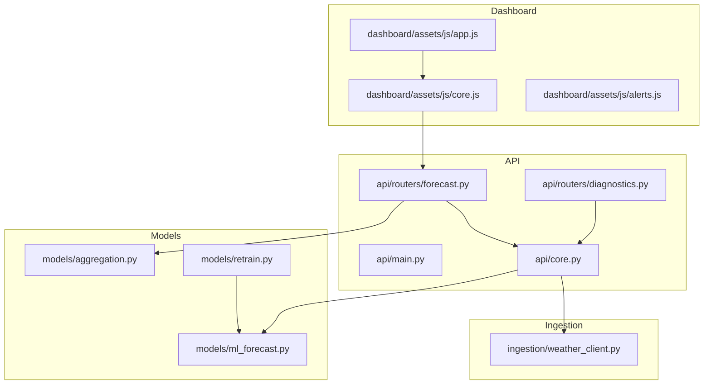
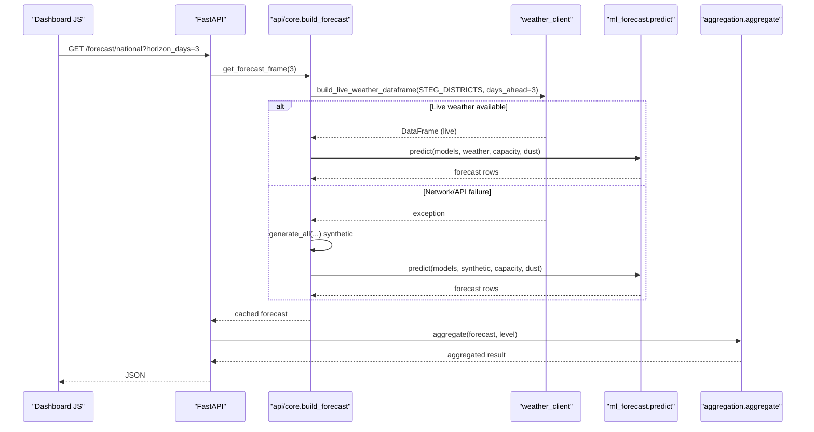
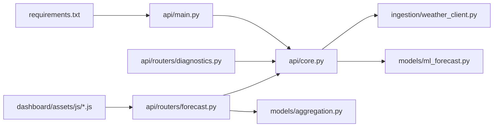

# Troubleshooting & FAQ

<cite>
**Referenced Files in This Document**
- [README.md](file://README.md)
- [requirements.txt](file://requirements.txt)
- [api/main.py](file://api/main.py)
- [api/core.py](file://api/core.py)
- [api/routers/forecast.py](file://api/routers/forecast.py)
- [api/routers/diagnostics.py](file://api/routers/diagnostics.py)
- [ingestion/weather_client.py](file://ingestion/weather_client.py)
- [models/ml_forecast.py](file://models/ml_forecast.py)
- [models/aggregation.py](file://models/aggregation.py)
- [models/retrain.py](file://models/retrain.py)
- [dashboard/assets/js/app.js](file://dashboard/assets/js/app.js)
- [dashboard/assets/js/core.js](file://dashboard/assets/js/core.js)
- [dashboard/assets/js/alerts.js](file://dashboard/assets/js/alerts.js)
</cite>

## Table of Contents
1. [Introduction](#introduction)
2. [Project Structure](#project-structure)
3. [Core Components](#core-components)
4. [Architecture Overview](#architecture-overview)
5. [Detailed Component Analysis](#detailed-component-analysis)
6. [Dependency Analysis](#dependency-analysis)
7. [Performance Considerations](#performance-considerations)
8. [Troubleshooting Guide](#troubleshooting-guide)
9. [Conclusion](#conclusion)
10. [Appendices](#appendices)

## Introduction
This document provides comprehensive troubleshooting and FAQ guidance for the National Rooftop PV Forecast Platform. It focuses on common issues during setup, model training, API usage, and dashboard operation. It includes step-by-step resolution guides, diagnostic procedures for weather data connectivity, model performance degradation, and API response problems. It also covers debugging techniques for forecast accuracy, data ingestion failures, frontend rendering problems, error messages and their meanings, performance optimization tips, migration considerations, and frequently asked questions about model behavior, data requirements, and system limitations.

## Project Structure
The platform is organized into clear layers:
- API layer (FastAPI): entrypoint, routers, shared state, caching, scheduling
- Ingestion layer: real-time weather from Open-Meteo and historical PVGIS
- Models layer: feature engineering, quantile gradient boosting, aggregation
- Reports and results: metrics, retraining logs, Prosol history
- Dashboard: static HTML pages with JavaScript modules that call the API

**Diagram sources**
- [api/main.py:10-41](file://api/main.py#L10-L41)
- [api/core.py:55-99](file://api/core.py#L55-L99)
- [api/routers/forecast.py:25-158](file://api/routers/forecast.py#L25-L158)
- [api/routers/diagnostics.py:17-80](file://api/routers/diagnostics.py#L17-L80)
- [ingestion/weather_client.py:53-130](file://ingestion/weather_client.py#L53-L130)
- [models/ml_forecast.py:49-131](file://models/ml_forecast.py#L49-L131)
- [models/aggregation.py:26-89](file://models/aggregation.py#L26-L89)
- [models/retrain.py:40-104](file://models/retrain.py#L40-L104)
- [dashboard/assets/js/app.js:1-17](file://dashboard/assets/js/app.js#L1-L17)
- [dashboard/assets/js/core.js:16-17](file://dashboard/assets/js/core.js#L16-L17)
- [dashboard/assets/js/alerts.js:91-109](file://dashboard/assets/js/alerts.js#L91-L109)

**Section sources**
- [README.md:75-117](file://README.md#L75-L117)
- [api/main.py:10-41](file://api/main.py#L10-L41)

## Core Components
- API entrypoint and CORS configuration
- Forecast computation pipeline with live/synthetic fallback
- Weather ingestion with concurrent requests
- Quantile forecasting models and aggregation
- Diagnostics and alerts endpoints
- Dashboard modules and status polling

Key responsibilities:
- api/main.py: FastAPI app assembly and router registration
- api/core.py: Model loading, forecast building, caching, scheduled refresh/retrain
- ingestion/weather_client.py: Concurrent fetching of Open-Meteo forecasts; synthetic fallback path via core
- models/ml_forecast.py: Feature creation, training, prediction, evaluation
- models/aggregation.py: Aggregation to national/direction/steg_district levels
- api/routers/forecast.py: Endpoints for national, intraday, directions, districts, map, timelapse, export
- api/routers/diagnostics.py: Alerts, metrics, validation, history endpoints
- dashboard assets: UI modules calling API endpoints and rendering charts/alerts

**Section sources**
- [api/main.py:10-41](file://api/main.py#L10-L41)
- [api/core.py:55-99](file://api/core.py#L55-L99)
- [ingestion/weather_client.py:53-130](file://ingestion/weather_client.py#L53-L130)
- [models/ml_forecast.py:49-131](file://models/ml_forecast.py#L49-L131)
- [models/aggregation.py:26-89](file://models/aggregation.py#L26-L89)
- [api/routers/forecast.py:25-158](file://api/routers/forecast.py#L25-L158)
- [api/routers/diagnostics.py:17-80](file://api/routers/diagnostics.py#L17-L80)
- [dashboard/assets/js/app.js:1-17](file://dashboard/assets/js/app.js#L1-L17)
- [dashboard/assets/js/core.js:507-536](file://dashboard/assets/js/core.js#L507-L536)
- [dashboard/assets/js/alerts.js:91-109](file://dashboard/assets/js/alerts.js#L91-L109)

## Architecture Overview
The API builds a forecast by attempting live weather first; if unavailable, it falls back to synthetic data. The forecast is cached for ~14 minutes and served across endpoints. The dashboard polls status and alerts and renders charts using Chart.js.

**Diagram sources**
- [api/routers/forecast.py:25-32](file://api/routers/forecast.py#L25-L32)
- [api/core.py:72-99](file://api/core.py#L72-L99)
- [ingestion/weather_client.py:77-130](file://ingestion/weather_client.py#L77-L130)
- [models/ml_forecast.py:118-131](file://models/ml_forecast.py#L118-L131)
- [models/aggregation.py:26-89](file://models/aggregation.py#L26-L89)

## Detailed Component Analysis

### Weather Data Connectivity
Symptoms:
- “No forecast data available” or empty responses
- Dashboard shows “API Offline”
- Alerts not updating

Diagnostics:
- Verify network access to Open-Meteo and PVGIS
- Check that governorates list is valid and non-empty
- Confirm timeout settings and concurrency behavior

Resolution steps:
- Ensure internet connectivity and DNS resolution
- If live weather fails, the system automatically falls back to synthetic data; verify data_source reflects “synthetic”
- For development without internet, rely on synthetic generation; confirm that the fallback path executes

Error signals:
- HTTP errors from weather APIs are raised and converted to RuntimeError in the synchronous wrapper
- Empty DataFrame after time filtering raises ValueError indicating no rows in range

Recommended actions:
- Use /forecast/refresh to force recomputation
- Inspect diagnostics /metrics and /alerts for context
- Validate environment variables and firewall rules

**Section sources**
- [ingestion/weather_client.py:53-130](file://ingestion/weather_client.py#L53-L130)
- [api/core.py:72-99](file://api/core.py#L72-L99)
- [api/routers/forecast.py:35-54](file://api/routers/forecast.py#L35-L54)
- [dashboard/assets/js/core.js:507-536](file://dashboard/assets/js/core.js#L507-L536)

### Model Training and Performance Degradation
Symptoms:
- Elevated MAE/nRMSE compared to baselines
- Alerts indicating drift or failed retraining
- Stale forecasts despite new data

Diagnostics:
- Run model evaluation and compare against persistence/clear-sky baselines
- Check retraining logs and candidate promotion status
- Validate feature columns and data quality

Resolution steps:
- Re-run training to produce updated artifacts
- Trigger continuous learning to evaluate drift and optionally retrain
- Inspect metrics_by_horizon.csv and model validation outputs

Error signals:
- Drift threshold exceeded triggers retraining workflow
- Promotion may fail due to validation constraints

Recommended actions:
- Review recent measurement data completeness
- Adjust thresholds if necessary
- Monitor retrain log and alert status

**Section sources**
- [models/ml_forecast.py:97-152](file://models/ml_forecast.py#L97-L152)
- [models/retrain.py:40-104](file://models/retrain.py#L40-L104)
- [api/routers/diagnostics.py:102-125](file://api/routers/diagnostics.py#L102-L125)
- [api/routers/diagnostics.py:17-80](file://api/routers/diagnostics.py#L17-L80)

### API Usage and Response Problems
Symptoms:
- 403 Forbidden when calling protected endpoints
- 404 for unknown district/governorate
- 503 when no forecast data available for intraday window
- Export endpoints returning CSV/XML

Diagnostics:
- Confirm X-API-Key header matches configured key
- Validate query parameters and enum values
- Check cache freshness and data source

Resolution steps:
- Set correct API key or configure environment variable
- Use /forecast/refresh to force recomputation
- Inspect /alerts and /metrics for operational context

Error signals:
- Invalid or missing API key returns 403
- Unknown location returns 404
- No data in next 6 hours returns 503

Recommended actions:
- Use /forecast/export for programmatic consumption
- Cache responses client-side with appropriate TTL
- Monitor /cache/status via dashboard status polling

**Section sources**
- [api/core.py:45-52](file://api/core.py#L45-L52)
- [api/routers/forecast.py:35-54](file://api/routers/forecast.py#L35-L54)
- [api/routers/forecast.py:64-128](file://api/routers/forecast.py#L64-L128)
- [api/routers/forecast.py:182-186](file://api/routers/forecast.py#L182-L186)

### Dashboard Rendering and Frontend Issues
Symptoms:
- Charts not loading
- Status indicator shows “API Offline”
- Alerts panel empty or error message

Diagnostics:
- Check browser console for fetch errors
- Verify API_BASE points to running server
- Confirm CORS allows browser requests

Resolution steps:
- Ensure API is running and reachable at expected host/port
- Refresh page to reinitialize modules
- Inspect status and alerts endpoints directly

Error signals:
- Fetch failures set status text to “API Offline”
- Alerts module displays error message when unreachable

Recommended actions:
- Use local dev server with reload
- Validate network policies and proxies
- Clear browser cache if stale assets cause issues

**Section sources**
- [dashboard/assets/js/app.js:1-17](file://dashboard/assets/js/app.js#L1-L17)
- [dashboard/assets/js/core.js:16-17](file://dashboard/assets/js/core.js#L16-L17)
- [dashboard/assets/js/core.js:507-536](file://dashboard/assets/js/core.js#L507-L536)
- [dashboard/assets/js/alerts.js:91-109](file://dashboard/assets/js/alerts.js#L91-L109)

### Data Ingestion Failures
Symptoms:
- Synthetic fallback used unexpectedly
- Missing features like DNI/DHI/wind speed
- Incorrect timestamps or timezone issues

Diagnostics:
- Validate input DataFrame schema and required columns
- Check timezone handling and horizon calculations
- Confirm governorate mapping and capacity/dust lookups

Resolution steps:
- Provide complete feature set or rely on defaults added by feature engineering
- Ensure timestamps are localized correctly
- Verify geographic identifiers match lookup tables

**Section sources**
- [models/ml_forecast.py:49-94](file://models/ml_forecast.py#L49-L94)
- [ingestion/weather_client.py:77-130](file://ingestion/weather_client.py#L77-L130)
- [api/core.py:36-43](file://api/core.py#L36-L43)

### Forecast Accuracy Debugging
Symptoms:
- P10/P50/P90 bands too wide or narrow
- Coverage below expected levels
- Bias between forecast and actual

Diagnostics:
- Evaluate metrics by horizon and coverage
- Compute bias correction using meter buffer if available
- Inspect feature contributions and data quality

Resolution steps:
- Retrain models with updated data
- Apply bias correction for intraday endpoint
- Review weather inputs and synthetic vs live data source

**Section sources**
- [models/ml_forecast.py:134-152](file://models/ml_forecast.py#L134-L152)
- [api/core.py:106-122](file://api/core.py#L106-L122)
- [api/routers/forecast.py:35-54](file://api/routers/forecast.py#L35-L54)

## Dependency Analysis
The system depends on Python packages defined in requirements.txt and uses FastAPI, httpx, pandas, lightgbm, scikit-learn, apscheduler, and others.

**Diagram sources**
- [requirements.txt:1-15](file://requirements.txt#L1-L15)
- [api/main.py:10-41](file://api/main.py#L10-L41)
- [api/core.py:55-99](file://api/core.py#L55-L99)
- [ingestion/weather_client.py:53-130](file://ingestion/weather_client.py#L53-L130)
- [models/ml_forecast.py:49-131](file://models/ml_forecast.py#L49-L131)
- [models/aggregation.py:26-89](file://models/aggregation.py#L26-L89)
- [api/routers/diagnostics.py:17-80](file://api/routers/diagnostics.py#L17-L80)
- [api/routers/forecast.py:25-158](file://api/routers/forecast.py#L25-L158)
- [dashboard/assets/js/app.js:1-17](file://dashboard/assets/js/app.js#L1-L17)

**Section sources**
- [requirements.txt:1-15](file://requirements.txt#L1-L15)
- [api/main.py:10-41](file://api/main.py#L10-L41)

## Performance Considerations
- Concurrency: Weather fetching uses async gather to minimize latency across all governorates
- Caching: Forecasts cached for approximately 14 minutes to reduce repeated computation
- Scheduling: Background scheduler refreshes forecasts periodically and runs daily retraining
- Aggregation: Uncertainty bands combined assuming partial independence; consider spatial covariance for tighter bounds
- Frontend: Chart.js configured for responsive rendering; avoid excessive re-renders

Optimization tips:
- Increase cache TTL if acceptable staleness exists
- Tune model hyperparameters based on horizon-specific performance
- Batch dashboard updates and debounce user interactions
- Monitor memory usage during large aggregations and consider chunked processing

[No sources needed since this section provides general guidance]

## Troubleshooting Guide

### Setup and Installation
Common issues:
- Missing dependencies
- API key misconfiguration
- Scheduler not installed

Steps:
- Install dependencies from requirements.txt
- Configure PRESOL_API_KEY environment variable for protected endpoints
- Ensure apscheduler is installed for background tasks

Verification:
- Start API server and open docs
- Check status via dashboard or direct API calls

**Section sources**
- [requirements.txt:1-15](file://requirements.txt#L1-L15)
- [api/core.py:45-52](file://api/core.py#L45-L52)
- [api/core.py:142-165](file://api/core.py#L142-L165)
- [README.md:97-117](file://README.md#L97-L117)

### Model Training
Common issues:
- Insufficient data for train/validation split
- Feature column mismatches
- Poor coverage or high nRMSE

Steps:
- Generate or import training data with required schema
- Add time features and extended features as needed
- Train quantile models and save artifacts
- Evaluate metrics and review by-horizon performance

**Section sources**
- [models/ml_forecast.py:97-152](file://models/ml_forecast.py#L97-L152)
- [models/ml_forecast.py:236-267](file://models/ml_forecast.py#L236-L267)

### API Usage
Common issues:
- Authentication failures
- Unknown locations
- No data for requested windows

Steps:
- Include correct X-API-Key header
- Validate district/governorate names
- Force refresh if cache is stale

Endpoints:
- National, intraday, directions, districts, map, timelapse, export

**Section sources**
- [api/core.py:45-52](file://api/core.py#L45-L52)
- [api/routers/forecast.py:25-158](file://api/routers/forecast.py#L25-L158)
- [api/routers/forecast.py:182-186](file://api/routers/forecast.py#L182-L186)

### Dashboard Operation
Common issues:
- API offline status
- Alerts not updating
- Charts not rendering

Steps:
- Verify API_BASE and CORS settings
- Refresh page to reload modules
- Check browser console for errors

**Section sources**
- [dashboard/assets/js/core.js:507-536](file://dashboard/assets/js/core.js#L507-L536)
- [dashboard/assets/js/alerts.js:91-109](file://dashboard/assets/js/alerts.js#L91-L109)
- [dashboard/assets/js/app.js:1-17](file://dashboard/assets/js/app.js#L1-L17)

### Weather Data Connectivity
Common issues:
- Network timeouts
- API rate limits
- Timezone mismatches

Steps:
- Test connectivity to Open-Meteo and PVGIS
- Validate timeout and retry logic
- Ensure timestamps use Africa/Tunis timezone

**Section sources**
- [ingestion/weather_client.py:53-130](file://ingestion/weather_client.py#L53-L130)
- [api/core.py:72-99](file://api/core.py#L72-L99)

### Model Performance Degradation
Common issues:
- Drift detected
- Retraining failed
- Candidate not promoted

Steps:
- Review drift ratio and metrics
- Inspect retrain logs and state
- Re-run retraining manually if needed

**Section sources**
- [models/retrain.py:40-104](file://models/retrain.py#L40-L104)
- [api/routers/diagnostics.py:17-80](file://api/routers/diagnostics.py#L17-L80)

### Data Ingestion Failures
Common issues:
- Missing columns
- Incorrect geography mapping
- Default feature substitution masking issues

Steps:
- Validate DataFrame schema
- Ensure capacity and dust lookups exist
- Confirm timezone and horizon calculations

**Section sources**
- [models/ml_forecast.py:49-94](file://models/ml_forecast.py#L49-L94)
- [ingestion/weather_client.py:77-130](file://ingestion/weather_client.py#L77-L130)

### Frontend Rendering Problems
Common issues:
- i18n keys missing
- Chart initialization failures
- Module load order issues

Steps:
- Validate translations and keys
- Check Chart.js availability and plugins
- Ensure modules are loaded in correct order

**Section sources**
- [dashboard/assets/js/core.js:39-351](file://dashboard/assets/js/core.js#L39-L351)
- [dashboard/assets/js/app.js:1-17](file://dashboard/assets/js/app.js#L1-L17)

### Error Messages and Recommended Actions
- 403 Invalid or missing X-API-Key header: Provide correct API key via X-API-Key
- 404 Unknown district/location: Verify name against supported lists
- 503 No forecast data available: Check weather connectivity and refresh cache
- “API Offline”: API unreachable; check server status and network
- “Could not reach API to fetch alerts”: Network or CORS issue; validate endpoints

**Section sources**
- [api/core.py:45-52](file://api/core.py#L45-L52)
- [api/routers/forecast.py:35-54](file://api/routers/forecast.py#L35-L54)
- [dashboard/assets/js/alerts.js:91-109](file://dashboard/assets/js/alerts.js#L91-L109)

### Migration and Upgrades
Common issues:
- Dependency conflicts
- Schema changes in ingestion or models
- Dashboard asset paths or API_BASE changes

Steps:
- Update requirements and reinstall dependencies
- Validate data schemas and feature columns
- Adjust dashboard API_BASE if server port/host changes
- Re-run model training to align with new data formats

**Section sources**
- [requirements.txt:1-15](file://requirements.txt#L1-L15)
- [models/ml_forecast.py:49-94](file://models/ml_forecast.py#L49-L94)
- [dashboard/assets/js/core.js:16-17](file://dashboard/assets/js/core.js#L16-L17)

### FAQ
- What data sources are used?
  - Live weather from Open-Meteo; historical PVGIS; synthetic fallback when network unavailable
- How is uncertainty represented?
  - P10/P50/P90 quantiles with widening bands over longer horizons
- Can I run without internet?
  - Yes; synthetic data generation provides full functionality for demos
- How often are forecasts refreshed?
  - Cached for approximately 14 minutes; background scheduler refreshes every 15 minutes
- How do I trigger retraining?
  - Via continuous learning job or manual execution; monitor alerts for status
- What are the supported aggregation levels?
  - National, direction, steg_district, and legacy district alias

**Section sources**
- [ingestion/weather_client.py:53-130](file://ingestion/weather_client.py#L53-L130)
- [models/ml_forecast.py:134-152](file://models/ml_forecast.py#L134-L152)
- [api/core.py:72-99](file://api/core.py#L72-L99)
- [models/aggregation.py:26-89](file://models/aggregation.py#L26-L89)

## Conclusion
This guide consolidates diagnostic procedures, resolution steps, and best practices for operating the National Rooftop PV Forecast Platform. By leveraging built-in fallbacks, caching, and continuous learning, the system remains robust under varying conditions. Use the provided endpoints and diagnostics to identify issues quickly and maintain reliable forecasts for dispatch operations.

## Appendices

### Quick Reference: Key Endpoints
- /forecast/national: National-level forecast
- /forecast/intraday: 15-minute intraday forecast with optional bias correction
- /forecast/directions: Direction-level forecasts
- /forecast/district/{district}: District-level forecasts
- /forecast/steg-district/{name}: STEG commercial district forecasts
- /forecast/map: Spatial snapshot for map visualization
- /forecast/timelapse: Multi-hour timelapse frames
- /forecast/export: Export forecasts as CSV or XML
- /alerts: Operational alerts including saturation risks and retraining status
- /metrics: Backtest metrics by horizon
- /model/validation: Model validation metrics

**Section sources**
- [api/routers/forecast.py:25-158](file://api/routers/forecast.py#L25-L158)
- [api/routers/diagnostics.py:17-125](file://api/routers/diagnostics.py#L17-L125)